# EFRM leave-one-dataset-out full-target five-fold evaluation freeze

_Normative protocol for comparison-grade EFRM experiments, frozen 2026-07-27._

**Protocol ID:** `efrm_lodo_full_target_fivefold_v2`  
**Status:** protocol frozen; implementation and manifests not yet materialized  
**Frozen on:** 2026-07-27  
**Machine-readable contract:** [`lodo_full_target_fivefold_v2.yaml`](lodo_full_target_fivefold_v2.yaml)

---

## 📋 Authority and purpose

This document is the normative performance-testing protocol for the next EFRM
experiment. It supersedes the resource-bounded source/target protocol for all
future EFRM-versus-mainline performance claims. The completed v1 experiment
remains immutable historical development evidence.

The purpose of v2 is to obtain comparison-grade EFRM metrics without:

1. exposing a target dataset during representation pretraining;
2. discarding a source third and then evaluating only on the remaining target
   cohort;
3. training a downstream probe on only two inner folds and testing it without
   refitting on the complete outer-development partition; or
4. comparing methods that use different subjects or outer folds.

The primary estimand is inductive generalization to unseen subjects from a
representation pretrained on other EEG-fNIRS datasets. A deliberately
optimistic sample-random result is retained only as a secondary sensitivity
analysis.

## 🔍 Why the protocol changed

The completed v1 protocol used one source-only checkpoint because five
fold-specific 223M-parameter pretraining runs were outside the compute budget.
To protect every target fold from that one checkpoint, it first assigned about
one third of each dataset to a source cohort and two thirds to a target cohort.
It then split the source cohort for pretraining validation and split each
target outer-development set into three inner folds.

That design was leakage-safe, but it changed the benchmark and sharply reduced
the data available to both representation learning and downstream fitting:

| Dataset / task family | Total subjects | v1 pretraining train | v1 probe train per strict fold | v2 final outer-train |
| --- | ---: | ---: | ---: | ---: |
| Single-Trial MI / MA | 29 | 8 | 10 | 23–24 |
| Simultaneous WG / N-back | 26 | 7 | 8–9 | 20–21 |
| Simultaneous DSR | 25 eligible | 7 dataset-level | 8 | 20 |
| REFED | 32 | 8 | 10–11 | 25–26 |
| Visual | 16 | 4 | 5 | 12–13 |

Five-fold evaluation itself retains about 80% of the eligible target subjects
in every outer-development set. The severe reduction came from the additional
source/target boundary and from not refitting after inner validation. v2 keeps
five-fold downstream evaluation but removes both losses.

Five-fold is retained here to match the project comparison registry and to
obtain out-of-fold predictions from every eligible target subject. It is not
treated as a universal foundation-model convention or as part of EFRM's
original few-shot claim.[^1] Changing the common comparison protocol would require
a separately frozen version for every method, not an EFRM-only exception.

## 📊 Dataset and task map

One leave-one-dataset-out (LODO) checkpoint is trained for each target dataset.
Tasks sharing a dataset share its frozen checkpoint.

| Target dataset | Target tasks | Pretraining datasets | Approximate pretraining subjects |
| --- | --- | --- | ---: |
| `eeg_fnirs_single_trial` | motor imagery, mental arithmetic | Simultaneous + REFED + Visual | 74 |
| `simultaneous_eeg_nirs` | word generation, N-back, DSR | Single-Trial + REFED + Visual | 77 |
| `refed` | valence/arousal regression | Single-Trial + Simultaneous + Visual | 71 |
| `visual_cognitive_motivation` | visual motivation | Single-Trial + Simultaneous + REFED | 87 |

The target dataset is excluded as a whole. No target signal, label, subject,
record, fitted statistic, preprocessing decision, checkpoint-selection
decision, or diagnostic-driven architecture revision may enter its LODO
pretraining run.

## 🔄 Protocol overview

The frozen sequence separates target-independent representation learning from
target-only downstream evaluation and delays protected-fold access until all
public checks pass.

```mermaid
flowchart LR
    accTitle: EFRM v2 evaluation workflow
    accDescr: Freeze common folds, train target-excluded representations, select and refit downstream heads, pass gates, and then aggregate protected results.

    registry["📋 Freeze shared folds"] --> select["🔍 Select LODO epochs"]
    select --> pretrain["🧠 Refit four LODO models"]
    pretrain --> cache["💾 Cache target features"]
    cache --> fit["⚙️ Select and refit heads"]
    fit --> gates{"✅ All gates pass?"}
    gates -->|Yes| evaluate["🔒 Evaluate protected folds"]
    gates -->|No| record["❌ Record failure"]
    evaluate --> report(["📊 Aggregate primary results"])

    classDef action fill:#E3F2FD,stroke:#1565C0,color:#0D47A1
    classDef decision fill:#FFF3E0,stroke:#E65100,color:#BF360C
    classDef success fill:#E8F5E9,stroke:#2E7D32,color:#1B5E20
    classDef failure fill:#FFEBEE,stroke:#C62828,color:#B71C1C
    class registry,select,pretrain,cache,fit action
    class gates decision
    class evaluate,report success
    class record failure
```

## ⚙️ LODO pretraining protocol

### Stage A: non-target checkpoint selection

For each target dataset, all subjects from the other three datasets form the
allowable pretraining pool. Within each included dataset, canonical subjects
are sorted and split with shuffled five-fold `KFold`, seed 43. The first test
partition is the pretraining-selection validation partition; its complement is
the selection-training partition.

The selection run uses:

- method `efrm_sync_200_10_variable_channel_v1`;
- architecture and objectives from `configs/pretrain_sync.yaml`;
- synchronized paired EEG-fNIRS inputs;
- balanced dataset/inventory sampling;
- seed 42;
- at most 100 epochs;
- minimum 20 epochs and patience 15; and
- total non-target validation loss for checkpoint selection.

CLIP retrieval, positive-negative separation, embedding rank, reconstruction
losses, and finite-value checks are mandatory diagnostics. They describe
whether the source-faithful objectives activated; they do not authorize
switching objectives after target outcomes are seen.

The selected epoch count and all resolved hyperparameters are frozen before
the final refit. A selection failure must be recorded. It may motivate a
separately named future ablation, but it must not silently replace the
source-faithful baseline.

### Stage B: full non-target refit

EFRM is reinitialized from random weights with seed 42 and trained on 100% of
the three non-target datasets for exactly the Stage-A selected epoch count.
There is no early stopping or checkpoint selection during this refit. The
checkpoint at the frozen terminal epoch is the only checkpoint permitted for
formal downstream evaluation.

This two-stage procedure uses validation to choose the training budget without
permanently withholding non-target subjects from representation learning. The
final refit manifest must record:

- excluded target dataset;
- complete included subject and sample lists;
- Stage-A split and selected epoch;
- preprocessing and event-index fingerprints;
- resolved configuration and implementation hashes;
- random seed and optimizer-step count;
- final checkpoint SHA-256; and
- `target_dataset_exposure: false`.

There are four Stage-A selection runs and four Stage-B final refits. There are
not five pretraining runs per downstream fold.

## 🔗 Shared full-target fold registry

Before downstream training, one method-neutral full-dataset fold registry must
be materialized for all methods in the comparison. EFRM, the project mainline,
STA-Net, and any other claimed baseline must consume the exact same registry.
Existing aggregates are directly comparable only when their task eligibility,
subject lists, sample lists, outer test hashes, labels, modalities, and
endpoints match this registry.

For tasks from the same dataset, dataset-level canonical subject ordering and
outer assignment are shared wherever task eligibility permits.

Protected target-test membership remains inaccessible to training code.
Public manifests expose outer training and inner validation membership.
Protected manifests expose only counts and hashes until the explicit
evaluation unlock.

## 🧪 Downstream evaluation

### Primary strict cross-subject five-fold protocol

Eligible subjects from the complete target dataset are divided with shuffled
five-fold `KFold`, seed 42. Each subject appears in exactly one protected outer
test fold. All samples from a subject remain in the same outer partition.

For every outer fold:

1. The remaining approximately 80% of subjects form `outer_train`.
2. `outer_train` is divided into three subject-level inner folds using seed
   `43 + outer_index`.
3. Inner fold zero is validation and the other two inner folds are the
   selection-training partition.
4. Starting from the target dataset's frozen LODO checkpoint, train the
   downstream head on selection-training and choose the epoch on validation.
5. Reinitialize the downstream head from the same seed, fit it on all
   `outer_train` subjects for exactly the selected epoch count, and do not use
   validation-based stopping during this refit.
6. Fit normalization, class weights, and REFED target scalers again on all
   `outer_train` data only. Calibration is evaluated after prediction and is
   not a target-wide fitted transform.
7. Evaluate the refitted model once on the protected outer test fold.

The EFRM backbone remains frozen for the primary linear-probe result.
Downstream seeds 17, 42, and 73 are required. Selection and full-outer refit
are repeated independently for each seed. Seed results are averaged inside
each outer fold before the five-fold aggregate is calculated; seed dispersion
is reported separately.

The reporting name is:

`efrm_lodo_strict_cross_subject_5fold_v2`

### Secondary sample-random five-fold protocol

The secondary protocol uses all eligible target samples. Classification uses
`StratifiedKFold(n_splits=5, shuffle=True, random_state=42)` and REFED uses
shuffled `KFold` with the same seed. Its inner selection and full-outer refit
procedure is identical to the strict protocol, except partitions are defined
over samples rather than subjects.

Subject, record, session, video, trial, and overlapping-context dependencies
are not isolated. The same subject or acquisition context may cross
partitions. Consequently, this result is an optimistic split-sensitivity
diagnostic and must never be described as subject-independent or new-subject
generalization.

The reporting name is:

`efrm_lodo_sample_random_5fold_secondary_v2`

This result cannot replace the strict result in the abstract, main comparison
claim, or conclusion.

### Downstream task and transfer matrix

| Task | Target | Input | Primary endpoint |
| --- | --- | --- | --- |
| Motor imagery | LMI/RMI | paired 8 s | macro-F1 |
| Mental arithmetic | MA/BL | paired 8 s | macro-F1 |
| Word generation | WG/BL | paired 8 s | macro-F1 |
| N-back | 0/2/3-back | paired 8 s | macro-F1 |
| DSR | Go/No-go | 2 s EEG + synchronized 2 s fNIRS context | macro-F1 |
| Visual motivation | RR/RF/FF/FR | paired 8 s | macro-F1 |
| REFED | valence/arousal sequence | paired 20 s | native-coordinate CCC |

Frozen-backbone paired-modality linear probing is required. Full fine-tuning is
a separately named secondary matrix and may start only after the complete
linear-probe grid has been aggregated. Scratch initialization and unimodal
inputs are controls, not substitutes for the paired pretrained primary result.

Frozen encoder features should be cached once per target dataset/checkpoint
and reused across downstream seeds. Cache construction must not fit any
target-wide normalization or other learned transform before the outer split is
resolved.

## ✅ Sanity checks required before protected evaluation

Every task, protocol, and outer fold must pass:

1. exact checkpoint-hash and excluded-target-dataset verification;
2. complete and disjoint train/validation/test index checks;
3. strict-mode subject-disjointness and five-fold coverage checks;
4. finite, non-constant encoder feature checks;
5. label/class-count and REFED mask/coverage checks;
6. majority or class-prior baseline calculation;
7. fixed-seed label-permutation linear-probe control;
8. prediction class-coverage and confusion-matrix checks; and
9. verification that the full-outer refit used all allowed outer-training
   subjects and never read protected data.

These checks detect implementation failure. They do not impose a minimum
performance threshold and do not authorize outcome-driven tuning until a
number rises above chance.

## 📈 Reporting and uncertainty

For classification, report:

- primary fold mean macro-F1;
- sample SD across five outer folds (`ddof=1`);
- pooled out-of-fold macro-F1 as a companion estimate;
- Accuracy, balanced Accuracy, Cohen's kappa, per-class precision/recall/F1,
  confusion matrix, and calibration;
- per-subject metrics; and
- seed mean and seed SD separately from fold variation.

For REFED, report:

- fold mean native-coordinate CCC and sample SD;
- pooled out-of-fold CCC;
- native MAE, RMSE, R², Pearson, Spearman, and valid coverage;
- valence and arousal results separately; and
- seed dispersion.

Generate a two-sided 95% subject-cluster bootstrap interval with 10,000
replicates and seed 20260727 from concatenated out-of-fold predictions.
For method comparisons, use paired subject-cluster bootstrap differences on
the exact shared folds. The five outer folds are not treated as five
independent biological replicates.

The primary paper table ranks methods only on the strict cross-subject result.
Sample-random values occupy a separate protocol-sensitivity table.

## 🔐 Claim boundary

This protocol estimates cross-dataset-pretrained EFRM transfer to unseen
subjects in a held-out target dataset. It does not reproduce EFRM's
approximately 1,250-hour pretraining corpus[^1], estimate pretraining-seed
uncertainty, prove physiological EEG-fNIRS coupling, or establish that
sample-random performance generalizes to new subjects.

The completed v1 results must be labeled
`historical_resource_bounded_source_to_target_transfer` and may be discussed
as evidence that the earlier data allocation was too restrictive. They may
not be mixed with v2 folds or selected task-by-task in place of v2.

Any post-freeze change to target eligibility, outer folds, metrics, model
objectives, pretraining pools, selected checkpoints, downstream seeds, or
selection/refit rules creates a new protocol version.

## ✍️ Execution control

### Required execution order

1. Freeze the method-neutral full-target fold registry and hashes.
2. Build and audit the four target-excluded LODO pretraining manifests.
3. Run four Stage-A non-target selection jobs.
4. Freeze each selected epoch and resolved pretraining configuration.
5. Run four Stage-B full non-target refits and freeze checkpoint hashes.
6. Cache frozen target features without target-wide fitted transforms.
7. Run public inner-selection and full-outer-refit jobs for all strict folds
   and all three downstream seeds.
8. Pass all sanity and coverage gates.
9. Open strict protected folds once and evaluate the complete grid.
10. Aggregate strict results before starting or opening the secondary
    sample-random grid.
11. Run and aggregate sample-random sensitivity results.
12. Package configs, manifests, checkpoints, predictions, metrics, hashes,
    runtime/memory evidence, and the final report.

### Prohibited shortcuts

- pretraining on any part of the active target dataset;
- reusing the completed v1 source-only checkpoint as a v2 checkpoint;
- one all-dataset checkpoint labeled inductive;
- evaluating the inner-selected head without full-outer refitting;
- fitting transforms on validation or test data during the final refit;
- changing the objective or checkpoint after seeing protected performance;
- choosing v1 or v2 per task according to which score is higher;
- reporting sample-random results as cross-subject;
- comparing against an unmatched fold aggregate; or
- tuning until an observed protected metric exceeds chance.

[^1]: E. Jung and J. An, “EFRM: A Multimodal EEG–fNIRS
    Representation-learning Model for few-shot brain-signal classification,”
    *Computers in Biology and Medicine*, vol. 199, 111292, 2025.
    https://doi.org/10.1016/j.compbiomed.2025.111292
