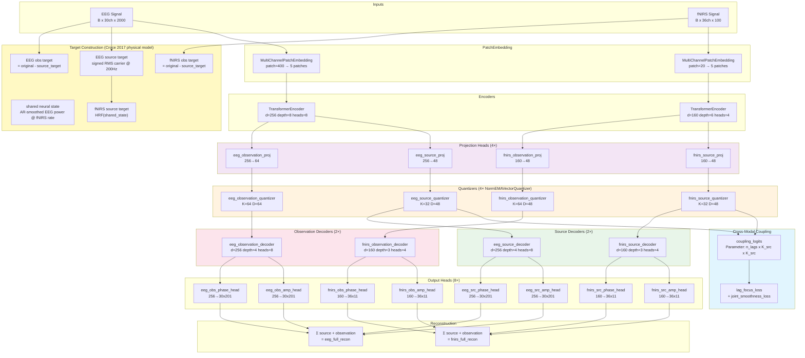
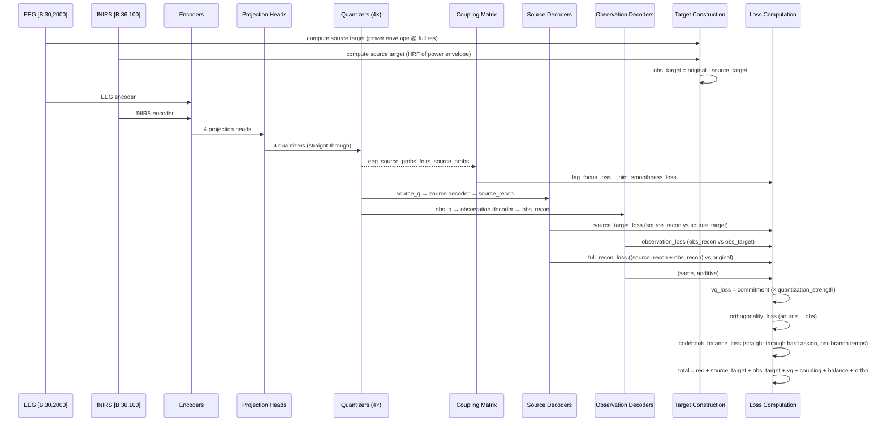
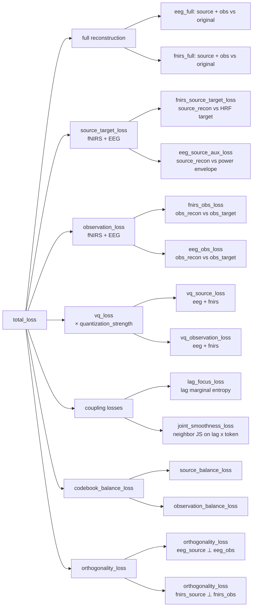

# Current Architecture: Source/Observation Tokenizer (Dual Decoder + Croce 2017 Physical Model)

> **Semantics version**: `s2_source_observation_v2_phase2b`
> **Last updated**: 2026-05-14
> **Current phase**: Phase 2B (Croce 2017 Physical Model + Coupling Structure Priors) — Architecture stabilized
> **Mainline class**: `SourceObservationLaBraMVQNSP` in [factorized_labram_vqnsp.py](../src/tokenizers/factorized_labram_vqnsp.py)
> **Changelog**: [architecture_changelog/INDEX.md](architecture_changelog/INDEX.md)

---

## 1. Component Architecture (Current — Phase 2B Stabilized)




**Key architectural change from Phase 1/2**: Single shared decoder per modality → dual independent decoders (source + observation). Full reconstruction = source_recon + observation_recon (additive in signal space).

## 2. Data Flow (Forward Pass)



## 3. Loss Composition (Phase 2A Target)



### Current Target Loss Weights (Phase 2B — Physical Model)

| Loss Term | Weight | Purpose |
|-----------|--------|---------|
| `eeg_rec_loss` | 1.0 (amp 1.0 + time 0.9) | EEG full reconstruction via source + observation sum |
| `fnirs_rec_loss` | 1.0 (amp 1.0 + time 1.0) | fNIRS full reconstruction via source + observation sum |
| `source_target_loss` (fNIRS) | 0.3 | fNIRS source decoder → HRF(shared_state) via Croce model |
| `eeg_source_aux_loss` | 0.3 (weight × aux_weight) | EEG source decoder → signed-RMS-carrier, temporally smoothed |
| `observation_loss` (fNIRS) | 0.15 | fNIRS observation decoder → original − HRF(shared_state) |
| `observation_loss` (EEG) | 0.15 | EEG observation decoder → original − signed-RMS-carrier |
| `vq_loss` | 1.0 × quantization_strength | Commitment + EMA codebook loss (all 4 quantizers) |
| `source_coupling_loss` | `coupling.weight` | `lag_focus_loss + 0.2 * joint_smoothness_loss` when coupling prior is enabled |
| `lag_focus_loss` | internal 1.0 | Normalized entropy of the lag marginal $P(\tau \mid z_{eeg})$ |
| `joint_smoothness_loss` | internal 0.2 | Neighbor JS divergence on $Q(\tau, z_{fnirs} \mid z_{eeg})$ |
| `codebook_balance_loss` | 0.08 | Entropy-based dead-code prevention |
| `orthogonality_loss` | 0.05 | Cosine similarity penalty: source ⊥ observation |

### Coupling Structure Monitoring

Current implementation does not apply a direct EEG-fNIRS KL matching loss. Coupling monitoring therefore focuses on structural priors and matrix geometry:

| Loss | Role | Healthy range | Danger signal |
|------|------|--------------|---------------|
| `lag_focus_loss` | Delay preference concentration | Below the uniform baseline, but not collapsing to 0 | Near 1.0 → lag structure remains uninformative |
| `joint_smoothness_loss` | EEG-neighbor consistency in joint delay-response space | Decreasing, then stable | Increasing while lag focus drops → over-constrained or noisy neighborhoods |

## 4. Component Catalog

### Core Tokenizer

| File | Role |
|------|------|
| [src/tokenizers/factorized_labram_vqnsp.py](../src/tokenizers/factorized_labram_vqnsp.py) | **Mainline tokenizer**: `SourceObservationLaBraMVQNSP` — encoders, projectors, 4 quantizers, coupling, dual source/observation decoders |
| [src/tokenizers/labram_vqnsp.py](../src/tokenizers/labram_vqnsp.py) | **Shared components**: `NormEMAVectorQuantizer`, `TransformerEncoder`, `TransformerDecoder`, `l2norm`, `MultiChannelPatchEmbedding` |
| [src/tokenizers/base.py](../src/tokenizers/base.py) | Abstract `BaseTokenizer` class |
| [src/tokenizers/registry.py](../src/tokenizers/registry.py) | Tokenizer factory: config → constructor mapping, `StandardizedOutput` interface |

### Loss Functions

| File | Role |
|------|------|
| [src/losses/multimodal_tokenizer.py](../src/losses/multimodal_tokenizer.py) | `batch_usage_entropy_loss`, `straight_through_assignment_probs`, `orthogonality_loss`, `align_pair`, `coupling_lag_focus_loss`, `coupling_eeg_neighbor_smoothness_loss` |
| [src/losses/reconstruction.py](../src/losses/reconstruction.py) | Multi-STFT and time-domain reconstruction losses |

### Spatial & Physiological Priors

| File | Role |
|------|------|
| [src/data/channel_adjacency.py](../src/data/channel_adjacency.py) | 10-10 EEG neighbor table, fNIRS channel name parsing, `mnt.mat` 3D coordinate validation, spatial adjacency matrix construction, per-channel RMS envelope and spatially-weighted fNIRS neural driver |
| [src/inference/neurovascular_smc.py](../src/inference/neurovascular_smc.py) | Sequential Monte Carlo filter for neurovascular state-space model (shared neural state + modality-specific forward models)

### Analysis & Visualization

| File | Role |
|------|------|
| [src/visualization/tokenizer_analysis_suite.py](../src/visualization/tokenizer_analysis_suite.py) | Standardized analysis entry point |
| [src/visualization/source_observation_analysis.py](../src/visualization/source_observation_analysis.py) | Source/observation alignment analysis, Gate 1-4 scorecard |

### Configs

| Directory | Purpose |
|-----------|---------|
| [experiments/configs/source_observation/phase1/](../experiments/configs/source_observation/phase1/) | Phase 1 Gate1 baseline configs (locked) |
| [experiments/configs/source_observation/phase2/](../experiments/configs/source_observation/phase2/) | Phase 2 HRF Source Target configs (historical reference) |
| [experiments/configs/source_observation/phase2a/](../experiments/configs/source_observation/phase2a/) | Phase 2A Dual Decoder + spatial source target configs (**active**) |

## 5. Quantizer Summary

| Quantizer | Codebook Size | Embedding Dim | Semantics |
|-----------|---------------|---------------|-----------|
| `eeg_source_quantizer` | K=32 | D=48 | EEG neurovascular coupling state (shared neural driver) |
| `fnirs_source_quantizer` | K=32 | D=48 | fNIRS neurovascular coupling state (shared neural driver) |
| `eeg_observation_quantizer` | K=64 | D=64 | EEG modality-specific encoding debt |
| `fnirs_observation_quantizer` | K=64 | D=48 | fNIRS modality-specific encoding debt |

All quantizers use EMA updates, kmeans initialization, dead code revival, and cosine-similarity-based assignment (l2-normalized). Phase 2A expands observation codebooks to 64 while keeping source at 32, providing more capacity for modality-specific details.

## 6. Coupling Mechanism

The coupling matrix `coupling_logits` is an `[n_lags, K_src, K_src]` learned parameter.

**Forward pass** (for each lag):
1. Align EEG and fNIRS source token distributions with lag offset
2. Maintain `coupling_logits[lag]` as the lag-indexed EEG→fNIRS mapping scaffold
3. Current implementation does not optimize a direct KL-based EEG-fNIRS matching loss

**Structural priors** (current active design):
- **Lag focus**: for each EEG source token, the lag marginal of the joint distribution
    $$Q_i(\tau, j) = P(\tau, z_{fnirs}=j \mid z_{eeg}=i)$$
    should prefer a few delays. This sharpens delay structure without forcing only a few token-lag pairs overall.
- **Joint smoothness**: nearby EEG tokens in codebook space should have similar joint delay-response distributions $Q_i(\tau, j)$.
    Neighborhoods are computed from detached EEG source codebook geometry rather than raw token indices.

**Selection**: Diagnostics now use the dominant lag under the average lag marginal of $Q_i(\tau, j)$; this is still a structural summary, not a batch-level best-lag search.

**Current lags**: `[0, 1, 2, 3, 4, 5, 6, 7, 8, 9, 10, 11]`

## 7. Source Target Construction (Croce et al. 2017 Physical Model)

### Design Motivation

Prior Phase 2A design used `EEG_power_envelope` (μV², non-negative) as the EEG
source target. This broke the additive decomposition `original = source + observation`
because power units differ from voltage, and the envelope's non-negativity forced
the observation branch to carry the DC offset and zero-crossing structure.

The revised design adopts Croce et al. 2017's joint EEG-fNIRS state-space model:
a shared latent neural state `s(t)` drives both modalities — EEG observes it
instantaneously, fNIRS observes it through hemodynamic convolution.

### Shared Neural State

```
s_k = α · s_{k-1} + (1 − α) · x_k

where  x_k = channel-averaged EEG power, downsampled to fNIRS rate (10 Hz)
       α   = shared_state_alpha (default 0.90)
```

- α → 1.00: only sub-0.1 Hz hemodynamic fluctuations survive (SMC limit)
- α ≈ 0.90: ~1 s half-life — alpha/beta-band power envelope preserved
- α → 0.00: raw EEG power, no smoothing

### fNIRS Source Target (Croce forward model)

```
s(t) [B,1,100] → HRF convolution (learnable double-gamma) → rescale → [B,36,100]
```
The HRF convolution absorbs the 4–6 s neurovascular delay. The output is
time-synchronous with the original fNIRS (zero-phase alignment).

### EEG Source Target (Croce forward model)

Mode: `signed_rms_carrier` (default in Phase 2B)

```
EEG [B,30,2000] → per-channel RMS envelope (Hann-smoothed, μV units)
                → temporal smoothing with shared α
                → multiply by sign(smoothed voltage waveform)
                → signed, μV units, same physical meaning as raw EEG
```

Key properties:
- Same physical units as EEG (μV, signed)
- Additive decomposition `original = source + observation` is physically meaningful
- Temporal smoothing via shared α removes fast noise while preserving task dynamics

### Observation Target

```
obs_target = original - source_target  (computed independently per modality)
```

## 8. Decoder Modes

Three decoder input modes are explicitly trained:

| Mode | Input to source decoder | Input to obs decoder | Target | Loss |
|------|------------------------|---------------------|--------|------|
| Full | source_q | obs_q | original | full reconstruction loss |
| Source-only | source_q | zeros | source_target | source_target_loss |
| Observation-only | zeros | obs_q | obs_target | observation_loss |

Full reconstruction = source_recon + observation_recon (additive in signal space).

## 9. Phase Status

| Phase | Name | Status | Key Deliverable |
|-------|------|--------|-----------------|
| Phase 1 | Structural Migration | ✅ Complete | Source/Observation tokenizer, shared/private removed |
| Phase 2 | HRF Source Target | ✅ Complete | Double-gamma HRF kernel; Gate 2-4 fail, needed Phase 2A redesign |
| Phase 2A | Branch Target Redesign + Dual Decoder | ✅ Complete | Dual decoder, unified source target, explicit observation target |
| Phase 2B | Croce 2017 Physical Model + Coupling Structure Priors | ✅ **Current** | Shared-state AR-smoothed neural driver, signed-RMS EEG target, HRF fNIRS target, lag focus + joint smoothness |
| Mechanism C | Causal Asymmetry | ❌ Abandoned | See IMPLEMENTATION_PLAN.md §11 |

### Locked Phase1 Handoff

| Artifact | Role |
|----------|------|
| [experiments/configs/source_observation/phase1/gate1_best_current.yaml](../experiments/configs/source_observation/phase1/gate1_best_current.yaml) | Current best Gate1-stable baseline alias |
| [experiments/configs/source_observation/phase1/gate1_baseline_locked_bs128.yaml](../experiments/configs/source_observation/phase1/gate1_baseline_locked_bs128.yaml) | Clean reusable Gate1 baseline |
| [experiments/runs/s2_phase1_gate1_health_uniform32_stable_sourceonly_balance_provq_nophase_longwarmup_bs128_20260511_175718](../experiments/runs/s2_phase1_gate1_health_uniform32_stable_sourceonly_balance_provq_nophase_longwarmup_bs128_20260511_175718) | Best recorded Gate1 pass |

### Phase 2 Diagnostic Baseline

| Artifact | Role |
|----------|------|
| [experiments/runs/s2_phase2_gate2_hrf_target_uniform32_bs128_longrun/](../experiments/runs/s2_phase2_gate2_hrf_target_uniform32_bs128_longrun/) | Phase 2 run with full Gate 1-4 analysis |
| [experiments/runs/s2_phase2_gate2_hrf_target_uniform32_bs128_longrun/analysis/gate_summary.json](../experiments/runs/s2_phase2_gate2_hrf_target_uniform32_bs128_longrun/analysis/gate_summary.json) | Gate scorecard: Gate1=pending, Gate2/3/4=fail |

## 10. Related Documents

| Document | Role |
|----------|------|
| [IMPLEMENTATION_PLAN.md](../IMPLEMENTATION_PLAN.md) | Implementation order, file migration scope, validation gates |
| [PHYSIOLOGICAL_COUPLING_PLAN.md](PHYSIOLOGICAL_COUPLING_PLAN.md) | Mechanism motivation, math, physiological interpretation |
| [SEMANTIC_TOKEN_SCORECARD.md](SEMANTIC_TOKEN_SCORECARD.md) | 4-Gate evaluation framework |
| [EXPERIMENT_LOG.md](EXPERIMENT_LOG.md) | Formal experiment conclusions |
| [architecture_changelog/INDEX.md](architecture_changelog/INDEX.md) | Chronological architecture change records |
