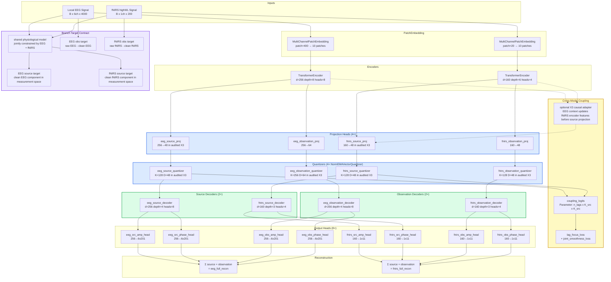
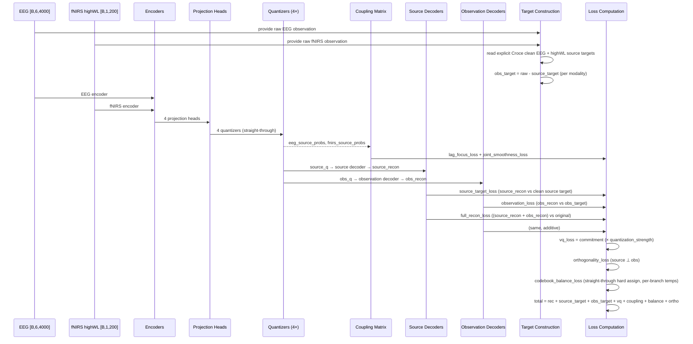
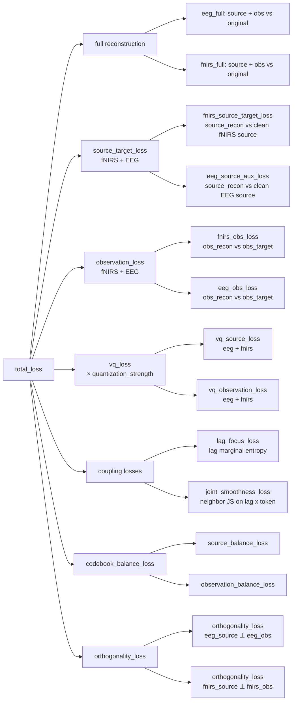

# Current Architecture: Source/Observation Tokenizer

> **Semantics version**: `s2_source_observation_v4_croce_local_highwl`
> **Last updated**: 2026-07-01
> **Current phase**: Legacy source/observation runtime frozen as the implementation baseline; physiology-semantic redesign approved but not implemented
> **Mainline class**: `SourceObservationLaBraMVQNSP` in [factorized_labram_vqnsp.py](../src/tokenizers/factorized_labram_vqnsp.py)
> **Changelog**: [architecture_changelog/INDEX.md](architecture_changelog/INDEX.md)

> **Active note**: this file describes code that runs today. The approved replacement is specified in [physiology_semantic_tokenizer/02_TARGET_ARCHITECTURE.md](physiology_semantic_tokenizer/02_TARGET_ARCHITECTURE.md) and becomes current only after its implementation and validation gates pass. Repository code still contains older proxy-target paths; they remain candidate baselines only.

> **Current training contract**: the active tokenizer dataset is `croce_local_cache`. Each sample is one fNIRS spatial anchor, its six-channel local EEG neighbourhood, and explicit source/observation targets from the generated Croce cache. fNIRS uses only `highWL` (`source_fnirs_optical_channel_0` / `obs_fnirs_optical_channel_0`) as an optical measurement-space, HbO-sensitive proxy; `lowWL` remains in cache metadata but is ignored by the current model input.

> **Current audited X3 dimensions**: the run named `k128_dim128_x3_causal_exchange_seed20260652` has source codebook size `K=128`, but its explicit `eeg_codebook_dim` and `fnirs_codebook_dim` fields both resolve to vector dimension `D=48`; the generic `codebook_dim=128` field is shadowed. Runtime dimensions, not run names, are authoritative. Observation dimensions are EEG `D=64` and fNIRS `D=48`.

---

## 0. Approved Target Architecture — Not Implemented

The 2026-07-01 design freeze approved a physiology-semantic replacement with four boundaries:

1. an uncertainty-aware Croce-style physical state teacher used as privileged training supervision;
2. independently inferred EEG and fNIRS semantic tokens;
3. continuous private/residual paths that preserve information outside the semantic bottleneck;
4. frozen-token sequence-to-distribution coupling evaluated against fNIRS history and marginal baselines.

The complete target tensor contracts, losses, implementation gates, and experiment suites live in [docs/physiology_semantic_tokenizer/](physiology_semantic_tokenizer/README.md). None of those target components should be cited as implemented until the transition rule in that archive is satisfied.

## 1. Architecture Contract

当前主线只把下列语义当作 branch target 合同：

1. source branch 监督对象是两个模态各自的**干净生理观测成分**，而不是单向 proxy 或只在 latent 空间自洽的隐藏变量；
2. clean EEG 与 clean fNIRS 必须由同一个共享生理模型联合约束，二者地位对称；
3. observation target 必须保持逐模态线性残差定义：

   $$
   y^{obs}_{EEG} = y^{raw}_{EEG} - y^{src}_{EEG}, \qquad
   y^{obs}_{fNIRS} = y^{raw}_{fNIRS} - y^{src}_{fNIRS}
   $$

4. source branch 尽量承载真实生理活动，observation branch 尽量承载被试差异、导联接触、仪器噪声和其他观测污染。

下列表述不再属于当前主线语义：

1. 任何把单模态代理量直接当作 source 定义的做法；
2. 任何把 clean EEG 与 clean fNIRS 置于不对等地位的做法；
3. 任何单向构造另一模态 clean target 的做法；
4. 任何只在 latent 中自洽、却不给出测量空间 clean source 的做法。

## 2. Component Architecture

**Key architectural invariant**: source/observation 仍然是加法分解架构。唯一被重置的是“source target 究竟如何定义”。

## 3. Data Flow

## 4. Loss Contract

### Current Loss Meaning

| Loss Term | Weight | Purpose |
|-----------|--------|---------|
| `eeg_rec_loss` | 1.0 (amp 1.0 + time 0.9) | EEG full reconstruction via source + observation sum |
| `fnirs_rec_loss` | 1.0 (amp 1.0 + time 1.0) | fNIRS full reconstruction via source + observation sum |
| `source_target_loss` (fNIRS) | 0.3 | fNIRS source decoder → clean fNIRS component in measurement space |
| `eeg_source_aux_loss` | 0.3 (weight × aux_weight) | EEG source decoder → clean EEG component in measurement space |
| `observation_loss` (fNIRS) | 0.15 | fNIRS observation decoder → raw fNIRS − clean fNIRS |
| `observation_loss` (EEG) | 0.15 | EEG observation decoder → raw EEG − clean EEG |
| `vq_loss` | 1.0 × quantization_strength | Commitment + EMA codebook loss (all 4 quantizers) |
| `source_coupling_loss` | `coupling.weight` | Weighted sum of lag focus, joint smoothness, lag-balanced pair likelihood, and conditional-gain lag evidence |
| `lag_focus_loss` | internal 1.0 | Normalized entropy of the lag marginal $P(\tau \mid z_{eeg})$ |
| `joint_smoothness_loss` | internal 0.2 | Neighbor JS divergence on $Q(\tau, z_{fnirs} \mid z_{eeg})$ |
| `pair_likelihood_loss` | optional | Equal-per-lag conditional NLL for observed EEG/fNIRS source-token pairs; active residual mode removes EEG-independent fNIRS marginal bias |
| `lag_evidence_loss` | optional | Cross-entropy from lag mass to conditional log-likelihood gain over the lag-specific fNIRS marginal |
| `codebook_balance_loss` | 0.08 | Entropy-based dead-code prevention |
| `orthogonality_loss` | 0.05 | Cosine similarity penalty: source ⊥ observation |

当前活动文档只定义这些 loss 的**语义角色**。如果代码里某个 loss 仍通过 legacy proxy 路径来近似实现，应视为待替换的旧求解路径，而不是当前合同。

### Coupling Structure Monitoring

Current implementation does not force the two source codebooks to share numeric indices. The optional empirical terms learn a full conditional mapping for every lag, while monitoring covers both tensor geometry and held-out token evidence:

| Loss | Role | Healthy range | Danger signal |
|------|------|--------------|---------------|
| `lag_focus_loss` | Delay preference concentration | Below the uniform baseline, but not collapsing to 0 | Near 1.0 → lag structure remains uninformative |
| `joint_smoothness_loss` | EEG-neighbor consistency in joint delay-response space | Decreasing, then stable | Increasing while lag focus drops → over-constrained or noisy neighborhoods |
| `pair_likelihood_loss` | EEG-conditioned fNIRS mapping, with every valid lag weighted equally | Below the uniform conditional baseline $\log K$ | Improvement without held-out gain → subject-specific or marginal-frequency fit |
| `lag_evidence_loss` | Align lag mass with conditional gain over the fNIRS marginal | Decreasing after pair mappings become informative | Lag collapse without empirical gain → focus prior dominates evidence |

## 5. Component Catalog

### Core Tokenizer

| File | Role |
|------|------|
| [src/tokenizers/factorized_labram_vqnsp.py](../src/tokenizers/factorized_labram_vqnsp.py) | **Mainline tokenizer**: `SourceObservationLaBraMVQNSP` — encoders, projectors, 4 quantizers, coupling, dual source/observation decoders |
| [src/tokenizers/labram_vqnsp.py](../src/tokenizers/labram_vqnsp.py) | **Shared components**: `NormEMAVectorQuantizer`, `TransformerEncoder`, `TransformerDecoder`, `l2norm`, `MultiChannelPatchEmbedding` |
| [src/tokenizers/base.py](../src/tokenizers/base.py) | Abstract `BaseTokenizer` class |
| [src/tokenizers/registry.py](../src/tokenizers/registry.py) | Tokenizer factory: config → constructor mapping, `StandardizedOutput` interface |

### Loss Functions

| File | Role |
|------|------|
| [src/losses/multimodal_tokenizer.py](../src/losses/multimodal_tokenizer.py) | Codebook health, orthogonality, lag focus, EEG-neighbor smoothness, lag-balanced pair likelihood, and lag-evidence losses |
| [src/losses/reconstruction.py](../src/losses/reconstruction.py) | Multi-STFT and time-domain reconstruction losses |

### Spatial & Physiological Priors

| File | Role |
|------|------|
| [src/data/croce_local_cache_dataset.py](../src/data/croce_local_cache_dataset.py) | Active Croce local cache adapter: returns `eeg [B,6,4000]`, `fnirs [B,1,200]`, explicit source/observation targets, and Gate0 highWL-only metadata |
| [src/data/channel_adjacency.py](../src/data/channel_adjacency.py) | 10-10 EEG neighbor table, fNIRS channel name parsing, `mnt.mat` 3D coordinate validation, spatial adjacency matrix construction, per-channel RMS envelope and spatially-weighted fNIRS neural driver |
| [src/inference/neurovascular_smc.py](../src/inference/neurovascular_smc.py) | Candidate physical-model inference utilities for joint EEG-fNIRS source estimation; current implementations include legacy Croce-style proxy paths under review |

### Analysis & Visualization

| File | Role |
|------|------|
| [src/visualization/tokenizer_analysis_suite.py](../src/visualization/tokenizer_analysis_suite.py) | Standardized analysis entry point |
| [src/visualization/source_observation_analysis.py](../src/visualization/source_observation_analysis.py) | Source/observation alignment analysis, Gate 0-4 scorecard. Gate0 asserts the highWL-only cache/input contract before semantic metrics are interpreted |

### Configs

| Directory | Purpose |
|-----------|---------|
| [experiments/configs/source_observation/phase1/](../experiments/configs/source_observation/phase1/) | Phase 1 Gate1 baseline configs (locked) |
| [experiments/configs/source_observation/phase2/](../experiments/configs/source_observation/phase2/) | Historical proxy-target configs; not current branch-target contract |
| [experiments/configs/source_observation/phase2a/](../experiments/configs/source_observation/phase2a/) | Historical redesign configs; decoder structure still relevant, target semantics superseded |
| `experiments/configs/source_observation/croce_local/` | Frozen compatibility configs for the Croce highWL/X3 lineage. Their existing results are archived under `experiments/archive/pre_physiology_semantic_20260701/runs/` |

## 5. Quantizer Summary

| Quantizer | Codebook Size | Embedding Dim | Semantics |
|-----------|---------------|---------------|-----------|
| `eeg_source_quantizer` | K=128 | D=48 | Audited X3 EEG source branch |
| `fnirs_source_quantizer` | K=128 | D=48 | Audited X3 fNIRS source branch |
| `eeg_observation_quantizer` | K=256 | D=64 | Audited X3 EEG observation branch |
| `fnirs_observation_quantizer` | K=128 | D=48 | Audited X3 highWL observation branch |

All quantizers use the current implementation's EMA-like updates, kmeans initialization, dead-code revival, and cosine-similarity assignment. The table records the audited X3 runtime rather than historical base-config defaults. The redesign plan treats the current vector update as a correctness issue because codeword sums are not maintained by EMA.

## 6. Coupling Mechanism

The coupling tensor `coupling_logits` is an `[n_lags, K_src, K_src]` learned parameter. `n_lags` is derived from the token window length, so the active 20s Croce local tokenizer with 10 tokens uses valid nonnegative lags `0..9`. There is no user-configured `lag_candidates` list and no selected-lag optimization path.

**Forward pass**:
1. Maintain `coupling_logits` as a full lag-indexed source-state correspondence scaffold
2. Convert it to the EEG-conditioned joint delay-response distribution
    $$Q_i(\tau, j) = P(\tau, z_{fnirs}=j \mid z_{eeg}=i)$$
3. Apply structural coupling losses over all valid lag slices rather than selecting one lag

**Structural priors** (current active design):
- **Lag focus**: for each EEG source token, the lag marginal of the joint distribution
    $$Q_i(\tau, j) = P(\tau, z_{fnirs}=j \mid z_{eeg}=i)$$
    should prefer a few delays. This sharpens delay structure without forcing only a few token-lag pairs overall.
- **Joint smoothness**: nearby EEG tokens in codebook space should have similar joint delay-response distributions $Q_i(\tau, j)$.
    Neighborhoods are computed from detached EEG source codebook geometry rather than raw token indices.
- **Lag-balanced pair likelihood**: each lag independently fits $P(z_{fnirs,t+\tau}\mid z_{eeg,t},\tau)$ and contributes one equal-weight loss term. Longer overlap at small $\tau$ therefore cannot dominate through sample count alone. With `residualize_fnirs_marginal=true`, the lag-specific empirical $P(z_{fnirs}\mid\tau)$ is a detached baseline and the trainable tensor represents only EEG-conditioned logit deviations. A column preference shared by every EEG token is therefore not accepted as cross-modal coupling.
- **Conditional-gain lag evidence**: lag mass is supervised by the mapping's log-likelihood gain over the lag-specific fNIRS marginal. The evidence target is detached so the term moves lag mass instead of fabricating evidence by changing token assignments.

No diagonal or same-indice constraint is used. EEG token 7 may map to any fNIRS token according to the learned conditional matrix; equal indices are not assigned privileged physiological meaning.

**Diagnostics**: Analysis reports all-lag tensor views: EEG×fNIRS marginal, EEG×lag marginal, expected and argmax fNIRS index by lag, conditional peak/entropy/KL-to-marginal, and per-lag conditional slices. In residual mode, these model projections use column-centered coupling logits so common fNIRS token frequency is not mistaken for EEG-conditioned structure. It also reports equal-per-lag MI against within-subject shuffles and leave-one-subject-out conditional accuracy against the fNIRS marginal baseline. Expected fNIRS index remains a visualization projection, not a standalone metric or training objective.

## 7. Branch Target Contract

### Required Outputs

当前 branch target 只接受如下输出对：

$$
(\hat y^{src}_{EEG}(t), \hat y^{src}_{fNIRS}(t))
$$

它们必须同时满足：

1. 由同一个共享生理模型联合约束；
2. 分别位于 EEG 与 fNIRS 的测量空间；
3. 保持与原始测量足够同步，使 observation target 可线性定义；
4. 不把被试差异、接触问题和仪器噪声误写成 source semantics。

### What Is No Longer Accepted As Mainline Semantics

以下内容可以作为候选 baseline 保留在代码中，但不再被活动文档当作 branch target 定义：

1. 任何单模态幅值代理直接充当 clean EEG source；
2. 任何单向构造直接充当 clean fNIRS source；
3. 用目标模态自身统计量“制造” clean source；
4. 只凭 coupling 可预测性来替代 clean target 的显式构造。

### Candidate Physical Models

当前允许进入主线评审的物理模型家族包括：

1. **Croce-style joint state-space model**：但必须升级为真正的 joint inference，并输出对称的 clean EEG / clean fNIRS 成分；
2. **Nuisance-augmented local state-space model**：在共享生理状态之外显式建模 contact / device / subject drift；
3. **Simpler dynamic-factor baseline**：如果它能更稳定地满足 clean-source + linear-residual 合同，也允许作为 branch-target baseline。

## 8. Decoder Modes

Three decoder input modes are explicitly trained:

| Mode | Input to source decoder | Input to obs decoder | Target | Loss |
|------|------------------------|---------------------|--------|------|
| Full | source_q | obs_q | original | full reconstruction loss |
| Source-only | source_q | zeros | source_target | source_target_loss |
| Observation-only | zeros | obs_q | obs_target | observation_loss |

Full reconstruction = source_recon + observation_recon (additive in signal space).

## 9. Phase Status

| Phase | Name | Status | Key Deliverable |
|-------|------|--------|-----------------|
| Phase 1 | Structural Migration | ✅ Complete | Source/Observation tokenizer, shared/private removed |
| Phase 2 | Historical Proxy-Target Stages | ⚠️ Historical | Legacy proxy-target experiments, retained only for comparison |
| Phase 2A | Decoder Structure Redesign | ✅ Complete | Dual decoder, explicit observation target, additive reconstruction |
| Phase 2B | Croce Candidate Model Audit | ⚠️ Historical Candidate | Joint state-space tooling and proxy-target baselines introduced |
| Current | Croce Local/X3 Source-Observation Runtime | 🧊 **Frozen baseline** | Preserve the runnable highWL-only lineage and audited X3 exchange run for reproduction and comparison |
| Planned | Physiology-Semantic Redesign | 📝 Approved, not implemented | Independent semantic tokenizers, uncertainty-aware state teacher, residual information path, and frozen sequence coupling |
| Mechanism C | Causal Asymmetry | ❌ Abandoned | See the [archived implementation plan](archive/pre_physiology_semantic_20260701/source_observation/IMPLEMENTATION_PLAN.md) |

### Locked Phase1 Handoff

| Artifact | Role |
|----------|------|
| [experiments/configs/source_observation/phase1/gate1_best_current.yaml](../experiments/configs/source_observation/phase1/gate1_best_current.yaml) | Current best Gate1-stable baseline alias |
| [experiments/configs/source_observation/phase1/gate1_baseline_locked_bs128.yaml](../experiments/configs/source_observation/phase1/gate1_baseline_locked_bs128.yaml) | Clean reusable Gate1 baseline |
| [Archived Phase 1 best run](../experiments/archive/source_observation_phase1_gate1_stabilization_20260511/s2_phase1_gate1_health_uniform32_stable_sourceonly_balance_provq_nophase_longwarmup_bs128_20260511_175718) | Best recorded Gate1 pass |

### Phase 2 Diagnostic Baseline

| Artifact | Role |
|----------|------|
| [Archived Phase 2 diagnostic run](../experiments/archive/pre_croce_local_highwl_20260604/s2_phase2_gate2_hrf_target_uniform32_bs128_longrun/) | Phase 2 run with full Gate 1-4 analysis |
| [Archived Phase 2 gate summary](../experiments/archive/pre_croce_local_highwl_20260604/s2_phase2_gate2_hrf_target_uniform32_bs128_longrun/analysis/gate_summary.json) | Gate scorecard: Gate1=pending, Gate2/3/4=fail |

## 10. Related Documents

| Document | Role |
|----------|------|
| [physiology_semantic_tokenizer/README.md](physiology_semantic_tokenizer/README.md) | Approved redesign archive and authority map |
| [physiology_semantic_tokenizer/04_IMPLEMENTATION_VALIDATION_PLAN.md](physiology_semantic_tokenizer/04_IMPLEMENTATION_VALIDATION_PLAN.md) | Target implementation order, correctness checks, and module validity gates |
| [Archived implementation plan](archive/pre_physiology_semantic_20260701/source_observation/IMPLEMENTATION_PLAN.md) | Historical implementation plan for the source/observation runtime |
| [Croce real-data validation plan](../croce_validation/CROCE2017_REAL_DATA_VALIDATION_PLAN.md) | Real-data validation plan for Croce-style forward approximations and inverse stability |
| [Archived physiological coupling plan](archive/pre_physiology_semantic_20260701/source_observation/PHYSIOLOGICAL_COUPLING_PLAN.md) | Historical mechanism motivation and mathematics |
| [Archived semantic token scorecard](archive/pre_physiology_semantic_20260701/source_observation/SEMANTIC_TOKEN_SCORECARD.md) | Historical four-gate evaluation framework |
| [Active experiment log](physiology_semantic_tokenizer/06_EXPERIMENT_LOG.md) | Results admitted under the target design |
| [STORAGE_LAYOUT.md](STORAGE_LAYOUT.md) | Canonical generated-data and run-output paths |
| [architecture_changelog/INDEX.md](architecture_changelog/INDEX.md) | Chronological architecture change records |
