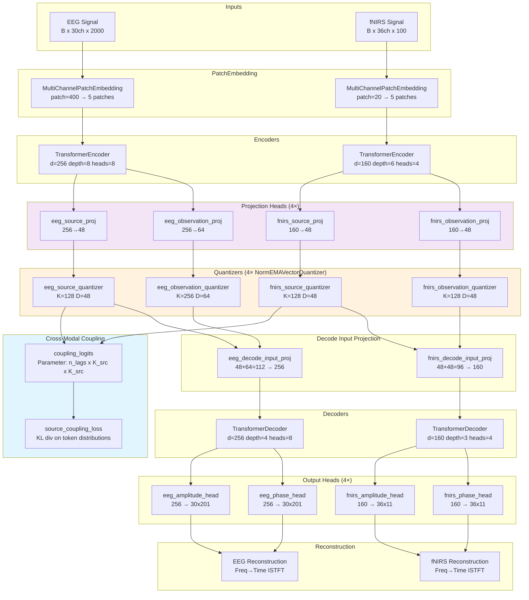
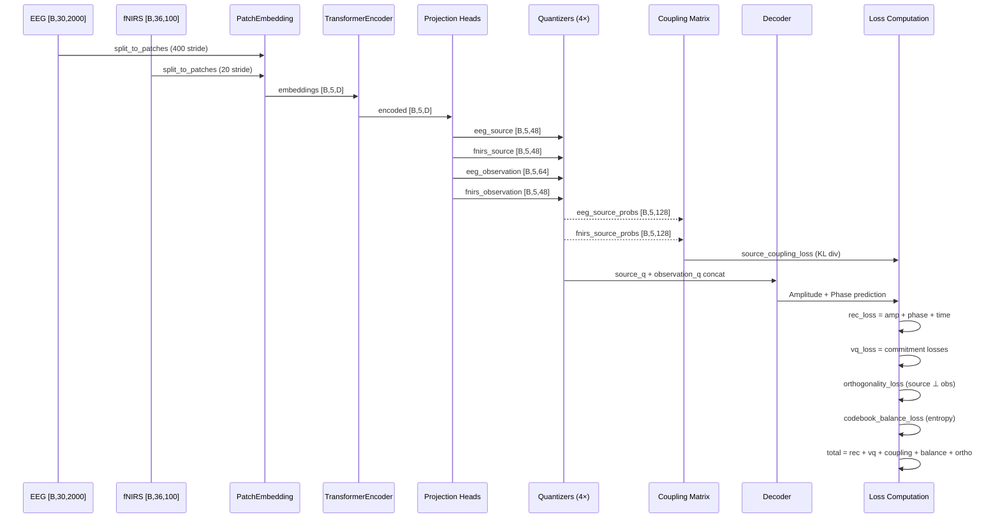
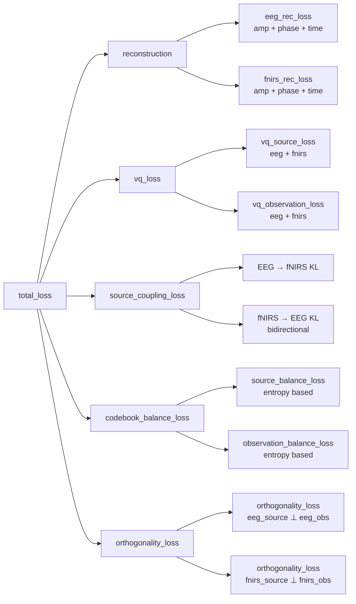

# Current Architecture: Source/Observation Tokenizer

> **Semantics version**: `s2_source_observation_v1`
> **Last updated**: 2026-05-08
> **Current phase**: Phase 1 (Structural Migration) — Complete
> **Active phase**: Phase 2 (HRF Source Target) — Ready to begin
> **Mainline class**: `SourceObservationLaBraMVQNSP` in [factorized_labram_vqnsp.py](../src/tokenizers/factorized_labram_vqnsp.py)
> **Changelog**: [architecture_changelog/INDEX.md](architecture_changelog/INDEX.md)

---

## 1. Component Architecture

## 2. Data Flow (Forward Pass)

## 3. Loss Composition

### Current Loss Weights

| Loss Term | Weight | Purpose |
|-----------|--------|---------|
| `eeg_rec_loss` | 1.0 | EEG full reconstruction (amp 1.0 + phase 1.0 + time 0.9) |
| `fnirs_rec_loss` | 1.0 | fNIRS full reconstruction (amp 1.0 + phase 0.2 + time 1.0) |
| `vq_loss` | 1.0 | Commitment + EMA codebook loss (all 4 quantizers) |
| `source_coupling_loss` | 0.07 | KL divergence: predicted vs actual source token distributions |
| `codebook_balance_loss` | 0.02 | Entropy-based dead-code prevention (all 4 quantizers) |
| `orthogonality_loss` | 0.01 | Cosine similarity penalty between source and observation within each modality |

## 4. Component Catalog

### Core Tokenizer

| File | Role |
|------|------|
| [src/tokenizers/factorized_labram_vqnsp.py](../src/tokenizers/factorized_labram_vqnsp.py) | **Mainline tokenizer**: `SourceObservationLaBraMVQNSP` — encoders, projectors, 4 quantizers, coupling, decoders |
| [src/tokenizers/labram_vqnsp.py](../src/tokenizers/labram_vqnsp.py) | **Shared components**: `NormEMAVectorQuantizer`, `TransformerEncoder`, `TransformerDecoder`, `l2norm`, `MultiChannelPatchEmbedding` |
| [src/tokenizers/base.py](../src/tokenizers/base.py) | Abstract `BaseTokenizer` class |
| [src/tokenizers/registry.py](../src/tokenizers/registry.py) | Tokenizer factory: config → constructor mapping, `StandardizedOutput` interface |
| [src/tokenizers/__init__.py](../src/tokenizers/__init__.py) | Tokenizer exports and registration |

### Loss Functions

| File | Role |
|------|------|
| [src/losses/multimodal_tokenizer.py](../src/losses/multimodal_tokenizer.py) | `coupling_kl_loss`, `batch_usage_entropy_loss`, `orthogonality_loss`, `align_pair`, `symmetric_kl_from_logits` |
| [src/losses/reconstruction.py](../src/losses/reconstruction.py) | Multi-STFT and time-domain reconstruction losses |

### Analysis & Visualization

| File | Role |
|------|------|
| [src/visualization/tokenizer_analysis_suite.py](../src/visualization/tokenizer_analysis_suite.py) | **Standardized analysis entry point** — generates full tokenizer report |
| [src/visualization/source_observation_analysis.py](../src/visualization/source_observation_analysis.py) | Source/observation alignment analysis, scorecard generation, Gate 1-4 metrics |
| [src/visualization/tensorboard_logger.py](../src/visualization/tensorboard_logger.py) | TensorBoard metric logging during training |

### Training

| File | Role |
|------|------|
| [experiments/scripts/train_source_observation_tokenizer.py](../experiments/scripts/train_source_observation_tokenizer.py) | **Main training script** — loads config, creates model/dataloaders, runs training loop |
| [experiments/scripts/launch_training_nohup.sh](../experiments/scripts/launch_training_nohup.sh) | Standardized launcher for training runs |

### Configs

| Directory | Purpose |
|-----------|---------|
| [experiments/configs/base.yaml](../experiments/configs/base.yaml) | Dataset, preprocessing, and hardware defaults |
| [experiments/configs/source_observation/phase1/](../experiments/configs/source_observation/phase1/) | Phase 1 Structural Migration configs |
| [experiments/configs/source_observation/phase2/](../experiments/configs/source_observation/phase2/) | Phase 2 HRF Source Target configs (ready) |
| [experiments/configs/source_observation/phase3/](../experiments/configs/source_observation/phase3/) | Phase 3 Concentration Prior configs (ready) |
| [experiments/configs/source_observation/mechanism_a/](../experiments/configs/source_observation/mechanism_a/) | Mechanism A Smoothness configs (ready) |
| [experiments/configs/source_observation/mechanism_c/](../experiments/configs/source_observation/mechanism_c/) | Mechanism C Asymmetry configs (ready) |

## 5. Quantizer Summary

| Quantizer | Codebook Size | Embedding Dim | Semantics |
|-----------|---------------|---------------|-----------|
| `eeg_source_quantizer` | K=128 | D=48 | EEG neurovascular coupling state |
| `fnirs_source_quantizer` | K=128 | D=48 | fNIRS neurovascular coupling state |
| `eeg_observation_quantizer` | K=256 | D=64 | EEG modality-specific encoding debt |
| `fnirs_observation_quantizer` | K=128 | D=48 | fNIRS modality-specific encoding debt |

All quantizers use EMA updates, kmeans initialization, dead code revival, and cosine-similarity-based assignment (l2-normalized).

## 6. Coupling Mechanism

The coupling matrix `coupling_logits` is an `[n_lags, K_src, K_src]` learned parameter.

**Forward pass** (for each lag):
1. Align EEG and fNIRS source token distributions with lag offset
2. `EEG_probs → [coupling_logits[lag]] → predicted_fNIRS_probs`
3. KL divergence between predicted and actual fNIRS token distributions
4. When bidirectional: also compute `fNIRS → predicted_EEG` and average

**Selection**: Choose lag with minimum coupling loss (`alignment_selection='min'`).

**Current lags**: `[0, 1, 2, 3, 4, 5, 6, 7, 8, 9, 10, 11]`

## 7. Phase Status

| Phase | Name | Status | Key Deliverable |
|-------|------|--------|-----------------|
| Phase 1 | Structural Migration | ✅ Complete | Source/Observation tokenizer running, shared/private removed |
| Phase 2 | HRF Source Target | 🔜 Ready | Double-gamma HRF kernel, fNIRS source target from EEG |
| Phase 2A | Coupling-Aware Quantization | 📋 Planned | Coupling prior guides fNIRS source argmin |
| Phase 3 | Concentration Prior | 📋 Planned | Row entropy regularization on coupling matrix |
| Mechanism A | Coupling Smoothness | 📋 Planned | Local smoothness prior on coupling rows |
| Mechanism C | Causal Asymmetry | 📋 Planned | Independent fwd/rev coupling parameterization |

## 8. Related Documents

| Document | Role |
|----------|------|
| [IMPLEMENTATION_PLAN.md](../IMPLEMENTATION_PLAN.md) | Implementation order, file migration scope, validation gates |
| [PHYSIOLOGICAL_COUPLING_PLAN.md](PHYSIOLOGICAL_COUPLING_PLAN.md) | Mechanism motivation, math, physiological interpretation |
| [SEMANTIC_TOKEN_SCORECARD.md](SEMANTIC_TOKEN_SCORECARD.md) | 4-Gate evaluation framework |
| [EXPERIMENT_LOG.md](EXPERIMENT_LOG.md) | Formal experiment conclusions |
| [architecture_changelog/INDEX.md](architecture_changelog/INDEX.md) | Chronological architecture change records |
| [STANDARDIZATION_GUIDE.md](../STANDARDIZATION_GUIDE.md) | Naming conventions, run protocols, artifact standards |
