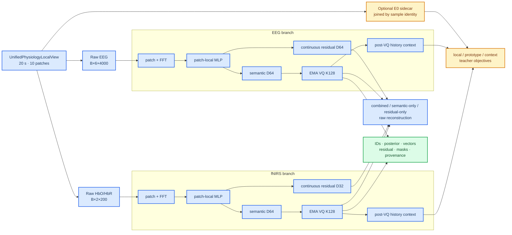
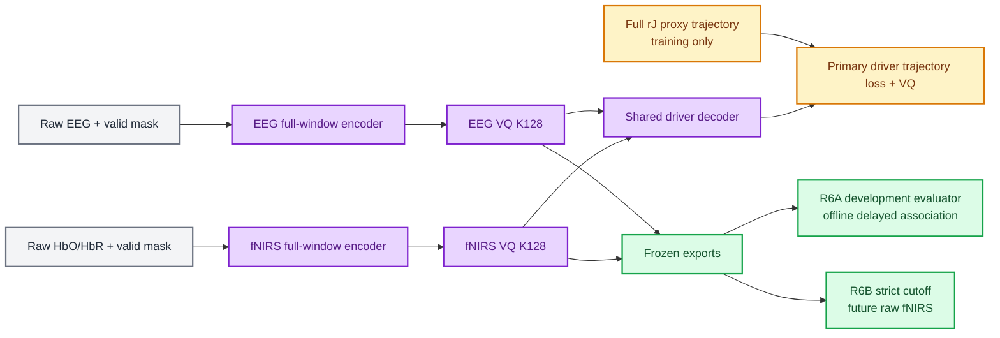

# 当前软件架构与下一代计划

_更新：2026-07-25；本文区分“当前可运行 E2 runtime”和“尚未实现的 SD-SVQ after-state”_

---

## 📋 状态结论

当前 active tokenizer 已不是早期 source/observation compatibility model。它是 `PhysiologySemanticTokenizer`：接收统一 measured local view，包含独立 EEG/fNIRS patch-local semantic/residual branch、独立 fixed `K=128,D=64` EMA VQ、post-VQ fixed-history context、raw reconstruction 和可选 teacher entry losses。E2 已在该 runtime 上完成。

2026-07-25 决定的 Shared-Driver Semantic VQ 是拟迁移架构，尚未成为 runtime。权威状态如下：

| 层级 | 文档/图 | 状态 |
| --- | --- | --- |
| 当前软件 | 本文、[canonical JSON](physiology_semantic_tokenizer/architecture/physiology_semantic_architecture.json)、[canonical SVG](physiology_semantic_tokenizer/figures/physiology_semantic_architecture.svg) | Implemented |
| 新架构计划 | [目标架构](physiology_semantic_tokenizer/02_TARGET_ARCHITECTURE.md)、[plan SVG](physiology_semantic_tokenizer/figures/plans/shared_driver_semantic_return_plan.svg) | Planned |
| 科学结果 | [实验日志](physiology_semantic_tokenizer/06_EXPERIMENT_LOG.md) | E0–E2 historical；R 系列未运行 |
| 旧 source/observation | `src/compatibility/` 与 [dated archive](archive/pre_physiology_semantic_20260701/README.md) | Compatibility only |

## 🏗️ 当前 E2-compatible runtime

```mermaid
flowchart LR
    accTitle: 当前 E2 compatible physiology semantic runtime
    accDescr: 统一原始测量分别进入 EEG 和 fNIRS patch-local branch，各自产生 semantic VQ、continuous residual 和 fixed-history context；训练器组合 raw reconstruction 与可选 routed teacher losses。

    loader["UnifiedPhysiologyLocalView<br/>20 s · 10 patches"]
    eeg["Raw EEG<br/>B×6×4000"]
    fnirs["Raw HbO/HbR<br/>B×2×200"]
    sidecar["Optional E0 sidecar<br/>joined by sample identity"]

    subgraph e["EEG branch"]
        ep["patch + FFT"]
        ee["patch-local MLP"]
        es["semantic D64"]
        eq["EMA VQ K128"]
        er["continuous residual D64"]
        ec["post-VQ history context"]
    end

    subgraph f["fNIRS branch"]
        fp["patch + FFT"]
        fe["patch-local MLP"]
        fs["semantic D64"]
        fq["EMA VQ K128"]
        fr["continuous residual D32"]
        fc["post-VQ history context"]
    end

    recon["combined / semantic-only / residual-only<br/>raw reconstruction"]
    routed["local / prototype / context<br/>teacher objectives"]
    export["IDs · posterior · vectors<br/>residual · masks · provenance"]

    loader --> eeg --> ep --> ee
    loader --> fnirs --> fp --> fe
    loader --> sidecar --> routed
    ee --> es --> eq --> ec --> routed
    ee --> er --> recon
    eq --> recon
    fe --> fs --> fq --> fc --> routed
    fe --> fr --> recon
    fq --> recon
    eq --> export
    fq --> export

    classDef current fill:#dbeafe,stroke:#2563eb,stroke-width:2px,color:#1e3a5f
    classDef optional fill:#fef3c7,stroke:#d97706,stroke-width:2px,color:#78350f
    classDef output fill:#dcfce7,stroke:#16a34a,stroke-width:2px,color:#14532d

    class loader,eeg,fnirs,ep,ee,es,eq,er,ec,fp,fe,fs,fq,fr,fc,recon current
    class sidecar,routed optional
    class export output
```

### 当前输入合同

- `eeg_raw`: `[B,6,4000]`；
- `fnirs_raw`: `[B,2,200]`；
- 20 秒窗口，10 个 2 秒 patch；
- codebook 固定 `K=128,D=64`；
- EEG residual `D=64`，fNIRS residual `D=32`；
- current validity 是 boundary/finite measurement mask；artifact invalidity 已于 `6d6c648` 撤销。

### 当前训练合同

当前 branch 每个 patch 独立提取 feature，semantic latent 量化后才进入 fixed-history context。decoder 可组合 semantic 与 residual 重建原始测量。teacher adapter 支持 `local/prototype/context/coupling` 命名 entry；E2 实际使用 local/prototype 的摘要目标。

这套软件通过了必要的 correctness 和 K128 health 测试，但 E2 没有接纳 teacher semantic row。它不能被描述为已成功发现生理耦合。

### 当前已知限制

1. teacher 是整窗 RTS smoother，而 token identity 是 patch-local，receptive field 不匹配；
2. E2 sidecar 只覆盖 validation 总 patch 的 `16.67%`；
3. historical probe 与 teacher loss 的 mask 支持总体不同；
4. raw reconstruction 与弱 teacher auxiliary loss 竞争；
5. routed mean/slope target 没有使 teacher 信息进入 hard-token geometry；
6. residual branch 和多入口增加了结果归因难度；
7. post-VQ context 不能补救量化前不可观测性。

详见 [E2 corrigendum](physiology_semantic_tokenizer/analysis/20260725_E2_FAILURE_MODE_CORRIGENDUM_AND_RETURN_DECISION.md)。

## 🎯 拟迁移的 SD-SVQ after-state

```mermaid
flowchart LR
    accTitle: Shared-Driver Semantic VQ proposed after-state
    accDescr: 两个 raw-only modality-specific full-window encoder 进入独立 K128 VQ，并通过一个共享 decoder 重建完整 joint-driver proxy；冻结后双向 token 先检验离线条件关联，满足 cutoff 后才检验窗外未来 fNIRS。

    eeg2["Raw EEG + valid mask"] --> ewe["EEG full-window encoder"] --> q_e["EEG VQ K128"]
    fnirs2["Raw HbO/HbR + valid mask"] --> fwe["fNIRS full-window encoder"] --> q_f["fNIRS VQ K128"]
    q_e --> dr["Shared driver decoder"]
    q_f --> dr
    rj["Full rJ proxy trajectory<br/>training only"] --> loss2["Primary driver trajectory loss + VQ"]
    dr --> loss2
    q_e --> frozen["Frozen exports"]
    q_f --> frozen
    frozen --> offline2["R6A development evaluator<br/>offline delayed association"]
    frozen --> cutoff2["R6B strict cutoff<br/>future raw fNIRS"]

    classDef measured fill:#f3f4f6,stroke:#6b7280,stroke-width:2px,color:#1f2937
    classDef planned fill:#e9d5ff,stroke:#7e22ce,stroke-width:2px,color:#581c87
    classDef training fill:#fef3c7,stroke:#d97706,stroke-width:2px,color:#78350f
    classDef evaluation fill:#dcfce7,stroke:#16a34a,stroke-width:2px,color:#14532d

    class eeg2,fnirs2 measured
    class ewe,fwe,q_e,q_f,dr planned
    class rj,loss2 training
    class frozen,offline2,cutoff2 evaluation
```

与 current runtime 的最小差异：

| 轴 | Current E2 runtime | Proposed SD-SVQ |
| --- | --- | --- |
| pre-VQ 时间范围 | patch-local | modality-only full 20 s |
| semantic target | raw reconstruction + weak routed summaries | full \(r^J\) trajectory primary |
| codebooks | independent K128 | independent K128，保持 |
| residual | 默认 continuous branch | 默认无；R4 可选 |
| context | post-VQ history head | pre-VQ full-window encoder |
| coupling shaping | 旧计划允许 shaper/foundation | 首轮删除 |
| coupling evidence | 未完成 | R6A 离线关联；R6B strict-cutoff 窗外预测；R7 才是独立确认 |

## 🔐 推理与声明边界

当前和 planned tokenizer 均不得把 subject/task/nuisance/teacher 当作 encoder 输入。metadata 可以存在于 dataset record，但只用于采样、统计、null 和 provenance。

SD-SVQ 的 full-window 版本与 E0 smoother 对齐，因此是 offline contextual representation。同窗 endpoint 只能支持离线关联；窗外预测必须使用 `completed_window_cutoff`，按原始 record 绝对时间证明整个 token receptive field（含预处理支持）早于 endpoint。另建 causal tokenizer 时还需重新通过语义门。

共同重建 \(r^J\) 会设计性地组织两个表示空间。它只能证明 teacher-grounded alignment；coupling discovery 必须来自冻结后超过 fNIRS history 与 matched null 的增量结果。

## 🔄 升级规则

canonical JSON/SVG 只在以下条件满足后改写：

1. R1-P full-trajectory sidecar、population-frozen teacher panel 和 raw-view independence 通过；
2. 双侧 continuous R2-P gate 通过；
3. SD-SVQ model、loss、export 的 tests/smoke 通过；
4. R3-P 的两模态、N0、E-control、Null-J、三 seed 与 health 合取门全部通过；
5. experiment log、launcher、configs 和 consumer docs 同步。

在此之前，计划图不得标记为 implemented，current 图也不得被解释为新架构。
