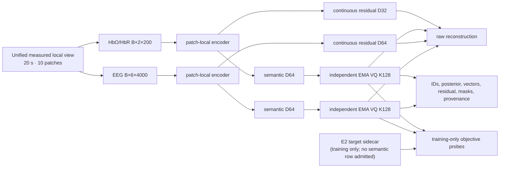

# Software architecture

_Runnable surfaces and package ownership. Current execution and scientific verdicts
are generated in [`PROJECT_STATUS.md`](PROJECT_STATUS.md)._

## Runtime scope

The production tokenizer runtime remains the E2-compatible
`PhysiologySemanticTokenizer`. R0-P, R1-D/R1-P, D1B, and R2-D added diagnostic
and qualification components around it. Their execution outcomes and scientific
interpretation are intentionally absent from this architecture document.

There are three reading levels for the runtime. The short Mermaid flow below is
the quick project summary; the canonical JSON/SVG pair is the implementation
detail; and the Draw.io file is a human-readable presentation draft.

The canonical current-runtime artifacts remain
[`physiology_semantic_architecture.json`](physiology_semantic_tokenizer/architecture/physiology_semantic_architecture.json)
and
[`physiology_semantic_architecture.svg`](physiology_semantic_tokenizer/figures/physiology_semantic_architecture.svg).
The shared-driver/SD-SVQ diagrams are pre-gate historical plan evidence, not an
implemented or active after-state.

The review-oriented Draw.io overview is available as a
**quick overview / paper-figure candidate**:
[`physiology_semantic_runtime_overview.svg`](physiology_semantic_tokenizer/figures/physiology_semantic_runtime_overview.svg),
with its editable
[`drawio` source](physiology_semantic_tokenizer/architecture/physiology_semantic_runtime_overview.drawio).
It is a current-or-snapshot presentation projection of the same E2 runtime, not a
timestamped registry view, second source of truth, or scientific-admission figure.
The JSON and deterministic renderer above remain the implementation authority.

## Current E2 dataflow

```mermaid
flowchart LR
    loader["Unified measured local view<br/>20 s · 10 patches"]
    eeg["EEG B×6×4000"] --> ep["patch-local encoder"]
    fnirs["HbO/HbR B×2×200"] --> fp["patch-local encoder"]
    loader --> eeg
    loader --> fnirs
    ep --> es["semantic D64"] --> eq["independent EMA VQ K128"]
    ep --> er["continuous residual D64"]
    fp --> fs["semantic D64"] --> fq["independent EMA VQ K128"]
    fp --> fr["continuous residual D32"]
    eq --> recon["raw reconstruction"]
    er --> recon
    fq --> recon
    fr --> recon
    sidecar["E2 target sidecar<br/>(training only; no semantic row admitted)"] --> routed["training-only objective probes"]
    eq --> routed
    fq --> routed
    eq --> export["IDs, posterior, vectors, residual, masks, provenance"]
    fq --> export
```

- Inputs are measured modality-specific views; subject/task/nuisance/teacher
  metadata are not encoder inputs.
- EEG and fNIRS have independent codebooks. Equal numeric IDs have no shared
  semantics.
- The teacher is privileged training/diagnostic evidence, not inference input
  and not physiological ground truth.
- The full-window teacher and patch-local token have different receptive
  fields; E2's weak routed objectives did not resolve that mismatch.
- Artifact annotations are diagnostics. Real recorded support in `valid_mask`
  remains the current validity authority.

## Package ownership

| Package / entrypoint | Current responsibility |
| --- | --- |
| `src/data/registry.py`, `factory.py`, `unified_physiology.py` | central measured-data registry and loader |
| `src/data/physiology_semantic_*` | E0–E2 local views and targets |
| `src/data/shared_driver_*` | independent raw view/teacher joins for R-series work |
| `src/tokenizers/physiology_semantic_tokenizer.py` | current E2 tokenizer |
| `src/tokenizers/ema_vector_quantizer.py` | corrected fixed-K128 VQ |
| `src/tokenizers/shared_driver_semantic_vq.py` | R2 diagnostic model component; not promoted runtime |
| `src/inference/adaptive_neurovascular_ssm.py` | sealed R1-P teacher implementation |
| `src/analysis/token_*` and `physiological_patch_features.py` | Token Physiology Atlas |
| `src/compatibility/pre_physiology_semantic_20260701/` | explicit historical checkpoint/replay surface |

Executable training, qualification, evaluation, and rendering workflows live
under `experiments/`. Comparison methods remain isolated below
`comparative_methods/`.

## Scientific boundary

Code presence is not experiment state and does not imply scientific support. Query
the unified project status before using a runnable component. A future method
generation requires a new independent holdout and a newly frozen
target/estimator/null/threshold contract.
