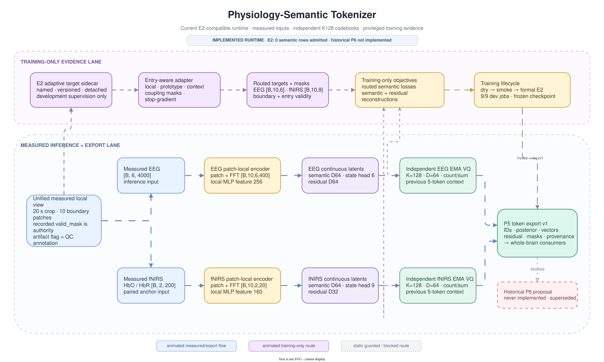
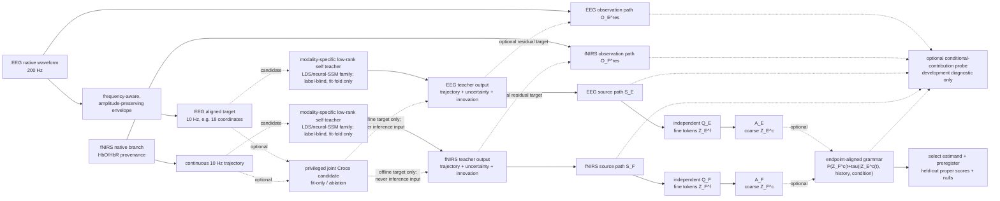
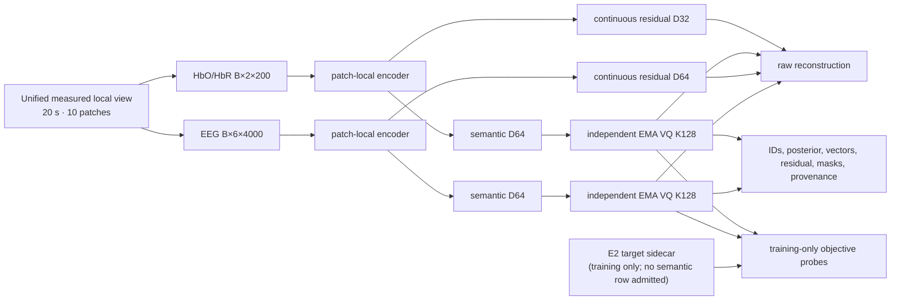

# Software architecture

_Runnable surfaces and package ownership. Current execution and scientific verdicts
are generated in [`PROJECT_STATUS.md`](PROJECT_STATUS.md)._

## Repository layers

The repository deliberately retains some frozen paths because configs, tests, reports,
and SHA-bound evidence refer to them. Physical presence does not make every subtree
active. Use these three layers:

| Layer | Paths | Default rule |
| --- | --- | --- |
| Active implementation | `src/`, active `tests/`, `experiments/scripts/` and reviewed configs, method-owned comparison code | read and change through the owning package |
| Local/generated | `data/`, `runs/`, `cache/`, `checkpoints/`, `upstream/`, `.tmp/` | do not recursively discover; write only to an existing owner root |
| Frozen/history | dated reports, `archive/`, compatibility namespaces, completed comparison campaign files | explicit-path, read-only unless a versioned migration is the task |

A bulk move of frozen comparison code would invalidate recorded paths and source
hashes, so future cleanup must create a new version instead of layering shims over
the old one.

## Runtime scope and version boundary

The only currently runnable tokenizer generation is the E2-compatible
`PhysiologySemanticTokenizer` (v1). R0-P, R1-D/R1-P, D1B, and R2-D added
diagnostic and qualification components around it. The v1 implementation,
checkpoints, and negative screen are retained as historical evidence; they are
not a new runtime generation. Their execution outcomes and scientific
interpretation are recorded in the owning reports rather than inferred from
file presence.

The v2 artifact below is an exploratory map of replaceable candidates, not a
versioned architecture target, runnable code, an admission result, or permission
to access measured/protected data. It does not freeze a teacher, path, token
hierarchy, grammar, or information decomposition. A candidate selected for
implementation must first receive its own software/data contract and synthetic
checks; any later independent evaluation separately preregisters its estimand,
split, nulls, and stopping rule.

The machine-readable current-runtime authority is
[`physiology_semantic_architecture.json`](physiology_semantic_tokenizer/architecture/physiology_semantic_architecture.json).
The review-oriented **quick overview / paper-figure candidate** is
[`physiology_semantic_runtime_overview.svg`](physiology_semantic_tokenizer/figures/physiology_semantic_runtime_overview.svg),
with its editable
[`drawio` source](physiology_semantic_tokenizer/architecture/physiology_semantic_runtime_overview.drawio).
It is a current-or-snapshot presentation projection of the same E2 runtime, not a
timestamped registry view, second source of truth, or scientific-admission figure.
The detailed
[`candidate architecture`](physiology_semantic_tokenizer/figures/physiology_semantic_architecture.svg)
and its
[`Draw.io source`](physiology_semantic_tokenizer/architecture/physiology_semantic_architecture.drawio)
are exploratory visual projections, not a runtime or frozen target. Draw.io owns
their visual layout; the JSON and registry remain the implementation and state
authorities. Historical shared-driver/SD-SVQ diagrams remain pre-gate evidence.

## Observation–source candidate exploration (unimplemented)

The exploration projection is kept separately from the v1 runtime:

- [`observation_source_exploration_v2.json`](physiology_semantic_tokenizer/architecture/observation_source_exploration_v2.json)
  is the text-diffable semantic design note.
- [`observation_source_exploration_v2.drawio`](physiology_semantic_tokenizer/architecture/observation_source_exploration_v2.drawio)
  owns the editable visual layout and shared project figure style.
- [`observation_source_exploration_v2.svg`](physiology_semantic_tokenizer/figures/plans/observation_source_exploration_v2.svg)
  is the exported framework figure, with
  [`alt text`](physiology_semantic_tokenizer/figures/plans/observation_source_exploration_v2.alt.txt).

The JSON owns only the figure content; this Mermaid view is a compact reader aid.
Neither is an implementation authority:

```mermaid
flowchart LR
    eeg0["EEG native waveform<br/>200 Hz"] --> eeg1["frequency-aware,<br/>amplitude-preserving envelope"]
    nir0["fNIRS native branch<br/>HbO/HbR provenance"] --> nir1["continuous 10 Hz trajectory"]
    eeg1 --> eeg10["EEG aligned target<br/>10 Hz, e.g. 18 coordinates"]
    eeg10 -. "candidate" .-> es["modality-specific low-rank self teacher<br/>LDS/neural-SSM family; label-blind, fit-fold only"]
    nir1 -. "candidate" .-> fs["modality-specific low-rank self teacher<br/>LDS/neural-SSM family; label-blind, fit-fold only"]
    eeg10 -. "optional" .-> jt["privileged joint Croce candidate<br/>fit-only / ablation"]
    nir1 -. "optional" .-> jt
    es --> eo["EEG teacher output<br/>trajectory + uncertainty + innovation"]
    fs --> fo["fNIRS teacher output<br/>trajectory + uncertainty + innovation"]
    jt -. "offline target only;<br/>never inference input" .-> eo
    jt -. "offline target only;<br/>never inference input" .-> fo
    eo --> se["EEG source path S_E"]
    fo --> sf["fNIRS source path S_F"]
    eeg0 --> oe["EEG observation path O_E^res"]
    nir0 --> of["fNIRS observation path O_F^res"]
    eo -. "optional residual target" .-> oe
    fo -. "optional residual target" .-> of
    se --> qe["independent Q_E<br/>fine tokens Z_E^f"] --> ae["A_E<br/>coarse Z_E^c"]
    sf --> qf["independent Q_F<br/>fine tokens Z_F^f"] --> af["A_F<br/>coarse Z_F^c"]
    ae -. "optional" .-> gram["endpoint-aligned grammar<br/>P(Z_F^c(t+tau)|Z_E^c(t), history, condition)"]
    af -. "optional" .-> gram
    oe -.-> probe["optional conditional-contribution probe<br/>development diagnostic only"]
    of -.-> probe
    se -.-> probe
    sf -.-> probe
    gram -.-> probe
    gram --> eval["select estimand + preregister<br/>held-out proper scores + nulls"]
```

The graph keeps these candidates available for controlled comparison. It does
not make observation/source branches, codebooks, fine-to-coarse mapping, grammar,
or conditional contribution probes mandatory method identity. A comparison
must declare input ownership and prevent leakage, but any candidate may be
replaced or removed before a method is selected.

If a grammar is tested, its fit/selection map is a learned artifact. Coupling
evidence is available only after a final estimator and evaluation protocol are
preregistered and applied to fresh held-out rows. A training map,
reconstruction score, occupancy plot, or decomposition label is not evidence.

## Current E2/v1 historical dataflow

```mermaid
flowchart LR
    loader["Unified measured local view<br/>20 s · 10 patches"]
    eeg["EEG B×6×4000"] --> ep["patch-local encoder"]
    fnirs["HbO/HbR B×2×200"] --> fp["patch-local encoder"]
    loader --> eeg
    loader --> fnirs
    ep --> es["semantic D64"] --> eq["independent EMA VQ K128"]
    ep --> er["continuous residual D64"]
    fp --> fs["semantic D64"] --> fq["independent EMA VQ K128"]
    fp --> fr["continuous residual D32"]
    eq --> recon["raw reconstruction"]
    er --> recon
    fq --> recon
    fr --> recon
    sidecar["E2 target sidecar<br/>(training only; no semantic row admitted)"] --> routed["training-only objective probes"]
    eq --> routed
    fq --> routed
    eq --> export["IDs, posterior, vectors, residual, masks, provenance"]
    fq --> export
```

- Inputs are measured modality-specific views; subject/task/nuisance/teacher
  metadata are not encoder inputs.
- EEG and fNIRS have independent codebooks. Equal numeric IDs have no shared
  semantics.
- The teacher is privileged training/diagnostic evidence, not inference input
  and not physiological ground truth.
- The full-window teacher and patch-local token have different receptive
  fields; E2's weak routed objectives did not resolve that mismatch.
- Artifact annotations are diagnostics. Real recorded support in `valid_mask`
  remains the current validity authority.

## Package ownership

| Package / entrypoint | Current responsibility |
| --- | --- |
| `src/data/registry.py`, `factory.py`, `unified_physiology.py` | central measured-data registry and loader |
| `src/data/physiology_semantic_*` | E0–E2 local views and targets |
| `src/data/shared_driver_*` | independent raw view/teacher joins for R-series work |
| `src/tokenizers/physiology_semantic_tokenizer.py` | current E2 tokenizer |
| `src/tokenizers/ema_vector_quantizer.py` | corrected fixed-K128 VQ |
| `src/tokenizers/shared_driver_semantic_vq.py` | R2 diagnostic model component; not promoted runtime |
| `src/inference/adaptive_neurovascular_ssm.py` | Croce/Balloon-inspired adaptive five-state RTS joint candidate; E0 offline development supervision accepted, R1-P population-frozen qualification rejected; not a qualified future teacher |
| `src/analysis/token_*` and `physiological_patch_features.py` | Token Physiology Atlas |
| `src/compatibility/pre_physiology_semantic_20260701/` | explicit historical checkpoint/replay surface |

Executable training, qualification, evaluation, and rendering workflows live
under `experiments/`. Comparison methods remain isolated below
`comparative_methods/`.

## Scientific boundary

Code presence is not experiment state and does not imply scientific support.
The v1 runtime and its negative results remain historical facts; the v2 JSON
and SVG are exploratory design artifacts only. Query the unified project status
before using a runnable component. A future method generation requires a
versioned implementation contract; independent evaluation then requires a new
holdout and a preregistered estimator/null/threshold contract. No architecture
edit opens a protected boundary or authorizes a measured campaign.
