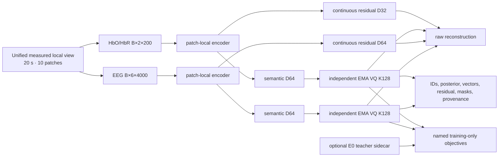

# Current software architecture

_Runnable surfaces and scientific state, updated 2026-07-30_

## Status

The production tokenizer runtime remains the E2-compatible
`PhysiologySemanticTokenizer`. R0-P, R1-D/R1-P, D1B, and R2-D added diagnostic
and qualification components around it; they did not promote the proposed
Shared-Driver Semantic VQ architecture.

| Surface | Software state | Scientific state |
| --- | --- | --- |
| E2 tokenizer and K128 EMA VQ | implemented and tested | no semantic row admitted; retain T0 |
| R0-P raw-lag baseline | implemented and complete | registered endpoint negative |
| R1-D full-trajectory teacher analysis | implemented and complete | exploratory only |
| R1-P population-frozen teacher | sealed, implemented, evaluated | structure pass; physical gate G2 failed |
| D1B perturbation diagnostic | implemented; validation publication aborted | scientifically undetermined |
| R2-D continuous observability | implemented and complete | bilateral criterion failed |
| SD-SVQ / R2-P–R7 | selected components exist, full generation not promoted | blocked and unauthorized |

The canonical current-runtime artifacts remain
[`physiology_semantic_architecture.json`](physiology_semantic_tokenizer/architecture/physiology_semantic_architecture.json)
and
[`physiology_semantic_architecture.svg`](physiology_semantic_tokenizer/figures/physiology_semantic_architecture.svg).
The proposed SD-SVQ diagram is historical plan evidence, not an implemented
after-state.

## Current E2 dataflow


```mermaid
flowchart LR
    loader["Unified measured local view<br/>20 s · 10 patches"]
    eeg["EEG B×6×4000"] --> ep["patch-local encoder"]
    fnirs["HbO/HbR B×2×200"] --> fp["patch-local encoder"]
    loader --> eeg
    loader --> fnirs
    ep --> es["semantic D64"] --> eq["independent EMA VQ K128"]
    ep --> er["continuous residual D64"]
    fp --> fs["semantic D64"] --> fq["independent EMA VQ K128"]
    fp --> fr["continuous residual D32"]
    eq --> recon["raw reconstruction"]
    er --> recon
    fq --> recon
    fr --> recon
    sidecar["optional E0 teacher sidecar"] --> routed["named training-only objectives"]
    eq --> routed
    fq --> routed
    eq --> export["IDs, posterior, vectors, residual, masks, provenance"]
    fq --> export
```

- Inputs are measured modality-specific views; subject/task/nuisance/teacher
  metadata are not encoder inputs.
- EEG and fNIRS have independent codebooks. Equal numeric IDs have no shared
  semantics.
- The teacher is privileged training/diagnostic evidence, not inference input
  and not physiological ground truth.
- The full-window teacher and patch-local token have different receptive
  fields; E2's weak routed objectives did not resolve that mismatch.
- Artifact annotations are diagnostics. Real recorded support in `valid_mask`
  remains the current validity authority.

## Package ownership

| Package / entrypoint | Current responsibility |
| --- | --- |
| `src/data/registry.py`, `factory.py`, `unified_physiology.py` | central measured-data registry and loader |
| `src/data/physiology_semantic_*` | E0–E2 local views and targets |
| `src/data/shared_driver_*` | independent raw view/teacher joins for R-series work |
| `src/tokenizers/physiology_semantic_tokenizer.py` | current E2 tokenizer |
| `src/tokenizers/ema_vector_quantizer.py` | corrected fixed-K128 VQ |
| `src/tokenizers/shared_driver_semantic_vq.py` | R2 diagnostic model component; not promoted runtime |
| `src/inference/adaptive_neurovascular_ssm.py` | sealed R1-P teacher implementation |
| `src/analysis/token_*` and `physiological_patch_features.py` | Token Physiology Atlas |
| `src/compatibility/pre_physiology_semantic_20260701/` | explicit historical checkpoint/replay surface |

Executable training, qualification, evaluation, and rendering workflows live
under `experiments/`. Comparison methods remain isolated below
`comparative_methods/`.

## Promotion boundary

The current decision is fixed by the R-series evidence:

```text
promotion_eligible = false
next_action = do_not_enter_r2_p
protected_subjects_24_29 = closed
```

R2-P or a new VQ generation requires a new independent holdout and a newly
frozen target/estimator/null/threshold contract. Existing code presence cannot
be used to bypass that scientific requalification.
