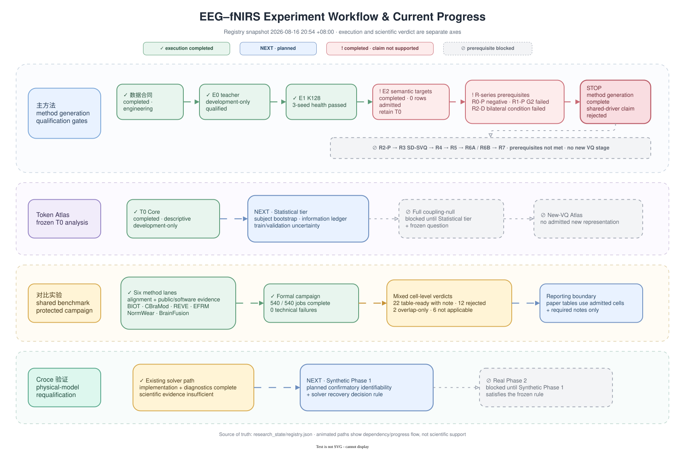

# Experiment sequencing

This document defines dependency order and a compact reader navigation. Detailed
current execution, scientific verdicts, job counts, and next actions are generated
from [`research_state/registry.json`](../research_state/registry.json) in
[`PROJECT_STATUS.md`](PROJECT_STATUS.md).

## Dependency lanes

| Lane | Stable dependency order | Owning contract |
| --- | --- | --- |
| Main method | frozen E0–R negative evidence → SSM reconstruction reliability → continuous shared/private latent without VQ → only then reconsider an information bottleneck | [`SSM_RECONSTRUCTION_RELIABILITY_PLAN.md`](analysis/SSM_RECONSTRUCTION_RELIABILITY_PLAN.md), [`CONTINUOUS_SHARED_PRIVATE_LATENT_PLAN.md`](analysis/CONTINUOUS_SHARED_PRIVATE_LATENT_PLAN.md) |
| Token Atlas | retained representation → Core → Statistical → a separately frozen confirmatory question | [`analysis/TOKEN_PHYSIOLOGY_ATLAS.md`](analysis/TOKEN_PHYSIOLOGY_ATLAS.md) |
| Comparisons | source fidelity → adapter/input alignment → software/public evidence → frozen formal execution → cell-level interpretation | [`comparisons/PROTOCOL.md`](comparisons/PROTOCOL.md) |
| Croce validation | reference implementation → Synthetic Phase 1 → Real Phase 2 | [`../croce_validation/CROCE2017_REAL_DATA_VALIDATION_PLAN.md`](../croce_validation/CROCE2017_REAL_DATA_VALIDATION_PLAN.md) |

Completion of one lane does not imply a scientific conclusion in another lane.
In particular, engineering completion, descriptive analysis, and a failed scientific
gate remain distinct in the unified two-axis state model.

## Four-lane reader navigation

| Lane | Design | Current result | Next | Evidence to read |
| --- | --- | --- | --- | --- |
| Main method | [`SSM reliability`](analysis/SSM_RECONSTRUCTION_RELIABILITY_PLAN.md) → [`continuous latent`](analysis/CONTINUOUS_SHARED_PRIVATE_LATENT_PLAN.md) | Both checks are complete. The no-VQ continuous experiment passed only 2/16 simultaneous lower bounds; fNIRS target and every matched-swap cell failed, so the registered sharedness claim is not supported | Keep VQ blocked; redesign the shared construct/target and identifiability controls before another method generation | [`PROJECT_STATUS.md#主方法`](PROJECT_STATUS.md#主方法), [`SSM results`](analysis/20260819_SSM_RECONSTRUCTION_RELIABILITY_RESULTS.md), [`continuous results`](analysis/20260819_CONTINUOUS_SHARED_PRIVATE_LATENT_RESULTS.md) |
| Token Atlas | [`TOKEN_PHYSIOLOGY_ATLAS.md`](analysis/TOKEN_PHYSIOLOGY_ATLAS.md) | T0 Core complete; Statistical tier not started | Run the Statistical tier on frozen T0; freeze a separate coupling-null question before any Full tier | [`TOKEN_PHYSIOLOGY_ATLAS.md`](analysis/TOKEN_PHYSIOLOGY_ATLAS.md), [`PROJECT_STATUS.md#token-atlas`](PROJECT_STATUS.md#token-atlas) |
| Comparisons | [`comparisons/PROTOCOL.md`](comparisons/PROTOCOL.md) | 540/540 jobs; 42 cells: 22 ready-with-note, 12 rejected, 2 overlap-only, 6 unsupported | Use admitted cells with their track notes for paper tables; this row does not imply a new campaign | [`PROTECTED_CAMPAIGN_RESULTS_20260814.md`](comparisons/PROTECTED_CAMPAIGN_RESULTS_20260814.md), [`METRIC_ACCEPTANCE.md`](comparisons/METRIC_ACCEPTANCE.md) |
| Croce validation | [`../croce_validation/CROCE2017_REAL_DATA_VALIDATION_PLAN.md`](../croce_validation/CROCE2017_REAL_DATA_VALIDATION_PLAN.md) | Legacy diagnostics complete; Synthetic Phase 1 not started | Run Synthetic Phase 1, then Real Phase 2 only if its decision rule is met | [`CROCE2017_REAL_DATA_VALIDATION_PLAN.md`](../croce_validation/CROCE2017_REAL_DATA_VALIDATION_PLAN.md), [`PROJECT_STATUS.md#croce-验证`](PROJECT_STATUS.md#croce-验证) |

## Updating current state

Edit the current item for the affected track in
[`research_state/registry.json`](../research_state/registry.json), then run:

```bash
.venv/bin/python experiments/scripts/project_state.py validate
.venv/bin/python experiments/scripts/project_state.py render
```

The renderer refreshes the root README status block and `docs/PROJECT_STATUS.md`.
An optional audit/freeze check is useful for paper-ready results but is not required
for an ordinary progress update. Protocol and data-access rules stay in their owning
contracts; they are not a third project-status axis.

## Quick workflow overview (registry snapshot)

The human-readable four-track overview is a presentation snapshot rendered from
the `2026-08-16T20:54:18+08:00` registry state:
[`project_workflow_progress.svg`](project_workflow_progress.svg) and its editable
[`Draw.io source`](project_workflow_progress.drawio). It is useful for orientation
and paper discussion, but it is not a second status authority; read
[`PROJECT_STATUS.md`](PROJECT_STATUS.md) for the current text projection and
[`research_state/registry.json`](../research_state/registry.json) for the source
records. Animated dependency paths in the Draw.io source indicate workflow
direction only, never scientific support.



## Historical visualization (2026-08-14)

The `experiment_plan*` files below are a **Historical snapshot (2026-08-14)**,
retained for navigation and historical reproducibility only. They are not current project
state and are no longer an input to the unified registry. Historical
campaign-specific access fields in that frozen snapshot are not read or projected
by the current registry.

- [Historical SVG](figures/experiment_plan.svg) · [PNG export](figures/experiment_plan.png)
- [Alt text](figures/experiment_plan.alt.txt) · [source JSON](figures/experiment_plan_status.json)
- [render manifest](figures/experiment_plan.manifest.json)
