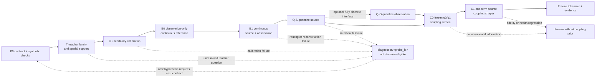

# Experiment sequencing

_Owning protocol: `PST-DISCOVERY-v1` · state: planned · 2026-08-25_

This is the single current experiment-design owner for the next
physiology-semantic tokenizer generation. The plan is limited to physical-teacher
qualification, source/observation tokenization, and coupling-prior retention. It
does not use downstream task performance as a training or selection endpoint.

This planning state does not authorize measured or protected-data access. There
is no executable configuration or forward launcher yet. Before any measured run,
the unresolved split registry, non-inferiority margins, primary lag/horizon, and
compute budget listed below must be frozen in one executable contract and pass
the software/synthetic gate. Subjects 24--29 and every protocol-owned protected
surface remain closed.

## Fixed question and decision target

The intended final object is the smallest tokenizer that jointly satisfies:

1. `source` retains a qualified continuous teacher trajectory from the same
   modality;
2. `observation` retains modality-specific measured information;
3. quantization, if admitted, does not materially degrade either function;
4. an optional coupling prior improves a held-out cross-modal proper score over
   the observation/source-history baseline without harming the first three
   properties.

The nine forward principles in
[`METHOD_RATIONALE.md`](METHOD_RATIONALE.md#frozen-theory-and-architecture-contract-unimplemented)
and the data/mask/split rules in [`DATA_CONTRACT.md`](DATA_CONTRACT.md) remain
fixed. This protocol selects implementations inside those boundaries; it does
not redefine them.

"Optimal" is deliberately lexicographic rather than a weighted total score:

1. pass every required source and observation fidelity gate;
2. pass uncertainty, stability, and codebook-health floors;
3. among passers, use the lowest token rate and simplest model;
4. use held-out proper score only as the final tie-breaker.

A strong result in one modality cannot compensate for failure in the other. If
continuous representations pass but VQ fails, the result is "no discrete
tokenizer admitted", not a forced codebook. If coupling fails, a qualified
coupling-free tokenizer may still be retained.

## Experiment flow



The dotted return is a future protocol transition, not an in-run retry. A
diagnostic can explain a failure or motivate `v2`; it cannot be pooled into the
`v1` promotion estimate.

## Common estimand and statistical contract

### Unit of inference

The biological unit is the subject. Scores are first aggregated over valid
coordinates, time points, patches, trials, and records within subject and then
averaged with equal subject weight. Channels, teacher coordinates, code IDs,
windows, and seeds are not independent biological replicates. Three paired seeds
are optimization/stability repeats and are reported separately from subject
uncertainty.

For a candidate `C` and baseline `B`, every main contrast is oriented so higher
is better:

```text
delta_s = subject_score_s(C) - subject_score_s(B)
Delta   = mean_s(delta_s)
```

Intervals use subject-cluster bootstrap or an exact subject-block test when the
subject count is too small for a stable bootstrap. Missing required support is
`INVALID`; the denominator is not silently reduced.

### Partitions and leakage control

- All channel selection, normalization, teacher parameters, uncertainty
  calibration, target projections, encoder/checkpoint selection, codebooks, and
  coupling maps are fit inside the authorized fit partition.
- Subject plus record/trial/video dependencies are grouped across every split.
- Historical subjects 01--18 and 19--23 have already influenced prior method
  development and cannot become a genuinely fresh confirmation cohort merely by
  relabeling them.
- The new nonprotected confirmation inventory is unresolved and must be frozen
  before measured execution. Protected subjects 24--29 remain closed.
- Task/condition annotations may define nuisance controls or matched nulls, but
  they are not prediction targets, architecture-selection endpoints, or losses
  in this protocol.

### Decision states and multiplicity

Every gate returns exactly one of `PASS`, `FAIL`, `INCONCLUSIVE`, or `INVALID`.
Confidence intervals crossing zero or a non-inferiority margin are
`INCONCLUSIVE`; technical interruption or incomplete support is `INVALID`.

Each stage has one named primary contrast. Lag, horizon, chromophore, channel,
and candidate families are either descriptive or controlled with a predeclared
max-statistic/closed-testing procedure. No best patch, lag, channel set, seed, or
checkpoint may be chosen after confirmation data are viewed.

The practical non-inferiority margins `delta_T`, `delta_S`, `delta_O`, and
`delta_H` are intentionally unresolved here: each must be estimated from
synthetic recovery, measurement repeatability, or fit-only technical repeats and
then frozen before the corresponding confirmation run. A percentage chosen
after seeing held-out results is not an admissible margin.

## P0: software and synthetic qualification

P0 is mandatory before measured data. One synthetic generator must cover known
latent trajectories, heteroscedastic noise, missing support, local spatial
topology, and a known delayed EEG-to-fNIRS relation. The smallest runnable check
must demonstrate:

- continuous target construction before patching/tokenization;
- exact canonical-key joins and distinct measurement, teacher, uncertainty,
  innovation, token, and lag masks;
- no cross-modal read before either main tokenizer emits its representation;
- known-state recovery and failure on independent/time-shift/spatial nulls;
- calibrated predictive intervals under the declared uncertainty convention;
- branch and coupling gradient allowlists;
- config/target/summary serialization, deterministic hashes, atomic publication,
  and an explicit incomplete-run state.

Only P0 is authorized by this design. Measured smoke work requires the later
executable contract; protected evaluation requires a separate explicit request.

## T: physical-teacher selection

### Candidate ladder

The teacher comparison is sequential, not a Cartesian product.

| ID | Candidate | Question | Promotion role |
| --- | --- | --- | --- |
| `T0-native` | measured continuous coordinate plus a simple fit-fold noise/smoothing model | Does the interface and score beat a no-dynamics reference? | control only |
| `T1-self` | modality-specific linear LDS/RTS, fitted separately to EEG and fNIRS | Does temporal structure help without privileged cross-modal information? | minimum dynamic baseline |
| `T2-croce` | paper-faithful Croce-2017 SMC reference, kept distinct from the repository's modified solver | Does the physical joint model recover known and held-out measurements beyond `T1-self`? | privileged physical candidate |
| `T3-adaptive` | current bounded/adaptive RTS/AR family, explicitly versioned as an improvement rather than "exact Croce" | Do the adaptive dynamics improve the same frozen endpoints? | competing physical candidate |
| `T4-spatial` | nested local-channel extension of the simplest passing `T2`/`T3` family | Is additional local spatial support necessary? | conditional refinement |

`T4-spatial` starts from one HbO/HbR pair plus six nearest EEG channels, then
tests two and at most four local fNIRS pairs with at most twelve EEG channels,
subject to actual channel support. It reuses the existing adjacency/geometry
owners. A geometry-aware linear observation operator and covariance are tested
before any graph neural network. Template geometry supports adjacency and
qualitative topology only, not exact cross-modal distance or co-registration.

Channel sets are selected on fit data without labels. Added channels are retained
only if they improve the held-out per-channel proper score, survive channel-drop
and geometry-permutation nulls, and do not degrade uncertainty calibration or
stability. Otherwise the smaller local model wins. An all-scalp model is not part
of the main ladder.

### Teacher outputs and uncertainty convention

All candidates publish the same continuous artifact, independent of teacher
family:

```text
trajectory_mean
aleatoric_variance
epistemic_variance
total_variance = aleatoric_variance + epistemic_variance
observation_values
innovation
named masks
coordinate/channel identities
fit, source, code, geometry, parameter, and calibration hashes
```

The new contract uses **variance**, not an ambiguous `uncertainty` scalar. The
legacy adapter mixes variance-like summaries while the current loss divides by
that field without a log-variance term; therefore its uncertainty-weighting
switch is not admitted evidence for this generation.

Calibration is fit-fold-only and frozen before application. The primary
uncertainty endpoint is held-out Gaussian log score; CRPS, 50/80/95% interval
coverage and width, standardized residuals, PIT, and risk-versus-uncertainty
monotonicity are required diagnostics. Aleatoric and epistemic components remain
separate in the artifact and report.

### Teacher gate

| Gate | Required evidence |
| --- | --- |
| `T-G0 contract` | lineage, fold, masks, units, sign/gauge, finite support, no label use or protected dereference |
| `T-G1 synthetic` | known-state recovery, calibrated intervals, stable numerics, and declared null failure |
| `T-G2 prediction` | subject-equal held-out measurement-space proper score is non-inferior for every required EEG/HbO/HbR coordinate; joint same-point reconstruction alone cannot pass |
| `T-G3 physical adequacy` | independent-modality application and held-out innovation beat phase/history/systemic and time/pairing nulls; required coordinates pass conjunctively |
| `T-G4 calibration` | log score and interval calibration pass for every coordinate admitted to source supervision |
| `T-G5 spatial/stability` | any added-channel gain survives spatial nulls and seed/fold/channel perturbation without worse calibration |

The simplest candidate passing all gates becomes the frozen training teacher. A
joint teacher remains a privileged target-side ablation and is never an inference
input or ground truth. If no candidate passes `T-G2`--`T-G4`, source-tokenizer
development stops; reconstruction work may continue only as a diagnostic.

## B/Q: source and observation tokenizer

### Functional implementation

The first implementation uses one simple modality-local temporal stem with two
heads:

```text
X_m -> stem_m -> source latent      -> teacher-trajectory decoder
             -> observation latent -> measured-signal decoder
```

EEG and fNIRS stems never read the other modality. Source and observation are
functional roles, not an assertion of statistical independence, and they need
not start as four physically separate encoders. A separate stem is considered
only if the shared-stem gradient audit demonstrates reproducible interference.

The observation target is the measured/masked modality coordinate. It is not
defined as `raw - source` unless a later diagnostic first establishes compatible
units and an identifiable additive decomposition. This avoids repeating the old
power-versus-voltage and single-decoder ambiguity.

### Candidate sequence

| ID | Change from previous row | Question |
| --- | --- | --- |
| `B0-O` | continuous observation-only autoencoder | What reconstruction is available without teacher semantics? |
| `B1-SO` | add continuous source head and frozen teacher supervision | Can both functional roles pass before discretization? |
| `Q-S` | quantize source only with the existing EMA-VQ family | Are physiological source patterns discretizable without losing semantics? |
| `Q-O` | quantize observation only after `Q-S` passes and only if a fully discrete interface is required | Can measured information also survive the bottleneck? |

The initial temporal grid and latent width use the smallest existing setting that
can express the continuous targets. If it fails, width doubles only until the
continuous gate passes. Patch duration is screened on the continuous model,
starting from the existing 2 s grid and testing 1 s only when temporal averaging
is the diagnosed failure; 0.5 s is a later diagnostic, not a default row.

The VQ family is EMA-VQ first. Codebook size starts at the retained K128
reference. If support is persistently redundant, K64 is the only next reduction;
larger K or another quantizer family is considered only when a healthy K128 loses
required information. There is no simultaneous K x D x quantizer search.

### Loss ladder

The default `B1-SO` objective contains only:

```text
L = L_observation_reconstruction + L_source_trajectory
```

`Q-S/Q-O` add only the corresponding VQ commitment/update term. No prototype,
context, balance, independence, cross-masking, or coupling loss is enabled by
default.

Additional terms are one-factor diagnostics with a named trigger:

| Trigger | Single allowed diagnostic | Promotion condition |
| --- | --- | --- |
| calibrated teacher uncertainty passes `T-G4` | uniform source loss vs clipped, normalized precision weighting | improves source score/calibration without worse observation fidelity or effective support |
| actual code collapse under a passing continuous model | existing straight-through balance loss | restores health without exceeding source/observation non-inferiority margins |
| continuous semantics pass but hard-token semantics fail | isolated prototype/topology loss | improves hard retention without codebook redundancy or gradient conflict |
| a valid local sequence endpoint fails while local targets pass | isolated context loss | improves the frozen sequence endpoint without future leakage |

The old multi-entry loss bundle is not restored. Every new entrance has its own
coordinates, masks, weight, ablation, and gradient audit.

### Tokenizer endpoints and gates

| Gate | Required evidence |
| --- | --- |
| `B-G0 support` | train loss and evaluation use the same declared target/mask population; subject/trial/patch coverage is explicit |
| `B-G1 observation` | held-out masked measurement log score/NRMSE is non-inferior to `B0-O`; EEG spectral and fNIRS HbO/HbR morphology are secondary fidelity checks |
| `B-G2 source` | continuous source latent/decoder retains the frozen teacher trajectory beyond history and target-permutation baselines, for every required modality/coordinate |
| `B-G3 attribution` | source-only, observation-only, and full interventions show that source gain is not supplied by an observation/residual bypass; cross-decoding is reported, not forced to zero |
| `Q-G1 retention` | expected embedding, posterior, and hard ID are each compared with the continuous upper bound; hard-token source and observation losses stay within frozen margins |
| `Q-G2 health` | active/effective support, dead/revival history, minimum per-code support, usage concentration, participation rank, near-duplicates, and subject/seed stability pass as guardrails |

Codebook utilization is not itself a semantic endpoint. Among gate-passing
models, the lowest bitrate wins; a higher occupancy count cannot rescue worse
reconstruction or teacher retention. Continuous latents, expected embeddings,
posteriors, hard IDs, and codebook embeddings are all exported so hard IDs never
become the entire representation record.

## C: coupling-prior return

### Frozen evaluation target

Coupling is tested only after the marginal tokenizer is frozen. The primary
representation-level estimand is the subject-equal held-out proper-score
increment for measured fNIRS innovation:

```text
q0(Y_F(t+h) | H_F_observation, H_F_source, phase/time/systemic controls)
q1(Y_F(t+h) | H_F_observation, H_F_source,
                 H_E_source, phase/time/systemic controls)

Delta_coupling = score(q1) - score(q0)
```

The evaluator is low-capacity and cross-fitted. Positive lag means EEG precedes
the fNIRS endpoint. One primary horizon or integrated horizon score is frozen
before confirmation; individual lag curves are descriptive and family-wise
controlled. Full-window tokens can support only an offline association label. A
prospective/delayed-prediction claim additionally requires strict receptive-field
cutoff tests.

Required nulls preserve the relevant marginals and dependence structure:

- whole-window circular shift with tokens and masks shifted together;
- same-subject/condition nonoverlapping trial derangement;
- independent-window pairing;
- lag reversal/negative-lag control;
- spatial adjacency permutation for a spatial-prior diagnostic.

NMI, co-occurrence heatmaps, row entropy, and same numeric IDs are descriptive
only. The teacher's latent flow is an upper-bound diagnostic, not the primary
coupling target.

### Minimal prior ladder

| ID | Tokenizer gradient | Purpose |
| --- | --- | --- |
| `C0` | none; fit a lag-balanced, marginal-residualized `q0/q1` after tokenizer freeze | establish whether the representation contains incremental information at all |
| `C1-source` | a small fit-selected weight reaches only the EEG source path; fNIRS target/history, both observation paths, teacher, and baseline are detached | test whether the one-term shaper preserves coupling-relevant source information |
| `C2-uncertainty` | same as `C1`, with clipped normalized confidence weights | optional only after `T-G4`; unweighted results remain co-primary sensitivity |

If `C0` does not beat `q0` and all registered nulls, no coupling loss reaches the
tokenizer. `C1/C2` are admitted only when `Delta_coupling` improves and all
observation/source fidelity and codebook-health gates remain non-inferior to the
coupling-free tokenizer.

Only the historical lag-balanced conditional pair likelihood is eligible to
return initially, because its training target matches the evaluation contrast.
The former lag-focus entropy, joint-entropy, codebook-neighbor JS, local/context
residual maps, and multi-term coupling bundle remain diagnostics. They may make a
coupling tensor look concentrated without improving held-out information and are
not reintroduced together. Best and final checkpoints, per-loss gradient norms,
reconstruction-versus-coupling cosine conflict, and assignment health are all
reported.

## Side-path experiments without workflow sprawl

A side path is a diagnostic child of a main run, not a new project track. It
shares the parent's data/split/teacher/code identities and lives at:

```text
experiments/runs/physiology_semantic_tokenizer/tokenizer_discovery_v1/
  <immutable-run-id>/
    manifest.json
    resolved_config.yaml
    summary.json
    metrics.csv
    figures/
    diagnostics/
      <probe-id>/
```

Each diagnostic records `parent_run_id`, `scope`, `hypothesis`, `estimand_id`,
`operator/null`, `status`, and `decision_eligibility=false`. It may use
`synthetic`, `diagnostic`, `null`, or `development` scope. It cannot change the
parent summary, reuse a protected unlock, or promote a candidate. A diagnostic
that motivates a new main hypothesis requires a new contract version before
fresh confirmation data are viewed.

`research_state/registry.json` records only suite/program state transitions. It
does not gain one record per probe, seed, channel arm, or gate. The retained
result index is updated only when a conclusion and its minimum provenance package
are frozen.

## Code ownership for later implementation

No scaffolding is created by this design. When implementation starts, reuse the
existing owners:

| Responsibility | Owner |
| --- | --- |
| continuous teacher and family adapter | `src/teachers/` |
| target artifact, masks, joins, and provenance | `src/data/` |
| modality-local source/observation tokenizer | `src/tokenizers/` |
| reconstruction, semantic, VQ, and optional coupling objectives | `src/losses/` |
| proper scores, calibration, retention, and codebook health | `src/metrics/` and `src/analysis/` |
| one orchestration/analysis entry | `experiments/scripts/` |
| reviewed executable contract, when ready | `experiments/configs/physiology_semantic_tokenizer/` |

Do not reactivate or rename an E0--E2/R-series YAML, archived source/observation
runner, or old coupling suite. There is no need for a manager, plugin layer,
parallel results root, or separate authorization file.

## Unresolved before an executable contract

The design is complete at the hypothesis/gate level. The following values remain
explicitly unresolved and block measured execution:

1. the exact nonprotected dataset and subject/record split providing a genuinely
   fresh confirmation set;
2. numeric `delta_T`, `delta_S`, `delta_O`, and `delta_H` margins;
3. the single primary coupling horizon or integrated horizon definition and its
   family-wise null procedure;
4. maximum training steps/checkpoint rule and the measured-run compute budget;
5. the final continuous target schema/version implementing the variance fields
   above.

The next authorized implementation step is therefore P0 plus one executable
contract. It is not a Croce real-data run, a VQ sweep, or a protected evaluation.

## Historical lifecycle boundary

The following table remains a lifecycle overlay for the superseded flow. It does
not rewrite hashed or dated evidence; linked reports remain the evidence owners.

| Historical item | Lifecycle | Evidence or retained plan | Retained use |
| --- | --- | --- | --- |
| E0--E2 and R0--R2 generations | **stopped** | [`06_EXPERIMENT_LOG.md`](physiology_semantic_tokenizer/06_EXPERIMENT_LOG.md) and [`20260728_R_SERIES_EXPERIMENT_REPORT.md`](physiology_semantic_tokenizer/analysis/20260728_R_SERIES_EXPERIMENT_REPORT.md) | Historical results and failure boundaries only |
| SSM reliability screen | **stopped** | [`20260819 SSM reconstruction reliability results`](analysis/20260819_SSM_RECONSTRUCTION_RELIABILITY_RESULTS.md) | Exploratory reliability evidence only |
| Continuous-latent screen | **stopped** | [`20260819 continuous shared/private latent results`](analysis/20260819_CONTINUOUS_SHARED_PRIVATE_LATENT_RESULTS.md) | Exploratory latent evidence only |
| LC-SPVQ optimization and QC | **stopped** | Dated LC-SPVQ reports under [`analysis/`](analysis/) | Negative/undetermined evidence only |
| Token Atlas Core (T0) | **stopped** | [`TOKEN_PHYSIOLOGY_ATLAS.md`](analysis/TOKEN_PHYSIOLOGY_ATLAS.md) | Development-only retained result |
| Protected comparison campaign and P0 degradation | **stopped** | [`PROTECTED_CAMPAIGN_RESULTS_20260814.md`](comparisons/PROTECTED_CAMPAIGN_RESULTS_20260814.md) and [`PERFORMANCE_DEGRADATION_P0_RESULTS_20260816.md`](comparisons/PERFORMANCE_DEGRADATION_P0_RESULTS_20260816.md) | Retained comparison evidence only |
| Croce legacy solver and audits | **stopped** | [`CROCE2017_REAL_DATA_VALIDATION_PLAN.md`](../croce_validation/CROCE2017_REAL_DATA_VALIDATION_PLAN.md) | Historical qualification/audit evidence only |
| Comparison P1/P2 and unexecuted follow-up | **abandoned** | [`PERFORMANCE_DEGRADATION_ANALYSIS_PLAN_20260816.md`](comparisons/PERFORMANCE_DEGRADATION_ANALYSIS_PLAN_20260816.md) | Unstarted comparison candidates only |
| D1B, future R/VQ, LC full development, observation/source map, Atlas Statistical/Full, and Croce follow-ons | **abandoned** | Dated plans and candidate snapshots indexed in [`README.md`](README.md) | Non-runnable historical candidates only |

Neither `stopped` nor `abandoned` evidence authorizes or determines a row in
`PST-DISCOVERY-v1`. Historical plans preserve their original wording for
reproducibility.

## Historical visualization (2026-08-14)

The `experiment_plan*` files below are retained for navigation only. They are
not inputs to this protocol or the current registry.

- [Historical SVG](figures/experiment_plan.svg) · [PNG export](figures/experiment_plan.png)
- [Alt text](figures/experiment_plan.alt.txt) · [source JSON](figures/experiment_plan_status.json)
- [render manifest](figures/experiment_plan.manifest.json)
