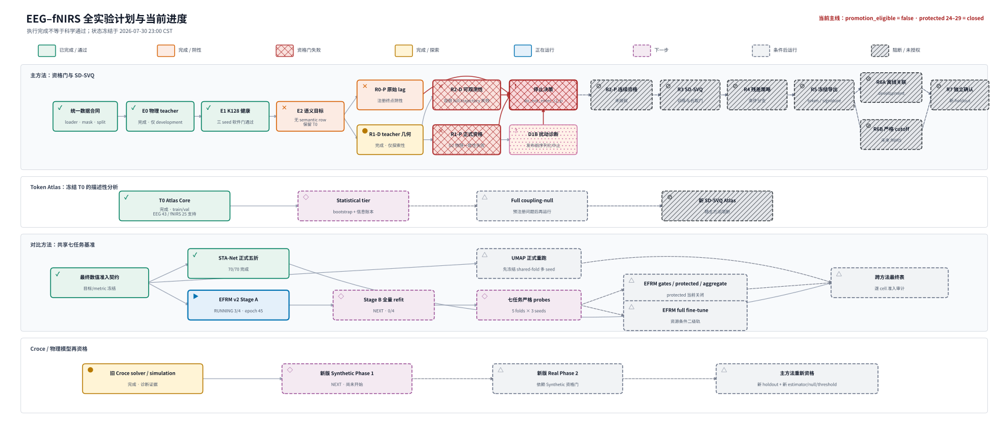

# 全实验计划与当前进度

_状态汇总：主方法与 Token Atlas 沿用 2026-07-30 冻结结论；对比方法更新至
2026-08-14 聚合终态_



[PNG 版本](figures/experiment_plan.png) ·
[无障碍长描述](figures/experiment_plan.alt.txt) ·
[图源数据](figures/experiment_plan_status.json) ·
[生成清单](figures/experiment_plan.manifest.json)

图中“完成”只表示实验或软件流程完成，不等于科学假设通过。颜色之外还使用
符号、边框和纹理重复编码状态；所有尚未获准访问数据的未来节点均明确标为
条件或阻断。

## 当前总决策

```text
promotion_eligible = false
next_action = do_not_enter_r2_p
protected_subjects_24_29 = closed
```

主方法没有可以立即开始的新 SD-SVQ/VQ 实验。R2-P、R3–R7 和新 VQ Atlas
保持阻断。若将来重启，必须重新建立独立 holdout、estimator、null family、
threshold、stopping rule 和端到端发布测试；不能复用本轮已查看的 protected
subjects 来挽救失败的 gate。

## 1. 主方法

| 阶段 | 执行状态 | 科学结果 | 后续影响 |
| --- | --- | --- | --- |
| 数据合同 | 已完成 | 四数据集 loader、mask、join、geometry、split 边界已建立 | 支撑现有分析和对比方法 |
| E0 | 已完成 | sign-calibrated adaptive teacher 仅获 development 监督资格 | 不是 ground truth |
| E1 | 已完成 | 三 seed 固定 K128 软件/occupancy 健康 | 只证明量化器可运行 |
| E2 | 已完成 | 九个 run 无 semantic row 获准 | 保留 T0 |
| R0-P | 已完成 | 原始 alpha–HbO lag 注册终点阴性 | 不支持低维 raw-lag 主张 |
| R1-D | 已完成 | correction geometry 仅探索性 | 不作为资格门 |
| R1-P | 已完成、失败 | structure pass；G2 物理一致性失败，G1 dtype 合同无效 | `promotion_eligible=false` |
| R2-D | 已完成、失败 | EEG ΔR² CI 跨零；fNIRS ΔR² 为负 | 双侧 continuous 前提失败 |
| D1B | 中止 | validation 在 endpoint/atomic publish 前被 JSON serializer 中断 | 科学状态未判定 |
| R2-P、R3–R7 | 未开始、阻断 | 没有数据访问授权 | 不训练新 VQ，不开放 subjects 24–29 |

数值和完整方法以
[`06_EXPERIMENT_LOG.md`](physiology_semantic_tokenizer/06_EXPERIMENT_LOG.md)
及
[`20260728_R_SERIES_EXPERIMENT_REPORT.md`](physiology_semantic_tokenizer/analysis/20260728_R_SERIES_EXPERIMENT_REPORT.md)
为准。

## 2. Token Physiology Atlas

E2 T0 的 Core tier 已完成，范围为 train/validation、development-only、
`protected_test_opened=false`。

| Split / modality | Active | Support-qualified |
| --- | ---: | ---: |
| train EEG | 102/128 | 82 |
| validation EEG | 93/128 | 43 |
| train fNIRS | 126/128 | 62 |
| validation fNIRS | 112/128 | 25 |

train→validation phenotype matching 的 mean cosine 为 EEG `0.7247`、fNIRS
`0.9828`；但 Core 没有 bootstrap、information ledger 或 coupling null。
posterior normalized entropy 接近 1，hard assignment 不应写成清晰生理状态。

安排顺序：

1. **下一步：Statistical tier** — subject bootstrap、information ledger 和
   train/validation signature uncertainty；
2. **条件步骤：Full tier** — 只有冻结具体 coupling 问题后才运行
   circular-shift null；
3. **阻断：新 SD-SVQ Atlas** — 必须等待主方法重新资格。

分析合同与读图规则见
[`analysis/TOKEN_PHYSIOLOGY_ATLAS.md`](analysis/TOKEN_PHYSIOLOGY_ATLAS.md)。

## 3. 对比方法

### 已完成的正式比较面

STA-Net 正式五折已完成 `70/70` 个训练。严格 cross-subject 主端点：

| MI | MA | WG | n-back | DSR | Visual | REFED CCC |
| ---: | ---: | ---: | ---: | ---: | ---: | ---: |
| 56.40% | 62.84% | 62.11% | 37.52% | 60.69% | 25.01% | 0.081 |

该 aggregate 和 140 个最新 formal checkpoints 保留为常用比较面。原论文
subject-specific 数值只作为背景，不能与新 strict protocol 做同协议声明。

六个联合方法的 public development、A0–A8、lane freeze、双签授权、protected
execution、双签揭盲和 aggregate 也已完成。正式 campaign 终态为：

```text
campaign: joint-comparison-protected-20260813-v3-single-gpu
protected jobs: 540/540 complete
failed / invalid / missing / technical failure: 0 / 0 / 0 / 0
registered cells: 42
TABLE_READY_WITH_NOTE / REJECTED_VALUE / OVERLAP_TRACK_ONLY / UNSUPPORTED:
22 / 12 / 2 / 6
```

完整 42-cell 主指标、fold SD、准入状态、证据路径和 SHA-256 见
[`comparisons/PROTECTED_CAMPAIGN_RESULTS_20260814.md`](comparisons/PROTECTED_CAMPAIGN_RESULTS_20260814.md)。
其中 12 个 `REJECTED_VALUE` 必须保留为真实观察结果，不能因为正式运行已经完成
就提升为正常可用数值；REVE MI/MA 仍只属于 overlap 表。STA-Net 继续作为
method-native context reference，不并入 support-matched direct 排名。

UMAP 正式重跑已退出当前队列；EFRM full fine-tuning、few-shot 和其他二级轨均未
纳入本轮联合 campaign，若未来启动必须创建新版本协议和新授权，不能复用本轮揭盲。

共享协议、实时状态和数字准入分别见
[`comparisons/PROTOCOL.md`](comparisons/PROTOCOL.md)、
[`comparisons/STATUS.md`](comparisons/STATUS.md) 和
[`comparisons/METRIC_ACCEPTANCE.md`](comparisons/METRIC_ACCEPTANCE.md)。

## 4. Croce / 物理模型

旧 solver、simulation 和 real-data local audit 已完成，但只属于诊断证据。
重设计尚未启动：

1. **下一步：Synthetic Phase 1** — 先验证可识别性、solver 回收和失败
   边界；
2. **条件步骤：Real Phase 2** — 只有 Synthetic 资格门通过后进入真实数据；
3. **条件步骤：主方法重新资格** — Croce 成功也不会自动解锁旧 R2-P，仍需
   新独立 holdout 和全新冻结合同。

当前高成本 `croce_validation/cache/croce_local/highwl_v2/` 保留，避免无谓
重建；旧 archive NPZ 已按
[`RESULTS_INDEX.md`](../experiments/RESULTS_INDEX.md) 的记录清理。

## 可并行的近期工作

在不开放新主方法 protected 数据、也不启动新 VQ 的前提下，可并行推进：

- 整理已完成对比 campaign 的公开汇总、审计哈希和论文表脚注；
- 运行 retained E2 T0 的 Atlas Statistical tier；
- 开始 Croce redesigned Synthetic Phase 1。

对比 campaign 已无待运行 job。Atlas Statistical tier 与 Croce Synthetic
Phase 1 仍标为“下一步”，都不是“已启动”；它们的授权边界与本轮 comparison
protected evaluation 相互独立。

## 图的更新规则

图由
[`experiment_plan_status.json`](figures/experiment_plan_status.json)
经
[`render_experiment_plan.py`](../experiments/scripts/render_experiment_plan.py)
生成。更新状态时先修改带证据路径和时间戳的源数据，再重新生成 SVG、300-DPI
PNG、alt text 和 manifest：

```bash
.venv/bin/python experiments/scripts/render_experiment_plan.py
```

SVG metadata 固定主方法 stop decision、权威来源和 live snapshot；测试防止
把失败节点误画为通过，或把 R2-P–R7 误画成已授权。
