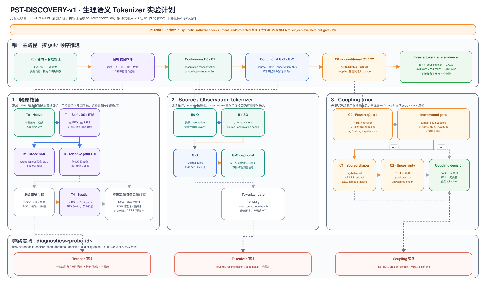

# Experiment sequencing

_Owning protocol: `PST-DISCOVERY-v1` · state: planned · 2026-08-26_

This is the single current experiment-design owner for the next
physiology-semantic tokenizer generation. The plan is limited to physical-teacher
qualification, source/observation tokenization, and coupling-prior retention. It
does not use downstream task performance as a training or selection endpoint.

Two bounded SSM entry points are now registered. The synthetic P0 launcher
remains the qualification path; the measured reconstruction/null launcher is a
nonprotected development diagnostic with its own executable contract. The
measured diagnostic uses only the registered development subjects, fits on
subjects 01--18, applies frozen objects to subjects 19--23, and keeps subjects
24--29 closed. Its outputs are exploratory reconstruction and null evidence;
they are not clean truth, teacher qualification, or a physical-teacher claim.
Protected data and every other protected surface remain closed.

The measured diagnostic does not replace the synthetic qualification gates or
authorize tokenizer promotion. Any future measured confirmation or physical
teacher qualification still requires the unresolved margins, primary
estimand, calibration, and compute decisions below to be frozen in a separate
contract.

## Fixed question and decision target

The intended final object is the smallest tokenizer that jointly satisfies:

1. `source` retains the same-modality slice of a qualified offline joint
   EEG+HbO+HbR teacher trajectory;
2. `observation` retains modality-specific measured information;
3. quantization, if admitted, does not materially degrade either function;
4. an optional coupling prior improves a held-out cross-modal proper score over
   the observation/source-history baseline without harming the first three
   properties.

The physical teacher's primary task is a physiology-constrained decomposition,
not pointwise observation copying or EEG-only cross-modal translation. From
aligned noisy EEG, HbO, and HbR observations it estimates an operational shared
neural driver `r(t)`, named hemodynamic states, an observation-space posterior,
and modality-specific or systemic nuisance/residual components. The shared
driver, physiological states, and separated noise are estimates rather than
ground truth and become decision-eligible only after the physical,
identifiability, corruption, null, and calibration checks below.

Observation-space reconstruction remains useful for posterior predictive
checking and for locating failure, but it is not the primary definition of a
good physical teacher. A candidate is not rejected solely because its point
MSE/NRMSE, R², or PCC is worse than persistence or a time-shift control.
Non-finite trajectories, physical-boundary violations, non-identifiable
physiological claims, systematic posterior-predictive failure, or failed
uncertainty calibration still reject the candidate.

The nine forward principles in
[`METHOD_RATIONALE.md`](METHOD_RATIONALE.md#frozen-theory-and-architecture-contract-unimplemented)
and the data/mask/split rules in [`DATA_CONTRACT.md`](DATA_CONTRACT.md) remain
fixed. This protocol selects implementations inside those boundaries; it does
not redefine them.

"Optimal" is deliberately lexicographic rather than a weighted total score:

1. qualify the teacher on physical identity, identifiability, robustness, null,
   and calibration gates;
2. pass every required source and observation fidelity gate;
3. pass uncertainty, stability, and codebook-health floors;
4. among passers, use the lowest token rate and simplest model;
5. use held-out proper score only as the final tie-breaker.

A strong result in one modality cannot compensate for failure in the other. If
continuous representations pass but VQ fails, the result is "no discrete
tokenizer admitted", not a forced codebook. If coupling fails, a qualified
coupling-free tokenizer may still be retained.

## Experiment flow



[Editable figure source](physiology_semantic_tokenizer/architecture/pst_discovery_v1_experiment_plan.json) ·
[standalone SVG](physiology_semantic_tokenizer/figures/pst_discovery_v1_experiment_plan.svg) ·
[visual style reference](physiology_semantic_tokenizer/figures/physiology_semantic_architecture.svg)

The upper spine is the only promotion path. The three detailed panels expose the
teacher, tokenizer, and coupling candidate ladders; the bottom lane contains
diagnostic children that are explicitly not decision-eligible.

The bottom diagnostic lane can explain a failure or motivate `v2`; it is not an
in-run retry and cannot be pooled into the `v1` promotion estimate.

## Common estimand and statistical contract

### Unit of inference

The biological unit is the subject. Scores are first aggregated over valid
coordinates, time points, patches, trials, and records within subject and then
averaged with equal subject weight. Channels, teacher coordinates, code IDs,
windows, and seeds are not independent biological replicates. Three paired seeds
are optimization/stability repeats and are reported separately from subject
uncertainty.

For a candidate `C` and baseline `B`, every main contrast is oriented so higher
is better:

```text
delta_s = subject_score_s(C) - subject_score_s(B)
Delta   = mean_s(delta_s)
```

Intervals use subject-cluster bootstrap or an exact subject-block test when the
subject count is too small for a stable bootstrap. Missing required support is
`INVALID`; the denominator is not silently reduced.

### Partitions and leakage control

- All channel selection, normalization, teacher parameters, uncertainty
  calibration, target projections, encoder/checkpoint selection, codebooks, and
  coupling maps are fit inside the authorized fit partition.
- Subject plus record/trial/video dependencies are grouped across every split.
- Historical subjects 01--18 and 19--23 have already influenced prior method
  development and cannot become a genuinely fresh confirmation cohort merely by
  relabeling them.
- The new nonprotected confirmation inventory is unresolved and must be frozen
  before measured execution. Protected subjects 24--29 remain closed.
- Task/condition annotations may define nuisance controls or matched nulls, but
  they are not prediction targets, architecture-selection endpoints, or losses
  in this protocol.

### Decision states and multiplicity

Every gate returns exactly one of `PASS`, `FAIL`, `INCONCLUSIVE`, or `INVALID`.
Confidence intervals crossing zero or a non-inferiority margin are
`INCONCLUSIVE`; technical interruption or incomplete support is `INVALID`.

Each stage has one named primary contrast. Lag, horizon, chromophore, channel,
and candidate families are either descriptive or controlled with a predeclared
max-statistic/closed-testing procedure. No best patch, lag, channel set, seed, or
checkpoint may be chosen after confirmation data are viewed.

The practical margins `delta_T`, `delta_S`, `delta_O`, and `delta_H` are
intentionally unresolved here: each must be estimated from synthetic recovery,
measurement repeatability, or fit-only technical repeats and then frozen before
the corresponding confirmation run. For the teacher, `delta_T` governs shared
driver/state robustness and calibration, not superiority of pointwise
observation reconstruction. A percentage chosen after seeing held-out results
is not an admissible margin.

## P0: software and synthetic qualification

P0 is mandatory before measured data. One synthetic generator must emit known
`r(t)`, extended Balloon states `s/f/v/p/q`, the true parameters and operators,
and clean EEG/HbO/HbR trajectories under an explicit
`p/q -> HbT/HbO/HbR` concentration map (plus the recorded optical operator when
the input coordinate is optical density) and known EEG-to-fNIRS delay. It then
injects heteroscedastic noise and controlled modality-specific or systemic artifacts--spikes, drift,
steps, bursts or high-frequency contamination, and dropout--while retaining the
clean reference, nuisance component, artifact mask, and severity. Full-input,
masked/held-out, and missing-modality replays must use the same generator. The
smallest runnable check must demonstrate:

- continuous target construction before patching/tokenization;
- exact canonical-key joins and distinct measurement, teacher, uncertainty,
  observation-residual, token, and lag masks;
- no cross-modal read before either main tokenizer emits its representation;
  the offline joint teacher is the declared fit-fold-only exception and emits
  detached modality-specific targets;
- the resting equilibrium, positive physiological states, stable integration,
  valid oxygen extraction, Balloon-compartment inflow/outflow, total-Hb and
  deoxy-Hb balances, and the explicit hemodynamic/optical observation map; these
  checks
  do not turn the model into a full oxygen-diffusion or CMRO2 model;
- prior-predictive support plus simulation-based calibration, profile-likelihood
  or equivalent identifiability checks, and multi-start sensitivity for every
  parameter allowed to vary;
- recovery of known `r(t)` and named physiological states, attenuation of
  injected artifacts, and failure on independent/time-shift/pairing/spatial
  nulls; observation-space MSE and correlation remain descriptive;
- residual agreement with injected corruption on artifact support and absence
  of systematic clean-signal removal off that support;
- calibrated predictive intervals, with uncertainty increasing under stronger
  corruption, masking, or missing input;
- branch and coupling gradient allowlists;
- config/target/summary serialization, atomic publication, and an explicit
  incomplete-run state.

P0 remains the qualification path. The separately registered measured
reconstruction/null diagnostic may run only on its nonprotected development
split and remains decision-ineligible; it cannot open protected data or promote
a teacher. Protected evaluation requires a separate explicit request.

## T: physical-teacher selection

### Selection principle and candidate range

The comparison is a staged ladder, not a Cartesian model search. Controls and
mechanism references cannot become the physical teacher merely by winning a
reconstruction metric. The first promotion candidate is the smallest robust
nonlinear Balloon model with explicit observation operators.

| ID | Candidate | Frozen question | Role |
| --- | --- | --- | --- |
| `T0-native` | measured coordinates with persistence, time-shift, and fit-fold smoothing controls | How much apparent recovery requires no latent physiology? | predictive control; never promoted |
| `T1-self` | independent EEG and fNIRS linear LDS/RTS models | How much smoothing and uncertainty calibration is available without a shared state? | single-modality attribution control |
| `T2a-croce-pf` | paper-faithful Croce-2017 nonlinear particle-filter mechanism | Which published Croce behaviours reproduce under the same synthetic contract? | fixed mechanism reference; not the default teacher |
| `T2b-adaptive-legacy` | current bounded adaptive Croce-like RTS/AR implementation | Which current results survive the new physical and identifiability tests? | historical regression baseline; never relabelled as exact Croce |
| `T3a-balloon-robust` | constrained nonlinear `r/s/f/v/p/q` extended Balloon state model, explicit EEG and fNIRS optical observations, masks, and fixed-degree-of-freedom Student-t observation noise | Can the model recover an identifiable shared drive and plausible physiological states while isolating corruption? | **primary promotion candidate** |
| `T3b-systemic` | `T3a` plus one low-dimensional fNIRS systemic/extracerebral nuisance factor | Does a frozen residual/PPC failure specifically improve without absorbing `r(t)`? | conditional extension after its predeclared `T-P3`/`T-G4` trigger |
| `T3c-hierarchical` | partial pooling of only parameters already identifiable in `T3a` | Does cross-subject pooling improve stability without prior domination? | conditional extension only after `T-P2` identifiability and a frozen cross-subject stability failure |
| `T4-dcm-lite` | two-stage EEG neural-state to Balloon/optical fNIRS model; fNIRS cannot retroactively rewrite the EEG neural state | Does a more conventional directed interpretation support the same physiology? | interpretability reference, not a joint-teacher promotion arm |
| `T5-spatial` | local geometry extension of the simplest `T3` model passing `T-G0`--`T-G4` | Is additional local spatial support necessary after physiology qualifies? | final conditional refinement at `T-G5` |

The executable synthetic P0 panel is intentionally smaller:
`T0-native`, `T1-self`, `T2b-adaptive-legacy`, and
`T3a-balloon-robust`. `T2a-croce-pf` and `T4-dcm-lite` remain frozen design
references until a contract-faithful adapter exists; they must not appear as
tested or unavailable rows manufactured from `NaN`. This P0 qualifies the
primary candidate and its current controls, not the later `T-P5` comparison.

Gamma-HRF/delay controls, Factorial/SLDS noise branches, switching regimes,
heteroscedastic process models, Gaussian-process dynamics, and full neural-mass
models remain diagnostics. They are not part of the first promotion ladder.
`T3a` does not simultaneously add switching, hierarchy, spatial structure, and
multiple nuisance factors.

`T5-spatial` starts from one HbO/HbR pair plus six nearest EEG channels, then
tests two and at most four local fNIRS pairs with at most twelve EEG channels,
subject to actual channel support. It reuses the existing adjacency/geometry
owners. A geometry-aware linear observation operator and covariance are tested
before any graph neural network. Template geometry supports adjacency and
qualitative topology only, not exact cross-modal distance or co-registration.

Channel sets are selected on fit data without labels. Added channels are
retained only if they improve a frozen posterior-predictive or proper-score
endpoint, survive channel-drop and geometry-permutation nulls, and do not
degrade calibration or state stability. Otherwise the smaller local model wins.
An all-scalp model is not part of this generation.

### Physiological state and parameter contract

The initial `T3a` continuous-time core follows the normalized Balloon dynamics
of [Friston et al. (2000)](https://www.fil.ion.ucl.ac.uk/spm/doc/papers/karl_nonlinear.pdf)
and the total-Hb/optics extension of
[Tak et al. (2015)](https://www.fil.ion.ucl.ac.uk/~wpenny/publications/tak-penny15.pdf).
Those papers define the model family; their fitted prior means are not treated
as universal human measurement ranges.

```text
ds/dt       = beta * r - kappa * s - gamma * (f - 1)
df/dt       = s
f_out       = v^(1/alpha)
tau * dv/dt = f - f_out
tau * dp/dt = f - f_out * p / v
tau * dq/dt = f * E(f, E0) / E0 - f_out * q / v
E(f, E0)    = 1 - (1 - E0)^(1/f)

domain: f > 0; 0 < E0 < 1; 0 < E(f, E0) < 1
rest:   r = s = 0; f = v = p = q = 1
```

Here `r` is the shared neural state in the fixed EEG loading/variance gauge; it
is not measured firing. `beta` is a dimensionless effective neural-to-vascular
gain in that gauge, not a molecular efficacy constant.
`s = df/dt` is the vasoactive signal; `f` is inflow normalized to rest; `v` is
normalized venous Balloon volume; and `p/q` are the normalized total-Hb/deoxy-Hb
model coordinates of that compartment. With time in seconds, `f/v/p/q` are
dimensionless, `s` has units s^-1, `r` and `gamma` have units s^-2, `beta` is
dimensionless, `kappa` has units s^-1, and `tau` has units s. `tau` is the resting transit constant
`V0/F0` of the modeled venous Balloon, not whole-region or whole-brain mean
transit time. `alpha` is its dimensionless outflow-volume exponent. A numeric
prior from another state/time scaling is usable only after its unit conversion
is recorded; copying a published coefficient labelled only as a "rate" into
this parameterization is a `T-P0` failure.

This initial model fixes Tak et al.'s viscoelastic time constant `tau_v` to
zero, so `f_out = v^(1/alpha)`. It is therefore the smallest explicit
total-Hb extension needed for `T3a`, not a claim to reproduce the paper's full
viscoelastic model. A nonzero `tau_v` is admitted only as a later one-parameter
extension after the initial state and parameter contract is identifiable.

The fNIRS forward model must be explicit rather than learned through arbitrary
signed gains:

```text
delta_HbT = P0 * (p - 1)
delta_HbR = Q0 * (q - 1)
delta_HbO = delta_HbT - delta_HbR
```

`P0` and `Q0` are positive baseline scales. If the declared measurement
coordinate is raw optical density, the above concentrations additionally pass
through the recorded wavelength-specific extinction, sensitivity/pathlength,
and cortical-mixing operator. If the coordinate is a released HbO/HbR export,
that optical-density transform is not applied a second time; its recorded
preprocessing/normalization transform is part of the observation operator.
Without those baselines and the recorded optical lineage, `p/q` remain
dimensionless model coordinates and cannot be relabelled as absolute Hb
concentrations. EEG has its own declared observation operator.

The parameter contract separates three kinds of restriction:

- **Hard mathematical/physical boundaries:** `kappa`, `gamma`, `tau`, and
  `alpha` are positive; `0 < E0 < 1`; `f`, `v`, `p`, `q`, and `f_out` remain
  positive; `E(f,E0)` remains in `(0,1)` at every step; `P0 > 0`, `Q0 > 0`,
  and the mapped absolute HbT/HbR/HbO values remain nonnegative with HbR not
  exceeding HbT. The resting equilibrium, compartment balances, units,
  finite integration, and stability checks must pass. These are validity
  conditions, not fitted medical ranges.
- **Neural-drive gauge:** set the baseline of `r` to zero, fix its sign so a
  positive drive increases `s`, normalize its scale by one predeclared
  fit-fold rule, and fix one EEG observation loading. The conventional
  `epsilon` factor is absorbed into `r`; no separate neural-efficacy parameter
  is fitted or reported as measured physiology.
- **Soft source-backed priors:** every numeric prior and plausible-response
  interval must record its units, compartment, species/population and challenge
  condition, primary source, and prior parameterization in the executable
  contract. A posterior pressed against a bound or unchanged from its prior is
  not evidence that the parameter was measured.
- **Measured exploratory release ladder:** retain `P0/Q0`, EEG loading, driver
  scale, noise, and Student-t degrees of freedom as fit-cohort gauges. Compare
  the fixed model first, then the single-parameter `beta`, `kappa`, and `tau`
  fits, then `beta+kappa+tau`, followed by one-at-a-time additions of `gamma`
  and `alpha`. Release `E0` only as a final strong-prior diagnostic because the
  current standardized fNIRS coordinate cannot establish absolute OEF. Each
  subject shares one parameter vector across independently reset trials. A
  later stage cannot be retained merely for reconstruction gain when its
  posterior is boundary-bound, prior-dominated, or compensatory. `p` has no
  separate free dynamic parameter in `T3a`.

Names must not overstate what the equations identify. `kappa` and `gamma` are
lumped model coefficients, not direct molecular vasodilation rates; `E0` is the
resting oxygen extraction fraction, not an oxygen dissociation rate. Without
absolute flow/volume and optical calibration, the experiment cannot claim
absolute OEF, CMRO2, or an oxygen dissociation rate. Such quantities remain
outside the result vocabulary even when the latent trajectory looks plausible.

### Teacher test sequence

| Stage | Test items | Promotion consequence |
| --- | --- | --- |
| `T-P0 semantics/physics` | state names, equations, units, gauge, observation map, equilibrium, positivity, finite/stable integration, and parameter-source ledger | any violation is `FAIL` before fitting |
| `T-P1 prior predictive` | draw prior trajectories across the frozen design; check plausible amplitudes/delays, boundary contact, solver failures, and prior sensitivity | unsupported priors or implausible mass dynamics block the candidate |
| `T-P2 identifiability` | simulation-based calibration using the declared EKF-Laplace posterior-CDF approximation, rank/coverage diagnostics, fixed-other-parameter objective slices as the initial posterior-geometry check, multi-start recovery, and parameter/state confounding | non-identifiable parameters are fixed/removed; stable `r` alone earns only state-level status; exact posterior SBC is required if the Laplace approximation itself fails calibration |
| `T-P3 known-truth corruption` | recover `r/s/f/v/p/q`, separate known artifacts/nuisance, preserve clean off-artifact morphology, vary severity/masks/missing modalities, and run independent/time-shift/pairing/spatial nulls | qualifies shared-state and noise-separation claims; point reconstruction metrics remain descriptive |
| `T-P4 measured development` | posterior-predictive checks, residual temporal/spectral structure, modality ablations, leave-one-trial/subject-out stability, and prior-to-posterior movement | permitted only after an executable measured-data contract; no protected access |
| `T-P5 comparison/spatial` | compare the simplest surviving models by predictive score, calibration, complexity, perturbation stability, and spatial/channel nulls | select the smallest fully qualified teacher; otherwise stop |

The current authorized P0 software/synthetic scope covers `T-P0` through
`T-P3` and the known-clean synthetic portion of `T-G4`. Final `T-G4`, `T-P4`,
`T-G5`, and `T-P5` require the later executable measured-data contract; this
plan does not open measured or protected data.

The synthetic `T-G4` screen uses Student-t interval/proper-score calibration
plus lag-one autocorrelation and normalized-spectrum errors of the posterior
mean. Those two reconstruction-shape diagnostics are not full posterior-
predictive simulations and are not labelled PPC in the executable output.

### Teacher outputs and uncertainty convention

All candidates publish common observation and diagnostic fields:

```text
trajectory_mean
aleatoric_variance
epistemic_variance
total_variance = aleatoric_variance + epistemic_variance
observation_values
observation_residual = observation_values - trajectory_mean
nuisance_mean / nuisance_variance, when the candidate declares a nuisance state
named masks and coordinate/channel identities
fit, model/config, parameter, and calibration identities
```

Physiological candidates additionally publish, with explicit state names:

```text
shared_driver_mean / shared_driver_variance
physiological_state_mean / physiological_state_variance
parameter_posterior_summary
parameter_identifiability_status
physical_check_status
```

`shared_driver_mean` is the operational `r(t)` estimate.
`physiological_state_mean` contains only states actually present and identified
in the fitted model. `trajectory_mean` is an observation-space posterior
prediction, not a clean-ground-truth claim. `observation_residual` may be
described as separated noise/artifact only to the extent supported by `T-P3`;
otherwise it remains an unassigned observation residual.

The contract uses **variance**, not an ambiguous `uncertainty` scalar. The
legacy adapter mixes variance-like summaries while the current loss divides by
that field without a log-variance term; therefore its uncertainty-weighting
switch is not admitted evidence for this generation.

Calibration is fit-fold-only and frozen before application. Primary uncertainty
endpoints are predictive log score and CRPS on known-clean synthetic coordinates
and prespecified masked real coordinates. 50/80/95% interval coverage and width,
standardized residuals, PIT, and risk-versus-uncertainty monotonicity are
required diagnostics. Same-point joint-posterior coverage is descriptive
because the observation was consumed by the smoother. Aleatoric and epistemic
components remain separate in the artifact and report.

### Teacher gate

| Gate | Required evidence |
| --- | --- |
| `T-G0 physical contract` | lineage, folds, masks, state/operator identity, units, sign/gauge, equilibrium, positivity, finite/stable integration, no label use, and no protected dereference |
| `T-G1 prior/synthetic validity` | source-frozen priors have plausible prior-predictive support; synthetic `r/s/f/v/p/q` and observations are generated without extraction, boundary, compartment-balance, or optical-map failure across the frozen design |
| `T-G2 identifiability` | SBC/coverage, posterior geometry or profile checks, and multi-start recovery support every reported state/parameter; prior-dominated or mutually confounded quantities cannot receive physiological labels |
| `T-G3 shared-state/noise adequacy` | `r(t)` and admitted states remain within frozen perturbation limits; known artifacts enter nuisance/residual rather than the physiological state; off-artifact leakage stays below its frozen bound; independent/time-shift/pairing/spatial null inputs do not yield a qualified shared state |
| `T-G4 calibration/PPC` | predictive log score, CRPS, interval calibration, uncertainty-risk monotonicity, and prespecified temporal/spectral posterior-predictive checks pass; MSE/NRMSE/R²/PCC and same-point reconstruction are descriptive only |
| `T-G5 measured/spatial stability` | measured modality ablations and subject/fold/seed/channel perturbations preserve the admitted claims; any spatial gain survives channel and geometry nulls without worse calibration |

Only the simplest `T3` candidate passing all applicable gates becomes the
frozen training-target producer. It is privileged, label-blind, fit-fold-only,
and training-only; it is never a tokenizer inference input or ground truth.
EEG-only and fNIRS-only reruns are attribution and missing-modality ablations,
not requirements that EEG reconstruct omitted HbO/HbR or vice versa.

Qualification has three explicit outcomes. Passing the full gate yields a
physical teacher. A robust `r(t)` with non-identifiable physiological parameters
is a state-only diagnostic and cannot support parameter-level interpretation.
A model that only smooths observations remains a baseline. If no `T3` candidate
passes `T-G0`--`T-G4`, source-tokenizer development stops; reconstruction work
may continue only as a diagnostic.

## B/Q: source and observation tokenizer

### Functional implementation

The first implementation uses one simple modality-local temporal stem with two
heads:

```text
X_m -> stem_m -> source latent      -> teacher-trajectory decoder
             -> observation latent -> measured-signal decoder
```

EEG and fNIRS stems never read the other modality. Source and observation are
functional roles, not an assertion of statistical independence, and they need
not start as four physically separate encoders. A separate stem is considered
only if the shared-stem gradient audit demonstrates reproducible interference.

The observation target is the measured/masked modality coordinate. It is not
defined as `raw - source` unless a later diagnostic first establishes compatible
units and an identifiable additive decomposition. This avoids repeating the old
power-versus-voltage and single-decoder ambiguity.

### Candidate sequence

| ID | Change from previous row | Question |
| --- | --- | --- |
| `B0-O` | continuous observation-only autoencoder | What reconstruction is available without teacher semantics? |
| `B1-SO` | add continuous source head and frozen teacher supervision | Can both functional roles pass before discretization? |
| `Q-S` | quantize source only with the existing EMA-VQ family | Are physiological source patterns discretizable without losing semantics? |
| `Q-O` | quantize observation only after `Q-S` passes and only if a fully discrete interface is required | Can measured information also survive the bottleneck? |

The initial temporal grid and latent width use the smallest existing setting that
can express the continuous targets. If it fails, width doubles only until the
continuous gate passes. Patch duration is screened on the continuous model,
starting from the existing 2 s grid and testing 1 s only when temporal averaging
is the diagnosed failure; 0.5 s is a later diagnostic, not a default row.

The VQ family is EMA-VQ first. Codebook size starts at the retained K128
reference. If support is persistently redundant, K64 is the only next reduction;
larger K or another quantizer family is considered only when a healthy K128 loses
required information. There is no simultaneous K x D x quantizer search.

### Loss ladder

The default `B1-SO` objective contains only:

```text
L = L_observation_reconstruction + L_source_trajectory
```

`Q-S/Q-O` add only the corresponding VQ commitment/update term. No prototype,
context, balance, independence, cross-masking, or coupling loss is enabled by
default.

Additional terms are one-factor diagnostics with a named trigger:

| Trigger | Single allowed diagnostic | Promotion condition |
| --- | --- | --- |
| calibrated teacher uncertainty passes `T-G4` | uniform source loss vs clipped, normalized precision weighting | improves source score/calibration without worse observation fidelity or effective support |
| actual code collapse under a passing continuous model | existing straight-through balance loss | restores health without exceeding source/observation non-inferiority margins |
| continuous semantics pass but hard-token semantics fail | isolated prototype/topology loss | improves hard retention without codebook redundancy or gradient conflict |
| a valid local sequence endpoint fails while local targets pass | isolated context loss | improves the frozen sequence endpoint without future leakage |

The old multi-entry loss bundle is not restored. Every new entrance has its own
coordinates, masks, weight, ablation, and gradient audit.

### Tokenizer endpoints and gates

| Gate | Required evidence |
| --- | --- |
| `B-G0 support` | train loss and evaluation use the same declared target/mask population; subject/trial/patch coverage is explicit |
| `B-G1 observation` | held-out masked measurement log score/NRMSE is non-inferior to `B0-O`; EEG spectral and fNIRS HbO/HbR morphology are secondary fidelity checks |
| `B-G2 source` | continuous source latent/decoder retains the frozen teacher trajectory beyond history and target-permutation baselines, for every required modality/coordinate |
| `B-G3 attribution` | source-only, observation-only, and full interventions show that source gain is not supplied by an observation/residual bypass; cross-decoding is reported, not forced to zero |
| `Q-G1 retention` | expected embedding, posterior, and hard ID are each compared with the continuous upper bound; hard-token source and observation losses stay within frozen margins |
| `Q-G2 health` | active/effective support, dead/revival history, minimum per-code support, usage concentration, participation rank, near-duplicates, and subject/seed stability pass as guardrails |

Codebook utilization is not itself a semantic endpoint. Among gate-passing
models, the lowest bitrate wins; a higher occupancy count cannot rescue worse
reconstruction or teacher retention. Continuous latents, expected embeddings,
posteriors, hard IDs, and codebook embeddings are all exported so hard IDs never
become the entire representation record.

## C: coupling-prior return

### Frozen evaluation target

Coupling is tested only after the marginal tokenizer is frozen. The primary
representation-level estimand is the subject-equal held-out proper-score
increment for measured fNIRS observation residual:

```text
q0(Y_F(t+h) | H_F_observation, H_F_source, phase/time/systemic controls)
q1(Y_F(t+h) | H_F_observation, H_F_source,
                 H_E_source, phase/time/systemic controls)

Delta_coupling = score(q1) - score(q0)
```

The evaluator is low-capacity and cross-fitted. Positive lag means EEG precedes
the fNIRS endpoint. One primary horizon or integrated horizon score is frozen
before confirmation; individual lag curves are descriptive and family-wise
controlled. Full-window tokens can support only an offline association label. A
prospective/delayed-prediction claim additionally requires strict receptive-field
cutoff tests.

Required nulls preserve the relevant marginals and dependence structure:

- whole-window circular shift with tokens and masks shifted together;
- same-subject/condition nonoverlapping trial derangement;
- independent-window pairing;
- lag reversal/negative-lag control;
- spatial adjacency permutation for a spatial-prior diagnostic.

NMI, co-occurrence heatmaps, row entropy, and same numeric IDs are descriptive
only. The teacher's latent flow is an upper-bound diagnostic, not the primary
coupling target.

### Minimal prior ladder

| ID | Tokenizer gradient | Purpose |
| --- | --- | --- |
| `C0` | none; fit a lag-balanced, marginal-residualized `q0/q1` after tokenizer freeze | establish whether the representation contains incremental information at all |
| `C1-source` | a small fit-selected weight reaches only the EEG source path; fNIRS target/history, both observation paths, teacher, and baseline are detached | test whether the one-term shaper preserves coupling-relevant source information |
| `C2-uncertainty` | same as `C1`, with clipped normalized confidence weights | optional only after `T-G4`; unweighted results remain co-primary sensitivity |

If `C0` does not beat `q0` and all registered nulls, no coupling loss reaches the
tokenizer. `C1/C2` are admitted only when `Delta_coupling` improves and all
observation/source fidelity and codebook-health gates remain non-inferior to the
coupling-free tokenizer.

Only the historical lag-balanced conditional pair likelihood is eligible to
return initially, because its training target matches the evaluation contrast.
The former lag-focus entropy, joint-entropy, codebook-neighbor JS, local/context
residual maps, and multi-term coupling bundle remain diagnostics. They may make a
coupling tensor look concentrated without improving held-out information and are
not reintroduced together. Best and final checkpoints, per-loss gradient norms,
reconstruction-versus-coupling cosine conflict, and assignment health are all
reported.

## Side-path experiments without workflow sprawl

A side path is a diagnostic child of a main run, not a new project track. It
shares the parent's data/split/teacher/code identities and lives at:

```text
experiments/runs/physiology_semantic_tokenizer/tokenizer_discovery_v1/
  <immutable-run-id>/
    resolved_config.yaml
    summary.json
    metrics.csv
    figures/
    diagnostics/
      <probe-id>/
```

Each diagnostic records `parent_run_id`, `scope`, `hypothesis`, `estimand_id`,
`operator/null`, `status`, and `decision_eligibility=false`. It may use
`synthetic`, `diagnostic`, `null`, or `development` scope. It cannot change the
parent summary, reuse a protected unlock, or promote a candidate. A diagnostic
that motivates a new main hypothesis requires a new contract version before
fresh confirmation data are viewed.

`research_state/registry.json` records only suite/program state transitions. It
does not gain one record per probe, seed, channel arm, or gate. The retained
result index is updated only when a conclusion and its minimum provenance package
are frozen.

## Code ownership for later implementation

No scaffolding is created by this design. When implementation starts, reuse the
existing owners:

| Responsibility | Owner |
| --- | --- |
| continuous teacher and family adapter | `src/teachers/` |
| target artifact, masks, joins, and provenance | `src/data/` |
| modality-local source/observation tokenizer | `src/tokenizers/` |
| reconstruction, semantic, VQ, and optional coupling objectives | `src/losses/` |
| proper scores, calibration, retention, and codebook health | `src/metrics/` and `src/analysis/` |
| one orchestration/analysis entry | `experiments/scripts/` |
| reviewed executable contract, when ready | `experiments/configs/physiology_semantic_tokenizer/` |

Do not reactivate or rename an E0--E2/R-series YAML, archived source/observation
runner, or old coupling suite. There is no need for a manager, plugin layer,
parallel results root, or separate authorization file.

## Unresolved before measured qualification or confirmation

The synthetic P0 contract and the bounded measured diagnostic contract are
executable. The following values remain unresolved for measured qualification
or confirmation and do not change the diagnostic's exploratory status:

1. the exact nonprotected dataset and subject/record split providing a genuinely
   fresh confirmation set beyond the registered development diagnostic;
2. the source-frozen soft priors, fixed versus free parameter list, parameter
   identifiability/SBC criteria, and numerical `r(t)` or physiological-state
   perturbation limits for `T-G1`--`T-G3`;
3. numeric `delta_S`, `delta_O`, and `delta_H` margins plus the single primary
   coupling horizon or integrated horizon definition and its
   family-wise null procedure;
4. maximum training steps/checkpoint rule and the measured-run compute budget;
5. the measured-data continuous target schema/version implementing the named shared
   driver, physiological states, nuisance/residual, trajectory, parameter
   summary, identifiability, physical-check, and variance fields above;
6. any measured-data corruption/masking schedule and clean-reference definition.

The `T3a-balloon-robust` P0 implementation, frozen synthetic generator,
corruption/null schedule, common output tables, gates, and Chinese renderer now
live in
[`t3a_balloon_robust_p0.yaml`](../experiments/configs/physiology_semantic_tokenizer/t3a_balloon_robust_p0.yaml),
[`evaluate_t3a_balloon_robust_p0.py`](../experiments/evaluate_t3a_balloon_robust_p0.py),
and
[`render_t3a_balloon_robust_p0.py`](../experiments/scripts/render_t3a_balloon_robust_p0.py).
The bounded measured reconstruction/null diagnostic is registered in
[`t3_measured_reconstruction_null_v1.yaml`](../experiments/configs/physiology_semantic_tokenizer/t3_measured_reconstruction_null_v1.yaml)
and
[`evaluate_t3_measured_reconstruction_null.py`](../experiments/evaluate_t3_measured_reconstruction_null.py).
It uses the canonical measured loader with `raw_with_ocular_artifact`, the
01--18 fit / 19--23 population pure-apply split, and declared independent,
pairing, and time-shift nulls. The measured non-circular time-shift comparison
scores the paired and shifted targets only on their common finite support; its
100-point support is not pooled with the 200-point independent/pairing nulls.
Its result is a nonprotected exploratory
diagnostic and is not a Croce/Balloon qualification, clean-ground-truth claim,
or protected evaluation. `T3b`, `T3c`, and `T5` enter only after their declared
triggers.

## Historical lifecycle boundary

The following table remains a lifecycle overlay for the superseded flow. It does
not rewrite dated evidence; linked reports remain the evidence owners.

| Historical item | Lifecycle | Evidence or retained plan | Retained use |
| --- | --- | --- | --- |
| E0--E2 and R0--R2 generations | **stopped** | [`06_EXPERIMENT_LOG.md`](physiology_semantic_tokenizer/06_EXPERIMENT_LOG.md) and [`20260728_R_SERIES_EXPERIMENT_REPORT.md`](physiology_semantic_tokenizer/analysis/20260728_R_SERIES_EXPERIMENT_REPORT.md) | Historical results and failure boundaries only |
| SSM reliability screen | **stopped** | [`20260819 SSM reconstruction reliability results`](analysis/20260819_SSM_RECONSTRUCTION_RELIABILITY_RESULTS.md) | Exploratory reliability evidence only |
| Continuous-latent screen | **stopped** | [`20260819 continuous shared/private latent results`](analysis/20260819_CONTINUOUS_SHARED_PRIVATE_LATENT_RESULTS.md) | Exploratory latent evidence only |
| LC-SPVQ optimization and QC | **stopped** | Dated LC-SPVQ reports under [`analysis/`](analysis/) | Negative/undetermined evidence only |
| Token Atlas Core (T0) | **stopped** | [`TOKEN_PHYSIOLOGY_ATLAS.md`](analysis/TOKEN_PHYSIOLOGY_ATLAS.md) | Development-only retained result |
| Protected comparison campaign and P0 degradation | **stopped** | [`PROTECTED_CAMPAIGN_RESULTS_20260814.md`](comparisons/PROTECTED_CAMPAIGN_RESULTS_20260814.md) and [`PERFORMANCE_DEGRADATION_P0_RESULTS_20260816.md`](comparisons/PERFORMANCE_DEGRADATION_P0_RESULTS_20260816.md) | Retained comparison evidence only |
| Croce legacy solver and audits | **stopped** | [`CROCE2017_REAL_DATA_VALIDATION_PLAN.md`](../croce_validation/CROCE2017_REAL_DATA_VALIDATION_PLAN.md) | Historical qualification/audit evidence only |
| Comparison P1/P2 and unexecuted follow-up | **abandoned** | [`PERFORMANCE_DEGRADATION_ANALYSIS_PLAN_20260816.md`](comparisons/PERFORMANCE_DEGRADATION_ANALYSIS_PLAN_20260816.md) | Unstarted comparison candidates only |
| D1B, future R/VQ, LC full development, observation/source map, Atlas Statistical/Full, and Croce follow-ons | **abandoned** | Dated plans and candidate snapshots indexed in [`README.md`](README.md) | Non-runnable historical candidates only |

Neither `stopped` nor `abandoned` evidence authorizes or determines a row in
`PST-DISCOVERY-v1`. Historical plans preserve their original wording for
reproducibility.
