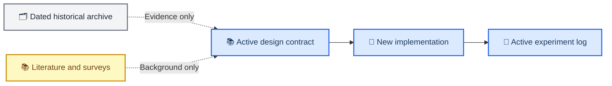

# Documentation authority and archive map

_Active design entrypoint and historical-document boundary, 2026-07-01_

---

## 📋 Read this first

New tokenizer work is governed by [`physiology_semantic_tokenizer/`](physiology_semantic_tokenizer/README.md). Historical source/observation documents remain available for reproduction, but they are not valid implementation instructions for the new architecture.

| Question | Active authority |
| --- | --- |
| Why redesign? | [`01_LEGACY_DESIGN_POSTMORTEM.md`](physiology_semantic_tokenizer/01_LEGACY_DESIGN_POSTMORTEM.md) |
| What should be built? | [`02_TARGET_ARCHITECTURE.md`](physiology_semantic_tokenizer/02_TARGET_ARCHITECTURE.md) |
| Why should it work? | [`03_THEORETICAL_FOUNDATIONS.md`](physiology_semantic_tokenizer/03_THEORETICAL_FOUNDATIONS.md) |
| How should it be implemented and tested? | [`04_IMPLEMENTATION_VALIDATION_PLAN.md`](physiology_semantic_tokenizer/04_IMPLEMENTATION_VALIDATION_PLAN.md) |
| Which experiments are allowed? | [`05_EXPERIMENT_DESIGN.md`](physiology_semantic_tokenizer/05_EXPERIMENT_DESIGN.md) |
| What has run under the new design? | [`06_EXPERIMENT_LOG.md`](physiology_semantic_tokenizer/06_EXPERIMENT_LOG.md) |
| Where should outputs be saved? | [`STORAGE_LAYOUT.md`](STORAGE_LAYOUT.md) |

## 🗂️ Document lifecycle

## 📚 Supporting documentation

| Path | Role | Authority |
| --- | --- | --- |
| [`ARCHITECTURE.md`](ARCHITECTURE.md) | Runnable pre-redesign implementation truth | Compatibility and baseline only |
| [`architecture_changelog/`](architecture_changelog/INDEX.md) | Chronological architecture decisions | Historical record |
| [`reliable_survey/`](reliable_survey/) | Literature and external-method research | Background evidence |
| [`report/`](report/) | Presentations and milestone reports | Communication artifacts |
| [`paper/`](paper/) | Manuscript workspace | Paper-specific claims |
| [`archive/pre_physiology_semantic_20260701/`](archive/pre_physiology_semantic_20260701/README.md) | Superseded plans, theory, scorecards, and workflow reconstruction | Explicit historical archive |

## 🛡️ Isolation rules

- Do not import a loss, gate, tensor contract, or output path from the archive into new code without recording a new design decision.
- Do not append new results to an archived experiment log.
- Do not treat `docs/reliable_survey/` as implementation authority.
- Keep target claims marked planned until their code-correctness and scientific-validity gates pass.
- Update this index whenever a document changes authority class.

_Last updated: 2026-07-01_
