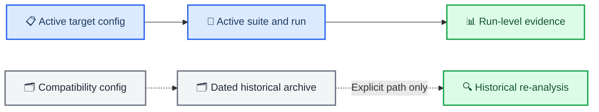

# Storage layout and result isolation

_Canonical cache, active-run, and archive namespaces as of 2026-07-01_

---

## 📋 Core rule

The directory name must answer whether an artifact belongs to the approved physiology-semantic program or to a superseded lineage. New tools operate on the active root only; historical analysis requires an explicit archive path.



## 🧪 Active experiment namespace

Every new run is written below:

```text
experiments/runs/physiology_semantic_tokenizer/<suite>/<timestamp>_<name>/
```

The suite names are fixed by the experiment program:

| Suite | Purpose |
| --- | --- |
| `e0_teacher_validity` | Cache, physical teacher, observability, uncertainty |
| `e1_quantizer_correctness` | EMA correctness and codebook health |
| `e2_semantic_supervision` | Waveform, state, and hybrid targets |
| `e3_masked_state` | Contextual physiological prediction |
| `e4_residual_strategy` | Continuous residual and later RVQ/FSQ |
| `e5_optical_representation` | HighWL, lowWL, paired optical, derived representations |
| `e6_information_ladder` | Continuous-to-discrete information retention |
| `e7_frozen_coupling` | Marginal/history-controlled sequence coupling |
| `e8_wholebrain_downstream` | Representation modes and downstream utility |
| `e9_visualization_stability` | Signature matching and figure reproducibility |

Configs resolve the namespace explicitly:

```yaml
experiment:
  run_group: physiology_semantic_tokenizer/e0_teacher_validity
```

No script may write a new run directly below `experiments/runs/`.

## 📦 Run artifact contract

```text
<run>/
├── config.yaml
├── resolved_config.yaml
├── manifest.json
├── environment.json
├── checkpoints/
├── metrics/
│   ├── train.jsonl
│   ├── validation.jsonl
│   └── test_summary.json
├── diagnostics/
├── predictions/
├── figures/
├── figure_data/
└── summary.md
```

`manifest.json` records the Git revision, dirty-worktree state, config/cache/split hashes, seed, command, timestamps, schema version, and completion status. Test metrics are written once after selection is frozen.

## 💾 Cache namespaces

The pre-redesign highWL compatibility cache remains available at:

```text
croce_validation/cache/croce_local/highwl_v1/
```

It is a historical input contract, not the target physical-teacher schema. The target implementation must use a versioned root:

```text
croce_validation/cache/physiology_semantic_tokenizer/<schema_version>/
```

The new cache version must expose paired optical observations, state posterior statistics, solver metadata, and causal-valid masks before E0 can run.

## 🗂️ Historical archive

All result families present at the 2026-07-01 design freeze were moved to:

```text
experiments/archive/pre_physiology_semantic_20260701/
├── runs/
├── comparison_reports/
├── README.md
└── archive_manifest.tsv
```

Earlier archives remain under their existing `experiments/archive/` and `croce_validation/archive/` namespaces. The [dated archive inventory](../experiments/archive/pre_physiology_semantic_20260701/README.md) records the move and evidence boundary.

## 🔍 Discovery rules

- Active tools default to `experiments/runs/physiology_semantic_tokenizer/`.
- Archive paths are never searched through a project-wide recursive glob.
- Explicit archive analysis must name `--runs-root` or an exact run directory.
- A suite summary can discover only descendants of its own suite.
- Discovery ignores directories without a valid manifest or required schema marker.
- Absolute paths inside old manifests are preserved as provenance; the archive manifest maps original to current locations.
- Generated payloads remain Git-ignored. Storage READMEs and lightweight archive manifests are force-tracked.

## 🛡️ Migration policy

- Move historical artifacts; do not delete or rewrite them.
- Do not create compatibility symlinks inside `experiments/runs/`, because they reintroduce discovery and reading ambiguity.
- Update active evidence links to the archive location.
- Keep archived configs and scripts labeled as compatibility surfaces until the target replacements are implemented.
- A target run is never stored in the archive merely because its scientific gate failed; valid negative results remain active evidence.

_Last updated: 2026-07-01_
