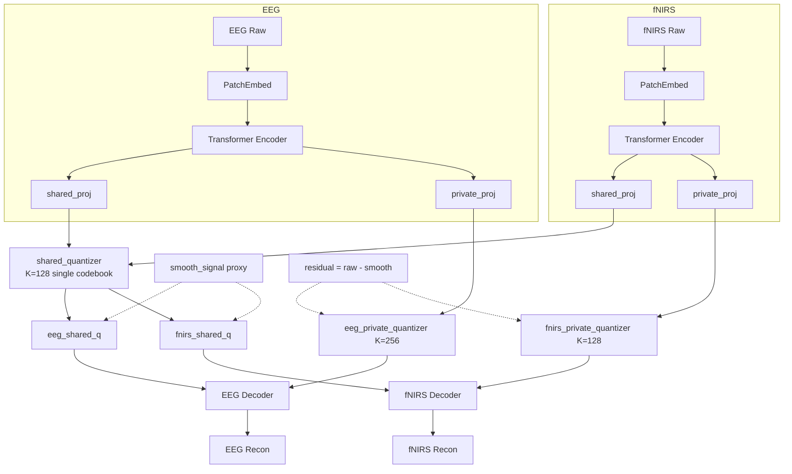

# Source/Observation Architecture Migration

> **Date**: 2026-05-06 | **Phase**: 1 (Structural Migration) | **Git**: `84299b4..ab7d7e0`
> **Status**: Merged
> **Links**: [IMPLEMENTATION_PLAN.md §6.2](../../IMPLEMENTATION_PLAN.md) | [PHYSIOLOGICAL_COUPLING_PLAN.md §2](../../PHYSIOLOGICAL_COUPLING_PLAN.md)

## Motivation

The old shared/private branch semantics used a purely engineering-driven definition: shared = temporally smoothed, private = residual. This had no physiological basis and weakened the project's innovation narrative. The redesign replaces these with source (neurovascular coupling state) and observation (modality-specific encoding debt) — grounded in a generative model of neural activity → measurement.

## Architecture Delta

### Before: Shared/Private Architecture



**Key characteristics**:
- Single `shared_quantizer` forces EEG and fNIRS to compete for the same K=128 discrete codes
- Shared branch trained by `smooth_signal(raw, kernel)` — a purely temporal low-pass proxy with no physiological meaning
- Private branch trained by `raw - smooth` — defined as the complement of shared, not by its own semantics
- Coupling observed post-hoc via free `coupling_logits` parameter

### After: Source/Observation Architecture

```mermaid
graph TB
    subgraph EEG
        E_IN[EEG Raw] --> E_PE[PatchEmbed] --> E_ENC[Transformer Encoder]
        E_ENC --> E_SRC_PROJ[source_proj]
        E_ENC --> E_OBS_PROJ[observation_proj]
    end
    subgraph fNIRS
        F_IN[fNIRS Raw] --> F_PE[PatchEmbed] --> F_ENC[Transformer Encoder]
        F_ENC --> F_SRC_PROJ[source_proj]
        F_ENC --> F_OBS_PROJ[observation_proj]
    end
    E_SRC_PROJ --> E_SQ[eeg_source_quantizer<br/>K=128 D=48]
    F_SRC_PROJ --> F_SQ[fnirs_source_quantizer<br/>K=128 D=48]
    E_OBS_PROJ --> E_OQ[eeg_observation_quantizer<br/>K=256 D=64]
    F_OBS_PROJ --> F_OQ[fnirs_observation_quantizer<br/>K=128 D=48]
    E_SQ --> COUPLING{Coupling Matrix M_lag<br/>[K_src x K_src]<br/>learned cross-codebook mapping}
    F_SQ --> COUPLING
    E_SQ --> E_DEC[EEG Decoder]
    E_OQ --> E_DEC
    F_SQ --> F_DEC[fNIRS Decoder]
    F_OQ --> F_DEC
    E_DEC --> E_OUT[EEG Reconstruction]
    F_DEC --> F_OUT[fNIRS Reconstruction]
    COUPLING -.-> COUPLING_LOSS[source_coupling_loss<br/>KL div between predicted<br/>and actual token distributions]
```

**Key characteristics**:
- **Dual independent source codebooks**: EEG and fNIRS each have their own K=128 codebook with potentially different dimensions
- **Coupling matrix bridges codebooks**: An `[n_lags, K_src, K_src]` learned parameter maps EEG source token distributions to fNIRS source token distributions (and vice versa when bidirectional)
- **Source branch**: Encodes neurovascular coupling state — the neural activity that drives both modalities
- **Observation branch**: Encodes modality-specific reconstruction debt — signal components source cannot explain
- **No smooth proxy**: Source is defined by cross-modal predictability through the coupling matrix, not by temporal smoothing
- **No residual target**: Observation is implicit — it's what reconstruction needs beyond source

## Component Changes

| File | Change | Description |
|------|--------|-------------|
| `src/tokenizers/factorized_labram_vqnsp.py` | Rewritten | `FactorizedLaBraMVQNSP` → `SourceObservationLaBraMVQNSP`; 4 independent quantizers; coupling matrix; removed smooth/residual targets |
| `src/tokenizers/codebook_focus_factorized_labram_vqnsp.py` | Removed | Too complex; functionality merged into main tokenizer |
| `src/tokenizers/__init__.py` | Modified | Export `SourceObservationLaBraMVQNSP`; register as `source_observation_labram_vqnsp` |
| `src/tokenizers/registry.py` | Modified | Added `source_observation_labram_vqnsp` config path; kept `factorized_labram_vqnsp` for backward config compatibility |
| `src/losses/multimodal_tokenizer.py` | Modified | Removed shared/private-specific loss wrappers; kept `coupling_kl_loss`, `batch_usage_entropy_loss`, `orthogonality_loss`, `align_pair` |
| `src/visualization/source_observation_analysis.py` | Added | New analysis entry point for source/observation architecture; replaces `factorized_alignment_analysis.py` |
| `experiments/scripts/train_shared_tokenizer.py` | Modified | Switched to source/observation model type and config schema |
| `experiments/configs/source_observation/` | Added | New config directory with phase1/phase2/phase3/mechanism_a/mechanism_c/ subdirectories |

## Data Flow Changes

**Encoder**: Unchanged structurally — same PatchEmbed + TransformerEncoder for both modalities. The change is in the projection heads: one encoder now feeds two projection layers (source_proj + observation_proj) instead of the old shared_proj + private_proj.

**Quantization**: Changed from 3 quantizers (1 shared + 2 private) to 4 quantizers (2 source + 2 observation). The critical change: EEG and fNIRS no longer share a quantizer — each modality's source latent is quantized independently by its own codebook.

**Coupling**: Before, coupling was a side-channel `coupling_logits` parameter learned via KL loss on token assignment probabilities. This remains structurally but is now the **primary** mechanism connecting the two modalities — it's no longer "just" a diagnostic tool, it's the architectural bridge replacing the old shared quantizer.

**Decoder**: Unchanged structurally — concatenates source_q + observation_q, projects to decoder dim, decodes via TransformerDecoder, outputs amp/phase heads.

## Configuration Changes

```yaml
# BEFORE (shared/private schema)
model:
  type: factorized_labram_vqnsp
  shared:
    codebook_size: 128
    codebook_dim: 48
  eeg_private:
    codebook_size: 256
    codebook_dim: 64
  fnirs_private:
    codebook_size: 128
    codebook_dim: 48
loss:
  alignment:
    shared_eeg_common_weight: 0.5    # smooth proxy target
    shared_fnirs_common_weight: 0.5
    eeg_private_residual_weight: 0.5  # residual target
    fnirs_private_residual_weight: 0.5

# AFTER (source/observation schema)
model:
  type: source_observation_labram_vqnsp
  source:
    codebook_size: 128
    eeg_codebook_dim: 48
    fnirs_codebook_dim: 48
  eeg_observation:
    codebook_size: 256
    codebook_dim: 64
  fnirs_observation:
    codebook_size: 128
    codebook_dim: 48
loss:
  coupling:
    weight: 0.07
    bidirectional: true
  branch:
    orthogonality_weight: 0.01
  codebook:
    balance_weight: 0.02
```

## Loss Function Changes

| Loss Term | Change | Notes |
|-----------|--------|-------|
| `shared_eeg_common_loss` | **Removed** | Replaced by HRF source target (Phase 2) |
| `shared_fnirs_common_loss` | **Removed** | Replaced by HRF source target (Phase 2) |
| `eeg_private_residual_loss` | **Removed** | Observation defined implicitly via reconstruction necessity |
| `fnirs_private_residual_loss` | **Removed** | Same as above |
| `shared_eeg_recon_loss` | **Removed** | Was smooth-only recon; now source+obs joint recon only |
| `shared_fnirs_recon_loss` | **Removed** | Same as above |
| `latent_align_loss` | **Removed** | Replaced by coupling KL loss |
| `assignment_align_loss` | **Removed** | Replaced by coupling KL loss |
| `hard_assignment_align_loss` | **Removed** | No longer needed |
| `shared_entropy_loss` | **Removed** | Replaced by unified `codebook_balance_loss` |
| `private_entropy_loss` | **Removed** | Replaced by unified `codebook_balance_loss` |
| `source_coupling_loss` | **Kept & elevated** | Now the primary cross-modal loss; was `coupling_loss` |
| `codebook_balance_loss` | **Added** | Unified entropy-based balance for all 4 quantizers |
| `orthogonality_loss` | **Kept** | Between source and observation within each modality |

## Linked Artifacts

- **Config**: `experiments/configs/source_observation/phase1/`
- **Experiments**:
  - `experiments/runs/phase1_structural_smoke_validation_20260508_165651/`
  - `experiments/runs/phase1_structural_formal_pilot_20260508_172349/`
- **Archived shared/private experiments**: `experiments/runs/archive/source_observation_reset_20260506/`
- **Archived shared/private configs**: `experiments/configs/archive/source_observation_reset_20260506/`

## Gate Impact

| Gate | Impact | Notes |
|------|--------|-------|
| Gate 1 (Health) | Monitored | Reconstruction and codebook health must remain stable through the migration |
| Gate 2 (Semantics) | Redefined | Old "shared overlap" metric replaced by source coupling structure; full semantics require Phase 2 HRF target |
| Gate 2A (Q-C Consistency) | Not yet | Phase 2A (coupling-aware quantization) is a subsequent change |
| Gate 3 (Structure) | Redefined | Now measures coupling matrix structure (concentration, row entropy) |
| Gate 4 (Utility) | Unchanged | Downstream evaluation protocol unchanged |

## Design Decisions

1. **Direct replacement, not side-by-side**: The old `FactorizedLaBraMVQNSP` class code was directly replaced rather than kept as a parallel path. No `--use_legacy_shared_private` flags. Rationale: prevents codebase fragmentation and forces the new architecture to stand on its own. Old code accessible via git history.

2. **Dual source codebooks vs single shared codebook**: Each modality gets its own source codebook (both K=128 but potentially different dims). This respects physiological heterogeneity — EEG (ms-scale electrical) and fNIRS (s-scale hemodynamic) may need different discretization granularity. The coupling matrix bridges them instead of forcing them into the same discrete space.

3. **Observation without explicit residual target**: The observation branch in Phase 1 is only constrained by reconstruction (via decoder concatenation) and orthogonality (to prevent source/obs collapse). No residual proxy target. This is intentionally underspecified — Phase 2 (HRF target) will provide the missing source supervision, and observation's role will be clarified by contrast.

4. **Coupling is now primary, not auxiliary**: In the old architecture, coupling was one of many alignment losses. Now it's THE cross-modal mechanism — the only path connecting EEG and fNIRS representations. This elevates it from diagnostic to structural.

5. **Removed `smooth_signal` entirely**: The smooth proxy (`avg_pool1d`) is gone from the training path. It remains in `losses/multimodal_tokenizer.py` as a utility function (could be useful for Phase 2 HRF implementation) but is no longer called during training.

## Rollback Considerations

If this migration needed to be reverted:
- Restore `FactorizedLaBraMVQNSP` from git history (commit `2f02946` parent)
- Restore shared/private configs from archive
- The `codebook_focus_factorized_labram_vqnsp.py` that was removed in `2f02946` would need restoration too
- Downstream evaluation scripts expect the new output format — would need rollback too
