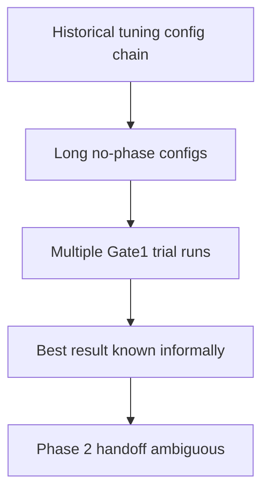
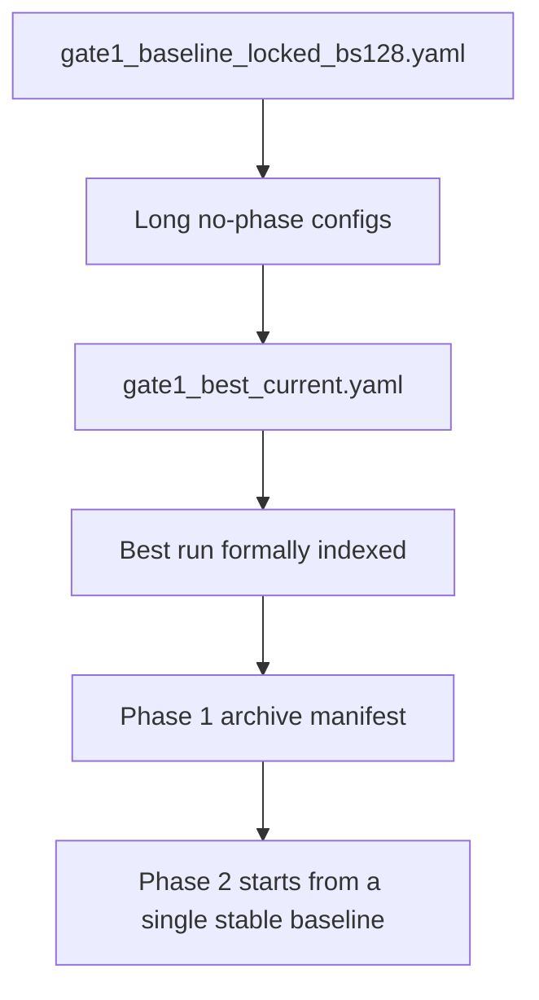

# Phase 1 Gate1 Baseline Lock and Archive

> **Date**: 2026-05-11 | **Phase**: 1 (Gate1 Baseline Lock) | **Git**: `7801c63..working-tree`
> **Status**: Merged
> **Links**: [IMPLEMENTATION_PLAN.md §10](../../IMPLEMENTATION_PLAN.md#10-implementation-order) | [EXPERIMENT_LOG.md](../EXPERIMENT_LOG.md) | [PHASE1_GATE1_STABILIZATION_20260511.md](../archive/logs/PHASE1_GATE1_STABILIZATION_20260511.md)

## Motivation

Phase 1 had already completed the source/observation structural migration, but the active handoff surface was still noisy: Gate1 tuning remained spread across a historical config chain, explicit phase supervision had already been removed in code but was still implied by parts of the documentation, and there was no single repository-level marker for the best Gate1-passing baseline.

This change locks a clean no-phase Gate1 baseline, formalizes the best run, and closes the Phase 1 tuning loop so Phase 2 can begin from a stable handoff artifact.

## Architecture Delta

### Before: Gate1 tuning still operated as an open search surface

### After: Gate1 is locked as a documented baseline handoff

## Key Changes

| Area | Change | Description |
|------|--------|-------------|
| Phase 1 config surface | Added | `gate1_baseline_locked_bs128.yaml` consolidates the stable no-phase Gate1 baseline outside the old diagnostic inheritance chain |
| Best baseline marker | Added | `gate1_best_current.yaml` points to the current best 320-epoch slow-warmup baseline |
| Result archival | Added | Archive manifests and result index record the full Gate1 search bundle without moving original run directories |
| Documentation | Updated | Architecture, implementation plan, experiment log, and coupling plan now reflect Gate1 closure and Phase 2 readiness |

## Gate Impact

| Gate | Impact | Notes |
|------|--------|-------|
| Gate 1 (Health) | Improved and locked | Stable pass on the no-phase baseline; best val_loss improved to 1.6395270029703777 |
| Gate 2 (Semantics) | Still blocked | HRF supervision and cross-modal predictability remain the next target |
| Gate 3 (Structure) | Still blocked | Coupling concentration remains diffuse |
| Gate 4 (Utility) | Still blocked | Subject leakage and semantic selectivity remain unresolved |

## Handoff Artifacts

- Best config: [experiments/configs/source_observation/phase1/gate1_best_current.yaml](../../experiments/configs/source_observation/phase1/gate1_best_current.yaml)
- Locked baseline: [experiments/configs/source_observation/phase1/gate1_baseline_locked_bs128.yaml](../../experiments/configs/source_observation/phase1/gate1_baseline_locked_bs128.yaml)
- Best run: [experiments/runs/s2_phase1_gate1_health_uniform32_stable_sourceonly_balance_provq_nophase_longwarmup_bs128_20260511_175718](../../experiments/runs/s2_phase1_gate1_health_uniform32_stable_sourceonly_balance_provq_nophase_longwarmup_bs128_20260511_175718)
- Archive manifest: [experiments/runs/archive/source_observation_phase1_gate1_stabilization_20260511/manifest.json](../../experiments/runs/archive/source_observation_phase1_gate1_stabilization_20260511/manifest.json)