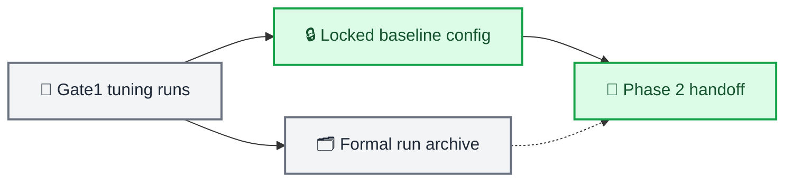

# Phase 1 Gate1 baseline lock and archive

_Date: 2026-05-11 · Phase: Phase 1 · Status: Merged_

_Links: [archive handoff log](../archive/logs/PHASE1_GATE1_STABILIZATION_20260511.md) · [current runtime architecture](../ARCHITECTURE.md)_

---

## 🎯 Motivation

Phase 1 produced a no-phase source/observation baseline that passed the historical Gate1 health criteria. The search was closed and preserved before source-target redesign began so later experiments could not silently redefine the baseline.

## 🔀 Architecture delta

### Before

### After

## 🧱 Component changes

| Component | Change | Description |
| --- | --- | --- |
| `gate1_baseline_locked_bs128.yaml` | Added | Reusable no-phase baseline |
| `gate1_best_current.yaml` | Updated | Alias for the best historical Gate1 run |
| Phase 1 run archive | Added | Preserved all tuning attempts and manifests |
| Archive handoff log | Added | Recorded Gate1–Gate4 outcome and promotion boundary |

## 🚦 Gate outcome

| Gate | Historical result | Meaning |
| --- | --- | --- |
| Gate1 | Pass | Codebook health baseline locked |
| Gate2 | Fail | Cross-modal predictability unresolved |
| Gate3 | Fail | Coupling structure diffuse |
| Gate4 | Fail | Utility and leakage unresolved |

The baseline was approved as a structural handoff, not as a physiological-coupling solution.

## 🔗 Archived artifacts

- [Locked baseline config](../../experiments/configs/source_observation/phase1/gate1_baseline_locked_bs128.yaml)
- [Best baseline alias](../../experiments/configs/source_observation/phase1/gate1_best_current.yaml)
- [Best archived run](../../experiments/archive/source_observation_phase1_gate1_stabilization_20260511/s2_phase1_gate1_health_uniform32_stable_sourceonly_balance_provq_nophase_longwarmup_bs128_20260511_175718)
- [Archive manifest](../../experiments/archive/source_observation_phase1_gate1_stabilization_20260511/manifest.json)

_Reconstructed from the preserved handoff log on 2026-07-01._
