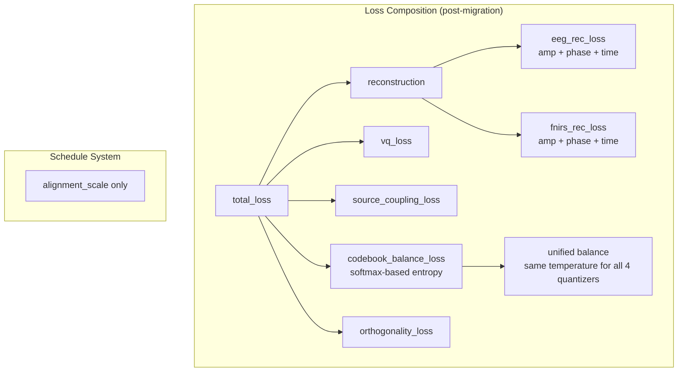
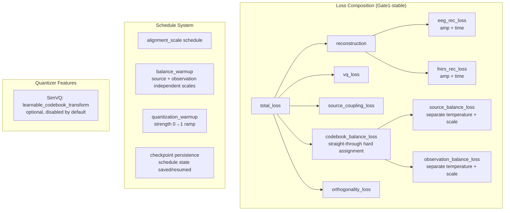

# Phase 1 Gate1 Model Stabilization — Balance Loss, Quantization Schedule, and Phase Removal

> **Date**: 2026-05-11 | **Phase**: 1 (Gate1 Stabilization) | **Git**: `ab7d7e0..7801c63`
> **Status**: Merged
> **Links**: [ARCHITECTURE.md](../ARCHITECTURE.md) | [2026-05-06 Migration](2026-05-06_source_observation_migration.md) | [Gate1 Baseline Lock](2026-05-11_phase1_gate1_baseline_lock.md)

## Motivation

After the source/observation structural migration (`ab7d7e0`), codebook health metrics were suboptimal: codebook utilization was diffuse, dead codes accumulated during training, and the phase reconstruction loss added complexity without a clear physiological interpretation. Three targeted changes were made to stabilize Gate1 (codebook health) and simplify the model before the Phase 2 handoff.

## Architecture Delta

### Before: Post-migration (after `ab7d7e0`)



### After: Gate1-stable (current)



## Component Changes

| File | Change | Description |
|------|--------|-------------|
| `src/losses/multimodal_tokenizer.py` | Added | `straight_through_assignment_probs()` — hard one-hot assignment with straight-through gradient estimator for codebook balance |
| `src/tokenizers/factorized_labram_vqnsp.py` | Modified | Balance loss: soft→hard assignment; added `source_balance_scale`, `observation_balance_scale`, per-branch temperatures; SimVQ support; quantization strength; removed phase reconstruction loss |
| `src/tokenizers/labram_vqnsp.py` | Modified | `NormEMAVectorQuantizer`: added `learnable_codebook_transform` (SimVQ), `get_codebook_weight()`, `set_quantization_strength()` |
| `experiments/scripts/train_source_observation_tokenizer.py` | Modified | Added generic `compute_schedule_value()`, `apply_epoch_schedules()` with balance_warmup and quantization_warmup; schedule state checkpoint persistence |

## Data Flow Changes

**Reconstruction loss path**: Decoder outputs (amplitude + phase) → ISTFT time reconstruction → re-split to patches → FFT with Hann window → amplitude loss against windowed target. Previously, phase loss was computed directly on decoder phase output against target phase (weighted by magnitude). Phase loss is now entirely removed — only amplitude and time-domain losses remain.

**Balance loss path**: Previously computed from softmax probabilities (continuous, diffuse). Now uses `straight_through_assignment_probs()` to produce hard one-hot assignments with straight-through gradient, giving a more accurate measure of codebook utilization. Source and observation branches use independent temperatures and scale factors for the balance term.

**Schedule path**: Each epoch, `apply_epoch_schedules()` computes alignment_scale, source_balance_scale, observation_balance_scale, and quantization_strength from config-driven schedules. These are injected into the model and persisted in checkpoints for correct resume behavior.

## Configuration Changes

```yaml
# New config keys (all optional with defaults)

# Codebook balance — independent source/observation control
model:
  codebook:
    balance_weight: 0.02           # unchanged default; Gate1 baseline uses 0.08
    source_balance_scale: 1.0      # NEW: scale factor for source balance loss
    observation_balance_scale: 1.0 # NEW: scale factor for observation balance loss
    assignment_temperature: 1.0    # default for both source and observation
    source_assignment_temperature: # NEW: override for source (None = use default)
    observation_assignment_temperature: # NEW: override for observation

  quantizer:
    source_simvq_enabled: false    # NEW: SimVQ learnable transform for source quantizers
    source_simvq_loss_weight: 1.0  # NEW
    observation_simvq_enabled: false # NEW
    observation_simvq_loss_weight: 1.0 # NEW

# Reconstruction — phase weights removed
model:
  reconstruction:
    eeg_amplitude_weight: 1.0
    eeg_time_weight: 0.9
    # REMOVED: eeg_phase_weight
    fnirs_amplitude_weight: 1.0
    fnirs_time_weight: 1.0
    # REMOVED: fnirs_phase_weight

# Training schedules
training:
  balance_warmup:                  # NEW: per-branch balance scale scheduling
    source:
      enabled: false
      start_epoch: 1
      ramp_epochs: 10
      start_scale: 0.0
      end_scale: 1.0
    observation:
      enabled: false
      start_epoch: 1
      ramp_epochs: 10
      start_scale: 0.0
      end_scale: 1.0

  quantization_warmup:             # NEW: quantization strength scheduling
    enabled: false
    start_epoch: 1
    ramp_epochs: 10
    start_scale: 0.0
    end_scale: 1.0
```

## Loss Function Changes

| Loss Term | Change | Details |
|-----------|--------|---------|
| `eeg_phase_loss` | **Removed** | Phase prediction removed from model; no physiological interpretation justified keeping it |
| `fnirs_phase_loss` | **Removed** | Same as above |
| `eeg_rec_loss` | **Simplified** | `amp + phase + time` → `amp + time`; FFT now uses Hann window and is computed from reconstructed time signal |
| `fnirs_rec_loss` | **Simplified** | Same as above |
| `codebook_balance_loss` | **Modified** | Softmax probabilities → straight-through hard one-hot assignment; source/observation now have independent temperatures and scales |
| `source_balance_loss` | **Modified** | Uses `source_balance_temperature` (default 1.0) and `source_balance_scale` (default 1.0) |
| `observation_balance_loss` | **Modified** | Uses `observation_balance_temperature` (default 1.0) and `observation_balance_scale` (default 1.0) |
| `vq_loss` | **Modified** | VQ commitment loss now modulated by `quantization_strength`; optional SimVQ transform consistency loss when enabled |

## Training Tool Changes

| Tool | Change | Description |
|------|--------|-------------|
| `compute_schedule_value()` | **Added** | Generic schedule value computation: `start_epoch`, `ramp_epochs`, `start_scale` → `end_scale` linear ramp |
| `apply_epoch_schedules()` | **Added** | Per-epoch dispatch: alignment_scale, balance_warmup (source+obs), quantization_warmup → model state |
| `snapshot_model_schedule_state()` | **Added** | Capture all schedule-driven model state for checkpoint |
| `apply_model_schedule_state()` | **Added** | Restore schedule state on resume / best-checkpoint load |
| Checkpoint payload | **Extended** | `schedule_state` dict now saved with each checkpoint |
| TensorBoard logging | **Extended** | All schedule metrics logged under `schedule/` |

## Linked Artifacts

- **Configs**:
  - `experiments/configs/source_observation/phase1/gate1_baseline_locked_bs128.yaml` — locked Gate1 baseline
  - `experiments/configs/source_observation/phase1/gate1_best_current.yaml` — best-current alias
- **Best run**: `experiments/runs/s2_phase1_gate1_health_uniform32_stable_sourceonly_balance_provq_nophase_longwarmup_bs128_20260511_175718/` — best_epoch 278, val_loss 1.6395
- **Related changelog entries**:
  - [2026-05-06 Source/Observation Migration](2026-05-06_source_observation_migration.md) — the architecture this stabilizes
  - [2026-05-11 Gate1 Baseline Lock](2026-05-11_phase1_gate1_baseline_lock.md) — documentation lock and archival

## Gate Impact

| Gate | Impact | Notes |
|------|--------|-------|
| Gate 1 (Health) | **Improved** | Straight-through balance loss + quantization warmup improved codebook utilization; phase removal simplified optimization surface |
| Gate 2 (Semantics) | None | Still blocked; requires Phase 2 HRF supervision |
| Gate 2A (Q-C Consistency) | None | SimVQ infrastructure in place but disabled |
| Gate 3 (Structure) | None | Coupling concentration remains diffuse |
| Gate 4 (Utility) | None | Subject leakage and semantic selectivity unchanged |

## Design Decisions

1. **Straight-through hard assignment for balance loss**: Softmax probabilities are continuous and can hide codebook collapse — a codebook where every token is used at 10% probability looks "balanced" under entropy but may have poor utilization in practice. Hard one-hot assignment with straight-through estimator gives a more honest signal of whether codes are actually being selected.

2. **Separate source/observation balance temperatures**: Source and observation codebooks have different roles and sizes (K=128 vs K=256). Independent temperatures allow tuning the balance pressure per branch — source codebooks may need gentler balance regularization than observation codebooks.

3. **Phase loss removal over improvement**: The `937c534` commit initially improved phase loss (weighted circular loss, Hann window, reconstructed-time FFT), but the `7801c63` commit removed it entirely. Rationale: phase prediction adds parameters and optimization complexity with no clear physiological interpretation in the source/observation framework. The amplitude + time reconstruction is sufficient for Gate1 signal fidelity.

4. **Schedule state in checkpoints**: Without saving schedule state, training resume would silently reset schedules to their initial values, causing metric discontinuity. The `schedule_state` dict in checkpoints ensures correct resume behavior.

5. **SimVQ as opt-in infrastructure**: The `learnable_codebook_transform` (SimVQ) is wired into all 4 quantizers but default-disabled. This keeps the Phase 1 baseline simple while providing the infrastructure for future coupling-aware quantization experiments (Phase 2A).

## Rollback Considerations

If these changes needed reversion:
- Phase loss restoration would require reverting `_compute_fft_amplitude_targets` → `_compute_fft_targets` (returning phase and magnitude) and re-adding `_compute_phase_loss`, `_compute_phase_weights`, `_elementwise_loss`
- Balance loss reversion would require changing `straight_through_assignment_probs` back to `F.softmax` in the balance computation
- Schedule infrastructure is purely additive — removing it would not break training, only lose the warmup capability
- SimVQ is disabled by default — no rollback needed unless configs explicitly enable it
