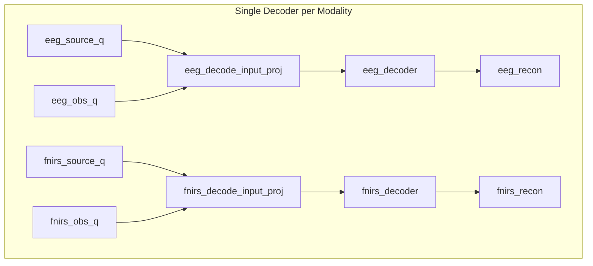
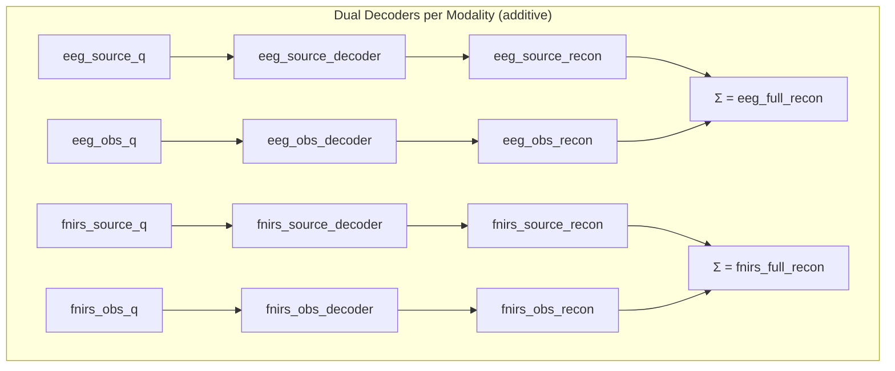

# Phase 2A: Branch Target Redesign + Dual Decoder Architecture

> **Date**: 2026-05-11 | **Phase**: 2A | **Git**: (pending implementation)
> **Status**: Planned
> **Links**: [Archived implementation plan §6.4](../archive/pre_physiology_semantic_20260701/source_observation/IMPLEMENTATION_PLAN.md) | [ARCHITECTURE.md](../ARCHITECTURE.md)

## Motivation

Phase 2 (HRF Source Target) was implemented but Gate 2/3/4 all failed. Root causes identified:
1. Single decoder per modality with concatenated latents — decoder never trained on branch ablations (source-only or observation-only inputs were OOD)
2. EEG source target (coarse downsampled signal) and fNIRS source target (HRF of power envelope) were different concepts — coupling matrix couldn't find meaningful mapping, collapsed to uniform
3. Observation branch had zero explicit supervision — source/observation decomposition not identifiable
4. Full reconstruction dominated all other losses (>13:1 weight ratio)

This revision introduces dual decoders with additive signal composition, unified source targets, and explicit observation targets.

## Architecture Delta

### Before



### After



## Component Changes

| File | Change | Description |
|------|--------|-------------|
| `src/tokenizers/factorized_labram_vqnsp.py` | Modified | Replace 2 shared decoders with 4 independent decoders (source + obs per modality) |
| `src/tokenizers/factorized_labram_vqnsp.py` | Modified | Redefine `_compute_eeg_source_target` to use power envelope at full EEG resolution |
| `src/tokenizers/factorized_labram_vqnsp.py` | Modified | Add `_compute_eeg_obs_target` and `_compute_fnirs_obs_target` (original - source_target) |
| `src/tokenizers/factorized_labram_vqnsp.py` | Modified | Forward pass: three decode modes (full, source-only, observation-only) all explicitly trained |
| `src/tokenizers/factorized_labram_vqnsp.py` | Modified | New loss aggregation: observation_loss added to total |
| `experiments/configs/source_observation/phase2a/` | Added | New config directory for Phase 2A experiments |

## Data Flow Changes

1. **Decoding**: Instead of `concat(source_q, obs_q) → single decoder → recon`, each quantized latent goes to its own decoder: `source_q → source_decoder → source_recon`, `obs_q → obs_decoder → obs_recon`. Full reconstruction = `source_recon + obs_recon`.

2. **Source target (EEG)**: Changed from `DownUp(coarse raw EEG)` to `EEG power envelope at full resolution (200Hz), expanded to all channels`. No downsampling to fNIRS rate.

3. **Source target (fNIRS)**: Unchanged in construction (HRF of power envelope), but now the SAME power envelope driver feeds both targets.

4. **Observation target**: New explicit target = `original - source_target` for each modality.

5. **Three decoder modes trained**: 
   - Full: decode(source_q, obs_q) → Σ vs original
   - Source-only: decode(source_q, zeros) → source_recon vs source_target
   - Observation-only: decode(zeros, obs_q) → obs_recon vs obs_target

## Configuration Changes

```yaml
# Before (Phase 2)
model:
  eeg_observation:
    codebook_size: 32
  fnirs_observation:
    codebook_size: 32

loss:
  source_target:
    weight: 0.15
    eeg_source_aux_weight: 0.5
  # no observation_target section
  branch:
    orthogonality_weight: 0.01
  codebook:
    observation_balance_scale: 0.0

# After (Phase 2A)
model:
  eeg_observation:
    codebook_size: 64
  fnirs_observation:
    codebook_size: 64

loss:
  source_target:
    weight: 0.3
    eeg_source_aux_weight: 1.0
  observation_target:
    weight: 0.15
    warmup_epochs: 30
  branch:
    orthogonality_weight: 0.05
  codebook:
    observation_balance_scale: 0.5
```

## Loss Function Changes

| Loss Term | Change | Weight |
|-----------|--------|--------|
| `eeg_rec_loss` | Modified — now sum of source + observation outputs | 1.0 |
| `fnirs_rec_loss` | Modified — now sum of source + observation outputs | 1.0 |
| `source_target_loss` (fNIRS) | Weight increased | 0.15 → 0.3 |
| `eeg_source_aux_loss` | Target changed (power envelope, not coarse signal); weight increased | 0.075 → 0.3 |
| `observation_loss` (EEG) | **NEW** — obs decoder vs (original - source_target) | 0.15 |
| `observation_loss` (fNIRS) | **NEW** — obs decoder vs (original - source_target) | 0.15 |
| `orthogonality_loss` | Weight increased | 0.01 → 0.05 |

## Linked Artifacts

- **Config**: `experiments/configs/source_observation/phase2a/` (to be created)
- **Experiment**: (pending)
- **Scorecard**: Gate 1-4 results summary (pending)
- **Related changelog entries**: [2026-05-06 Source/Observation Migration](2026-05-06_source_observation_migration.md), [2026-05-11 Phase 1 Gate1 Baseline Lock](2026-05-11_phase1_gate1_baseline_lock.md)

## Gate Impact

| Gate | Impact | Notes |
|------|--------|-------|
| Gate 1 (Health) | Expected: slight change | Dual decoder adds parameters; reconstruction quality should be comparable or better |
| Gate 2 (Semantics) | **BLOCKING** — this change targets Gate 2 pass | Source targets now unified; observation has explicit target; three modes trained |
| Gate 2A (Q-C Consistency) | Deferred to Phase 2C | Not affected by this change |
| Gate 3 (Structure) | Expected: no direct change | Coupling still lacks concentration/smoothness (Phase 2B); row entropy may still be near log(K) |
| Gate 4 (Utility) | Expected: improvement | Subject leakage should concentrate more in observation branch |

## Design Decisions

1. **Why dual decoder instead of branch dropout?** Branch dropout (stochastic masking during training) doesn't guarantee the decoder learns semantically correct decomposition — it could learn to reconstruct from either branch alone. Explicit targets (TokenFlow pattern) ensure each branch's output has a defined meaning.

2. **Why additive composition (source + observation = full)?** Follows the multi-view generative model: signal = shared_driver + modality_specific_residual. TokenFlow uses separate output spaces (semantic features vs pixels), but for physiological signals sharing the same measurement space, addition is the natural composition.

3. **Why not downsample EEG source target?** The coarse signal target (down-up sampling) loses mid/high-frequency EEG structure. The power envelope at full resolution preserves complete temporal dynamics while still being a low-dimensional neural driver.

4. **Why keep source codebook at 32?** Phase 1 established healthy codebook utilization at size 32. Reducing source capacity would risk reconstruction quality without guaranteeing better semantic separation. Observation codebook expansion to 64 provides sufficient capacity for modality-specific details.

## Rollback Considerations

If this change needed reversion:
- Restore the 2 shared decoders (architecturally simpler but semantically weaker)
- Remove observation_loss from total
- Restore old source_target and eeg_source_aux weights
- The coupling matrix behavior is orthogonal — Phase 2B changes are independent
