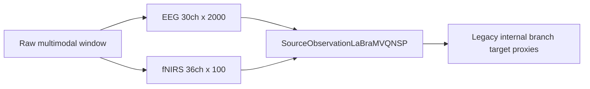
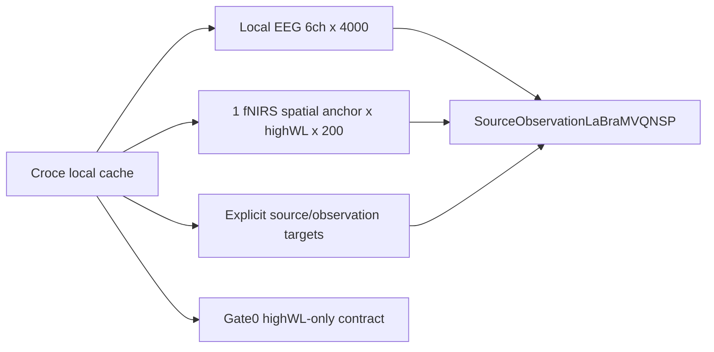

# HighWL-only Croce Local Tokenizer Input

> Date: 2026-06-04
> Phase: Phase 2C - Croce local cache tokenizer training
> Status: Merged
> Related docs: [ARCHITECTURE.md](../ARCHITECTURE.md), [archived semantic token scorecard](../archive/pre_physiology_semantic_20260701/source_observation/SEMANTIC_TOKEN_SCORECARD.md), [archived physiological coupling plan](../archive/pre_physiology_semantic_20260701/source_observation/PHYSIOLOGICAL_COUPLING_PLAN.md)

## Summary

The tokenizer training input moved from raw whole-brain multimodal windows to generated Croce local source/observation target caches. The active fNIRS input is temporarily highWL-only:

- EEG input: `[B, 6, 4000]`
- fNIRS input: `[B, 1, 200]`
- EEG source/observation targets: `[B, 6, 4000]`
- fNIRS source/observation targets: `[B, 1, 200]`

`highWL` is read from `source_fnirs_optical_channel_0` and `obs_fnirs_optical_channel_0`. `lowWL` remains in cache metadata and is ignored for the current training phase.

## Before

## After

## Key Changes

| Area | Change |
|------|--------|
| Dataset | Added `CroceLocalCacheDataset` for generated local cache windows |
| Registry/factory | Registered `croce_local_cache` and wired multimodal dataloaders |
| Model | Added optional `targets=` to `SourceObservationLaBraMVQNSP.forward()` |
| fNIRS semantics | Added `spatial_anchors`, `optical_components`, and `component_labels` metadata |
| Scorecard | Added Gate0 for highWL-only cache/input contract checks |
| Configs | Added base/LR/fNIRS-capacity Croce local highWL sweep configs |
| Storage | Current configs use canonical cache roots under `croce_validation/cache/croce_local/highwl_v1/` |

## Gate0 Contract

Gate0 must pass before any semantic gate is interpreted:

1. selected fNIRS component is `highWL`;
2. ignored fNIRS component includes `lowWL`;
3. cache records `pair_mode="wavelength"`;
4. cache records `pair_labels=["highWL", "lowWL"]`;
5. fNIRS layout is `1 spatial anchor x 1 optical component = 1 channel`.

## Notes

The highWL-only branch remains optical measurement-space signal. It is an HbO-sensitive proxy for this training phase, not HbO concentration. The current choice does not delete or invalidate lowWL cache content; it only excludes lowWL from model input while this tokenizer training question is tested.
