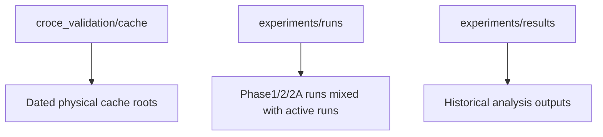
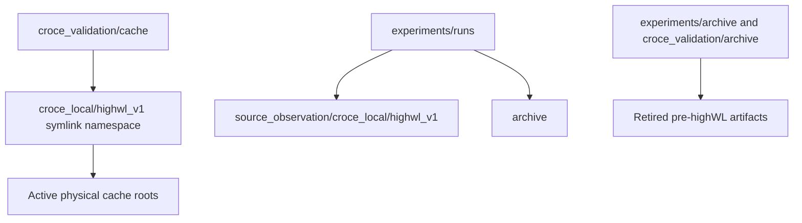

# Storage Layout Normalization

> **Date**: 2026-06-04 | **Phase**: Phase 2C | **Git**: `dd51f57..HEAD`
> **Status**: Merged
> **Links**: [ARCHITECTURE.md](../ARCHITECTURE.md) | [STORAGE_LAYOUT.md](../STORAGE_LAYOUT.md)

## Motivation

Historical Croce validation outputs and source/observation experiment runs were
crowding the active roots, and several paths encoded target semantics that have
been superseded by the Croce local highWL-only tokenizer paradigm.

## Architecture Delta

### Before



### After



## Component Changes

| File | Change | Description |
|------|--------|-------------|
| `src/utils/logger.py` | Modified | Added optional `experiment.run_group` and recursive non-archive run discovery for comparison CSV generation |
| `src/utils/run_metrics_comparison.py` | Modified | Default run discovery now finds nested run dirs containing `metrics.json` and skips archive by default |
| `experiments/configs/source_observation/croce_local/highwl_base.yaml` | Modified | Uses canonical highWL cache symlinks and `source_observation/croce_local/highwl_v1` run group |
| `docs/STORAGE_LAYOUT.md` | Added | Documents canonical active paths, archive roots, and discovery rules |
| `.gitignore` | Modified | Ignores `croce_validation/archive/` generated artifacts |

## Data Flow Changes

No tensor contract changed. The active data contract remains EEG `[B,6,4000]`
and fNIRS `[B,1,200]` with highWL-only fNIRS targets. Only config-facing paths
and generated-output organization changed.

## Configuration Changes

```yaml
experiment:
  run_group: source_observation/croce_local/highwl_v1

data:
  cache_sources:
    - root: croce_validation/cache/croce_local/highwl_v1/single_trial_motor_imagery
    - root: croce_validation/cache/croce_local/highwl_v1/single_trial_mental_arithmetic
    - root: croce_validation/cache/croce_local/highwl_v1/simultaneous_cognitive
```

## Linked Artifacts

- **Storage layout**: `docs/STORAGE_LAYOUT.md`
- **Current live run**: `experiments/runs/s2_croce_local_highwl_base_20260604_153549/`
- **Future run namespace**: `experiments/runs/source_observation/croce_local/highwl_v1/<run_name>/`
- **Retired Phase2/2A archive**: `experiments/runs/archive/pre_croce_local_highwl_20260604/`
- **Retired Croce validation archive**: `croce_validation/archive/`

## Gate Impact

| Gate | Impact | Notes |
|------|--------|-------|
| Gate 0 (Cache Contract) | None | Canonical symlinks point to the same active cache roots |
| Gate 1-4 | None | Evaluation semantics are unchanged |

## Design Decisions

1. Active cache roots were not moved because the first highWL training job is
   already running and reading those physical paths.
2. Retired artifacts were archived rather than deleted to keep provenance
   recoverable during the first full highWL-local run.
3. Comparison tools skip archive by default so historical failures do not pollute
   current run reports.

## Rollback Considerations

Removing `experiment.run_group` restores flat run output under
`experiments/runs/<run_name>/`. Config cache roots can be pointed back to the
physical cache directories if symlink use becomes undesirable.
