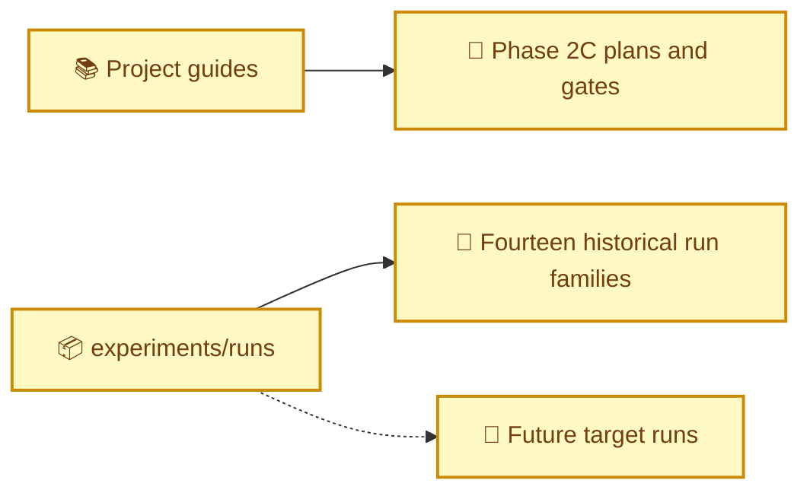
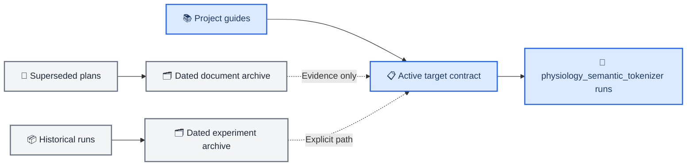

# Documentation and run archive isolation

_Date: 2026-07-01 · Phase: Phase 3 preparation · Git: `b81c31b..HEAD` · Status: Merged_

_Links: [documentation index](../README.md) · [storage layout](../STORAGE_LAYOUT.md) · [target experiment program](../physiology_semantic_tokenizer/05_EXPERIMENT_DESIGN.md)_

---

## 🎯 Motivation

The design freeze established a new architecture, but operational entrypoints still declared Phase 2C documents as current and `experiments/runs/` still exposed every prior coupling lineage at its top level. This made it easy for contributors and recursive tools to mix historical assumptions or results into the new program.

The change creates physical and documentary isolation without deleting evidence.

## 🔀 Architecture delta

### Before



### After



## 🧱 Component changes

| Component | Change | Description |
| --- | --- | --- |
| `docs/README.md` | Added | Defines active authority and archive boundaries |
| `docs/archive/pre_physiology_semantic_20260701/` | Added/moved | Stores superseded plans, scorecards, logs, and workflow reconstruction |
| `docs/physiology_semantic_tokenizer/06_EXPERIMENT_LOG.md` | Added | Accepts only target-architecture evidence |
| `experiments/runs/` | Reorganized | Contains only the target namespace and storage README |
| `experiments/archive/pre_physiology_semantic_20260701/` | Added/moved | Stores 14 old run families and two comparison reports |
| `archive_manifest.tsv` | Added | Maps original and current paths with byte/file counts |
| `README.md` and `CLAUDE.md` | Rewritten | Point new work to the target contract |
| `docs/STORAGE_LAYOUT.md` | Rewritten | Defines suite/run schema, cache versioning, and discovery exclusions |

## 📥 Data-flow changes

New configurations must resolve their output below `experiments/runs/physiology_semantic_tokenizer/<suite>/`. Historical analysis names an archive root explicitly. No compatibility symlink is left inside `experiments/runs/`, preventing old directories from reappearing in default recursive discovery.

## ⚙️ Configuration changes

Target configs use:

```yaml
experiment:
  run_group: physiology_semantic_tokenizer/<suite>
```

Existing source/observation and downstream configs remain compatibility baselines and cannot be used as target templates.

## 🚦 Gate impact

| Gate | Impact | Notes |
| --- | --- | --- |
| G0 Data/teacher | Clarified | Requires a versioned target cache root |
| G1 Quantizer | None | Scientific definition unchanged |
| G2–G6 | Clarified | Results must live in the matching active suite |
| Provenance | Strengthened | Archive manifest preserves original path mapping |

## 🧠 Design decisions

- Historical payloads were moved, not deleted or rewritten.
- Archives live outside `experiments/runs/`; archive subdirectories inside the active root are prohibited.
- Old absolute paths inside generated manifests remain untouched as provenance records.
- Failed but valid target experiments remain in the active namespace because scientific failure is not an archival condition.
- Empty suite directories are not created; a valid dry-run manifest creates the suite/run path.

## ↩️ Rollback considerations

The archive manifest contains every original path. A rollback can rename directories to their prior locations, but it should also restore the corresponding documentation authority and discovery rules. Reintroducing symlinks in `experiments/runs/` is not an acceptable partial rollback because it recreates ambiguity.

_Last updated: 2026-07-01_
