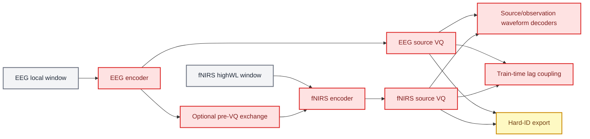
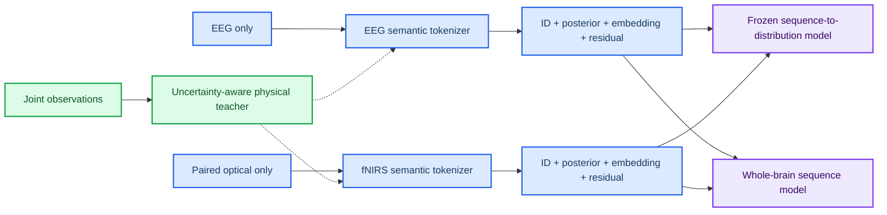

# Physiology-semantic tokenizer redesign baseline

_Date: 2026-07-01 · Phase: Phase 3 · Git: not applicable · Status: Planned_

_Links: [target implementation plan](../physiology_semantic_tokenizer/04_IMPLEMENTATION_VALIDATION_PLAN.md) · [current architecture](../ARCHITECTURE.md) · [target architecture](../physiology_semantic_tokenizer/02_TARGET_ARCHITECTURE.md)_

---

## 🎯 Motivation

The source/observation lineage did not establish a stable, task-local EEG-token-to-fNIRS-token relationship, even after increasingly strong coupling losses and pre-quantization information exchange. Audits also showed hard-token information loss, low-rank codebook geometry, source/task confounding downstream, and a mismatch between the physical state information saved in cache and the waveform-only targets exposed to the tokenizer.

This record freezes the approved redesign before implementation. It does not mark the target architecture as current or validated.

## 🔀 Architecture delta

### Before: current runnable lineage



### After: approved target



## 🧱 Planned component changes

| Component | Status | Planned change |
| --- | --- | --- |
| Cache/loader | Planned | Expose paired optical observations, state posterior, uncertainty, and valid-history masks |
| Physical teacher | Planned | Convert cached joint inference into stop-gradient, modality-identifiable patch targets |
| Quantizer | Planned | Correct count-and-vector-sum EMA and expose runtime/config health assertions |
| EEG/fNIRS tokenizer | Planned | Independent semantic codebooks plus continuous private/residual branches |
| Losses | Planned | State, prototype, masked-state, reconstruction, and branch-attribution objectives |
| Export | Planned | Persist IDs, posterior, codebook embeddings, residuals, teacher targets, and masks |
| Coupling | Planned | Move primary coupling estimation after tokenizer freeze; compare with fNIRS history/marginal baselines |
| Downstream | Planned | Compare hard ID, transferred codebook, soft expected embedding, and semantic-plus-residual modes |
| Visualization | Planned | Order by physical signatures and show incremental coupling with uncertainty/nulls |

## 📥 Data-flow changes

The current loader supplies EEG, highWL fNIRS, and decoded source/residual waveform targets. The target loader supplies EEG, paired optical fNIRS, a versioned physical-state posterior, uncertainty, causal-valid masks, and a single raw-space normalization contract. Teacher information is available only during training/evaluation supervision; inference for each modality remains independent.

## ⚙️ Configuration changes

The final schema will be written when P1 and P2 are implemented. The design contract requires explicit, non-shadowed fields for:

```yaml
architecture: physiology_semantic_tokenizer
teacher:
  cache_schema_version: <new-version>
  uncertainty_weighting: true
tokenizer:
  independent_modalities: true
  semantic_codebook_size: 128
  semantic_codebook_dim: 64
  residual_mode: continuous
fnirs:
  optical_input: paired
coupling:
  tokenizer_gradient: false
  control_fnirs_history: true
```

These keys describe an approved contract, not an accepted parser schema yet.

## ⚖️ Loss-function changes

| Loss | Change | Role |
| --- | --- | --- |
| Waveform source target | Demoted | Information-preserving auxiliary target |
| Physical state | Added | Uncertainty-weighted semantic latent supervision |
| Prototype state | Added | Make codebook geometry decode physical state regions |
| Masked state | Added | Learn temporal/contextual physiology |
| Private/residual | Added | Preserve information omitted by semantic bottleneck |
| Train-time coupling | Removed from primary tokenizer | Prevent correspondence from being written into token identity |
| Frozen incremental coupling | Added after tokenizer | Measure EEG contribution beyond fNIRS history and marginals |

## 🚦 Gate impact

| Gate | Expected impact | Promotion condition |
| --- | --- | --- |
| G0 Data/teacher | New blocking gate | State observability, calibration, masks, and no leakage pass |
| G1 Quantizer | Strengthened | Deterministic EMA tests and healthy geometry pass |
| G2 Information | Strengthened | Semantic-plus-residual closes the preregistered continuous-latent gap |
| G3 Semantics | Replaced | Held-out prototype/state decoding and seed stability pass |
| G4 Coupling | Replaced | Held-out incremental likelihood over history/marginal baseline passes |
| G5 Utility | Strengthened | Fine-task gains survive subject/source controls |
| G6 Reproducibility | New | Signature and coupling patterns exceed seed/permutation nulls |

## 🧠 Design decisions

- Physical decomposition remains useful as an uncertain teacher, not a literal ground-truth waveform partition.
- Semantic IDs, posterior, prototype embeddings, and residuals are all first-class outputs.
- Equal EEG/fNIRS token indices have no semantic privilege.
- The primary coupling claim is sequence-to-distribution and incremental, not token-to-token or raw conditional.
- Continuous residuals precede RVQ/FSQ so semantic failure is not confounded with a second quantizer.
- Pre-VQ exchange remains a historical ablation only.

## ↩️ Rollback considerations

No code rollback is required for this planned record. If physical-teacher validation fails, implementation stops at the corrected independent tokenizer and self-supervised/reconstruction baselines. If frozen coupling fails, a valid information-preserving tokenizer may still be retained, but the neurovascular token-coupling claim is rejected.

## 🔗 Linked artifacts

- [`Legacy design postmortem`](../physiology_semantic_tokenizer/01_LEGACY_DESIGN_POSTMORTEM.md)
- [`Target architecture`](../physiology_semantic_tokenizer/02_TARGET_ARCHITECTURE.md)
- [`Theoretical foundations`](../physiology_semantic_tokenizer/03_THEORETICAL_FOUNDATIONS.md)
- [`Implementation and validation plan`](../physiology_semantic_tokenizer/04_IMPLEMENTATION_VALIDATION_PLAN.md)
- [`Redesigned experiment program`](../physiology_semantic_tokenizer/05_EXPERIMENT_DESIGN.md)

_Last updated: 2026-07-01_
