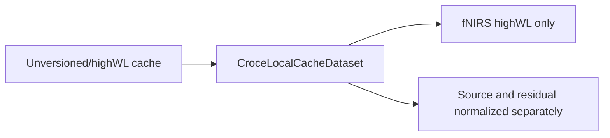
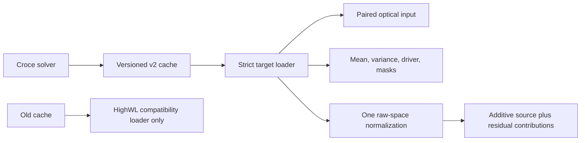

# P1 Physiology-Semantic Data Contract Smoke

**Date:** 2026-07-02

**Phase:** Phase 3 implementation, P1/G0
**Status:** In progress; dry-run and smoke passed, G0 not evaluated

## Change

The cache generator now writes the versioned `croce_physiology_semantic_v2` contract with paired optical clean/residual fields, posterior mean and variance, EEG-rate neural-driver mean and variance, finite-support masks, state coordinate names, and solver metadata. `CrocePhysiologySemanticDataset` strictly requires that schema, applies one raw-space normalization before additive decomposition, invalidates crop-boundary targets that require unseen causal history, and rejects split overlap or invalid normalization provenance.

The legacy `CroceLocalCacheDataset` remains unchanged as the highWL-only compatibility path. No old cache is auto-upgraded or accepted as target data.

## Before

## After

## Validation

- Targeted unit/static regression: 25 tests passed before real-data execution.
- Real cache generation: subjects 1, 21, and 25; one anchor, one event, 32 particles each.
- Dry-run: `20260702_191234_p1_contract_dry_run` passed.
- Smoke: `20260702_191234_p1_contract_smoke` passed with `[6,4000]` EEG, `[2,200]` fNIRS, `[200,5]` posterior tensors, finite non-negative variances, disjoint subjects, and 50% causal support after the declared 10-second history mask.
- Gate boundary: these runs do not measure posterior-predictive validity or observability; G0 remains pending.

## Key files

- `croce_validation/scripts/generate_target_cache.py`
- `src/data/croce_local_cache_dataset.py`
- `src/data/factory.py`
- `experiments/scripts/validate_physiology_semantic_contract.py`
- `experiments/configs/physiology_semantic_tokenizer/p1_e0_contract_smoke.yaml`
