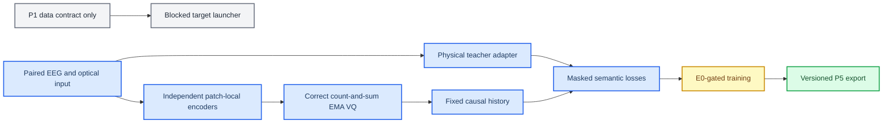

# P2-P5 physiology-semantic code migration

**Date:** 2026-07-02

**Phase:** Phase 3 P2-P5 software implementation

**Status:** Merged; scientific gates pending

---

## 📋 Decision

Implement the approved physiology-semantic runtime behind the new `physiology_semantic` registry name without modifying or automatically registering the archived source/observation model.

The implementation includes:

- a count-and-sum EMA semantic quantizer isolated from the legacy quantizer;
- a stop-gradient physical-state patch teacher;
- independent patch-local EEG and fNIRS semantic/residual branches;
- a post-quantization five-token causal-history module;
- mask-aware state, prototype, context, reconstruction, and VQ losses;
- a gated training entry, versioned export, and four whole-brain consumer modes.

## 🏗️ Before and after

## 🔒 Compatibility and evidence boundary

- `NormEMAVectorQuantizer` is unchanged for historical checkpoint interpretation.
- Active inference accepts only one modality per `encode_eeg` or `encode_fnirs` call.
- Teacher and decomposition tensors are training/audit inputs, never inference inputs.
- `e0_passed: false` forces zero optimizer steps even in software-smoke mode.
- The successful dry-run, smoke, checkpoint, and export establish integration correctness only. E0, G0, G2, G3, and all coupling claims remain unevaluated.

## ✅ Verification

- Full active suite: 65 tests passed, including distributed quantizer statistics.
- Real-cache dry-run: `20260702_235450_p2_p5_software_smoke`.
- Real-cache smoke under the historical pre-calibration E0 state: `20260702_235459_p2_p5_software_smoke`.
- P5 validation export: one validation sample with top-8 posterior and manifest.

**Implementation commit:** `f13363e`
