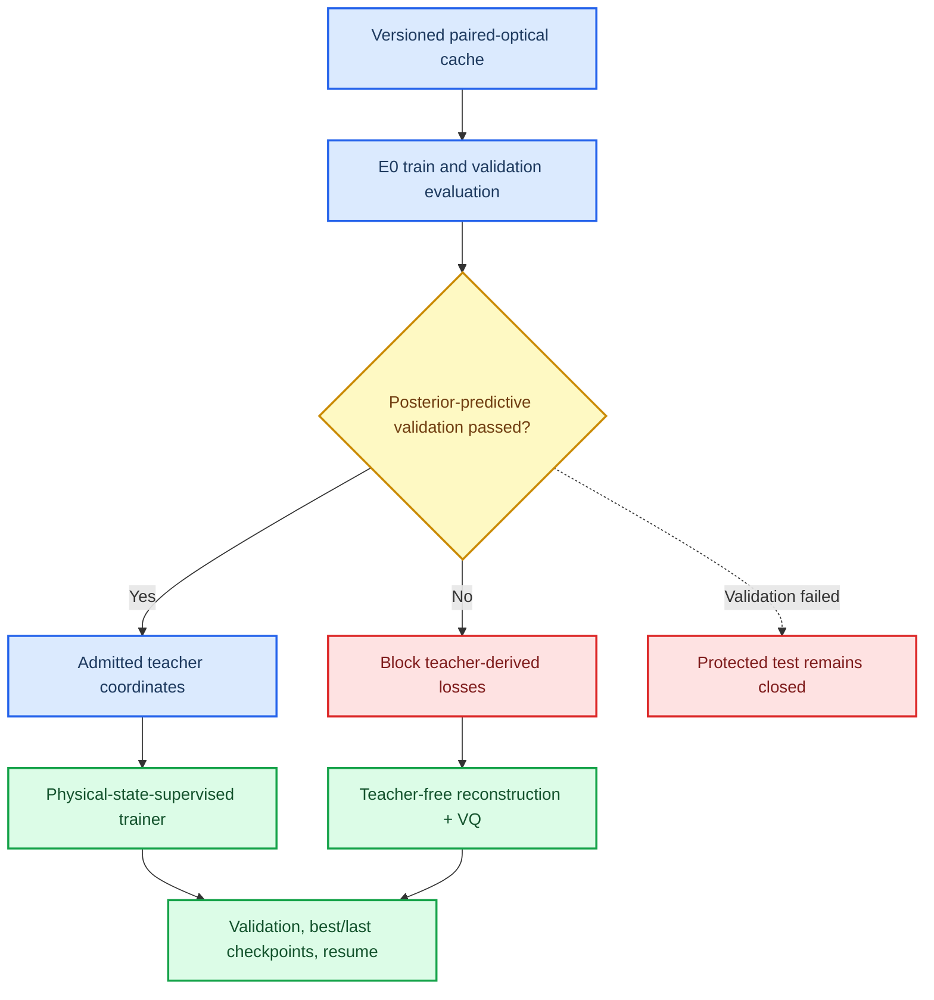

# E0 gate and physiology-semantic training runtime

- **Date:** 2026-07-03
- **Phase:** Phase 3 E0/P4
- **Status:** Merged; physical-state supervision blocked at validation
- **Commits:** `43bdef1`, `2b4f3b3`, `1dc69ce`, `4c66905`

---

## 📋 Decision

The physiology-semantic mainline now has a complete training runtime, but optimizer authorization is objective-specific. Physical-state-supervised loss requires a concrete passed E0 decision bound to the split, data contract, cache roots, decision protocol, metric registry, and evidence calibration. An explicit teacher-free reconstruction-plus-VQ objective may run when E0 is blocked because it consumes no teacher target.

The first E0 pilot failed its declared fNIRS posterior-predictive validation endpoint. This blocks physical-state supervision without opening the protected test. The failure is not converted into a pass by coordinate-level observability or by changing a configuration boolean.

## 🧱 Runtime changes

- The cache batch generator accepts deterministic anchor lists, sample caps, and partition-specific manifests.
- E0 records its protocol and calibration hashes, cache provenance, split hash, duplicate checks, observability diagnostics, posterior-predictive comparisons, nulls, confidence intervals, and source data for SVG/PNG figures.
- The trainer implements dry-run, smoke, and formal modes; epoch training and validation; AMP; gradient clipping; AdamW; warm-up/cosine scheduling; early stopping; best/last checkpoints; and exact-state resume.
- Loss routing applies E0 coordinate masks and excludes unadmitted or invalid teacher targets.
- A blocked E0 is a hard error for teacher-supervised optimization. Teacher-free optimization requires all teacher-derived weights to be zero.

## 🔬 Pilot evidence

The subject split contains 18 training, 5 validation, and 6 protected-test subjects. On validation, EEG normalized predictive gain was `+0.756030` with a subject-bootstrap 95% interval of `[0.691380, 0.805454]`. fNIRS gain was `-1.503607` with interval `[-2.383524, -0.662615]`, failing the history-baseline endpoint. All nine fNIRS summary coordinates exceeded the feature-permutation observability null, but that did not rescue the failed clean-observation prediction.

The teacher-free CUDA smoke completed two optimizer steps with best validation loss `2.067416`. Reloading `last.pt` resumed to four steps and improved the best validation loss to `2.063996`. These runs establish optimizer, validation, checkpoint, and resume correctness only.

## 🚧 Evidence boundary

- E0 status is `gate_blocked_validation`.
- Protected test access is `false` for E0 and trainer runs.
- Physical-state-supervised training remains blocked.
- Teacher-free smoke does not establish semantic state validity, information retention, or downstream utility.
- The next physical-teacher attempt requires a versioned repair of the fNIRS observation mapping or endpoint and a new validation decision; the existing decision artifact is immutable evidence.

## 🔗 Key artifacts

- E0 evaluator: `experiments/evaluate_physical_teacher_e0.py`
- Full trainer: `experiments/train_physiology_semantic_tokenizer.py`
- E0 pilot result: `experiments/runs/physiology_semantic_tokenizer/e0_teacher_validity/20260703_165153_e0_teacher_validity_pilot_v1/`
- Teacher-free smoke: `experiments/runs/physiology_semantic_tokenizer/e1_quantizer_correctness/20260703_165220_tokenizer_reconstruction_baseline_pilot_v1/`
- Resume verification: `experiments/runs/physiology_semantic_tokenizer/e1_quantizer_correctness/20260703_165236_tokenizer_reconstruction_baseline_pilot_v1/`
