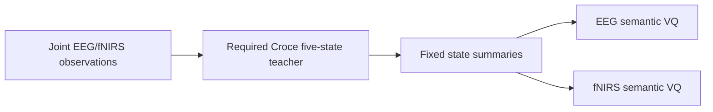
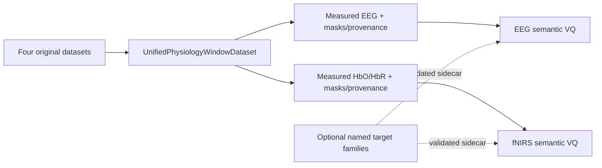

# Measurement-first input contract and optional teacher boundary

> **Date**: 2026-07-14 | **Phase**: Phase 3 input-contract revision | **Git**: `3308257..HEAD`
> **Status**: Merged
> **Links**: [Target architecture](../physiology_semantic_tokenizer/02_TARGET_ARCHITECTURE.md) | [Implementation plan](../physiology_semantic_tokenizer/04_IMPLEMENTATION_VALIDATION_PLAN.md)

## Motivation

The previous target contract promoted the Croce-2017 five-state decomposition and one
shared neural driver from a teacher hypothesis into the architecture's required input
and token semantics. Failed teacher validation and cross-dataset diagnostics do not
support that constraint. The revised contract starts from measured EEG/fNIRS and makes
every teacher family optional, replaceable and independently validated.

## Architecture Delta

### Before



### After



## Component Changes

| File | Change | Description |
| --- | --- | --- |
| `docs/physiology_semantic_tokenizer/02_TARGET_ARCHITECTURE.md` | Modified | Replaced fixed Croce input/semantics with measured inputs and optional target families |
| `src/data/unified_physiology.py` | Modified | Raised default observation context from 8 to 20 seconds |
| `src/data/registry.py` | Modified | Marked all four unified loaders implemented and separated supported loader interfaces |
| `docs/physiology_semantic_tokenizer/05_EXPERIMENT_DESIGN.md` | Modified | Made the unified loader mandatory for E0-E9 |

## Data Flow Changes

Measured EEG/fNIRS, separate modality clocks, canonical labels, geometry, validity masks
and preprocessing provenance are the only mandatory entrance. Croce caches remain
derived artifacts that may be joined by sample identity for named historical/teacher
ablations. They never replace the measured signal or enter the dataset count.

The loader default is now a 20-second event-anchored observation context. Two-second
patches remain a model-internal choice. Record-level spectral QC uses at least 100
seconds when evaluating the 0.01 Hz fNIRS band edge.

## Configuration Changes

```yaml
data:
  loader_class: UnifiedPhysiologyWindowDataset
  loader_contract: unified_physiology_window_v1
  window:
    duration_s: 20.0
  auxiliary_target:
    family: null  # explicit named family only when its scoped gate passes
```

## Loss Function Changes

| Loss term | Change | Weight |
| --- | --- | --- |
| reconstruction/VQ/private | Mandatory teacher-free mainline | Versioned by suite |
| auxiliary target/prototype/context | Optional per validated target family | Zero unless explicitly enabled |
| Croce five-state loss | Removed as architecture invariant | Zero by default |

## Linked Artifacts

- Historical 8-second quality report: `experiments/runs/physiology_semantic_tokenizer/data_quality_audit/final_four_dataset_check_20260710/`
- Single-Trial remediation plan: `docs/physiology_semantic_tokenizer/10_SINGLE_TRIAL_EEG_ARTIFACT_REMEDIATION_PLAN.md`
- Related record: `2026-07-03_e0_v2_teacher_information_contract.md`

## Gate Impact

| Gate | Impact | Notes |
| --- | --- | --- |
| G0 unified data | Required | Loader/schema/alignment/artifact admission remains blocking |
| G1 quantizer | None | Quantizer correctness is unchanged |
| G2 information retention | Required | Remains independent of any teacher |
| G3 registered semantics | Revised | Conclusions are scoped to a named validated signature family |
| G4 coupling | Revised premise | No single shared-driver teacher is assumed |
| G5 downstream | Required | Uses unified-loader-derived exports |

## Design Decisions

- Twenty seconds is the default context because it is materially better suited to the
  fNIRS response and matches existing pilots; it is not claimed to resolve 0.01 Hz PSD.
- Channel counts remain dataset-specific. Geometry and masks are explicit rather than
  padding all datasets into a fictitious common montage at the loader boundary.
- Loader status is interface-specific so REFED/Visual unified loading is implemented
  without falsely claiming support in the older continuous-visualization factory.

## Rollback Considerations

Reverting this decision would require new protected evidence that a fixed Croce/shared
driver target is identifiable across the intended datasets and improves both semantic
and information-retention endpoints. Historical Croce adapters remain available, so no
archive rewrite is required.
