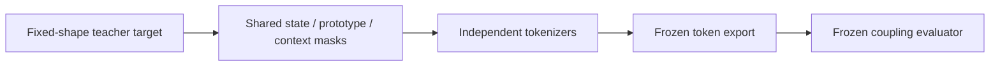

# Physical-teacher gradient entries and coupling stages

_Date: 2026-07-19 · Phase: Phase 3 · Status: Planned_

_Links: [decision](../physiology_semantic_tokenizer/analysis/20260719_PHYSICAL_TEACHER_GRADIENT_ENTRY_DECISION.md) · [implementation plan](../physiology_semantic_tokenizer/04_IMPLEMENTATION_VALIDATION_PLAN.md) · [experiment design](../physiology_semantic_tokenizer/05_EXPERIMENT_DESIGN.md) · [architecture overlay](../physiology_semantic_tokenizer/figures/plans/physical_teacher_gradient_entry_plan.svg)_

## Motivation

The gauge-corrected E0-v3 evidence admits more development state than the
minimum local-coordinate boundary, but not at every receptive field. The
existing loss contract reused modality-level masks across state, prototype,
and context entrances and had no explicit route for preserving delayed
EEG-to-fNIRS information before lossy quantization. The current foundation
baseline also lacks an explicit causal token-level `q_0/q_1` objective.

## Before

## After

```mermaid
flowchart LR
    accTitle: Entry-routed preserve discover certify architecture
    accDescr: Teacher coordinates are routed by receptive field, an asymmetric shaper preserves a delayed bridge, the foundation model discovers context-dependent organization, and a fresh evaluator certifies it.

    teacher["Versioned adaptive proxy"] --> router["Local / prototype / context / coupling router"]
    router --> tokenizer["Independent semantic tokenizers"]
    router --> shaper["Disposable causal preservation shaper"]
    tokenizer --> shaper
    tokenizer --> export["Frozen token export"]
    shaper --> export
    export --> foundation["Causal multimodal foundation q0 / q1"]
    foundation --> evaluator["Fresh or cross-fitted certificate"]
    evaluator --> figures["Lag / null / uncertainty figures"]
```

## Planned changes

| Boundary | Planned change |
| --- | --- |
| Teacher adapter | Required `r` and HbO/HbR local/prototype groups; optional EEG `s`; context/coupling-only flow |
| Loss routing | Separate masks and weights for local, prototype, context, and coupling entrances |
| Uncertainty | Uniform standardized loss until coordinate-and-entry calibration passes |
| Tokenizer | Optional EEG-only-gradient causal preservation shaper, discarded after training |
| Foundation | Multi-horizon fNIRS-history `q_0` and EEG-incremental `q_1` objectives |
| Evaluation | Fresh frozen/cross-fitted certificate after model selection |
| Visualization | Separate prevalence, history prediction, incremental gain, lag, uncertainty, and null panels |

## Gate impact

- E7 now tests whether tokenizer training preserves a delayed bridge under T0–T4 and null ablations.
- E8 tests foundation coupling discovery and downstream utility from frozen exports.
- E9 supplies the independent controlled-coupling certificate and stable paper visualization.
- E0 development admission still does not open the protected split or establish a coupling claim.

## Rollback

Each stage is optional and separately gated. If the physical-teacher routing or
preservation shaper fails, retain the teacher-free tokenizer. If foundation
discovery fails, retain any valid tokenizer result. If the independent
certificate fails, reject the paper-level coupling claim without relabeling
training objectives as evidence.
