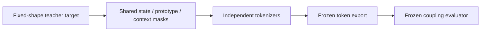
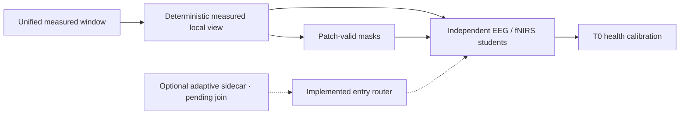

# Physical-teacher gradient entries and coupling stages

_Date: 2026-07-19 · Phase: Phase 3 · Status: In Progress_

_Links: [decision](../physiology_semantic_tokenizer/analysis/20260719_PHYSICAL_TEACHER_GRADIENT_ENTRY_DECISION.md) · [implementation plan](../physiology_semantic_tokenizer/04_IMPLEMENTATION_VALIDATION_PLAN.md) · [experiment design](../physiology_semantic_tokenizer/05_EXPERIMENT_DESIGN.md) · [architecture overlay](../physiology_semantic_tokenizer/figures/plans/physical_teacher_gradient_entry_plan.svg)_

## Motivation

The gauge-corrected E0-v3 evidence admits more development state than the
minimum local-coordinate boundary, but not at every receptive field. The
existing loss contract reused modality-level masks across state, prototype,
and context entrances and had no explicit route for preserving delayed
EEG-to-fNIRS information before lossy quantization. The current foundation
baseline also lacks an explicit causal token-level `q_0/q_1` objective.

## Before



## After

```mermaid
flowchart LR
    accTitle: Entry-routed preserve discover certify architecture
    accDescr: Teacher coordinates are routed by receptive field, an asymmetric shaper preserves a delayed bridge, the foundation model discovers context-dependent organization, and a fresh evaluator certifies it.

    teacher["Accepted adaptive SSM physical teacher"] --> router["Local / prototype / context / coupling router"]
    router --> tokenizer["Independent semantic tokenizers"]
    router --> shaper["Disposable causal preservation shaper"]
    tokenizer --> shaper
    tokenizer --> export["Frozen token export"]
    shaper --> export
    export --> foundation["Causal multimodal foundation q0 / q1"]
    foundation --> evaluator["Fresh or cross-fitted certificate"]
    evaluator --> figures["Lag / null / uncertainty figures"]
```



## Implementation state

| Boundary | State | Change |
| --- | --- | --- |
| Measurement entrance | Implemented for T0 Single-Trial pilot | Unified windows are converted to deterministic measured six-EEG/two-chromophore local views after mask and geometry checks |
| Teacher adapter | Partially implemented | Required `r` and HbO/HbR, optional EEG `s`, and context/coupling-only flow have independent detached masks; adaptive sidecar generation/join remains pending |
| Loss routing | Implemented | Local, prototype, context, and coupling entrances have separate coordinate allowlists and masks; E1 can select semantic-only reconstruction to prevent residual bypass |
| Uncertainty | Implemented | Uniform standardized loss can be selected; inverse-uncertainty weighting remains disabled for the adaptive route |
| Quantizer/masking | Implemented | Invalid measured patches are excluded from EMA, commitment loss, causal history, and health statistics; count/sum EMA starts from matched zero prior mass; optional revival is event-bounded and uses highest-error batch latents |
| Tokenizer preservation shaper | Planned | Optional EEG-only-gradient causal preservation shaper, discarded after training |
| Foundation | Planned | Multi-horizon fNIRS-history `q_0` and EEG-incremental `q_1` objectives |
| Evaluation | Planned | Fresh frozen/cross-fitted certificate after model selection |
| Visualization | Planned | Separate prevalence, history prediction, incremental gain, lag, uncertainty, and null panels |

## Component changes

| File | Change |
| --- | --- |
| `src/data/physiology_semantic_local.py` | Adds a measurement-first local-view adapter over `UnifiedPhysiologyWindowDataset` with deterministic anchors, geometry checks, dependency groups, and contracted token masks |
| `src/teachers/physical_state_teacher.py` | Emits target-family provenance and entry-specific detached validity masks |
| `src/losses/physiology_semantic.py` | Routes coordinates independently at local, prototype, context, and coupling entrances; supports teacher-free T0 |
| `src/tokenizers/ema_vector_quantizer.py` | Excludes invalid tokens and fixes unmatched initial EMA sum/count prior mass |
| `src/tokenizers/physiology_semantic_tokenizer.py` | Propagates measurement validity into VQ and fixed-history context |
| `experiments/train_physiology_semantic_tokenizer.py` | Audits unified subject keys and emits deterministic plus epoch-aggregated E1 health evidence |

## Current data flow



The T0 path is runnable without any teacher. The adaptive sidecar remains a
planned join at the unified sample-identity boundary; its absence does not
authorize a Croce-cache substitution.

## Configuration changes

```yaml
data:
  loader_class: UnifiedPhysiologyLocalViewDataset
  contract: physiology_semantic_measurement_local_v1
loss:
  uncertainty_weighting: false
  entry_routing:
    local: {eeg: [r_mean, r_slope], fnirs: [delta_hbo_mean, delta_hb_mean, delta_hbo_slope, delta_hb_slope]}
validation:
  promotion_eligible: false
```

## Linked artifacts

- Corrected CUDA smoke: `experiments/runs/physiology_semantic_tokenizer/software_smoke/20260719_m0_measurement_first_cuda_smoke_v2/`
- Combined-reconstruction negative calibration: `experiments/runs/physiology_semantic_tokenizer/e1_quantizer_correctness/20260719_e1_t0_measurement_first_short_formal_v1/`
- Semantic-only follow-up: `experiments/runs/physiology_semantic_tokenizer/e1_quantizer_correctness/20260719_e1_t0_semantic_only_short_formal_v2/`

## Gate impact

- E7 now tests whether tokenizer training preserves a delayed bridge under T0–T4 and null ablations.
- E8 tests foundation coupling discovery and downstream utility from frozen exports.
- E9 supplies the independent controlled-coupling certificate and stable paper visualization.
- E0 development admission still does not open the protected split or establish a coupling claim.

## Rollback

Each stage is optional and separately gated. If the physical-teacher routing or
preservation shaper fails, retain the teacher-free tokenizer. If foundation
discovery fails, retain any valid tokenizer result. If the independent
certificate fails, reject the paper-level coupling claim without relabeling
training objectives as evidence.
