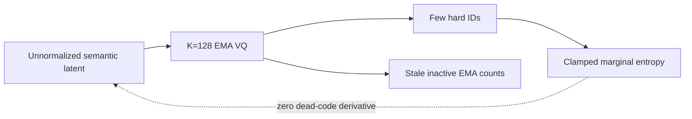
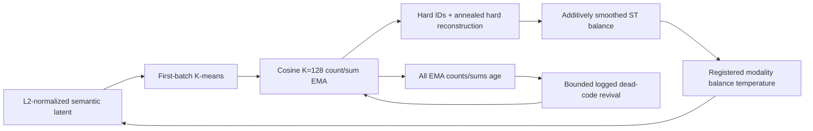

# E1 codebook occupancy contract restoration

_Date: 2026-07-20 · Phase: Phase 3 E1/P2 · Status: Complete — G1 passed_

_Links: [implementation plan](../physiology_semantic_tokenizer/04_IMPLEMENTATION_VALIDATION_PLAN.md) · [experiment design](../physiology_semantic_tokenizer/05_EXPERIMENT_DESIGN.md) · [experiment log](../physiology_semantic_tokenizer/06_EXPERIMENT_LOG.md)_

## Motivation

The first measurement-first K=128 runs collapsed to 2–12 active codes even
though the archived source/observation program had passed Gate1 with source
K=64 and observation K=128. The archive did not establish that EMA alone was
sufficient. Its passing configuration jointly used branch normalization,
unit-sphere/cosine quantization, first-batch K-means, codebook balance,
quantization warmup, decay 0.95, dead-code revival, batch 256, and 200 epochs.
The current eight-epoch semantic tokenizer initially restored only fragments of
that contract and also contained two implementation defects: dead-code balance
gradients were blocked by `clamp_min`, and zero-assignment EMA occupancy did not
age.

## Before

## After

## Implementation changes

| Boundary | Change |
| --- | --- |
| Balance gradient | Replace marginal `clamp_min` with additive smoothing so unused entries retain a recovery derivative |
| EMA health | Decay all count/sum statistics; inactive centroids stay fixed because count and sum decay together |
| Geometry | Add first-valid-batch K-means, cosine assignment, and optional latent L2 normalization |
| Reconstruction | Add hard and annealed-hard straight-through paths plus a checkpointed quantization-strength schedule |
| Revival | Bound and count events, select high-error or diverse candidates, add normalized noise, and register the replacement occupancy prior |
| Calibration | Support modality-specific balance temperatures and aggregate complete occupancy trajectories without opening protected tests |

The formal model contract remains EEG K=128 and fNIRS K=128. No codebook
capacity reduction was made.

## Evidence

The deterministic one-code-collapse probe leaves the forward loss unchanged at
approximately `0.999995`. Correcting additive smoothing restores nonzero unused
code gradients. Raising balance temperature from 1 to 2 increases dead-code
gradient L2 from `2.691e-7` to `3.690e-4` (ratio `1371.27`) for the registered
probe. This is reachability evidence, not a stability result.

Matched eight-epoch, single-seed training/validation runs show:

| Run | EEG active/effective | fNIRS active/effective | Best validation | Interpretation |
| --- | ---: | ---: | ---: | --- |
| v2 expected/no balance | 3 / 2.16 | 12 / 4.50 | 1.6960 | Collapse reference |
| v12 corrected balance gradient | 58 / 6.81 | 11 / 4.17 | 1.8397 | Wider EEG support, still highly skewed |
| v14 archived revival bundle | 71 / 55.32 | 121 / 42.89 | 1.8326 | K=128 broad coverage restored |
| v17 balance T2/T2 | 90 / 66.54 | 116 / 45.65 | 1.8217 | Strongest short-run occupancy/loss candidate |
| v18 balance T2/T1 | 90 / 66.54 | 116 / 39.67 | 1.8299 | Lower fNIRS revival count, lower effective usage |
| v22/v23 diverse retention, 3-seed mean | 86.33 / 65.85 | 110.00 / 39.99 | 1.5826 | Registered fixed-K=128 G1 candidate passes |

Across v17 plus two additional matched seeds, EEG effective usage is
`67.24 ± 0.70` (range `66.54–67.94`) and fNIRS effective usage is
`38.08 ± 6.66` (range `33.12–45.65`). EEG revival count is
`156.0` (range `151–160`) and fNIRS revival count is `102.7` (range
`100–105`). Thus the EEG improvement and the repeated mass-revival dependency
are reproducible, while fNIRS assignment uniformity remains seed-sensitive.
These three seeds are descriptive calibration, not a population uncertainty
interval.

The first registered 14-epoch retention candidate allowed revival only at steps
100 and 200. Across three top-error seeds, revival totals remained constant
from the first post-stop validation at step 231 through step 462, but the
registered gate failed: one fNIRS trajectory reached `21.18` effective codes,
below the frozen minimum of `24`. This was a transient skew rather than renewed
death: that run recovered to `32.08` effective codes and `109/128` active codes.

A paired repair changed only the revival replacement geometry from
`top_error` to `diverse_farthest`. On the failed seed, the fNIRS post-stop
minimum improved from `21.18` to `24.80`, with no EEG regression. Two additional
registered confirmation seeds then produced fNIRS minima `29.64/29.63`. All
three diverse-farthest runs passed every frozen check: eight post-stop
validation epochs, constant revival totals, full final effective rank, nearest
prototype cosine below `0.99`, final active fractions above the modality
ranges, and quantization strength `1.0`. Final effective usage is
`65.85 ± 1.66` for EEG and `39.99 ± 1.38` for fNIRS; final active codes average
`86.33/110.00`. Two bounded startup calibration events remain part of the
registered algorithm, but there is no ongoing periodic overwrite after step
200.

The current measured-data input is already normalized by full-record,
per-channel median/MAD. It is not the archived per-crop, separately normalized
source/observation contract. A training-only audit confirms materially greater
residual fNIRS scale variation: channel standard-deviation q05/q50/q95 is
`0.314/0.665/1.306`, versus `0.680/0.962/1.220` for EEG; `27.3%` of fNIRS
channel-windows lie outside `[0.5,2]`. G1 therefore establishes health under the
current measurement-first contract, not parity with the archive's near-uniform
observation assignments. All results use fixed subjects 01–23 only; subjects
24–29 remain unopened.

Definitive aggregate artifacts are under
`experiments/runs/physiology_semantic_tokenizer/e1_quantizer_correctness/20260720_e1_occupancy_comparison_v6/`.
The machine-readable decision is under
`experiments/runs/physiology_semantic_tokenizer/e1_quantizer_correctness/20260720_e1_post_revival_diverse_farthest_gate_v2/`.

## Gate impact

- G1/E1 quantizer correctness and registered health **pass** for the fixed-K=128 diverse-farthest/T2-T2 candidate.
- K=128 remains fixed; capacity shrinkage is not supported by the corrected runs.
- The original top-error retention candidate is rejected because one fNIRS seed violated the frozen effective-usage floor.
- Passing G1 authorizes the registered G2/G3 development sequence; it does not itself establish information retention, physiological semantics, or archive-level assignment uniformity.
- Protected subjects remain closed at this checkpoint; no protected result is claimed.

## Rollback

The uniform-batch-prior ablation remains rejected. Top-error replacement stays
available as the legacy-compatible constructor default, but its registered
three-seed retention gate failed. The E1 experiment config now selects
diverse-farthest replacement together with threshold occupancy prior; reverting
that factor reopens G1. The registered config continues to own all stronger
geometry, temperature, warmup, and revival choices.
