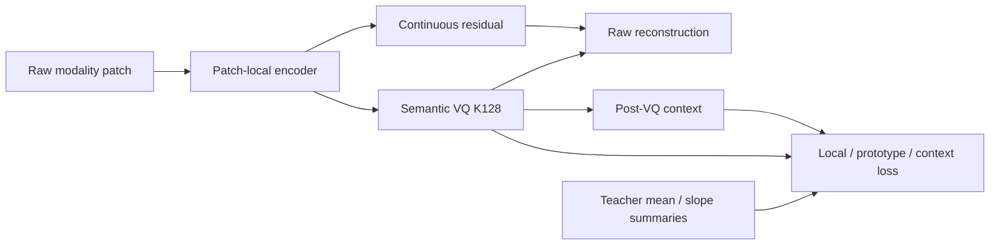
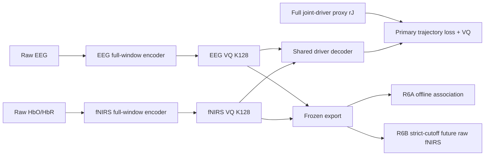

# Shared-Driver Semantic VQ architecture return

**Date:** 2026-07-25

**Status:** Planned after-state; E2 runtime remains current
**Supersedes as active plan:** `2026-07-19_physical_teacher_gradient_entry_and_coupling_stages.md`

## 📋 Context

E2 showed that the implemented multi-entry teacher supervision did not improve
the preregistered hard-token semantic endpoint. The audit also found sparse
sidecar coverage, a historical train/probe mask-support mismatch, and a
receptive-field mismatch between patch-local token identity and the full-window
RTS teacher.

The fixed K128 quantizer health result remains valid. This decision changes the
semantic estimand, temporal encoder and objective routing; it does not shrink
the codebook and does not reinterpret E2 as having tested the new hypothesis.

## ⏪ Before

## ⏩ After

## 🎯 Decision

- tokenizer inputs are own-modality raw measurements plus validity masks only;
- both independent codebooks remain `K=128,D=64`;
- R1-D subject-specific targets are exploratory; promotion requires a newly
  validated population-frozen R1-P teacher and paired \(r^J/r^E\) provenance;
- a modality-only 20-second temporal encoder precedes quantization;
- both codebooks reconstruct the same complete \(r^J\) trajectory through one
  shared decoder;
- raw reconstruction, mandatory residual, multi-entry teacher routing,
  coupling shaper and foundation model leave the minimal core;
- a continuous private branch is admitted only by an R4 ablation;
- frozen bidirectional tokens may enter R6A offline delayed-association tests;
  future raw-fNIRS prediction is an independent R6B branch using only completed
  windows whose absolute receptive field plus embargo ends before the endpoint;
  independent confirmation is reserved for R7.

## 🔍 Evidence and falsifier

This is a hypothesis-bearing plan. It is falsified before VQ if either
own-modality continuous student cannot reconstruct \(r^J\) under the
population-frozen R1-P teacher. It is falsified as a token hypothesis if hard
K128 outputs fail to retain the continuous signal. R6A fails if offline
association does not exceed history/null controls; R6B fails if its temporal
cutoff is violated or future raw-fNIRS gain does not exceed those controls.

## 🔄 Rollback

E0–E2 artifacts and the current runtime remain reproducible. If R2 fails, no
canonical model migration occurs. If R3 fails after R2 passes, the continuous
student may be retained as a result, but the K128 semantic claim is rejected.
If R6A fails, a semantic tokenizer can still be retained without a coupling
claim. If R6B fails after R6A passes, only the offline association wording is
allowed.

## 📦 Affected authority

- `docs/physiology_semantic_tokenizer/02_TARGET_ARCHITECTURE.md`
- `docs/METHOD_RATIONALE.md`
- `docs/physiology_semantic_tokenizer/04_IMPLEMENTATION_VALIDATION_PLAN.md`
- `docs/physiology_semantic_tokenizer/05_EXPERIMENT_DESIGN.md`
- `docs/physiology_semantic_tokenizer/07_CODE_MIGRATION_PLAN.md`
- `docs/METHOD_RATIONALE.md`
- `docs/physiology_semantic_tokenizer/architecture/shared_driver_semantic_return_plan.json`
