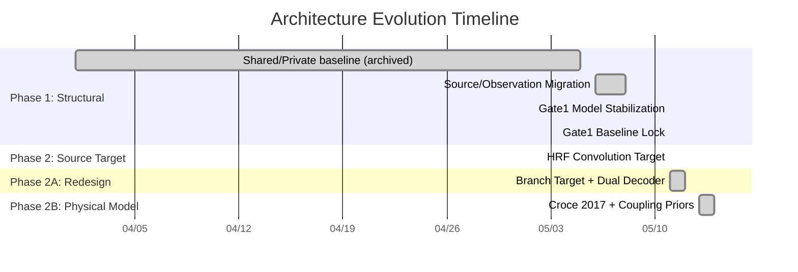

# Architecture Changelog Index

> The authoritative chronological record of every architectural change to the neuro-tokenization mainline.
> Current architecture state: [ARCHITECTURE.md](../ARCHITECTURE.md)
> Implementation plan: [IMPLEMENTATION_PLAN.md](../../IMPLEMENTATION_PLAN.md)

---

## Timeline

## Change Records

| # | Date | Phase | Title | Key Files | Status |
|---|------|-------|-------|-----------|--------|
| 1 | 2026-05-06 | Phase 1 | [Source/Observation Architecture Migration](2026-05-06_source_observation_migration.md) | `factorized_labram_vqnsp.py`, `registry.py`, `multimodal_tokenizer.py`, `__init__.py` | Merged |
| 2 | 2026-05-11 | Phase 1 | [Phase 1 Gate1 Model Stabilization](2026-05-11_phase1_gate1_model_stabilization.md) | `factorized_labram_vqnsp.py`, `multimodal_tokenizer.py`, `labram_vqnsp.py`, `train_source_observation_tokenizer.py` | Merged |
| 3 | 2026-05-11 | Phase 1 | [Phase 1 Gate1 Baseline Lock and Archive](2026-05-11_phase1_gate1_baseline_lock.md) | `phase1 configs`, `ARCHITECTURE.md`, `EXPERIMENT_LOG.md`, `IMPLEMENTATION_PLAN.md` | Merged |
| 4 | 2026-05-11 | Phase 2A | [Branch Target Redesign + Dual Decoder Architecture](2026-05-11_phase2a_branch_target_redesign_dual_decoder.md) | `factorized_labram_vqnsp.py`, `ARCHITECTURE.md`, `PHYSIOLOGICAL_COUPLING_PLAN.md`, `IMPLEMENTATION_PLAN.md` | Merged |
| 5 | 2026-05-13 | Phase 2B | [Croce 2017 Physical Model Targets](2026-05-13_phase2b_croce2017_physical_model_targets.md) | `factorized_labram_vqnsp.py`, `ARCHITECTURE.md`, `IMPLEMENTATION_PLAN.md` | Merged |
| 6 | 2026-05-14 | Phase 2B | Architecture Stabilization & Document Alignment | `IMPLEMENTATION_PLAN.md`, `ARCHITECTURE.md`, `README.md`, `PHYSIOLOGICAL_COUPLING_PLAN.md`, `SEMANTIC_TOKEN_SCORECARD.md`, `THEORY.md`, `EXPERIMENT_LOG.md`, `INDEX.md` | Merged |

## How to Add a New Entry

1. Copy [`template.md`](template.md) to `YYYY-MM-DD_short_title.md`
2. Fill in all sections — especially the **Before/After Mermaid diagrams**
3. Add a row to the Change Records table above
4. Update the Timeline gantt chart if needed
5. Update [ARCHITECTURE.md](../ARCHITECTURE.md) to reflect the new current state
6. If the change completes a phase, update IMPLEMENTATION_PLAN.md §10 (Implementation Order)

## Conventions

- **File naming**: `YYYY-MM-DD_short_snake_case_title.md`
- **Diagram format**: [Mermaid](https://mermaid.js.org/) — renders natively on GitHub
- **Status values**: `Planned` → `In Progress` → `Merged`
- **Git references**: Use short hashes (`abc1234..def5678`) or tags
- **Link hygiene**: Use relative links to files within the repo; all file paths from repo root
