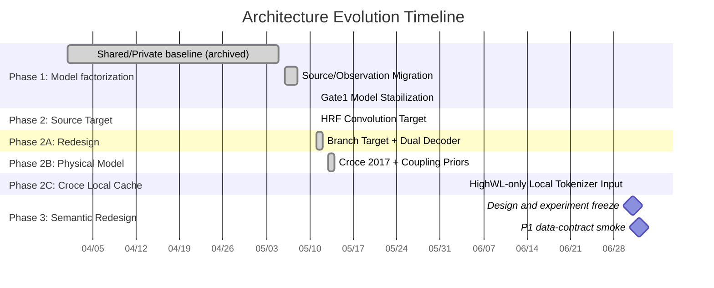

# Architecture Changelog Index

> The authoritative chronological record of every architectural change to the neuro-tokenization mainline.
> Current architecture state: [ARCHITECTURE.md](../ARCHITECTURE.md)
> Approved target architecture: [physiology_semantic_tokenizer/02_TARGET_ARCHITECTURE.md](../physiology_semantic_tokenizer/02_TARGET_ARCHITECTURE.md)
> Target implementation plan: [physiology_semantic_tokenizer/04_IMPLEMENTATION_VALIDATION_PLAN.md](../physiology_semantic_tokenizer/04_IMPLEMENTATION_VALIDATION_PLAN.md)

---

## Scope

This directory records changes to model structure and its scientific data contract: model components, tensor/data flow, supervision targets, quantization, losses, inference boundaries, and gate-relevant representation interfaces.

Repository layout, storage paths, documentation authority, archive moves, launcher organization, and test/config namespace maintenance belong in the [project operations changelog](../project_changelog/INDEX.md), even when they support an architecture migration.

## Timeline

```mermaid
gantt
    accTitle: Architecture evolution timeline
    accDescr: The source observation lineage is complete through the Croce local runtime, followed by a planned physiology semantic tokenizer redesign.
    title Architecture Evolution Timeline
    dateFormat  YYYY-MM-DD
    axisFormat  %m/%d
    section Phase 1: Model factorization
        Shared/Private baseline (archived) :done, 2026-04-01, 2026-05-05
        Source/Observation Migration      :done, 2026-05-06, 2026-05-08
        Gate1 Model Stabilization         :done, 2026-05-11, 2026-05-11
    section Phase 2: Source Target
        HRF Convolution Target            :done, 2026-05-11, 2026-05-11
    section Phase 2A: Redesign
        Branch Target + Dual Decoder      :done, 2026-05-11, 2026-05-12
    section Phase 2B: Physical Model
        Croce 2017 + Coupling Priors      :done, 2026-05-13, 2026-05-14
    section Phase 2C: Croce Local Cache
        HighWL-only Local Tokenizer Input :done, 2026-06-04, 2026-06-04
    section Phase 3: Semantic Redesign
        Design and experiment freeze      :milestone, 2026-07-01, 0d
        P1 data-contract smoke            :milestone, 2026-07-02, 0d
```

## Change Records

| # | Date | Phase | Title | Key Files | Status |
|---|------|-------|-------|-----------|--------|
| 1 | 2026-05-06 | Phase 1 | [Source/Observation Architecture Migration](2026-05-06_source_observation_migration.md) | `factorized_labram_vqnsp.py`, `registry.py`, `multimodal_tokenizer.py`, `__init__.py` | Merged |
| 2 | 2026-05-11 | Phase 1 | [Phase 1 Gate1 Model Stabilization](2026-05-11_phase1_gate1_model_stabilization.md) | `factorized_labram_vqnsp.py`, `multimodal_tokenizer.py`, `labram_vqnsp.py`, `train_source_observation_tokenizer.py` | Merged |
| 3 | 2026-05-11 | Phase 2A | [Branch Target Redesign + Dual Decoder Architecture](2026-05-11_phase2a_branch_target_redesign_dual_decoder.md) | `factorized_labram_vqnsp.py`, `ARCHITECTURE.md`, `PHYSIOLOGICAL_COUPLING_PLAN.md`, `IMPLEMENTATION_PLAN.md` | Merged |
| 4 | 2026-05-13 | Phase 2B | [Croce 2017 Physical Model Targets](2026-05-13_phase2b_croce2017_physical_model_targets.md) | `factorized_labram_vqnsp.py`, `ARCHITECTURE.md`, `IMPLEMENTATION_PLAN.md` | Merged |
| 5 | 2026-06-04 | Phase 2C | [HighWL-only Croce Local Tokenizer Input](2026-06-04_highwl_croce_local_tokenizer_input.md) | `croce_local_cache_dataset.py`, `factory.py`, `factorized_labram_vqnsp.py`, `source_observation_analysis.py`, `croce_local configs` | Merged |
| 6 | 2026-07-01 | Phase 3 | [Physiology-Semantic Tokenizer Redesign Baseline](2026-07-01_physiology_semantic_tokenizer_redesign.md) | `docs/physiology_semantic_tokenizer/`, `ARCHITECTURE.md`, architecture changelog | Planned |
| 7 | 2026-07-02 | Phase 3 P1/G0 | [P1 Physiology-Semantic Data Contract Smoke](2026-07-02_p1_physiology_semantic_data_contract.md) | v2 cache generator, strict paired-optical loader, E0 contract validator/config | In Progress |

## How to Add a New Entry

1. Copy [`template.md`](template.md) to `YYYY-MM-DD_short_title.md`
2. Fill in all sections — especially the **Before/After Mermaid diagrams**
3. Add a row to the Change Records table above
4. Update the Timeline gantt chart if needed
5. Update [ARCHITECTURE.md](../ARCHITECTURE.md) to reflect the new current state
6. If the change completes a phase, update the implementation plan identified by the relevant architecture record
7. If the change only moves files, rewrites documentation authority, or changes storage/launcher/test organization, record it in `docs/project_changelog/` instead

## Conventions

- **File naming**: `YYYY-MM-DD_short_snake_case_title.md`
- **Diagram format**: [Mermaid](https://mermaid.js.org/) — renders natively on GitHub
- **Status values**: `Planned` → `In Progress` → `Merged`
- **Git references**: Use short hashes (`abc1234..def5678`) or tags
- **Link hygiene**: Use relative links to files within the repo; all file paths from repo root
