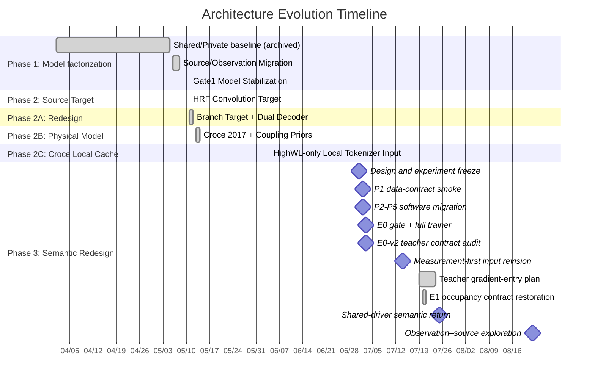

# Architecture Changelog Index

> The authoritative chronological record of every architectural change to the neuro-tokenization mainline.
> Current architecture state: [ARCHITECTURE.md](../ARCHITECTURE.md)
> Historical proposed architecture: [physiology_semantic_tokenizer/02_TARGET_ARCHITECTURE.md](../physiology_semantic_tokenizer/02_TARGET_ARCHITECTURE.md)
> Historical implementation plan: [physiology_semantic_tokenizer/04_IMPLEMENTATION_VALIDATION_PLAN.md](../physiology_semantic_tokenizer/04_IMPLEMENTATION_VALIDATION_PLAN.md)
> Current observation–source exploration (not an architecture contract): [design note](../physiology_semantic_tokenizer/architecture/observation_source_exploration_v2.json) · [framework SVG](../physiology_semantic_tokenizer/figures/plans/observation_source_exploration_v2.svg)

---

## Scope

This directory records changes to model structure and its scientific data contract: model components, tensor/data flow, supervision targets, quantization, losses, inference boundaries, and gate-relevant representation interfaces.

Repository layout, storage paths, documentation authority, archive moves, launcher organization, and test/config namespace maintenance belong in the [project operations changelog](../project_changelog/INDEX.md), even when they support an architecture migration.

## Timeline

```mermaid
gantt
    accTitle: Architecture evolution timeline
    accDescr: The source observation lineage is complete through the Croce local runtime, followed by a planned physiology semantic tokenizer redesign.
    title Architecture Evolution Timeline
    dateFormat  YYYY-MM-DD
    axisFormat  %m/%d
    section Phase 1: Model factorization
        Shared/Private baseline (archived) :done, 2026-04-01, 2026-05-05
        Source/Observation Migration      :done, 2026-05-06, 2026-05-08
        Gate1 Model Stabilization         :done, 2026-05-11, 2026-05-11
    section Phase 2: Source Target
        HRF Convolution Target            :done, 2026-05-11, 2026-05-11
    section Phase 2A: Redesign
        Branch Target + Dual Decoder      :done, 2026-05-11, 2026-05-12
    section Phase 2B: Physical Model
        Croce 2017 + Coupling Priors      :done, 2026-05-13, 2026-05-14
    section Phase 2C: Croce Local Cache
        HighWL-only Local Tokenizer Input :done, 2026-06-04, 2026-06-04
    section Phase 3: Semantic Redesign
        Design and experiment freeze      :milestone, 2026-07-01, 0d
        P1 data-contract smoke            :milestone, 2026-07-02, 0d
        P2-P5 software migration          :milestone, 2026-07-02, 0d
        E0 gate + full trainer             :milestone, 2026-07-03, 0d
        E0-v2 teacher contract audit       :milestone, 2026-07-03, 0d
        Measurement-first input revision   :milestone, 2026-07-14, 0d
        Teacher gradient-entry plan        :done, 2026-07-19, 5d
        E1 occupancy contract restoration  :done, 2026-07-20, 1d
        Shared-driver semantic return      :milestone, 2026-07-25, 0d
        Observation–source exploration      :milestone, 2026-08-22, 0d
```

## Change Records

| # | Date | Phase | Title | Key Files | Status |
|---|------|-------|-------|-----------|--------|
| 1 | 2026-05-06 | Phase 1 | [Source/Observation Architecture Migration](2026-05-06_source_observation_migration.md) | `factorized_labram_vqnsp.py`, `registry.py`, `multimodal_tokenizer.py`, `__init__.py` | Merged |
| 2 | 2026-05-11 | Phase 1 | [Phase 1 Gate1 Model Stabilization](2026-05-11_phase1_gate1_model_stabilization.md) | `factorized_labram_vqnsp.py`, `multimodal_tokenizer.py`, `labram_vqnsp.py`, `train_source_observation_tokenizer.py` | Merged |
| 3 | 2026-05-11 | Phase 2A | [Branch Target Redesign + Dual Decoder Architecture](2026-05-11_phase2a_branch_target_redesign_dual_decoder.md) | `factorized_labram_vqnsp.py`, `ARCHITECTURE.md`, `PHYSIOLOGICAL_COUPLING_PLAN.md`, `IMPLEMENTATION_PLAN.md` | Merged |
| 4 | 2026-05-13 | Phase 2B | [Croce 2017 Physical Model Targets](2026-05-13_phase2b_croce2017_physical_model_targets.md) | `factorized_labram_vqnsp.py`, `ARCHITECTURE.md`, `IMPLEMENTATION_PLAN.md` | Merged |
| 5 | 2026-06-04 | Phase 2C | [HighWL-only Croce Local Tokenizer Input](2026-06-04_highwl_croce_local_tokenizer_input.md) | `croce_local_cache_dataset.py`, `factory.py`, `factorized_labram_vqnsp.py`, `source_observation_analysis.py`, `croce_local configs` | Merged |
| 6 | 2026-07-01 | Phase 3 | [Physiology-Semantic Tokenizer Redesign Baseline](2026-07-01_physiology_semantic_tokenizer_redesign.md) | `docs/physiology_semantic_tokenizer/`, `ARCHITECTURE.md`, architecture changelog | Planned |
| 7 | 2026-07-02 | Phase 3 P1/G0 | [P1 Physiology-Semantic Data Contract Smoke](2026-07-02_p1_physiology_semantic_data_contract.md) | v2 cache generator, strict paired-optical loader, E0 contract validator/config | In Progress |
| 8 | 2026-07-02 | Phase 3 P2-P5 | [P2-P5 Physiology-Semantic Code Migration](2026-07-02_p2_p5_physiology_semantic_code_migration.md) | corrected EMA VQ, physical teacher, independent tokenizer, gated trainer, export/consumers | Merged |
| 9 | 2026-07-03 | Phase 3 E0/P4 | [E0 Gate and Physiology-Semantic Training Runtime](2026-07-03_e0_gate_and_training_runtime.md) | E0 posterior-predictive gate, full trainer, objective-specific authorization, resume | Historical pre-calibration record; superseded |
| 10 | 2026-07-03 | Phase 3 E0-v2/P3-P4 | [E0-v2 Teacher Information Contract and Validity-Mask Split](2026-07-03_e0_v2_teacher_information_contract.md) | measurement adapter, split teacher masks, layered metrics, visual audit | Historical pre-calibration record; superseded |
| 11 | 2026-07-14 | Phase 3 input contract | [Measurement-first Input Contract and Optional Teacher Boundary](2026-07-14_measurement_first_input_contract.md) | unified loader, target architecture, experiment matrix, registry | Merged |
| 12 | 2026-07-19 | Phase 3 coupling architecture | [Physical-Teacher Gradient Entries and Coupling Stages](2026-07-19_physical_teacher_gradient_entry_and_coupling_stages.md) | measurement-local adapter, entry router, masked EMA VQ, preservation/foundation/certificate plan | Superseded historical plan |
| 13 | 2026-07-20 | Phase 3 E1/P2 | [E1 Codebook Occupancy Contract Restoration](2026-07-20_e1_codebook_occupancy_contract_restoration.md) | Fixed-K=128 EMA VQ, gradient-preserving balance, bounded diverse revival, multi-seed retention gate v2 | Complete — G1 passed |
| 14 | 2026-07-24 | Phase 3 E0 final | [Sign-calibrated physical-teacher acceptance](../physiology_semantic_tokenizer/analysis/20260724_E0_SIGN_CALIBRATED_PHYSICAL_TEACHER_ACCEPTANCE.md) | adaptive SSM, gauge/sign calibration, fNIRS status correction | Complete — full E0 passed |
| 15 | 2026-07-25 | Phase 4 architecture return | [Shared-Driver Semantic VQ architecture return](2026-07-25_shared_driver_semantic_return.md) | full-window raw-only encoders, independent K128, full-driver primary objective, frozen external certificate | Planned — R0–R7 not run |
| 16 | 2026-08-22 | Phase 5 exploration note | [Observation–source candidate map](../physiology_semantic_tokenizer/architecture/observation_source_exploration_v2.json) | replaceable continuous targets, teachers, observation/source branches, token hierarchies, endpoint grammar, and optional conditional analyses | Exploratory note only — no architecture frozen; implementation and measured runs not started |

## How to Add a New Entry

1. Copy [`template.md`](template.md) to `YYYY-MM-DD_short_title.md`
2. Fill in all sections — especially the **Before/After Mermaid diagrams**
3. Add a row to the Change Records table above
4. Update the Timeline gantt chart if needed
5. Update [ARCHITECTURE.md](../ARCHITECTURE.md) to reflect the new current state
6. If the change completes a phase, update the implementation plan identified by the relevant architecture record
7. If the change only moves files, rewrites documentation authority, or changes storage/launcher/test organization, record it in `docs/project_changelog/` instead

## Conventions

- **File naming**: `YYYY-MM-DD_short_snake_case_title.md`
- **Diagram format**: [Mermaid](https://mermaid.js.org/) — renders natively on GitHub
- **Status values**: `Planned` → `In Progress` → `Merged`/`Complete`; append a gate qualifier where necessary
- **Git references**: Use short hashes (`abc1234..def5678`) or tags
- **Link hygiene**: Use relative links to files within the repo; all file paths from repo root
