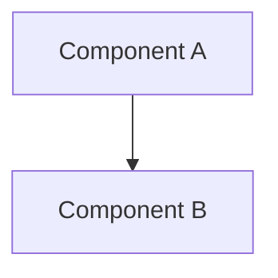
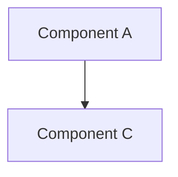

# [Change Title]

> **Date**: YYYY-MM-DD | **Phase**: [Phase 1 / 2 / 2A / 3 / A / C] | **Git**: `<start_commit>..<end_commit>`
> **Status**: [Planned / In Progress / Merged]
> **Links**: [IMPLEMENTATION_PLAN.md §X](IMPLEMENTATION_PLAN.md) | [ARCHITECTURE.md](ARCHITECTURE.md)

## Motivation

<!-- 1-2 sentences: why this change happened. What was the problem or design decision that drove it. -->

## Architecture Delta

### Before

<!-- Mermaid diagram of the architecture BEFORE this change -->



### After

<!-- Mermaid diagram of the architecture AFTER this change -->



## Component Changes

| File | Change | Description |
|------|--------|-------------|
| `path/to/file.py` | Added / Modified / Removed | What changed and why |

## Data Flow Changes

<!-- Describe what paths in the forward/data pipeline changed. Reference the Mermaid diagrams above for visual context. -->

## Configuration Changes

<!-- Show the config diff or describe new/removed config keys -->

```yaml
# Before (if applicable)
# old_key: old_value

# After
# new_key: new_value
```

## Loss Function Changes

<!-- If loss terms were added, removed, or reweighted -->

| Loss Term | Change | Weight |
|-----------|--------|--------|

## Linked Artifacts

- **Config**: `experiments/configs/source_observation/<phase>/<config>.yaml`
- **Experiment**: `experiments/runs/<run_name>/`
- **Scorecard**: Gate 1-4 results summary
- **Related changelog entries**: [YYYY-MM-DD Title](YYYY-MM-DD_title.md)

## Gate Impact

<!-- Check which gates are affected by this change -->

| Gate | Impact | Notes |
|------|--------|-------|
| Gate 1 (Health) | None / Expected change | |
| Gate 2 (Semantics) | None / Expected change | |
| Gate 2A (Q-C Consistency) | None / Expected change | |
| Gate 3 (Structure) | None / Expected change | |
| Gate 4 (Utility) | None / Expected change | |

## Design Decisions

<!-- Key choices made during implementation and why. Especially useful for non-obvious decisions. -->

## Rollback Considerations

<!-- If this change needed to be reverted, what else would need to change? -->
