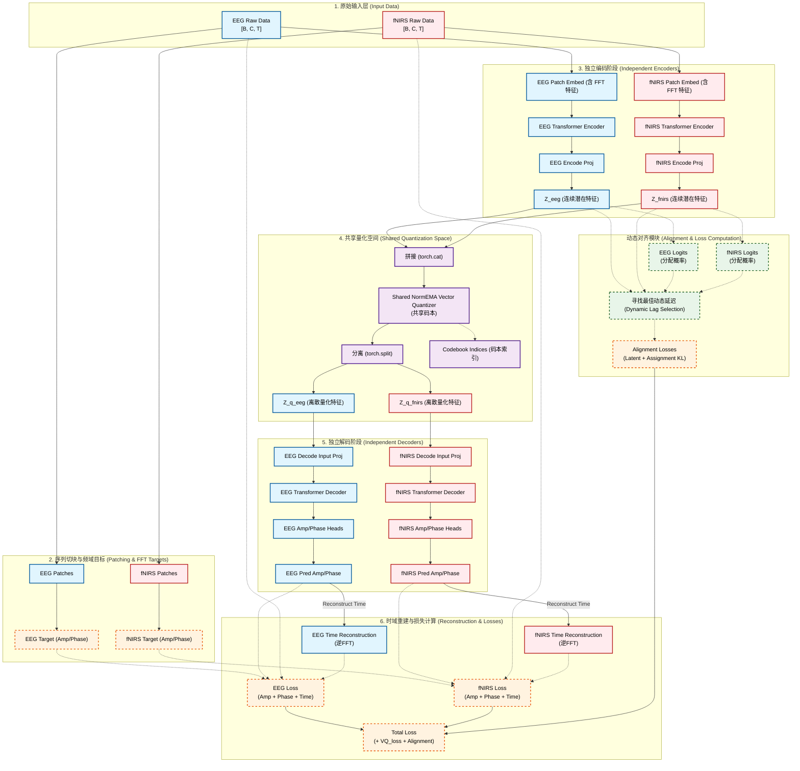

# Shared codebook structure report

> for code reference, see src/tokenizers/shared_labram_vqnsp.py and experiments/scripts/train_shared_tokenizer.py at main branch as of 2026-3-26

## Alignment method

- **Shared codebook**: EEG and fNIRS has independent encoder and decoder, but they share a same vector quantizer with a same codebook. EEG and fNIRS latent representations are concatenated before quantization, then split back into separate modalities after quantization. 

```python
z_joint = torch.cat([z_eeg, z_fnirs], dim=0)
z_q_joint, indices_joint, quant_info = self.quantize(z_joint)
```

- **Explicit Alignment Losses**: Two alignment losses are designed to encourage the shared codebook to learn a common representation space for both modalities:
    1. **Latent Alignment Loss**: Use AlignmentLoss to directly calculate the similarity between the EEG and fNIRS latent representations before quantization.
    2. **Assignment Alignment Loss**: Use the codebook assignment indices to calculate a loss that encourages similar inputs from both modalities to be assigned to the same or nearby codebook entries.

- Dynamic Lag Handling:
    - Lag Candidates: The model maintains a set of candidate lags (e.g., 0,1,2,3 time steps) to account for potential temporal misalignment between EEG and fNIRS.
    - Lagged time slice: fNIRS inputs are shifted by each candidate lag.
    - Alignment Selection: in `_compute_alignment_losses`, the model computes alignment losses for each candidate lag and selects the one with the lowest loss as the optimal alignment for that training step.

## Data flow visualization


