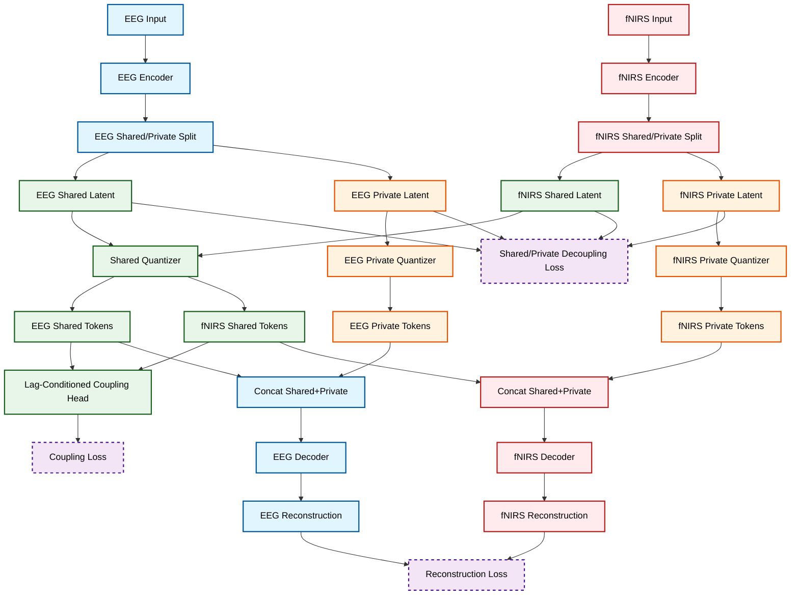

# Shared/Private Factorization Design For EEG-fNIRS Tokenization

> This document is a follow-up design note built on top of [Shared_codebook_structure_report.md](Shared_codebook_structure_report.md).
> The goal is to replace the current single shared-codebook assumption with a factorized architecture that preserves reconstruction while keeping cross-modal alignment interpretable and physiologically grounded.

## 1. Why the current shared-codebook design plateaus

The current model in [src/tokenizers/shared_labram_vqnsp.py](src/tokenizers/shared_labram_vqnsp.py) uses:

- independent EEG and fNIRS encoders,
- one shared vector quantizer,
- independent EEG and fNIRS decoders,
- latent and assignment alignment losses on top of the shared codebook.

This design is elegant, but the recent experiments show a structural conflict:

1. EEG and fNIRS do not carry the same amount of modality-specific information.
EEG contains high-frequency, rapidly changing electrophysiological structure. fNIRS is slower, smoother, and hemodynamically delayed. Forcing both modalities into the same discrete token inventory means the shared codebook must simultaneously represent:
- fast EEG dynamics,
- slow fNIRS dynamics,
- cross-modal common structure,
- modality-private nuisance and reconstruction details.

2. Shared-token identity is stronger than physiological correspondence.
Physiological coupling does not require that EEG and fNIRS emit the same token index. It only requires that certain EEG states predict certain fNIRS states under a lagged, structured mapping. The current model uses token identity overlap as an implicit proxy for correspondence. That proxy is too strict.

3. Reconstruction and alignment compete inside the same discrete bottleneck.
If the codebook prioritizes reconstruction, each modality tends to occupy its own region of the vocabulary and overlap collapses. If the codebook prioritizes overlap, reconstruction degrades because modality-private details are suppressed. This is the tradeoff observed in the final shared-codebook experiments.

4. Codebook-health metrics can be misleading under a shared bottleneck.
EMA utilization can remain high while emitted-token overlap becomes nearly zero. In other words, the quantizer is numerically active, but the learned shared representation is semantically empty.

These observations indicate that the main problem is not simply a bad loss weight. The problem is that the representation geometry is over-constrained.

## 2. Core idea: shared/private factorization

The replacement principle is:

- shared factors should encode only cross-modal common structure,
- private factors should encode modality-specific reconstruction details,
- cross-modal correspondence should be modeled as a structured relationship between shared factors, not as forced code identity over the whole representation.

In practice, each modality is decomposed into two latent streams:

- shared latent: intended to capture cross-modal physiological content,
- private latent: intended to capture modality-unique information needed for reconstruction.

This gives the model enough freedom to reconstruct well without abandoning interpretability.

## 3. Theoretical motivation

### 3.1 Partial information decomposition view

For EEG latent $Z_e$ and fNIRS latent $Z_f$, the information relevant to downstream physiology can be conceptually decomposed into:

$$
I(Z_e, Z_f; Y) = R + U_e + U_f + S
$$

where:

- $R$ is redundant/shared information,
- $U_e$ is EEG-unique information,
- $U_f$ is fNIRS-unique information,
- $S$ is synergistic information.

The current single shared codebook implicitly assumes most reconstructive content should live in a common discrete space. That is equivalent to over-allocating capacity to $R$ while under-modeling $U_e$ and $U_f$.

Shared/private factorization instead aligns the model structure with the decomposition:

- shared codes approximate redundant cross-modal content,
- private codes approximate modality-specific content,
- the coupling module models delayed relationships between shared factors.

### 3.2 Identifiability and interpretability

Interpretability improves when each subspace has a clear causal role:

- shared subspace: what is stable across modalities up to lagged mapping,
- private EEG subspace: what only EEG needs to reconstruct,
- private fNIRS subspace: what only fNIRS needs to reconstruct.

This is much easier to interpret than a single mixed codebook where overlap may disappear for purely optimization reasons.

### 3.3 Physiological realism

EEG and fNIRS are coupled, but not isomorphic.

- EEG reflects fast electrical activity.
- fNIRS reflects delayed vascular response.

Therefore, the physiologically appropriate objective is not:

$$
token_e(t) = token_f(t + \Delta)
$$

but rather:

$$
p(s_f(t + \Delta) \mid s_e(t))
$$

where $s_e$ and $s_f$ are shared physiological states and $\Delta$ is the allowed lag. This naturally suggests a lag-conditioned coupling model, not a single shared token identity constraint.

## 4. Proposed architecture

### 4.1 High-level structure

Each modality keeps its own encoder and decoder backbone, but the latent output is split into two branches:

- shared branch,
- private branch.

The shared branches are quantized by a shared quantizer or a pair of lightly tied quantizers.
The private branches are quantized by modality-specific quantizers.

Reconstruction uses both shared and private quantized latents:

$$
\hat{x}_{eeg} = D_e([z^{sh}_e, z^{pr}_e]), \quad
\hat{x}_{fnirs} = D_f([z^{sh}_f, z^{pr}_f])
$$

Cross-modal alignment is applied only on the shared branch.

### 4.2 Recommended version: factorized dual-quantizer model

This is the recommended concrete design.

- EEG encoder output splits into:
  - EEG shared latent $z^{sh}_e$
  - EEG private latent $z^{pr}_e$
- fNIRS encoder output splits into:
  - fNIRS shared latent $z^{sh}_f$
  - fNIRS private latent $z^{pr}_f$
- Shared latent streams go through:
  - shared quantizer $Q_{sh}$
- Private latent streams go through:
  - EEG private quantizer $Q^{e}_{pr}$
  - fNIRS private quantizer $Q^{f}_{pr}$
- Decoder input is concatenated shared and private quantized latents.

This gives three discrete bottlenecks instead of one:

- one for shared physiology,
- one for EEG-private structure,
- one for fNIRS-private structure.

### 4.3 Coupling head on shared factors

Instead of forcing shared token identity directly, introduce a lag-aware coupling head:

- input: quantized shared EEG tokens or shared EEG logits,
- target: quantized shared fNIRS tokens or shared fNIRS logits,
- condition: allowed lags in $[0, 8]$ patches.

The coupling head can be implemented in one of two forms:

1. Transition matrix form
- learn a conditional mapping from EEG shared token distribution to fNIRS shared token distribution,
- easy to visualize as a lag-conditioned token-to-token graph.

2. Cross-attention form
- EEG shared states attend over lagged fNIRS shared states,
- more expressive but slightly less directly interpretable.

For this project, the transition matrix form is the better first step because it preserves interpretability.

## 5. Architecture diagram

## 6. Loss design

The total objective should be reorganized as:

$$
L = L_{rec}^{eeg} + L_{rec}^{fnirs} + \lambda_{vq} L_{vq} + \lambda_{cpl} L_{cpl} + \lambda_{orth} L_{orth} + \lambda_{bal} L_{bal}
$$

with the following terms.

### 6.1 Reconstruction loss

Keep the current reconstruction definitions per modality:

- EEG amplitude + phase + time reconstruction,
- fNIRS amplitude + phase + time reconstruction.

This preserves continuity with all previous experiments.

### 6.2 VQ loss

Use separate VQ losses for shared and private codebooks:

$$
L_{vq} = L_{vq}^{sh} + L_{vq}^{e,pr} + L_{vq}^{f,pr}
$$

### 6.3 Coupling loss on shared branch only

Recommended first implementation:

- compute EEG shared-token logits,
- compute fNIRS shared-token logits,
- align them over allowed lag candidates,
- predict fNIRS shared distribution from EEG shared distribution using a lag-conditioned transition matrix,
- minimize KL or cross-entropy between predicted and observed fNIRS shared distributions.

This replaces the current assignment-alignment role at the full representation level.

### 6.4 Shared/private decoupling loss

To stop shared and private branches from collapsing into each other, add a decorrelation or orthogonality penalty.

Simple version:

$$
L_{orth} = \| (Z^{sh}_e)^T Z^{pr}_e \|_F^2 + \| (Z^{sh}_f)^T Z^{pr}_f \|_F^2
$$

This encourages the shared branch to encode different content from the private branch.

### 6.5 Balance regularization

One risk is that the decoder may ignore the shared branch and route everything through private codes.
To counter this, use a weak balance term, for example:

- channel dropout on private branch during training,
- or stochastic masking of shared/private branches,
- or a minimum-usage regularizer on the shared codebook.

This should be weak. The goal is to prevent trivial bypass, not to force false sharing.

## 7. What should remain shared, and what should become private

### Shared

- lag-aware physiological state transitions,
- low-frequency task-related cross-modal structure,
- token transition motifs that persist across subjects.

### Private EEG

- fast oscillatory detail,
- phase-specific transient structure,
- high-frequency or non-hemodynamic content.

### Private fNIRS

- slow vascular shape detail,
- subject-specific baseline drift patterns,
- local channel-specific hemodynamic morphology.

This separation is exactly what the current one-codebook design cannot express cleanly.

## 8. Concrete code modification plan

### Phase A. Add a new tokenizer class

Create a new file:

- [src/tokenizers/factorized_labram_vqnsp.py](src/tokenizers/factorized_labram_vqnsp.py)

Do not mutate the current shared tokenizer heavily. Keep the old model for comparison.

The new class should:

1. reuse the current EEG/fNIRS patch embedding,
2. reuse the current EEG/fNIRS transformer encoders,
3. split each modality encoder output into shared and private projections,
4. instantiate three quantizers:
   - shared quantizer,
   - EEG-private quantizer,
   - fNIRS-private quantizer,
5. concatenate shared and private quantized states before modality decoder input,
6. expose diagnostics separately for shared/private indices and codebook usage.

Suggested module-level components:

- `eeg_shared_proj`
- `eeg_private_proj`
- `fnirs_shared_proj`
- `fnirs_private_proj`
- `shared_quantizer`
- `eeg_private_quantizer`
- `fnirs_private_quantizer`
- `coupling_head`

### Phase B. Registry integration

Update:

- [src/tokenizers/registry.py](src/tokenizers/registry.py)

Add a new model type, for example:

- `factorized_labram_vqnsp`

Map config fields for:

- shared/private codebook sizes,
- shared/private latent dims,
- coupling loss weights,
- orthogonality weight,
- branch dropout or branch masking settings.

### Phase C. Training script changes

Update:

- [experiments/scripts/train_shared_tokenizer.py](experiments/scripts/train_shared_tokenizer.py)

The current script can likely be reused with moderate changes if the new model returns the same top-level keys plus new diagnostics.

Add logging for:

- shared codebook perplexity,
- EEG-private codebook perplexity,
- fNIRS-private codebook perplexity,
- shared/private active code counts,
- shared coupling loss,
- shared/private branch contribution ratio,
- orthogonality loss.

Gradient attribution should also be updated so we can see whether learning is dominated by:

- EEG reconstruction,
- fNIRS reconstruction,
- shared coupling,
- orthogonality,
- VQ terms.

### Phase D. Visualization updates

Update:

- [src/visualization/shared_alignment_analysis.py](src/visualization/shared_alignment_analysis.py)

The current analysis assumes one shared index stream per modality. For the new model, split the analysis into:

1. shared-token coupling analysis,
2. private-token usage analysis,
3. decoder reliance analysis.

New plots should include:

- shared codebook usage by modality,
- private codebook usage by modality,
- lag-conditioned coupling matrix heatmaps,
- overlap and mutual information on shared branch only,
- ablation reconstruction plots with shared-only and private-only decoding.

### Phase E. Config design

Add a new experiment config family under:

- [experiments/configs/phase0plus](experiments/configs/phase0plus)

Recommended first config:

- 1 shared codebook of size 64 or 128,
- 1 EEG-private codebook of size 128 or 256,
- 1 fNIRS-private codebook of size 64 or 128,
- same lag range `[0..8]`,
- same 30 s window and 2 s patches,
- alignment/coupling only on shared branch,
- orthogonality penalty small at start,
- private-branch dropout mild.

The shared codebook should be intentionally smaller than the private codebooks. That forces the shared branch to represent only compressible common structure.

## 9. Recommended training schedule

### Stage 1. Reconstruction-first pretraining

Train the factorized model with:

- reconstruction losses,
- VQ losses,
- orthogonality loss,
- no cross-modal coupling yet.

Goal:

- both modalities reconstruct well,
- shared/private branches become stable,
- private branches absorb modality-specific detail.

### Stage 2. Coupling warm-start on shared branch

Enable the lag-conditioned shared coupling loss only after Stage 1 stabilizes.

Goal:

- align shared states without damaging reconstruction,
- observe whether shared code overlap and coupling MI increase while private branches preserve fidelity.

### Stage 3. Decoder reliance probes

Run ablations:

- decode from shared branch only,
- decode from private branch only,
- decode from both.

This directly tests whether the shared branch is meaningful rather than decorative.

## 10. Why this is better than another shared-codebook weight sweep

Another weight sweep still leaves the model with one impossible requirement:

- use the same token vocabulary to encode both shared and private information.

Factorization removes that contradiction.

The expected benefits are:

1. Better reconstruction
- because private branches no longer compete for shared capacity.

2. More meaningful cross-modal interpretability
- because shared codes correspond to common physiology, not full modality content.

3. Cleaner codebook diagnostics
- because shared usage can be evaluated independently from private usage.

4. More stable optimization
- because alignment no longer directly fights against modality-specific reconstruction details.

## 11. Main risks and mitigations

### Risk 1. Shared branch collapses and decoder uses only private branch

Mitigation:

- small shared-usage regularizer,
- branch dropout,
- shared-only decoding probe during validation.

### Risk 2. Shared branch becomes too weak to capture coupling

Mitigation:

- keep shared codebook smaller but not tiny,
- couple only on shared branch,
- increase shared latent width before increasing coupling weight.

### Risk 3. Private branches memorize too much

Mitigation:

- use modest private codebook sizes,
- monitor private code entropy and top-k coverage,
- use branch masking in some batches.

## 12. Recommended implementation order

1. Add new factorized tokenizer class without changing current shared class.
2. Reuse current reconstruction path and split latent projections into shared/private heads.
3. Add three quantizers and return shared/private indices separately.
4. Keep current loss logging style, then add shared/private diagnostics.
5. Add coupling head on shared branch only.
6. Extend analysis code to inspect shared and private branches separately.
7. Launch a reconstruction-first run before any coupled training.

## 13. Bottom line

The main lesson from the latest experiments is not that alignment should be weaker or stronger. The lesson is that one shared discrete bottleneck is too rigid for this problem.

Shared/private factorization is the minimal structural change that:

- preserves reconstruction as a first-class objective,
- preserves interpretability,
- remains physiologically meaningful,
- and stops forcing EEG and fNIRS to share token identity where only lagged correspondence is required.

If we want both good reconstruction and interpretable EEG-fNIRS alignment, this is the most defensible next architecture.