# Legacy tokenizer design postmortem

_Evidence-to-decision record for the transition from reconstruction-centered coupling to physiology-semantic tokenization_

---

## 📋 Scope

This document records what was wrong with the previous design, how each issue was discovered, which parts are direct observations, and how the approved redesign addresses them. The old implementation and runs remain valid historical controls; they are not retroactively relabeled as failed code.

The strongest audited reference is the X3 causal-exchange run `k128_dim128_x3_causal_exchange_seed20260652`, together with its information-drop, local-coupling, geometry, position, and downstream artifacts. Whole-brain evidence comes from the 2026-06-24 short-formal MLM/InfoNCE run.

## 🔍 Previous design and failure surface

```mermaid
flowchart LR
    accTitle: Legacy tokenizer failure surface
    accDescr: The legacy path reconstructs teacher-generated source and residual waveforms, quantizes four independent branches, injects coupling or exchange, and exports hard IDs to downstream models.

    cache_targets["PF source and residual cache"] --> raw_input["Recomposed model input"]
    raw_input --> independent_encoders["Independent modality encoders"]
    independent_encoders --> four_quantizers["Four cosine VQ branches"]
    four_quantizers --> hard_ids["Hard token IDs"]
    four_quantizers --> coupling_tensor["Lag coupling tensor"]
    hard_ids --> fresh_embeddings["Fresh downstream embeddings"]
    fresh_embeddings --> wholebrain_tasks["Whole-brain tasks"]
    coupling_tensor --> conditional_plots["Conditional projections"]

    classDef source fill:#f3f4f6,stroke:#6b7280,stroke-width:2px,color:#1f2937
    classDef risk fill:#fee2e2,stroke:#dc2626,stroke-width:2px,color:#7f1d1d
    classDef output fill:#fef9c3,stroke:#ca8a04,stroke-width:2px,color:#713f12

    class cache_targets,raw_input source
    class independent_encoders,four_quantizers,coupling_tensor,fresh_embeddings risk
    class hard_ids,wholebrain_tasks,conditional_plots output
```

## 📊 Evidence ledger

The table distinguishes measured evidence from mechanistic interpretation. A mechanism remains a hypothesis until an intervention isolates it.

| Problem | Direct evidence | Mechanistic inference | Redesign response | Falsification condition |
| --- | --- | --- | --- | --- |
| Hard IDs discard usable structure | Test LOSO CCA: continuous `0.1483`, soft `0.1589`, hard one-hot `0.0584`, quantized embedding `0.0602` | Hard assignment and current codebook geometry discard cross-modal directions | Preserve posterior and codebook embedding; keep a residual stream | Hard-only performance matches soft/residual under controlled capacity |
| Reconstruction does not define physiological semantics | Source waveform reconstruction can improve while task-local coupling and fine-task probes remain weak | Decoder capacity can satisfy waveform loss without organizing codewords by physical state | Supervise semantic latent and codeword prototypes with teacher state summaries | Prototype-to-state decoding does not improve over reconstruction-only |
| Global coupling mixes heterogeneous distributions | Global held-out NLL gain `0.3044`, but mental-arithmetic and motor dataset gains are negative; task groups do not have positive lower CIs | Dataset/task mixture and marginals can produce global dependence without stable task-local mapping | Evaluate sequence-conditioned gain within dataset/task/phase and over history/marginal baselines | Multiple held-out task-local groups show reproducible positive gains under the old model |
| Strong exchange contaminates the test | X3 sends EEG context directly into the fNIRS source encoder before quantization | Cleaner mapping can be architecturally written into fNIRS tokens rather than discovered | Generate modality tokens independently; train coupling after freezing tokenizers | Exchange improves independent held-out coupling after removing the exchange path at evaluation |
| Conditional plots are marginal-dominated | Residual logits are near uniform, while stronger conditional peaks appear after adding the fNIRS marginal | Argmax structure can reflect frequent fNIRS codes rather than EEG information | Plot and optimize incremental log likelihood over lag/history marginals | Residual-only logits show stable non-uniform task-local structure |
| Current VQ geometry is low-rank or redundant | Effective ranks: EEG source `12.28`, fNIRS source `7.20`, fNIRS observation `3.51`; fNIRS observation nearest cosine `0.955` | High utilization is compatible with redundant prototypes | Fix EMA update semantics; audit rank, prototype stability, and state coverage | Corrected VQ retains the same redundancy with stable physiological prototypes |
| Nominal and effective dimensions diverged | X3 is named `dim128`, but explicit modality fields produce source codebooks `[128,48]` | Config naming obscured the actual experiment and invalidated capacity interpretation | Resolve and assert all tensor contracts before launch | Runtime assertions confirm a single unambiguous dimension surface |
| Current cache target is a hard waveform point estimate | Cache stores `state_estimates` and `r_estimates_eeg`, but the loader returns only decoded source/residual waveforms | Posterior uncertainty and physical state geometry never reach the codebook | Expose teacher posterior mean/variance and patch state summaries | State supervision adds no prototype stability or semantic selectivity |
| Residual was overinterpreted | Residual is defined algebraically as raw minus model source | Residual contains true private physiology, model misspecification, and noise | Rename it private/residual; avoid calling it nuisance or noise without probes | Independent nuisance/private labels validate a narrower interpretation |
| Branch-wise normalization breaks raw-space additivity | Source and residual are standardized separately before being recomposed in X3 | The model no longer sees a single normalized version of the original raw measurement | Preserve one raw normalization transform; carry branch scaling only as loss normalization | Additivity and amplitude-ratio tests show no difference |
| HighWL-only input discards available optical information | Both optical cache components exist; the active tokenizer reads only channel 0 | The student receives less hemodynamic information than the PF teacher used | Use paired optical input in the mainline; retain highWL-only as an ablation | Paired optical input shows no information or state-estimation benefit |
| Downstream discards tokenizer geometry | Whole-brain code creates new `nn.Embedding` tables | Token IDs preserve category identity but not learned prototype geometry | Initialize or directly consume tokenizer embeddings/posteriors | Fresh embeddings consistently outperform transferred geometry |
| Expected token index is not meaningful | Existing plots compute `E[index]` | Code indices are nominal and permutation-dependent | Order tokens by train-only physiological signatures; visualize distributions and excess probability | Index ordering is shown to be externally fixed and physiologically ordinal |

## 📈 Key experimental observations

### Information ladder

The X3 test-global information audit reported:

| Representation | Conditional MI estimator | LOSO CCA correlation |
| --- | ---: | ---: |
| Raw patch features | 0.0397 | 0.0641 |
| Source target features | 0.0253 | 0.1250 |
| Continuous source latent | 0.1726 | 0.1483 |
| Soft assignment | 0.3931 | 0.1589 |
| Hard token one-hot | 0.2467 | 0.0584 |
| Quantized embedding | 0.0438 | 0.0602 |

The Gaussian conditional-MI values are estimator- and dimensionality-dependent; their absolute ordering must not be interpreted as information creation. The robust conclusion is the LOSO pattern: hard IDs and quantized embeddings retained substantially less usable cross-modal linear structure than continuous and soft representations.

### Coupling locality

| Scope | Group | NLL gain | 95% bootstrap interval | Interpretation |
| --- | --- | ---: | --- | --- |
| Global | All data | 0.3044 | `[0.1787, 0.4156]` | Positive mixed-distribution dependence |
| Dataset | Simultaneous cognitive | 0.0091 | `[0.0049, 0.0134]` | Small positive local evidence |
| Dataset | Mental arithmetic | -0.0189 | `[-0.0201, -0.0175]` | Worse than marginal baseline |
| Dataset | Motor imagery | -0.0149 | `[-0.0180, -0.0118]` | Worse than marginal baseline |
| Task | n-back | -0.0179 | `[-0.0194, -0.0165]` | No stable task-local mapping |
| Task | WG | 0.0059 | `[-0.0062, 0.0181]` | Interval includes zero |

The evidence supports a global mixture effect, not a universally stable physiological mapping.

### Downstream utility

Whole-brain MLM/InfoNCE pretraining produced the following test balanced accuracies:

| Task | Balanced accuracy | Chance reference |
| --- | ---: | ---: |
| `nback_vs_wg` | 0.6377 | 0.5 |
| `cognitive_task_type_5way` | 0.2596 | 0.2 |
| `mental_arithmetic_bl_vs_ma` | 0.5000 | 0.5 |
| `motor_lmi_vs_rmi` | 0.5227 | 0.5 |
| `croce_label_6way` | 0.3926 | 0.1667 |

Frozen event embeddings predicted `source_name` at `0.6476` balanced accuracy and `task_type_family` at `0.5495`, but fine-grained `task_type_label_name` at only `0.2851`. Because source and task family are confounded in the combined dataset, source-style prediction is not evidence of physiological semantics.

## 🎯 Decisions

### Retained

- Local 2-second patch grid and whole-brain anchor aggregation
- Separate modality encoders at inference time
- Discrete semantic IDs as an interpretable analysis interface
- Soft posterior and codebook embedding as first-class outputs
- Additive reconstruction, provided normalization preserves additivity
- Croce-style state-space structure as a teacher candidate
- Marginal-controlled held-out coupling evaluation

### Retired from the mainline

- Hard ID as the only downstream representation
- Reconstruction loss as the definition of token semantics
- Direct pre-VQ EEG-to-fNIRS information exchange in the primary model
- Coupling heatmap appearance as a promotion criterion
- Same-index or expected-index physiological interpretation
- Residual equals noise/nuisance as an untested claim
- A single global `[lag, EEG token, fNIRS token]` parameter as the complete coupling model

## 🔗 Evidence artifacts

- [`X3 information-drop audit`](../../experiments/archive/pre_physiology_semantic_20260701/runs/tokenizer_cross_modal_exchange/20260626_173718_causal_cross_adapter_v1/information_drop_audit/k128_dim128_x3_causal_exchange_seed20260652/summary.json)
- [`X3 local-coupling audit`](../../experiments/archive/pre_physiology_semantic_20260701/runs/tokenizer_cross_modal_exchange/20260626_173718_causal_cross_adapter_v1/local_coupling_audit/k128_dim128_x3_causal_exchange_seed20260652/summary.json)
- [`X3 codebook geometry`](../../experiments/archive/pre_physiology_semantic_20260701/runs/tokenizer_cross_modal_exchange/20260626_173718_causal_cross_adapter_v1/codebook_geometry/k128_dim128_x3_causal_exchange_seed20260652/summary.json)
- [`Whole-brain short-formal summary`](../../experiments/archive/pre_physiology_semantic_20260701/runs/downstream/source_observation_wholebrain_pretrain/20260624_k128_dim128_wholebrain_mlm_v1/short_formal/summary.json)
- [`Whole-brain embedding probes`](../../experiments/archive/pre_physiology_semantic_20260701/runs/downstream/source_observation_wholebrain_pretrain/20260624_k128_dim128_wholebrain_mlm_v1/short_formal/embedding_probe_report.json)

_Last updated: 2026-07-01_
