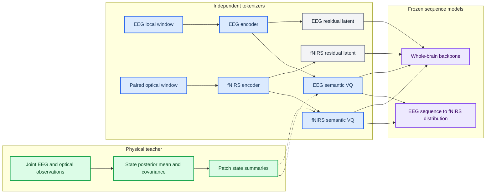

# Target architecture: physiology-semantic multimodal tokenizer

_Approved architecture contract; implementation pending as of 2026-07-01_

---

## 📋 Architecture status

This document specifies the target architecture that replaces reconstruction-centered source-token coupling. It is a forward contract for code changes and experiments, not a description of the current runtime.

The target has four separable layers:

1. a frozen or stop-gradient **physical state teacher**;
2. independent EEG and fNIRS **semantic tokenizers**;
3. modality-private **residual representations** for information preservation;
4. a frozen-token **sequence-to-distribution coupling model** and whole-brain downstream backbone.

## 🎯 Non-negotiable invariants

| Invariant | Required behavior | Prohibited shortcut |
| --- | --- | --- |
| Independent inference | EEG tokens use EEG only; fNIRS tokens use fNIRS only | Feeding EEG features into the fNIRS tokenizer in the mainline |
| State-level semantics | Codewords decode teacher-state summaries | Treating waveform reconstruction as sufficient semantics |
| Structured output | Return ID, posterior, prototype embedding, and residual | Exporting only hard IDs |
| Delayed correspondence | Model EEG sequence to future fNIRS distribution | Forcing equal indices or diagonal alignment |
| Incremental coupling | Compare against fNIRS history and lag marginals | Interpreting raw conditional probability as EEG evidence |
| Uncertainty-aware teacher | Weight state supervision by teacher uncertainty | Treating posterior means as exact labels |
| Additive signal contract | Preserve one consistent raw-space normalization | Normalizing source and residual independently before summation |
| Paired optical mainline | Use both available optical components where compatible | Calling highWL-only input a complete hemodynamic representation |

## 🏗️ Component architecture

## 📥 Input and teacher contracts

### Current-compatible local window

The first implementation keeps the validated 20-second local-anchor grid:

| Tensor | Current-compatible shape | Target mainline shape |
| --- | ---: | ---: |
| EEG input | `[B, 6, 4000]` | `[B, 6, 4000]` |
| fNIRS input | `[B, 1, 200]` highWL | `[B, 2, 200]` paired optical |
| EEG patches | `[B, 10, 6, 400]` | `[B, 10, 6, 400]` |
| fNIRS patches | `[B, 10, 1, 20]` | `[B, 10, 2, 20]` |

HighWL-only remains an explicit ablation and compatibility path. It is not the target mainline because the cache and physical solver already contain paired optical observations.

### Physical teacher output

The minimum teacher interface is:

| Field | Shape | Meaning |
| --- | ---: | --- |
| `state_mean` | `[B, 200, 5]` | Posterior mean for `(s, delta_f, delta_hbo, delta_hb, r)` |
| `state_var` | `[B, 200, 5]` | Diagonal posterior variance |
| `state_cov` | optional `[B, 200, 5, 5]` | Full or low-rank covariance |
| `neural_driver_eeg_rate` | `[B, 4000, 1]` | EEG-rate estimate of `r(t)` |
| `eeg_clean_mean` | `[B, 6, 4000]` | Teacher clean EEG observation |
| `fnirs_clean_mean` | `[B, 2, 200]` | Teacher clean paired optical observation |
| `teacher_valid_mask` | `[B, 200]` | Valid support after history and boundary handling |

Patch pooling creates a state target:

\[
U_t = [\operatorname{mean}(x_t),\operatorname{slope}(x_t),\log\operatorname{var}(x_t)]
\in\mathbb R^{15}
\]

and therefore `patch_state_summary: [B, 10, 15]`.

The teacher runs on continuous sessions or complete event windows. The student receives a crop plus a mask that removes fNIRS targets whose causal EEG history lies outside the visible context.

## 🧠 Semantic tokenizer contract

### Recommended first formal dimensions

| Component | Shape |
| --- | ---: |
| EEG encoder output | `[B, 10, 256]` |
| fNIRS encoder output | `[B, 10, 160]` |
| EEG semantic latent | `[B, 10, 64]` |
| fNIRS semantic latent | `[B, 10, 64]` |
| EEG semantic codebook | `[128, 64]` |
| fNIRS semantic codebook | `[128, 64]` |
| EEG/fNIRS posterior | `[B, 10, 128]` each |
| EEG/fNIRS hard ID | `[B, 10]` each |
| EEG/fNIRS expected embedding | `[B, 10, 64]` each |

`D=64` is the starting point because the explicit state target is low-dimensional and the residual path carries high-fidelity detail. `D in {48, 64, 128}` remains a preregistered capacity ablation.

### Token semantics

The two source vocabularies do not represent the same raw variables:

| Vocabulary | Primary identifiable state | Secondary context |
| --- | --- | --- |
| EEG semantic token | Fast neural driver and vasoactive signal `(r, s)` | Local spectral and temporal context |
| fNIRS semantic token | Hemodynamic state `(delta_f, delta_hbo, delta_hb)` | Delayed neural history and vascular context |

Each codeword has a decoded physical signature:

\[
\mu_k^m = G_m(e_k^m)
\]

where `G_E` predicts EEG-identifiable teacher coordinates and `G_F` predicts fNIRS-identifiable coordinates. Equal token indices have no privileged meaning.

### Quantizer correctness requirements

The target quantizer must:

- maintain EMA for both cluster counts and codeword sums;
- leave a codeword unchanged when it receives no current-batch assignments;
- revive dead codes through an explicitly logged policy;
- expose hard IDs, logits, normalized posterior, quantized embeddings, and codebook weights;
- assert runtime codebook size and dimension against the resolved config;
- report assignment entropy, active codes, effective rank, nearest-neighbor cosine, and prototype drift.

Cosine-only assignment is an ablation. The mainline must preserve amplitude or log-power through either the semantic input, a side feature, or the residual branch.

## 💾 Private and residual representation

The private/residual branch preserves information that the physical semantic model cannot explain. It must not be called noise by default.

The first formal experiment keeps residual latents continuous:

| Branch | Suggested shape |
| --- | ---: |
| EEG residual latent | `[B, 10, 64]` |
| fNIRS residual latent | `[B, 10, 32]` |

RVQ or FSQ is introduced only after the semantic branch passes state and information-retention gates. This isolates whether failures come from semantic organization or a second quantizer.

The decoder contract is:

\[
\hat X^m = D_m(E[K^m],R^m)
\]

with auxiliary semantic-only and residual-only reconstructions for attribution.

## ⚙️ Training objectives

### Tokenizer stage

The tokenizer objective is:

\[
\mathcal L_{tok}=
\lambda_{state}\mathcal L_{state}
+\lambda_{proto}\mathcal L_{proto}
+\lambda_{masked}\mathcal L_{masked\_state}
+\lambda_{recon}\mathcal L_{recon}
+\lambda_{vq}\mathcal L_{vq}
+\lambda_{private}\mathcal L_{private}
\]

The physical-state term is uncertainty weighted:

\[
\mathcal L_{state}^m =
(\hat u_t^m-\mu_t^m)^\top
(\Sigma_t^m+\epsilon I)^{-1}
(\hat u_t^m-\mu_t^m)
\]

The prototype term applies the same target to `G_m(e_k^m)`, forcing codebook geometry rather than only the continuous encoder output to represent state.

The masked-state objective predicts teacher state summaries from unmasked temporal context. It is the primary semantic sequence objective; raw reconstruction is the information-preservation objective.

### Coupling stage

The coupling model is trained after both tokenizers are frozen:

\[
p(K_t^F\mid K_{t-L:t}^E,H_t^F,\tau)
\]

For a 2-second grid, the initial lag support is `0..8` tokens, covering `0..16` seconds. The output contract is:

| Field | Shape |
| --- | ---: |
| EEG context state | `[B, 10, H]` |
| Lag-conditioned fNIRS logits | `[B, 10, 9, 128]` |
| Valid-pair mask | `[B, 10, 9]` |
| fNIRS history baseline logits | `[B, 10, 9, 128]` |
| Incremental log-likelihood | `[B, 10, 9]` |

Primary coupling evidence is the held-out gain over a fNIRS-history, lag-, dataset-, and subject-controlled baseline. The coupling head does not update tokenizers in the primary experiment.

## 📦 Export and downstream contract

Each semantic token export must contain:

| Field | Local shape | Whole-brain shape |
| --- | ---: | ---: |
| Hard ID | `[N, 10]` | `[N, A, 2, 10]` |
| Posterior or top-k posterior | `[N, 10, 128]` | `[N, A, 2, 10, 128]` or sparse equivalent |
| Expected codebook embedding | `[N, 10, 64]` | `[N, A, 2, 10, 64]` |
| Residual latent | branch-specific | `[N, A, 2, 10, D_r]` |
| Teacher state summary | `[N, 10, 15]` | `[N, A, 10, 15]` |
| Masks and metadata | sample-specific | anchor, time, history, subject, source |

The whole-brain backbone must support four representation modes:

1. hard ID only;
2. transferred codebook embedding;
3. soft expected embedding;
4. semantic embedding plus residual.

The comparison between these modes is a required information-retention result, not an optional diagnostic.

## 📊 Visualization contract

Publication visualizations must obey the following rules:

- do not use expected token index as a physiological scalar;
- order tokens using train-only physical signatures and lock the order for validation/test;
- align seeds with Hungarian matching on physical signatures, not raw IDs;
- display conditional excess probability or incremental log likelihood rather than raw conditionals alone;
- include uncertainty intervals and marginal/history baselines;
- aggregate 128 tokens into a small number of physiological meta-states for the main figure while retaining full matrices in supplementary artifacts;
- use fixed color scales for task-difference plots.

## 🔐 Claim boundary

The architecture can support the claim that tokens represent state regions and that EEG token sequences predict future fNIRS token distributions only after the corresponding gates pass. It cannot by itself support claims of causal neurovascular coupling, universal task invariance, or one-to-one token correspondence.

## 🔗 Related documents

- [`Legacy design postmortem`](01_LEGACY_DESIGN_POSTMORTEM.md)
- [`Theoretical foundations`](03_THEORETICAL_FOUNDATIONS.md)
- [`Implementation and validation plan`](04_IMPLEMENTATION_VALIDATION_PLAN.md)
- [`Experiment design`](05_EXPERIMENT_DESIGN.md)
- [`Current runtime architecture`](../ARCHITECTURE.md)

_Last updated: 2026-07-01_
