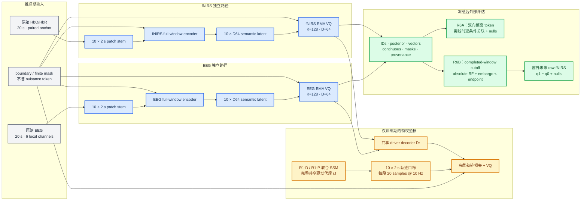

# 目标架构：Shared-Driver Semantic VQ

_设计冻结：2026-07-25；状态：拟实现的 R 系列 after-state，不代表当前 runtime_

---

## 📋 架构决定

目标架构简称 **SD-SVQ**（Shared-Driver Semantic Vector Quantization）。它使用两个彼此独立、仅接收本模态原始生理测量的 tokenizer，并让两个 semantic codebook 都以 E0 的完整联合共享驱动代理轨迹 \(r^J\) 为主要训练目标。训练完成后冻结 tokenizer，再按主张选择 R6A 离线时延条件关联和/或独立的 R6B 窗外预测；后者要求显式时间截断保证表示 receptive field 早于 endpoint。

当前可运行代码、E2 runtime 和本设计必须区分：

| 对象 | 权威状态 |
| --- | --- |
| 当前已实现软件 | [当前架构](../ARCHITECTURE.md) 与 canonical runtime SVG |
| E0–E2 结果 | [实验日志](06_EXPERIMENT_LOG.md)，历史合同不改写 |
| 拟实现架构 | 本文与 [shared-driver plan SVG](figures/plans/shared_driver_semantic_return_plan.svg) |
| 实施顺序 | [实现与验证计划](04_IMPLEMENTATION_VALIDATION_PLAN.md) |
| 科学实验与 stop rules | [R 系列实验设计](05_EXPERIMENT_DESIGN.md) |

本设计只有在 P1–P5 代码与测试、R1-P population-frozen teacher panel 及 development rows 的 100% coverage、R2
R2-P continuous observability 和 R3-P development semantic gate 全部通过后，才可升级为当前架构；protected coverage 只能在一次性开启后核验。

## 🔒 不可妥协的约束

1. EEG encoder 只接收冻结预处理合同下的 measured EEG 与 boundary/finite 计算 mask。
2. fNIRS encoder 只接收冻结预处理合同下的 measured HbO/HbR 与 boundary/finite 计算 mask。
3. task、subject、trial phase、nuisance、teacher state 和另一模态不得进入 tokenizer。
4. EEG 与 fNIRS 使用独立 codebook；不共享参数，不匹配 ID。
5. 两侧 semantic codebook 均固定为 `K=128, D=64`。这是预先指定的容量预算，不称为已证明的最优状态数。
6. semantic branch 的主要目标是完整 \(r^J\) 轨迹，不再使用 E2 的 mean/slope 多入口辅助目标。
7. semantic branch 不承担原始信号重建。
8. 不在 tokenizer 训练中加入 InfoNCE、co-occurrence、index matching、cross-attention 或 coupling loss。
9. 生理耦合只在 token 冻结后，用未参与训练塑形的原始 fNIRS endpoint 检验；temporal scope 决定只能声明离线关联还是窗外预测。
10. protected subjects `24–29` 在架构、配置、endpoint 和 evaluator 冻结前保持关闭。

## 🏗️ 最小架构


```mermaid
flowchart LR
    accTitle: Shared-Driver Semantic VQ 目标架构
    accDescr: EEG 和 fNIRS 原始测量分别进入独立的整窗时序编码器和 K128 量化器，共用一个只在训练期使用的联合共享驱动代理轨迹目标；冻结后 R6A 离线关联与 R6B completed-window 预测是按主张选择的独立分支。

    subgraph inputs["推理期输入"]
        eeg["原始 EEG<br/>20 s · 6 local channels"]
        fnirs["原始 HbO/HbR<br/>20 s · paired anchor"]
        masks["boundary / finite mask<br/>不含 nuisance token"]
    end

    subgraph eeg_path["EEG 独立路径"]
        eeg_patch["10 × 2 s patch stem"]
        eeg_context["EEG full-window encoder"]
        eeg_latent["10 × D64 semantic latent"]
        eeg_vq["EEG EMA VQ<br/>K=128 · D=64"]
    end

    subgraph fnirs_path["fNIRS 独立路径"]
        fnirs_patch["10 × 2 s patch stem"]
        fnirs_context["fNIRS full-window encoder"]
        fnirs_latent["10 × D64 semantic latent"]
        fnirs_vq["fNIRS EMA VQ<br/>K=128 · D=64"]
    end

    subgraph privileged["仅训练期的特权坐标"]
        joint_teacher["R1-D / R1-P 联合 SSM<br/>完整共享驱动代理 rJ"]
        target_split["10 × 2 s 轨迹目标<br/>每段 20 samples @ 10 Hz"]
        driver_decoder["共享 driver decoder Dr"]
        loss["完整轨迹损失 + VQ"]
    end

    subgraph evaluation["冻结后外部评估"]
        export["IDs · posterior · vectors<br/>continuous · masks · provenance"]
        offline["R6A：双向整窗 token<br/>离线时延条件关联 + nulls"]
        cutoff["R6B：completed-window cutoff<br/>absolute RF + embargo < endpoint"]
        future["窗外未来 raw fNIRS<br/>q1 − q0 + nulls"]
    end

    eeg --> eeg_patch --> eeg_context --> eeg_latent --> eeg_vq
    fnirs --> fnirs_patch --> fnirs_context --> fnirs_latent --> fnirs_vq
    masks --> eeg_vq
    masks --> fnirs_vq
    masks --> eeg_context
    masks --> fnirs_context
    masks --> loss

    joint_teacher --> target_split --> loss
    eeg_vq --> driver_decoder --> loss
    fnirs_vq --> driver_decoder

    eeg_vq --> export
    fnirs_vq --> export
    export --> offline
    export --> cutoff --> future

    classDef measured fill:#f3f4f6,stroke:#6b7280,stroke-width:2px,color:#1f2937
    classDef model fill:#dbeafe,stroke:#2563eb,stroke-width:2px,color:#1e3a5f
    classDef teacher fill:#fef3c7,stroke:#d97706,stroke-width:2px,color:#78350f
    classDef evaluationClass fill:#dcfce7,stroke:#16a34a,stroke-width:2px,color:#14532d

    class eeg,fnirs,masks measured
    class eeg_patch,eeg_context,eeg_latent,eeg_vq,fnirs_patch,fnirs_context,fnirs_latent,fnirs_vq model
    class joint_teacher,target_split,driver_decoder,loss teacher
    class export,offline,cutoff,future evaluationClass
```

## 📥 数据与时间合同

每个样本沿用统一 20 秒窗口和一个 fNIRS spatial anchor：

| 张量 | 建议形状 | 说明 |
| --- | --- | --- |
| `eeg_raw` | `[B, 6, 4000]` | 200 Hz，六通道局部 EEG |
| `fnirs_raw` | `[B, 2, 200]` | 10 Hz，paired HbO/HbR |
| `valid_mask` | `[B, 10]` | 2 秒 patch 的 boundary/finite 有效性 |
| `driver_target` | `[B, 10, 20]` | \(r^J\) 的十段完整轨迹 |
| `eeg_only_driver_control` | `[B, 10, 20]` | 同 R1-P bundle 的 \(r^E\)，仅用于 control/common probe |
| `teacher_mask` | `[B, 10]` | sidecar 支持且参数来自允许训练折 |
| `target_point_valid_mask` | `[B, 10, 20]` | teacher 逐点 finite/support；不静默收缩成 patch 数 |
| `eeg_only_point_valid_mask` | `[B, 10, 20]` | \(r^E\) point support；\(\delta^F\) 使用与 \(r^J\) 的交集 |

模型有效 loss mask 必须显式计算为：

\[
m^{\mathrm{loss}}_{b,t,u}
=m^{\mathrm{valid}}_{b,t}
\land m^{\mathrm{teacher}}_{b,t}
\land m^{\mathrm{target\_point}}_{b,t,u}.
\]

encoder/VQ 只使用 patch-level `valid_mask`；trajectory loss、验证和所有 common probe 使用同一个 pointwise mask。任何 patch-level 汇总都必须报告其从 20 个 point support 得到的固定规则，不能静默改变分母。当前 EEG artifact mask 已退出有效性权威；信号质量可以作为敏感性分层变量，但不能在不同阶段静默改变样本总体。

raw view 的通道和窗口选择必须在加入 sidecar 之前冻结。sidecar 只提供目标与 provenance，不得决定模型看到哪个 raw channel，也不得把 target-present 与 raw-view selection 绑定。

teacher-v2 分为两个不可混写的 provenance：

| 版本 | 参数来源 | 允许用途 |
| --- | --- | --- |
| `R1-D development_crossfit` | 可由同一 development subject 的其他 trial 拟合 | R2/R3 调试与探索；不支持被试外或 protected semantic claim |
| `R1-P population_frozen` | `R1-P-dev` 在 `01–18` 拟合、对 `19–23` apply；设计冻结后 `R1-P-final` 在 `01–23` 拟合、对 protected 纯 apply | R2-P/R3-P subject-heldout gate 与 R7 的必要前提 |

\(r^E\) 与 \(r^J\) 必须来自同一个 R1-P parameter/anchor/projection/gauge bundle；\(r^E\) 只移除 fNIRS observation update，不得单独重拟合，\(\delta^F=r^J-r^E\) 使用两者 pointwise support 交集。R1-P 是新 estimand，不能继承旧 E0 admission；进入 R2-P 前必须重新通过 population-frozen physical reconstruction、jointness、gauge stability、target observability 和非退化 correction panel。

R1 阶段的 100% coverage 只针对已注册的 development cohort。protected rows 在开启前不得读取；其 coverage 只能在 R7 一次性开启后核验。

## 🧠 整窗编码与神经时间对齐

E2 的 patch-local encoder 与 teacher 的整窗 fixed-interval state 不匹配。SD-SVQ 先对 10 个 patch 形成 modality-specific sequence，再在量化前执行浅层 full-window temporal encoding：

\[
h_{1:10}^{(m)}
=E_m\left(P_m(x_{1:T}^{(m)}),m^{\mathrm{valid}}\right).
\]

量化仍输出十个 2 秒位置，而非单个 window token。fNIRS encoder 可通过整窗上下文利用延迟响应，但不能看 EEG。输出坐标对齐到 teacher 的神经时间 \(t\)，不是直接把同一观测时刻的 EEG/fNIRS patch 当作同步状态。

首轮模型是离线 contextual tokenizer，因为 encoder 和 E0 RTS target 都可使用整窗。若 token 与 endpoint 来自同一 20 秒窗，文档和论文只能称其为 offline conditional association，不得称 causal/online/future prediction。首个 R6B 只使用已经通过 R2-P/R3-P/R5 的同一双向 tokenizer，但只汇总 cutoff 前**已经完整结束**的窗口；任何新 causal tokenizer 必须重新通过自己的门禁。

## 🧊 独立量化合同

两个量化器均使用当前已通过软件健康审计的 fixed-capacity EMA VQ：

```text
EEG:   K=128, D=64
fNIRS: K=128, D=64
```

必须保留：

- matched count/sum EMA；
- invalid token 排除；
- commitment gradient；
- 训练期 dead-code 健康诊断与有界 revival；
- hard ID、soft posterior、codebook vector 和 pre-VQ continuous latent 的并行导出；
- 跨 seed 基于 decoded-driver prototype 的匹配。

不得将“128 个条目全部均匀使用”设为 semantic success。有效生理状态可能少于 128；容量、实际使用数和稳定语义数是三个不同量。

## 🎯 共享驱动目标

同一个 decoder \(D_r\) 接受任一模态的 quantized vector，输出对应 2 秒的完整 \(r^J\)：

\[
\hat r_{t,1:20}^{J,(m)}=D_r(q_t^{(m)}),\quad
\mathcal L_{\mathrm{driver}}
=\frac{\sum_{m,t,u}m_{t,u}^{\mathrm{loss}}
\rho(\hat r_{t,u}^{J,(m)},r_{t,u}^J)}
{\sum_{m,t,u}m_{t,u}^{\mathrm{loss}}}.
\]

\(\rho\) 的首选实现为标准化轨迹 `SmoothL1`，可附加一项低权重的一阶差分损失，但不得重新拆成多个 semantic head。总损失为：

\[
\mathcal L
=\mathcal L_{\mathrm{driver}}
+\lambda_{\mathrm{commit}}\mathcal L_{\mathrm{commit}}
+\lambda_{\mathrm{codebook}}\mathcal L_{\mathrm{EMA-health}}.
\]

主实验不得对 EEG/fNIRS token ID 施加相等约束，也不得让 decoder 通过 modality ID 绕开共享坐标。若共享 decoder 明显欠拟合，可在 R3 的注册 ablation 中与两个同构 decoder 比较，但默认仍是一个 decoder。

## 💾 可选的连续 private branch

private branch 不属于最小核心。只有 R3 发现 semantic-only 模型对原始信号保留不足，且该不足影响预注册 downstream control 时，才在 R4 引入：

\[
p_t^{(m)}=E_m^{\mathrm{private}}(x^{(m)}),\qquad
\hat x^{(m)}=D_m^{\mathrm{raw}}(p^{(m)},\operatorname{sg}(q^{(m)})).
\]

它保持连续，不量化，不命名为 nuisance/noise token。raw-reconstruction 梯度不得进入任何 semantic encoder/codebook 参数：使用独立 private encoder/optimizer，或在分支点 detach，并以参数级 gradient allowlist 验证；只把 raw decoder 分开并不足够。

## 📤 导出合同

每个冻结样本至少导出：

- `sample_id`, `subject_id`, `session_id`, `record_id`, `condition`, `anchor_id`；
- `eeg/fnirs_hard_ids`；
- `eeg/fnirs_posteriors`；
- `eeg/fnirs_codebook_vectors`；
- `eeg/fnirs_continuous_latents`；
- `valid_mask`, `teacher_mask`, `target_point_valid_mask`；
- decoded \(r^J\) prototype；
- codebook、encoder、teacher、split、normalization 与 source commit hashes；
- `token_temporal_scope=bidirectional_full_window`；
- `absolute_input_start/end` 与包含预处理支持的逐 token absolute receptive-field start/end；
- evaluator 另记 `evaluator_temporal_mode=offline_same_window | completed_window_cutoff | semantic_only`，不得与 token scope 混写。

teacher target 可用于审计，但不得作为冻结 coupling evaluator 的输入特征。

## 🔬 冻结后的两种 temporal estimand

### R6A：离线时延条件关联

双向 20 秒 token 与同窗 fNIRS endpoint 可以进入容量匹配的 `q0/q1`，检验加入 EEG token 后 held-out proper score 是否改善，并运行 within-subject/condition permutation、circular shift、impossible lag、EEG marginal-only 和 matched smooth-target null。由于 token 的 receptive field 可能覆盖 endpoint，这一结果只能称 **offline delayed conditional association**，即使 lag 为正也不能改写成未来预测。

### R6B：严格 cutoff 的窗外增量预测

未来预测必须先构造 observation cutoff \(c\)：

\[
q_0:\;Y^F_{(c+g):(c+g+h)}\sim H^F_{\le c}+C_c,
\]

\[
q_1:\;Y^F_{(c+g):(c+g+h)}
\sim H^F_{\le c}+S(K^E_{\mathcal W:\operatorname{end}(\mathcal W)\le c})+C_c,
\]

\[
\Delta=\operatorname{score}(q_1)-\operatorname{score}(q_0),
\qquad
\max \operatorname{RF}_{\mathrm{absolute}}(K^E)+\mathrm{embargo}
<\min \operatorname{time}_{\mathrm{absolute}}(Y^F).
\]

\(S\) 首版只消费已结束的双向 token 窗口。token 与 endpoint 必须共享可核验的 `record_id` 与绝对时间基准；row ID 不重叠不能替代 receptive-field interval 不重叠。embargo、gap \(g\)、horizon \(h\)、窗口规则和 fNIRS innovation 定义必须预注册；endpoint 不得进入 token receptive field、normalization、checkpoint selection 或 teacher construction。\(C_c\) 只在 evaluator 中包含 task/phase 等控制。统计单位是 subject，不是 patch；seed 只反映算法方差。

R6A/R6B 都只是 development frozen evaluation；primary protocol 在 `01–18` 拟合模型/q0/q1、对 `19–23` apply。由于 `19–23` 已参与架构选择，这仍是 post-selection development evidence；可选 nested sensitivity 只有在 teacher、tokenizer、checkpoint 和 evaluator 全部逐 outer fold 重建时才称 whole-pipeline。真正独立的确认只来自一次性 R7 protected cohort。只有 R6B 通过且其 cutoff 合同被冻结，R7 才能确认“窗外增量预测”；否则 R7 最多确认 semantic gate，不确认 coupling prediction。

## ⚠️ teacher 解释边界

\(r^J\) 来自 EEG proxy 与延迟 HbO/HbR 的联合 fixed-interval RTS smoother，是 privileged joint proxy，不是 ground truth。它可用于定义表示坐标，但不能单独证明：

- 潜变量唯一可辨识；
- fNIRS 对该状态具有充分的独立观测信息；
- token 共现不是共同监督的产物；
- EEG 对 fNIRS 存在因果作用。

因此，进入 VQ 前必须先通过 R2-P 的双侧 continuous observability gate；进入生理耦合声明前必须通过 joint-versus-control teacher 和 frozen raw-endpoint gate。

## 🔐 复杂度升级规则

任何新增 branch、loss 或模型阶段都必须同时满足：

1. 对应一个已重复观测且定位明确的失败模式；
2. 有一个成对 ablation 可否定其必要性；
3. 不改变原注册 primary endpoint；
4. 不让训练期目标泄漏到冻结 coupling evaluator。

在此规则下，旧计划中的 discrete effect/nuisance token、coupling shaper 和 foundation model 均退出首轮主线。

## 🔗 相关文档

- [架构回归与理论启示](12_ARCHITECTURE_RETURN_AND_METHOD_LESSONS.md)
- [实现与验证计划](04_IMPLEMENTATION_VALIDATION_PLAN.md)
- [R 系列实验设计](05_EXPERIMENT_DESIGN.md)
- [代码迁移计划](07_CODE_MIGRATION_PLAN.md)
- [SVG 视觉化规范](08_ARCHITECTURE_VISUALIZATION.md)
