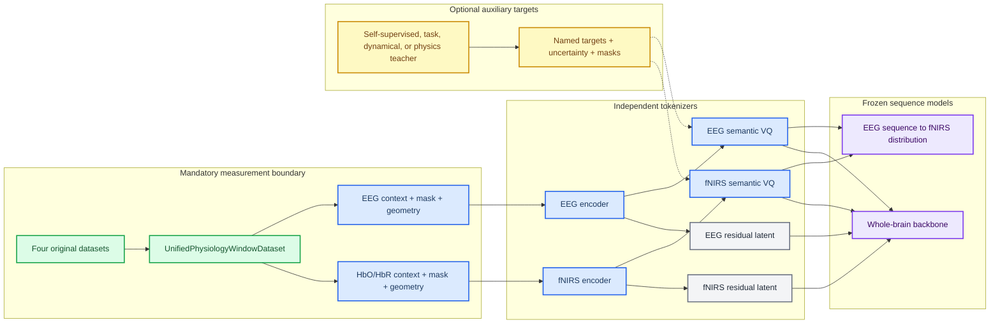

# Target architecture: physiology-semantic multimodal tokenizer

_Revised architecture contract; measurement-first input boundary approved 2026-07-14_

---

## 📋 Architecture status

This document specifies the target architecture that replaces reconstruction-centered source-token coupling. It is a forward contract for code changes and experiments, not a description of the current runtime. The 2026-07-14 revision removes the earlier assumption that a Croce-2017 five-state decomposition or one shared neural driver defines the model input or the meaning of every token.

The maintained current-runtime SVG and its implementation-status legend are available in [`08_ARCHITECTURE_VISUALIZATION.md`](08_ARCHITECTURE_VISUALIZATION.md). The SVG is generated from a versioned JSON specification and must accompany future modification plans through a plan-specific change overlay.

The current revision is annotated against that runtime diagram in the
[`measurement-first input-contract plan SVG`](figures/plans/measurement_first_input_contract_plan.svg).

The target has four separable layers:

1. a mandatory, provenance-preserving **unified measurement loader**;
2. independent EEG and fNIRS **semantic tokenizers**;
3. modality-private **residual representations** for information preservation;
4. optional, replaceable **auxiliary teachers** plus a frozen-token sequence/downstream layer.

## 🎯 Non-negotiable invariants

| Invariant | Required behavior | Prohibited shortcut |
| --- | --- | --- |
| Independent inference | EEG tokens use EEG only; fNIRS tokens use fNIRS only | Feeding EEG features into the fNIRS tokenizer in the mainline |
| Measurement-first input | Tokenizers receive measured EEG or fNIRS plus masks/metadata | Requiring a Croce state, source/observation split, or shared driver as model input |
| Evidence-defined semantics | Codeword meaning is established by held-out probes and interventions | Declaring a teacher coordinate to be token truth before validation |
| Structured output | Return ID, posterior, prototype embedding, and residual | Exporting only hard IDs |
| Delayed correspondence | Model EEG sequence to future fNIRS distribution | Forcing equal indices or diagonal alignment |
| Incremental coupling | Compare against fNIRS history and lag marginals | Interpreting raw conditional probability as EEG evidence |
| Optional teacher boundary | Every auxiliary target is named, replaceable, masked, and stop-gradient | Making one teacher family a prerequisite for all experiments |
| Provenance-preserving normalization | Preserve native measurement family and reversible transform metadata | Claiming that numerical standardization makes physical units identical |
| Paired chromophore mainline | Use canonical HbO/HbR components where available | Calling highWL-only input a complete hemodynamic representation |

## 🏗️ Component architecture

```mermaid
flowchart LR
    accTitle: Physiology semantic tokenizer architecture
    accDescr: The target architecture uses one unified measurement loader, independent modality semantic tokenizers, optional replaceable teachers, private residual paths, and frozen sequence models.

    subgraph data_layer ["Mandatory measurement boundary"]
        raw_records["Four original datasets"] --> unified_loader["UnifiedPhysiologyWindowDataset"]
        unified_loader --> eeg_signal["EEG context + mask + geometry"]
        unified_loader --> fnirs_signal["HbO/HbR context + mask + geometry"]
    end

    subgraph tokenizer_layer ["Independent tokenizers"]
        eeg_signal --> eeg_encoder["EEG encoder"] --> eeg_semantic["EEG semantic VQ"]
        fnirs_signal --> fnirs_encoder["fNIRS encoder"] --> fnirs_semantic["fNIRS semantic VQ"]
        eeg_encoder --> eeg_residual["EEG residual latent"]
        fnirs_encoder --> fnirs_residual["fNIRS residual latent"]
    end

    subgraph auxiliary_layer ["Optional auxiliary targets"]
        teacher_bank["Self-supervised, task, dynamical, or physics teacher"] --> auxiliary_targets["Named targets + uncertainty + masks"]
    end
    auxiliary_targets -.-> eeg_semantic
    auxiliary_targets -.-> fnirs_semantic

    subgraph sequence_layer ["Frozen sequence models"]
        eeg_semantic --> coupling_head["EEG sequence to fNIRS distribution"]
        fnirs_semantic --> coupling_head
        eeg_semantic --> wholebrain_model["Whole-brain backbone"]
        fnirs_semantic --> wholebrain_model
        eeg_residual --> wholebrain_model
        fnirs_residual --> wholebrain_model
    end

    classDef data fill:#dcfce7,stroke:#16a34a,stroke-width:2px,color:#14532d
    classDef teacher fill:#fef9c3,stroke:#ca8a04,stroke-width:2px,color:#713f12
    classDef tokenizer fill:#dbeafe,stroke:#2563eb,stroke-width:2px,color:#1e3a5f
    classDef residual fill:#f3f4f6,stroke:#6b7280,stroke-width:2px,color:#1f2937
    classDef sequence fill:#ede9fe,stroke:#7c3aed,stroke-width:2px,color:#3b0764

    class raw_records,unified_loader data
    class teacher_bank,auxiliary_targets teacher
    class eeg_signal,eeg_encoder,eeg_semantic,fnirs_signal,fnirs_encoder,fnirs_semantic tokenizer
    class eeg_residual,fnirs_residual residual
    class coupling_head,wholebrain_model sequence
```

## 📥 Measurement input and auxiliary-target contracts

### Mandatory unified measurement window

Every newly planned E0–E9 experiment reads the four original datasets through `UnifiedPhysiologyWindowDataset`. `croce_local_cache` is a derived supervision artifact and is never counted as a dataset or used as the default signal entrance.

The default event-anchored observation context is **20 seconds**. This is long enough to include a meaningful part of the slow hemodynamic response and matches the existing pilot configuration family; it does not fully resolve the 0.01 Hz filter edge, so spectral-quality estimation must use record-level segments of at least 100 seconds. The model may subdivide a 20-second context into ten two-second patches, but patch duration is an encoder choice rather than a loader constraint.

| Field | Shape or type | Contract |
| --- | ---: | --- |
| `eeg` | `[B,C_E,4000]` | 200 Hz, canonical numerical coordinate; channel count remains dataset/record specific |
| `fnirs` | `[B,C_F,200]` | 10 Hz, interleaved canonical HbO/HbR components |
| `valid_mask.eeg` | `[B,4000]` | False for boundary padding or rejected support |
| `valid_mask.fnirs` | `[B,200]` | False for boundary padding or rejected support |
| `alignment` | metadata | Separate EEG/fNIRS clocks, anchor times, offset and alignment case |
| `label` | mapping | `canonical_task_label_v1`; task, condition, class and event role remain separate |
| `channel_geometry` | row lists | `canonical_channel_geometry_v1` with missing coordinates retained explicitly |
| preprocessing/provenance | metadata | Native unit/family, source path, transform and canonical preprocessing state |

Numerical `robust_standard_deviation` units make amplitudes comparable for model optimization and quality checks; they do not assert that EEG voltage and chromophore concentration are the same physical quantity. Dataset, task, measurement family, channel identity and geometry are never discarded.

### Optional auxiliary-target interface

An experiment may attach a self-supervised target, task target, data-driven dynamical teacher, physics-regularized hybrid, or Croce-2017 diagnostic. Every such target uses the same generic sidecar:

| Field | Meaning |
| --- | --- |
| `target_family` / `target_version` | Exact generating method and immutable version |
| `target_value` | Family-specific tensor; no globally fixed five-state dimension |
| `target_uncertainty` | Optional calibrated uncertainty, never assumed valid by presence alone |
| `target_valid_mask` | Receptive-field, solver and support validity |
| `target_provenance` | Generator commit, parameters, source records and transform history |
| `identifiability_scope` | Which modality, history and population can identify the target |

No auxiliary target may change `eeg`, `fnirs`, event alignment, or tokenizer inference signatures. Croce `(s, delta_f, delta_hbo, delta_hb, r)`, clean means and source/observation decompositions remain admissible only as named ablation/diagnostic fields. A shared neural driver is a hypothesis to test against modality-private and delayed alternatives, not an input-contract invariant.

### Joint privileged-teacher scope

An optional teacher may condition jointly on paired EEG and fNIRS during
offline target generation. This does not violate independent inference: the
EEG and fNIRS students still receive only their own measured modality, and the
teacher is detached and absent from tokenizer inference. E0 admission of such a
teacher asks whether it yields a stable, non-degenerate, learnable
physiology-shaped multimodal consensus proxy. It does **not** require the full
joint posterior to be independently recoverable from EEG alone or fNIRS alone.

Independent single-modality recovery has a different role. It is required when
claiming that a latent is independently identifiable from that modality, and
independently generated student tokens are required for the later frozen
EEG-history-to-fNIRS-distribution coupling evaluation. A joint teacher may
organize both tokenizers as privileged information, but its own fused posterior
is never used as evidence that coupling was independently discovered.

## 🧠 Semantic tokenizer contract

### Recommended first formal dimensions

| Component | Shape |
| --- | ---: |
| EEG encoder output | `[B, 10, 256]` |
| fNIRS encoder output | `[B, 10, 160]` |
| EEG semantic latent | `[B, 10, 64]` |
| fNIRS semantic latent | `[B, 10, 64]` |
| EEG semantic codebook | `[128, 64]` |
| fNIRS semantic codebook | `[128, 64]` |
| EEG/fNIRS posterior | `[B, 10, 128]` each |
| EEG/fNIRS hard ID | `[B, 10]` each |
| EEG/fNIRS expected embedding | `[B, 10, 64]` each |

`D=64` remains a starting point rather than a consequence of a five-dimensional physical state. `D in {48, 64, 128}` remains a preregistered capacity ablation, and the residual path carries information that the discrete vocabulary does not preserve.

### Token semantics

The two vocabularies need not represent the same latent variables:

| Vocabulary | Required evidence | Prohibited interpretation |
| --- | --- | --- |
| EEG semantic token | Reproducible EEG-local structure plus held-out task/physiology probe results | Automatically equating a token with Croce `r` or `s` |
| fNIRS semantic token | Reproducible HbO/HbR-local and delayed temporal structure plus held-out probes | Automatically equating a token with Croce flow or hemoglobin states |

Each codeword may have multiple decoded signatures:

\[
\mu_{k,j}^m = G_{m,j}(e_k^m),
\]

where `j` names a registered probe or auxiliary target family. Signature claims are family-specific and require held-out validation. Equal token indices across modalities have no privileged meaning, and failure of a Croce probe does not invalidate a teacher-free tokenizer that passes its own information and downstream gates.

### Temporal context boundary

Semantic token identity is patch-local: quantization of a two-second patch cannot depend on another patch or its absolute position inside a crop. Sequence context is modeled after quantization by a separate causal module. The 20-second loader context yields ten two-second tokens. History length is an experiment parameter; the existing five-token/ten-second history remains a baseline, while fNIRS experiments must compare longer histories within record support. Targets without complete declared history are masked, and context representations never replace exported tokenizer IDs.

### Quantizer correctness requirements

The target quantizer must:

- maintain EMA for both cluster counts and codeword sums;
- leave a codeword unchanged when it receives no current-batch assignments;
- revive dead codes through an explicitly logged policy;
- expose hard IDs, logits, normalized posterior, quantized embeddings, and codebook weights;
- assert runtime codebook size and dimension against the resolved config;
- report assignment entropy, active codes, effective rank, nearest-neighbor cosine, and prototype drift.

Cosine-only assignment is an ablation. The mainline must preserve amplitude or log-power through either the semantic input, a side feature, or the residual branch.

## 💾 Private and residual representation

The private/residual branch preserves information that the discrete semantic branch cannot explain. It must not be called noise by default.

The first formal experiment keeps residual latents continuous:

| Branch | Suggested shape |
| --- | ---: |
| EEG residual latent | `[B, 10, 64]` |
| fNIRS residual latent | `[B, 10, 32]` |

RVQ or FSQ is introduced only after the semantic branch passes its registered semantic and information-retention gates. This isolates whether failures come from semantic organization or a second quantizer.

The decoder contract is:

\[
\hat X^m = D_m(E[K^m],R^m)
\]

with auxiliary semantic-only and residual-only reconstructions for attribution.

## ⚙️ Training objectives

### Tokenizer stage

The tokenizer objective is a registered combination of information-preserving and optional auxiliary terms:

\[
\mathcal L_{tok}=
\lambda_{recon}\mathcal L_{recon}
+\lambda_{vq}\mathcal L_{vq}
+\lambda_{private}\mathcal L_{private}
+\sum_j \lambda_j\mathcal L_{aux,j}.
\]

When auxiliary target `j` exposes calibrated uncertainty, its loss may be uncertainty weighted:

\[
\mathcal L_{aux,j}^m =
(\hat u_{t,j}^m-\mu_{t,j}^m)^\top
(\Sigma_{t,j}^m+\epsilon I)^{-1}
(\hat u_{t,j}^m-\mu_{t,j}^m).
\]

An auxiliary prototype or masked-target loss is enabled only after its target family passes modality- and receptive-field-specific validation. Reconstruction/self-supervision and residual attribution provide the teacher-free mainline. No loss is enabled merely because a field exists in a Croce cache.

### Coupling stage

The coupling model is trained after both tokenizers are frozen:

\[
p(K_t^F\mid K_{t-L:t}^E,H_t^F,\tau)
\]

For a 2-second grid, the initial lag support is `0..8` tokens, covering `0..16` seconds. The output contract is:

| Field | Shape |
| --- | ---: |
| EEG context state | `[B, 10, H]` |
| Lag-conditioned fNIRS logits | `[B, 10, 9, 128]` |
| Valid-pair mask | `[B, 10, 9]` |
| fNIRS history baseline logits | `[B, 10, 9, 128]` |
| Incremental log-likelihood | `[B, 10, 9]` |

Primary coupling evidence is the held-out gain over a fNIRS-history, lag-, dataset-, and subject-controlled baseline. The coupling head does not update tokenizers in the primary experiment.

## 📦 Export and downstream contract

Each semantic token export must contain:

| Field | Local shape | Whole-brain shape |
| --- | ---: | ---: |
| Hard ID | `[N, 10]` | `[N, A, 2, 10]` |
| Posterior or top-k posterior | `[N, 10, 128]` | `[N, A, 2, 10, 128]` or sparse equivalent |
| Expected codebook embedding | `[N, 10, 64]` | `[N, A, 2, 10, 64]` |
| Residual latent | branch-specific | `[N, A, 2, 10, D_r]` |
| Auxiliary signatures | optional family-specific | optional family-specific |
| Masks and metadata | sample-specific | anchor, time, history, subject, source |

The whole-brain backbone must support four representation modes:

1. hard ID only;
2. transferred codebook embedding;
3. soft expected embedding;
4. semantic embedding plus residual.

The comparison between these modes is a required information-retention result, not an optional diagnostic.

## 📊 Visualization contract

Publication visualizations must obey the following rules:

- do not use expected token index as a physiological scalar;
- order tokens using a named train-only signature family and lock the order for validation/test;
- align seeds with Hungarian matching on that registered signature family, not raw IDs;
- display conditional excess probability or incremental log likelihood rather than raw conditionals alone;
- include uncertainty intervals and marginal/history baselines;
- aggregate 128 tokens into a small number of physiological meta-states for the main figure while retaining full matrices in supplementary artifacts;
- use fixed color scales for task-difference plots.

## 🔐 Claim boundary

The architecture can support the claim that tokens preserve reproducible measurement structure and that EEG token sequences predict future fNIRS token distributions only after the corresponding gates pass. A particular physical-state interpretation requires a separately validated target/probe family. The architecture cannot by itself support claims of a single shared neural driver, causal neurovascular coupling, universal task invariance, or one-to-one token correspondence.

Differences between task-specific coupling patterns are a secondary, non-blocking research objective. Their absence does not invalidate controlled incremental coupling, and their presence supports only a qualified secondary finding; it does not change any gate decision in the current approved program.

## 🔗 Related documents

- [`Legacy design postmortem`](01_LEGACY_DESIGN_POSTMORTEM.md)
- [`Theoretical foundations`](03_THEORETICAL_FOUNDATIONS.md)
- [`Implementation and validation plan`](04_IMPLEMENTATION_VALIDATION_PLAN.md)
- [`Experiment design`](05_EXPERIMENT_DESIGN.md)
- [`Active experiment log`](06_EXPERIMENT_LOG.md)
- [`Current runtime architecture`](../ARCHITECTURE.md)

_Last updated: 2026-07-16_
