# Implementation and validation plan

_Approved execution plan; no target-architecture code had been merged as of 2026-07-01_

---

## 📋 Scope and completion rule

This plan converts the target architecture into independently testable modules. A module is complete only when its code-correctness checks and its scientific-validity gate both pass. A lower training loss, a successful smoke run, or a visually structured heatmap is not sufficient by itself.

The existing `source_observation` and X3 cross-modal-exchange paths remain runnable baselines. The redesign is introduced behind new configuration names and output schemas; archival runs are never rewritten in place.

## 🧭 Dependency order

```mermaid
flowchart LR
    accTitle: Implementation dependency and gate order
    accDescr: The redesign proceeds from frozen baselines through data and quantizer contracts, semantic tokenization, exports, frozen coupling analysis, and publication figures.

    archive["P0: Freeze evidence and baselines"] --> contracts["P1: Data and tensor contracts"]
    contracts --> quantizer["P2: Correct quantizer"]
    contracts --> teacher["P3: Physical teacher interface"]
    quantizer --> tokenizer["P4: Semantic and residual tokenizer"]
    teacher --> tokenizer
    tokenizer --> export["P5: Export and whole-brain consumers"]
    export --> coupling["P6: Frozen sequence coupling"]
    coupling --> figures["P7: Stable publication figures"]

    classDef archived fill:#f3f4f6,stroke:#6b7280,stroke-width:2px,color:#1f2937
    classDef foundation fill:#dbeafe,stroke:#2563eb,stroke-width:2px,color:#1e3a5f
    classDef evaluation fill:#dcfce7,stroke:#16a34a,stroke-width:2px,color:#14532d

    class archive archived
    class contracts,quantizer,teacher,tokenizer foundation
    class export,coupling,figures evaluation
```



## 🧱 Planned code changes

Paths marked **new** are proposed module boundaries; the exact filename can change during implementation if repository dependencies make another boundary cleaner. Any such change must be reflected here and in the architecture changelog.

| Area | Planned path | Change | Compatibility requirement |
| --- | --- | --- | --- |
| Quantization | `src/tokenizers/labram_vqnsp.py` | Replace batch-overwrite behavior with count-and-sum EMA; expose full quantizer diagnostics | Legacy behavior remains selectable only for frozen baseline reproduction |
| Tokenizer | `src/tokenizers/physiology_semantic_tokenizer.py` **new** | Independent semantic VQ and continuous residual branches | No cross-modal feature is accepted by either tokenizer inference API |
| Registry | `src/tokenizers/registry.py` | Register a new target architecture name | Existing names and checkpoint loading remain unchanged |
| Cache loader | `src/data/croce_local_cache_dataset.py` | Return paired optical channels, state posterior, uncertainty, masks, and one normalization contract | Preserve highWL-only compatibility mode |
| Cache generator | `croce_validation/scripts/generate_target_cache.py` | Persist state mean, variance/covariance, solver metadata, and validity support | Existing cache schema is read-only and versioned |
| Teacher adapter | `src/teachers/physical_state_teacher.py` **new** | Convert cached solver outputs into causal patch targets | Teacher tensors are stop-gradient and mask-aware |
| Losses | `src/losses/physiology_semantic.py` **new** | State, prototype, masked-state, private-attribution, and uncertainty-weighted losses | Every term can be disabled for ablation |
| Training entry | `experiments/train_physiology_semantic_tokenizer.py` **new** | Resolve config, train independent branches, emit validation artifacts | Dry-run and CPU/small-batch smoke modes are mandatory |
| Export | `experiments/scripts/export_physiology_semantic_tokens.py` **new** | Export IDs, posterior, transferred embedding, residual, state target, and masks | Schema version and checkpoint hash are embedded |
| Whole brain | existing whole-brain pretrain/probe modules | Add hard-ID, codebook, soft, and semantic-plus-residual input modes | Existing token-index mode remains a baseline |
| Coupling | `experiments/analyze_frozen_sequence_coupling.py` **new** | Fit EEG-history to fNIRS-distribution models after tokenizer freeze | Must emit history/marginal-controlled baseline comparison |
| Figures | `experiments/scripts/visualize_semantic_coupling.py` **new** | Signature ordering, meta-state aggregation, uncertainty, and null panels | No expected-index physiology panel in the main figure |

## 🧪 Phase plan and gates

### P0 — Archive and reproduce the legacy baseline

**Implementation:** retain exact X3 config, checkpoint, run-level summaries, plots, and the current whole-brain short-formal probe as immutable references.

**Correctness checks:** verify referenced files exist, record hashes and resolved config, and distinguish suite-level summaries from run-level results.

**Validity gate:** reproduce at least the decisive held-out information, task-local coupling, and downstream probe metrics within their saved evaluation procedure. If exact reproduction is impossible, mark the comparison historical rather than silently changing the baseline.

### P1 — Establish data, normalization, and tensor contracts

**Implementation:** add a versioned loader output containing paired optical data, teacher posterior statistics, causal-valid masks, and sample metadata. Apply a single raw-space normalization before any source/residual decomposition.

**Correctness checks:**

- assert all shapes, dtypes, units, sampling rates, and masks;
- verify `raw_normalized ≈ source_normalized + residual_normalized` only when the decomposition is defined as additive;
- verify that crop boundaries invalidate teacher targets requiring unseen history;
- verify no train-derived normalization statistic is fitted on validation or test subjects;
- compare cached arrays against solver output on deterministic samples.

**Validity gate:** paired optical inputs and teacher targets must cover the preregistered train/validation/test samples without subject leakage, silent NaNs, or unexplained support loss.

### P2 — Correct and instrument the vector quantizer

**Implementation:** maintain EMA cluster counts `N_k` and EMA vector sums `M_k`, then update `e_k=M_k/(N_k+epsilon)`. Log revival events and resolved dimensions.

**Correctness checks:**

- a codeword with zero assignments in a batch does not move;
- repeated identical assignments converge toward their known centroid;
- saved and reloaded quantizer state produces identical IDs and posteriors;
- distributed count/sum reduction matches the single-process reference;
- hard ID equals the posterior argmax;
- runtime codebook shape equals the resolved modality-specific configuration.

**Validity gate:** on a fixed latent stream, active-code fraction, effective rank, nearest-neighbor cosine, assignment entropy, and prototype drift stay inside preregistered healthy ranges without repeated mass revival. These are health checks, not semantic evidence.

### P3 — Expose the physical state teacher

**Implementation:** wrap the Croce solver cache as a frozen teacher returning patch state mean, uncertainty, clean observations, neural driver, and masks. Provide identifiable coordinate subsets for EEG and fNIRS.

**Correctness checks:** deterministic patch pooling, covariance positivity or clamping, mask propagation, temporal alignment, and explicit unit tests for synthetic constant/ramp state trajectories.

**Validity gate:** held-out teacher posterior predictive checks must outperform a mean/history-only baseline for the observed modalities. State coordinates that fail observability or calibration checks are removed from semantic supervision rather than treated as ground truth.

### P4 — Train independent semantic and residual branches

**Implementation:** add state decoding from continuous latents and codebook prototypes, masked-state prediction, shared decoder reconstruction, and branch-attribution outputs. Start with continuous residuals.

**Correctness checks:**

- changing EEG input cannot change fNIRS tokenizer output when fNIRS is fixed, and vice versa;
- gradients from the EEG branch cannot enter the fNIRS encoder or codebook in the mainline;
- each loss term reaches only its declared parameters;
- the semantic-only and residual-only decoder paths have tested tensor shapes;
- teacher uncertainty and validity masks produce zero contribution where invalid;
- permutation of token IDs leaves all ID-invariant metrics unchanged.

**Validity gate:** the semantic branch must improve held-out state decoding and prototype stability over reconstruction-only VQ, while semantic-plus-residual reconstruction and downstream information do not regress beyond the preregistered tolerance. Failure of either side blocks coupling experiments.

### P5 — Export representations and update consumers

**Implementation:** version the export schema and allow downstream models to consume hard IDs, transferred codebook embeddings, soft expected embeddings, and residuals.

**Correctness checks:** export-to-checkpoint round trips, token/posterior consistency, sample-order hashes, anchor masks, no fresh random embedding when `codebook` mode is selected, and strict schema compatibility errors.

**Validity gate:** a frozen probe must establish the information ordering of the four representation modes on identical folds. The implementation is rejected if `codebook` mode is not numerically identical to indexing the saved tokenizer codebook.

### P6 — Fit frozen sequence-to-distribution coupling

**Implementation:** freeze both tokenizers, fit the fNIRS-history baseline and the EEG-plus-fNIRS-history model on identical training samples, and report lag-resolved incremental likelihood.

**Correctness checks:**

- causal masks exclude future EEG and fNIRS tokens;
- shuffled EEG leaves the baseline unchanged and removes incremental gain;
- marginal-only synthetic data produces no excess coupling;
- lag indexing is verified with injected delayed synthetic events;
- no coupling gradient reaches tokenizer parameters in the primary experiment.

**Validity gate:** held-out incremental log-likelihood must be positive with a confidence interval excluding zero in the preregistered primary dataset, survive subject-controlled and marginal-controlled tests, and show a reproducible lag profile. Global pooled significance alone does not pass.

### P7 — Produce stable analysis and publication figures

**Implementation:** derive token physical signatures on training data, lock their ordering, match codebooks across seeds, aggregate meta-states, and add uncertainty and null comparisons.

**Correctness checks:** train-only ordering, deterministic seed matching, fixed scales for compared panels, invariant results under arbitrary ID permutation, and figure-data tables saved beside each image.

**Validity gate:** a reader can distinguish raw prevalence, history prediction, and EEG-incremental coupling from the exported figure alone. Seed/task stability statistics must accompany any claimed physiological pattern.

## 🔬 Test pyramid

| Layer | Required tests | Typical runtime | Blocking condition |
| --- | --- | ---: | --- |
| Static/config | schema validation, resolved-shape assertions, forbidden exchange keys | seconds | Any ambiguous or shadowed runtime field |
| Unit | EMA, masks, pooling, loss routing, serialization, synthetic lags | seconds–minutes | Any deterministic mismatch |
| Integration | loader → teacher → tokenizer → export → consumer | minutes | Schema, gradient, or sample-order mismatch |
| Dry run | construct every planned suite without training | minutes | Missing artifact or invalid config |
| Smoke | tiny subject/sample subset, 1–2 epochs | under 1 hour target | NaN, collapse, leakage, unusable throughput |
| Short formal | fixed small folds and seeds | hours | Module validity gate fails |
| Full formal | preregistered folds, datasets, and seeds | days | Primary scientific endpoint fails |

The execution order is always `unit → integration → dry-run → smoke → short formal → full formal`. Full experiments do not compensate for a failed lower-level check.

## 📦 Required run artifact schema

Every target-architecture run writes to:

```text
experiments/runs/physiology_semantic_tokenizer/<suite>/<timestamp>_<name>/
├── config.yaml
├── resolved_config.yaml
├── manifest.json
├── environment.json
├── checkpoints/
├── metrics/
│   ├── train.jsonl
│   ├── validation.jsonl
│   └── test_summary.json
├── diagnostics/
│   ├── quantizer_health.json
│   ├── state_semantics.json
│   └── information_retention.json
├── predictions/
├── figures/
├── figure_data/
└── summary.md
```

`manifest.json` must include Git commit, dirty-worktree flag, cache/schema version, dataset and split hashes, checkpoint hashes, seed, command, start/end time, and completion status. Test metrics are written only once after model and hyperparameter selection are frozen.

## 🔄 Migration and rollback

- New configs use a new architecture name; no legacy checkpoint is auto-upgraded.
- Existing run directories are immutable. Re-analysis writes a child artifact with its own manifest.
- Cache schema changes use a new version and side-by-side storage.
- Every phase can be disabled independently. A failed coupling head does not require reverting a valid tokenizer, and a failed teacher gate returns the project to reconstruction/self-supervised baselines without fabricating physical labels.
- Cross-modal pre-VQ exchange remains an explicit historical ablation, never a silent default.

## ✅ Definition of done

The redesign is implemented only when all of the following are true:

1. current and target architecture documents match the merged code;
2. all P1–P5 correctness checks and validity gates pass;
3. frozen coupling P6 has a complete marginal/history-controlled result, whether positive or negative;
4. the experiment matrix has immutable manifests and run-level summaries;
5. figures are regenerated from saved tables, not notebook-only state;
6. downstream results compare all four representation modes on identical folds;
7. claims in the paper are limited to gates that actually passed.

## 🔗 Related documents

- [`Target architecture`](02_TARGET_ARCHITECTURE.md)
- [`Theoretical foundations`](03_THEORETICAL_FOUNDATIONS.md)
- [`Experiment design`](05_EXPERIMENT_DESIGN.md)
- [`Legacy design postmortem`](01_LEGACY_DESIGN_POSTMORTEM.md)

_Last updated: 2026-07-01_
