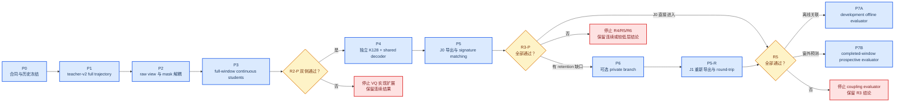

# Shared-Driver Semantic VQ 实现与验证计划

_适用于 2026-07-25 架构回归；状态：计划，尚未替代当前 E2 runtime_

---

## 📋 完成标准

实现工作的目标不是一次性把全部 R 系列写进训练器，而是按依赖顺序建立可单独验证的部件。每一阶段同时需要：

1. code correctness；
2. data/gradient/leakage contract；
3. 一个最小 smoke；
4. 对应科学 gate 的可运行入口；
5. 失败时不污染后续阶段的 rollback。


```mermaid
flowchart LR
    accTitle: Shared-Driver VQ 实现依赖
    accDescr: 实现从冻结样本与完整轨迹 sidecar 开始，先建立连续单模态学生，再接入独立 K128 量化器和共享 decoder；可选 private 分支与冻结 coupling evaluator 后置。

    p0["P0<br/>合同与历史冻结"]
    p1["P1<br/>teacher-v2 full trajectory"]
    p2["P2<br/>raw view 与 mask 解耦"]
    p3["P3<br/>full-window continuous students"]
    g2{"R2-P 双侧通过？"}
    p4["P4<br/>独立 K128 + shared decoder"]
    p5["P5<br/>J0 导出与 signature matching"]
    p6["P6<br/>可选 private branch"]
    p5r["P5-R<br/>J1 重新导出与 round-trip"]
    g3{"R3-P<br/>全部通过？"}
    g5{"R5<br/>全部通过？"}
    p7a["P7A<br/>development offline evaluator"]
    p7b["P7B<br/>completed-window prospective evaluator"]
    stop["停止 VQ 实现扩展<br/>保留连续结果"]
    stop3["停止 R4/R5/R6<br/>保留连续或较低层结论"]
    stop5["停止 coupling evaluator<br/>保留 R3 结论"]

    p0 --> p1 --> p2 --> p3 --> g2
    g2 -->|"是"| p4 --> p5 --> g3
    g3 -->|"J0 直接进入"| g5
    g3 -->|"有 retention 缺口"| p6 --> p5r --> g5
    g3 -->|"否"| stop3
    g5 -->|"离线关联"| p7a
    g5 -->|"窗外预测"| p7b
    g5 -->|"否"| stop5
    g2 -->|"否"| stop

    classDef implementation fill:#dbeafe,stroke:#2563eb,stroke-width:2px,color:#1e3a5f
    classDef gate fill:#fef3c7,stroke:#d97706,stroke-width:2px,color:#78350f
    classDef stop fill:#fee2e2,stroke:#dc2626,stroke-width:2px,color:#7f1d1d

    class p0,p1,p2,p3,p4,p5,p6,p5r,p7a,p7b implementation
    class g2,g3,g5 gate
    class stop,stop3,stop5 stop
```

## 🧊 P0：冻结与隔离

- E0–E2 的 dated configs、run manifests、结果和报告不原地重写。
- 新配置使用 `r0_...` 至 `r7_...` namespace。
- 旧 `physical_teacher_gradient_entry_plan` 保留为 superseded 历史 overlay。
- canonical architecture JSON 继续表示当前 runtime；新设计只以 overlay 表示，直到正式迁移。
- 为所有 run 增加 `architecture_generation`, `validity_policy`, `teacher_schema`, `token_temporal_scope`, `evaluator_temporal_mode` 字段。
- protected-open 检查必须在数据构造器、teacher builder、训练器和 evaluator 四个入口都执行。

两个时间字段不得混用：

- `token_temporal_scope = bidirectional_full_window | causal_past`，描述 tokenizer 自身 receptive field；
- `evaluator_temporal_mode = offline_same_window | completed_window_cutoff | semantic_only`，描述 evaluator 如何取样。

`completed_window_cutoff` 不是 token 属性；不得把 bidirectional token 在 manifest 中误标为 causal。

## 📦 P1：完整轨迹 teacher-v2

新增版本化 sidecar schema：

```text
sample_id
target_shared_driver       float32 [10, 20]
target_valid_mask          bool    [10]
target_point_valid_mask    bool    [10, 20]
target_eeg_only_driver     float32 [10, 20]
eeg_only_point_valid_mask  bool    [10, 20]
teacher_family             "adaptive_joint"
teacher_scope              "population_frozen" | "development_crossfit"
teacher_parameter_fold
teacher_gauge_hash
teacher_source_hash
raw_view_advisory          metadata only
```

旧 mean/slope adapter 只保留兼容路径。新 builder 必须：

- 保存完整 10 Hz \(r^J\)；
- 以统一 sample identity join；
- 在训练折冻结 normalization、EEG proxy loading、SSM/gauge 参数；
- 输出 target coverage 与 leakage audit；
- 支持 registered paired-joint candidate、EEG-only、phase-matched shuffle 和 smooth pseudo-target family；
- 不携带 raw channel 的选择权。

单元测试覆盖 shape、时序索引、2 秒切片、跨 session join、重复 sample、NaN、hash 变化、held-out parameter provenance 和 target-family 隔离。

两个 `teacher_scope` 具有不同权限：

- `development_crossfit`（R1-D）允许当前 E0 的 subject-specific leave-one-trial 方式：同一 development subject 的其他 trial 可拟合参数、anchor 与 EEG projection；只用于 R2/R3 探索。
- `population_frozen`（R1-P）必须只在 development-training subjects 拟合 normalization、参数、anchor 与 projection；对 held-out/protected subject 纯 apply。R2-P/R3-P 的 subject-heldout gate 和 R7 必须使用它。

builder 必须从同一个 R1-P parameter bundle 成对产生 \(r^J\) 与 \(r^E\)：后者只移除 fNIRS observation update，不得重新拟合参数、projection、anchor 或 gauge；\(\delta^F=r^J-r^E\) 使用两者 pointwise support 交集。测试要对任一 provenance 字段不一致 fail closed。

R1-P 不能继承旧 E0 admission。runner 必须实现新的 population-frozen teacher panel：held-out physical reconstruction、jointness、fold/gauge stability、target observability 和非退化 \(\delta^F\)；阈值只由 development-training/synthetic calibration 冻结，panel 通过前禁止 R2-P。

R1 的 coverage 门只在未开启 protected 时核验 development registry。protected coverage 不得预读，只能在 R7 一次性开启后报告。

## 📥 P2：raw view 与有效性

`physiology_semantic_local` 必须先根据冻结 geometry/channel rule 构造 raw EEG/HbO/HbR view，再按 `sample_id` 附加 teacher。target-present 与 target-absent 样本的 raw view 必须逐位相同。

唯一 loss mask：

\[
m^{\mathrm{loss}}_{b,t,u}
=m^{\mathrm{valid}}_{b,t}
\land m^{\mathrm{teacher}}_{b,t}
\land m^{\mathrm{target\_point}}_{b,t,u}.
\]

`target_point_valid_mask` 是 pointwise finite/support 权威；不得在未记录规则时收缩成 patch mask。必须添加训练/验证/common probe 同 pointwise mask 的断言测试。`artifact_mask` 只作为 QC annotation 导出，不改变 `valid_mask`；历史 E2 validity policy 通过 manifest 显式区分。

## 🔭 P3：full-window continuous students

在修改 VQ 前新增两个 modality-only continuous student：

```text
raw signal
→ 10 patch embeddings
→ shallow full-window temporal encoder
→ 10 × D64 latent
→ shared driver decoder
→ 10 × 20 rJ trajectory
```

关键测试：

- 改变 EEG 输入不会改变 fNIRS latent，反之亦然；
- teacher tensor、subject/task/phase metadata 不在 encoder forward signature；
- masked patch 不进入 attention key/value 或 loss；
- positional/time alignment 保持 10 个神经时间位置；
- decoder 接受任一模态的 D64 vector；
- shared decoder 不读取 modality ID；
- future context 的使用被 manifest 标记为 `token_temporal_scope=bidirectional_full_window`，并导出每个 token 的 receptive-field start/end；
- target stop-gradient 和 train-only normalization 生效。

只有使用 R1-P 的 R2-P 通过后才进入 P4；R2-D 只能用于调试。

## 🧠 P4：独立 K128 semantic VQ

复用已审计的 matched count/sum EMA、commitment、invalid-token exclusion 和有界 revival，但固定：

```text
eeg_codebook_size: 128
fnirs_codebook_size: 128
eeg_codebook_dim: 64
fnirs_codebook_dim: 64
```

模型 forward 至少返回：

```text
eeg/fnirs_continuous_latent
eeg/fnirs_quantized
eeg/fnirs_hard_ids
eeg/fnirs_posteriors
eeg/fnirs_driver_reconstruction
valid_mask
```

主损失只包含完整 driver trajectory 与 VQ 项。测试必须证明没有：

- same-ID/index matching；
- cross-modal attention；
- token-pair/co-occurrence loss；
- raw reconstruction gradient 进入 semantic codebook；
- teacher target 进入推理输入；
- 一模态 loss 更新另一模态 encoder（共享 decoder 除外）。

同时保留 gradient norm、codebook health、prototype drift 和 revival stop 日志。健康测试不把全 128 均匀占用设为 pass rule。

quantizer calibration 只能在第一次 R3-P evaluation 前使用 subjects `01–18`/synthetic 完成并冻结；runner 必须拒绝“查看 `19–23` failure → calibration → 同一 validation 再 promotion”的条件重试。

## 📤 P5：导出和 prototype matching

更新 exporter，使 hard ID、posterior、codebook vector、continuous latent、decoded-driver signature、mask 和完整 provenance 同时导出。跨 seed 匹配只允许使用 decoded trajectory/signature，不允许直接比较 ID。

添加 deterministic export、checkpoint reload、sample-order、mask、hash、rare-code support 和 Hungarian matching 测试。

## 💾 P6：可选 continuous private branch

此阶段默认关闭，且只有 R3-P 已通过后才可进入。实现形式：

```text
raw → private encoder → continuous private
continuous private + stopgrad(semantic) → modality raw decoder
```

禁止 private VQ、nuisance token 和跨模态 private exchange。测试 semantic-only checkpoint 在 private 开启后保持逐位不变，且 raw loss 不向任何 semantic encoder/codebook 参数反传。若 J1 被选择，必须以 P5-R 重新执行完整 export/checkpoint round-trip、signature matching、mask 与 provenance 测试；不得复用 J0 的 P5 产物。

## 🔗 P7A/P7B：冻结后的 development evaluator

evaluator 必须是独立训练入口，只读取冻结导出和原始 endpoint。P7A 支持双向整窗 token 的离线条件关联：

- `q0`: fNIRS history + registered controls；
- `q1`: q0 + EEG token history；
- matched capacity 和 optimization budget；
- within-subject/condition shuffle、frequency-preserving permutation、circular shift、impossible lag、reverse direction；
- subject-equal proper-score aggregation；
- raw HbO/HbR endpoint primary；
- `token_temporal_scope=bidirectional_full_window` 时强制输出 `offline_delayed_association`，禁用 future/predictive label。

P7B 是需要未来预测主张时才实现的 `completed_window_cutoff` 模式。首版只接受已通过 R2-P/R3-P/R5 的同一 `bidirectional_full_window` tokenizer，并只汇总 cutoff 前已完整结束的窗口。任何新 `causal_past` tokenizer 都必须重新通过自己的 R2-P/R3-P/R5。export 与 endpoint 必须携带 `(record_id, absolute_start, absolute_end)`；token bounds 还要包含滤波/预处理支持，并逐样本断言：

```text
same_record_id
max(token_absolute_receptive_field_end) + embargo < endpoint_absolute_start
```

row ID 不相交不能代替 absolute-time non-overlap。embargo、gap、horizon、窗口重叠规则、innovation 定义和 null 必须写入 manifest。任何 tokenizer checkpoint selection 都不得读取 evaluator endpoint。primary development split 固定为模型/q0/q1 fit subjects `01–18`、apply `19–23`；因 `19–23` 已参与架构选择，只称 post-selection development evidence。可选 nested sensitivity 必须逐 outer fold 重建 R1-P teacher、tokenizer、checkpoint 和 evaluator。真正独立的 confirmation 只来自 R7 protected。

## 🧪 测试金字塔

| 层级 | 必测内容 |
| --- | --- |
| Unit | target slicing、mask intersection、raw-view independence、VQ EMA、gradient isolation、lag indexing、absolute-time embargo |
| Property | modality independence、ID permutation invariance、export determinism、teacher-family isolation |
| Synthetic | 已知延迟 bridge、零耦合、phase-only、marginal-only、teacher leakage 和 impossible-lag |
| Integration | R1 sidecar join、R2 continuous smoke、R3 K128 optimizer step、P5/P5-R round-trip、R6A q0/q1、R6B cutoff |
| Scientific | subject-held-out gates、matched null、prototype stability、protected boundary |

synthetic suite 必须同时包含可恢复正例和严格零耦合反例；否则不能证明 evaluator 的方向和 null 正确。

## 📦 运行产物

所有 run 继承项目 manifest，并增加：

```text
architecture_generation
teacher_schema
teacher_family
teacher_parameter_scope
teacher_coverage_hash
raw_view_hash
validity_policy
mask_intersection_hash
token_temporal_scope
token_receptive_field_bounds
evaluator_temporal_mode
record_and_absolute_time_bounds
semantic_objective
private_branch_enabled
codebook_capacity
protected_open
```

科学 run 还必须写出 [实验设计](05_EXPERIMENT_DESIGN.md) 中列出的 coverage、continuous feasibility、quantization retention、prototype stability 和 coupling/null 产物。

R7 handoff 必须由一个 fail-closed packager 固定执行：

```text
R1-P-final(01–23) → final tokenizer → final export
→ final common probe/phase baseline
→ optional final q0/q1
→ hash freeze → protected apply-only
```

packager 要拒绝旧 R6 evaluator 与新 codebook/teacher 坐标混用，并测试 protected 上不能 fit normalization、teacher、probe、q0/q1、subject intercept、early stopping 或 calibration。开启后先用冻结阈值运行 apply-only R1-P teacher panel。

## 🔄 回滚边界

- P1 失败：保留旧 sidecar 仅供 E2 重放，不训练新架构。
- R1-P teacher panel 失败：R1-D 仅保留为探索产物，不运行 R2-P。
- P2 失败：停止所有 R 系列；不以 loader workaround 绕过。
- R2 失败：保留 continuous 负结果，不实现额外 VQ trick。
- R3 失败：可保留 continuous representation，不更换 K 来改写假设。
- P6 无增益：删除 private branch。
- R6A 失败：保留合格 semantic tokenizer，但拒绝离线 coupling 声明。
- R6B 失败：若 R6A 已独立运行并通过，可保留其离线关联结果；未来预测声明仍被拒绝。

## ✅ 架构迁移完成条件

只有满足以下条件，canonical runtime 图和 [当前架构](../ARCHITECTURE.md) 才切换到 SD-SVQ：

1. P1–P5 code/tests 通过；
2. R1-P population-frozen teacher panel 通过，且注册 development rows 上 100% target coverage；
3. R2-P 双侧 continuous observability 通过；
4. 使用 R1-P target 的 R3-P development gate 通过；
5. current and plan SVG drift tests 通过；
6. launcher/config/export 文档同步；
7. protected subjects 仍关闭。

R6/R7 是科学声明门禁，不是把软件标为 implemented 的前提。
