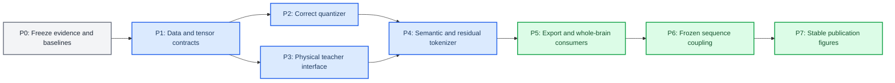

# Implementation and validation plan

_Approved execution plan; P1-P5 software interfaces are merged, while all scientific validity gates remain pending_

---

## 📋 Scope and completion rule

This plan converts the target architecture into independently testable modules. A module is complete only when its code-correctness checks and its scientific-validity gate both pass. A lower training loss, a successful smoke run, or a visually structured heatmap is not sufficient by itself.

Scientific gates use adaptive, versioned evidence calibration rather than permanent numerical cutoffs. Deterministic software invariants remain fixed, while data-dependent health ranges and effect criteria are learned from synthetic references, training-only pilots, matched baselines, and null distributions. The calibration procedure and protected-data boundary are fixed before the corresponding formal test evaluation; newly discovered metrics remain diagnostic or secondary until a new evaluation version.

The existing `source_observation` and X3 cross-modal-exchange paths remain runnable baselines. The redesign is introduced behind new configuration names and output schemas; archival runs are never rewritten in place.

## 🧭 Dependency order


```mermaid
flowchart LR
    accTitle: Implementation dependency and gate order
    accDescr: The redesign proceeds from frozen baselines through data and quantizer contracts, semantic tokenization, exports, frozen coupling analysis, and publication figures.

    archive["P0: Freeze evidence and baselines"] --> contracts["P1: Data and tensor contracts"]
    contracts --> quantizer["P2: Correct quantizer"]
    contracts --> teacher["P3: Physical teacher interface"]
    quantizer --> tokenizer["P4: Semantic and residual tokenizer"]
    teacher --> tokenizer
    tokenizer --> export["P5: Export and whole-brain consumers"]
    export --> coupling["P6: Frozen sequence coupling"]
    coupling --> figures["P7: Stable publication figures"]

    classDef archived fill:#f3f4f6,stroke:#6b7280,stroke-width:2px,color:#1f2937
    classDef foundation fill:#dbeafe,stroke:#2563eb,stroke-width:2px,color:#1e3a5f
    classDef evaluation fill:#dcfce7,stroke:#16a34a,stroke-width:2px,color:#14532d

    class archive archived
    class contracts,quantizer,teacher,tokenizer foundation
    class export,coupling,figures evaluation
```

## 🧱 Planned code changes

Paths marked **new** are proposed module boundaries; the exact filename can change during implementation if repository dependencies make another boundary cleaner. Any such change must be reflected here and in the architecture changelog.

| Area | Planned path | Change | Compatibility requirement |
| --- | --- | --- | --- |
| Quantization | `src/tokenizers/ema_vector_quantizer.py` **new** | Add count-and-sum EMA and full quantizer diagnostics without changing the legacy quantizer | Archived compatibility code continues to use its unchanged quantizer |
| Tokenizer | `src/tokenizers/physiology_semantic_tokenizer.py` **new** | Independent semantic VQ and continuous residual branches | No cross-modal feature is accepted by either tokenizer inference API |
| Registry | `src/tokenizers/registry.py` | Register a new target architecture name | Existing names and checkpoint loading remain unchanged |
| Cache loader | `src/data/croce_local_cache_dataset.py` | Return paired optical channels, state posterior, uncertainty, masks, and one normalization contract | Preserve highWL-only compatibility mode |
| Cache generator | `croce_validation/scripts/generate_target_cache.py` | Persist state mean, variance/covariance, solver metadata, and validity support | Existing cache schema is read-only and versioned |
| Teacher adapter | `src/teachers/physical_state_teacher.py` **new** | Convert cached solver outputs into causal patch targets | Teacher tensors are stop-gradient and mask-aware |
| Losses | `src/losses/physiology_semantic.py` **new** | State, prototype, masked-state, private-attribution, and uncertainty-weighted losses | Every term can be disabled for ablation |
| Training entry | `experiments/train_physiology_semantic_tokenizer.py` **new** | Resolve config, train independent branches, emit validation artifacts | Dry-run and CPU/small-batch smoke modes are mandatory |
| Export | `experiments/scripts/export_physiology_semantic_tokens.py` **new** | Export IDs, posterior, transferred embedding, residual, state target, and masks | Schema version and checkpoint hash are embedded |
| Whole brain | existing whole-brain pretrain/probe modules | Add hard-ID, codebook, soft, and semantic-plus-residual input modes | Existing token-index mode remains a baseline |
| Coupling | `experiments/analyze_frozen_sequence_coupling.py` **new** | Fit EEG-history to fNIRS-distribution models after tokenizer freeze | Must emit history/marginal-controlled baseline comparison |
| Figures | `experiments/scripts/visualize_semantic_coupling.py` **new** | Signature ordering, meta-state aggregation, uncertainty, and null panels | No expected-index physiology panel in the main figure |

## 🧪 Phase plan and gates

### P0 — Archive and reproduce the legacy baseline

**Implementation:** retain exact X3 config, checkpoint, run-level summaries, plots, and the current whole-brain short-formal probe as immutable references.

**Correctness checks:** verify referenced files exist, record hashes and resolved config, and distinguish suite-level summaries from run-level results.

**Validity gate:** reproduce at least the decisive held-out information, task-local coupling, and downstream probe metrics within their saved evaluation procedure. If exact reproduction is impossible, mark the comparison historical rather than silently changing the baseline.

### P1 — Establish data, normalization, and tensor contracts

**Implementation status (2026-07-02):** in progress. The versioned paired-optical cache schema, posterior variance fields, strict loader, split/provenance checks, causal crop mask, and raw-space additive normalization passed one-anchor/one-event real-data dry-run and smoke validation on mutually exclusive subjects 1/21/25. This is correctness evidence only; the P1 validity gate and E0 scientific endpoint remain pending.

**Implementation:** add a versioned loader output containing paired optical data, teacher posterior statistics, causal-valid masks, and sample metadata. Apply a single raw-space normalization before any source/residual decomposition.

**Correctness checks:**

- assert all shapes, dtypes, units, sampling rates, and masks;
- verify `raw_normalized ≈ source_normalized + residual_normalized` only when the decomposition is defined as additive;
- verify that crop boundaries invalidate teacher targets requiring unseen history;
- verify no train-derived normalization statistic is fitted on validation or test subjects;
- compare cached arrays against solver output on deterministic samples.

**Validity gate:** paired optical inputs and teacher targets must cover the preregistered train/validation/test samples without subject leakage, silent NaNs, or unexplained support loss.

### P2 — Correct and instrument the vector quantizer

**Implementation status (2026-07-02):** merged. Count-and-sum EMA, Euclidean and cosine assignment modes, distributed reductions, explicit revival accounting, serialization, posterior outputs, and health diagnostics pass deterministic tests. E1 health calibration and the P2 validity gate have not run.

**Implementation:** maintain EMA cluster counts `N_k` and EMA vector sums `M_k`, then update `e_k=M_k/(N_k+epsilon)`. Log revival events and resolved dimensions.

**Correctness checks:**

- a codeword with zero assignments in a batch does not move;
- repeated identical assignments converge toward their known centroid;
- saved and reloaded quantizer state produces identical IDs and posteriors;
- distributed count/sum reduction matches the single-process reference;
- hard ID equals the posterior argmax;
- runtime codebook shape equals the resolved modality-specific configuration.

**Validity gate:** on a fixed latent stream, active-code fraction, effective rank, nearest-neighbor cosine, assignment entropy, and prototype drift remain consistent with health ranges calibrated from synthetic references and training-only pilots, without repeated mass revival. These ranges may change by modality, dataset, or phase and must retain their calibration provenance. They are health checks, not semantic evidence.

### P3 — Expose the physical state teacher

**Implementation status (2026-07-02):** merged. Constant/ramp pooling, uncertainty propagation, complete-patch mask contraction, stop-gradient behavior, and a one-sample real-cache dry run pass. E0 and G0 remain unevaluated.

**Implementation:** wrap the Croce solver cache as a frozen teacher returning patch state mean, uncertainty, clean observations, neural driver, and masks. Provide identifiable coordinate subsets for EEG and fNIRS.

**Correctness checks:** deterministic patch pooling, covariance positivity or clamping, mask propagation, temporal alignment, and explicit unit tests for synthetic constant/ramp state trajectories.

**Execution boundary:** E0 teacher validity remains blocked until these correctness checks and a one-sample real-cache dry run pass. Tokenizer optimization remains blocked until E0 declares which teacher coordinates are admissible supervision.

**Validity gate:** held-out teacher posterior predictive checks must outperform a mean/history-only baseline for the observed modalities. State coordinates that fail observability or calibration checks are removed from semantic supervision rather than treated as ground truth.

### P4 — Train independent semantic and residual branches

**Implementation status (2026-07-02):** merged for software validation. Patch locality, fixed-history causality, modality/gradient isolation, reconstruction shapes, and invalid-mask loss routing pass. The real-cache smoke intentionally performed zero optimizer steps because E0 has not passed; no tokenizer training result exists.

**Implementation:** add patch-local state decoding from continuous latents and codebook prototypes, post-quantization fixed-history masked-state prediction, shared decoder reconstruction, and branch-attribution outputs. Token identity uses only the current two-second patch; a separate context module predicts patch `t` from the five preceding tokens and never changes exported IDs. Start with continuous residuals.

**Correctness checks:**

- changing EEG input cannot change fNIRS tokenizer output when fNIRS is fixed, and vice versa;
- gradients from the EEG branch cannot enter the fNIRS encoder or codebook in the mainline;
- each loss term reaches only its declared parameters;
- the semantic-only and residual-only decoder paths have tested tensor shapes;
- teacher uncertainty and validity masks produce zero contribution where invalid;
- permutation of token IDs leaves all ID-invariant metrics unchanged.

**Validity gate:** the semantic branch must improve held-out state decoding and prototype stability over reconstruction-only VQ under the versioned evidence protocol, while semantic-plus-residual reconstruction and downstream information remain consistent with the calibrated continuous-latent reference. G2 information retention and G3 state semantics are co-equal gates; failure of either side blocks coupling experiments.

### P5 — Export representations and update consumers

**Implementation status (2026-07-02):** merged for software validation. Hard, checkpoint-codebook, soft, and semantic-plus-residual consumers pass round-trip tests; a one-sample validation export with top-k posterior and manifest completed. Frozen-probe validity remains pending.

**Implementation:** version the export schema and allow downstream models to consume hard IDs, transferred codebook embeddings, soft expected embeddings, and residuals.

**Correctness checks:** export-to-checkpoint round trips, token/posterior consistency, sample-order hashes, anchor masks, no fresh random embedding when `codebook` mode is selected, and strict schema compatibility errors.

**Validity gate:** a frozen probe must establish the information ordering of the four representation modes on identical folds. The implementation is rejected if `codebook` mode is not numerically identical to indexing the saved tokenizer codebook.

### P6 — Fit frozen sequence-to-distribution coupling

**Implementation:** freeze both tokenizers, fit the fNIRS-history baseline and the EEG-plus-fNIRS-history model on identical training samples, and report lag-resolved incremental likelihood.

**Correctness checks:**

- causal masks exclude future EEG and fNIRS tokens;
- shuffled EEG leaves the baseline unchanged and removes incremental gain;
- marginal-only synthetic data produces no excess coupling;
- lag indexing is verified with injected delayed synthetic events;
- no coupling gradient reaches tokenizer parameters in the primary experiment.

**Validity gate:** held-out incremental log-likelihood must be directionally positive and separated from calibrated shuffle/time-shift/null evidence in the declared primary evaluation scope, survive subject-, source-, history-, marginal-, and task-prevalence-controlled tests, and show a reproducible lag profile. No universal minimum gain is imposed. Distinct task-specific coupling patterns remain a non-blocking secondary analysis; global pooled significance alone does not pass.

### P7 — Produce stable analysis and publication figures

**Implementation:** derive token physical signatures on training data, lock their ordering, match codebooks across seeds, aggregate meta-states, and add uncertainty and null comparisons.

**Correctness checks:** train-only ordering, deterministic seed matching, fixed scales for compared panels, invariant results under arbitrary ID permutation, and figure-data tables saved beside each image.

**Validity gate:** a reader can distinguish raw prevalence, history prediction, and EEG-incremental coupling from the exported figure alone. Seed stability must accompany the primary physiological pattern. Task-specific stability is reported only when the secondary task-interaction analysis supports it and is not required for G6.

## 🔬 Test pyramid

| Layer | Required tests | Typical runtime | Blocking condition |
| --- | --- | ---: | --- |
| Static/config | schema validation, resolved-shape assertions, forbidden exchange keys | seconds | Any ambiguous or shadowed runtime field |
| Unit | EMA, masks, pooling, loss routing, serialization, synthetic lags | seconds–minutes | Any deterministic mismatch |
| Integration | loader → teacher → tokenizer → export → consumer | minutes | Schema, gradient, or sample-order mismatch |
| Dry run | construct every planned suite without training | minutes | Missing artifact or invalid config |
| Smoke | tiny subject/sample subset, 1–2 epochs | under 1 hour target | NaN, collapse, leakage, unusable throughput |
| Short formal | fixed small folds and seeds | hours | Module validity gate fails |
| Full formal | versioned folds, datasets, seeds, and evidence protocol | days | Primary scientific endpoint fails |

The execution order is always `unit → integration → dry-run → smoke → short formal → full formal`. Full experiments do not compensate for a failed lower-level check.

## 📦 Required run artifact schema

Every target-architecture run writes to:

```text
experiments/runs/physiology_semantic_tokenizer/<suite>/<timestamp>_<name>/
├── config.yaml
├── resolved_config.yaml
├── decision_protocol.yaml
├── metric_registry.json
├── evidence_calibration.json
├── manifest.json
├── environment.json
├── checkpoints/
├── metrics/
│   ├── train.jsonl
│   ├── validation.jsonl
│   └── test_summary.json
├── diagnostics/
│   ├── quantizer_health.json
│   ├── state_semantics.json
│   └── information_retention.json
├── predictions/
├── figures/
├── figure_data/
└── summary.md
```

`manifest.json` must include Git commit, dirty-worktree flag, cache/schema version, dataset and split hashes, checkpoint hashes, seed, command, start/end time, completion status, and hashes for the decision protocol, metric registry, and evidence calibration. Protected-test metrics are written only once after the model, hyperparameters, metric roles, and applicable calibration procedure are frozen.

## 🔄 Migration and rollback

- New configs use a new architecture name; no legacy checkpoint is auto-upgraded.
- Existing run directories are immutable. Re-analysis writes a child artifact with its own manifest.
- Cache schema changes use a new version and side-by-side storage.
- Every phase can be disabled independently. A failed coupling head does not require reverting a valid tokenizer, and a failed teacher gate returns the project to reconstruction/self-supervised baselines without fabricating physical labels.
- Cross-modal pre-VQ exchange remains an explicit historical ablation, never a silent default.

## ✅ Definition of done

The redesign is implemented only when all of the following are true:

1. current and target architecture documents match the merged code;
2. all P1–P5 correctness checks and validity gates pass;
3. frozen coupling P6 has a complete marginal/history-controlled result, whether positive or negative;
4. the experiment matrix has immutable manifests and run-level summaries;
5. figures are regenerated from saved tables, not notebook-only state;
6. downstream results compare all four representation modes on identical folds;
7. every gate decision links to its versioned decision protocol, metric registry, and calibration evidence;
8. claims in the paper are limited to gates that actually passed, while task-specific coupling remains explicitly secondary.

## 🔗 Related documents

- [`Target architecture`](02_TARGET_ARCHITECTURE.md)
- [`Theoretical foundations`](03_THEORETICAL_FOUNDATIONS.md)
- [`Experiment design`](05_EXPERIMENT_DESIGN.md)
- [`Legacy design postmortem`](01_LEGACY_DESIGN_POSTMORTEM.md)
- [`Code migration plan`](07_CODE_MIGRATION_PLAN.md)

_Last updated: 2026-07-02_
