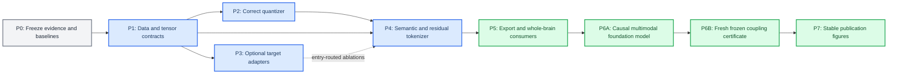

# Implementation and validation plan

_Revised execution plan; unified measurement loading is mandatory and physical teachers are optional_

---

## 📋 Scope and completion rule

This plan converts the target architecture into independently testable modules. A module is complete only when its code-correctness checks and its scientific-validity gate both pass. A lower training loss, a successful smoke run, or a visually structured heatmap is not sufficient by itself.

Scientific gates use adaptive, versioned evidence calibration rather than permanent numerical cutoffs. Deterministic software invariants remain fixed, while data-dependent health ranges and effect criteria are learned from synthetic references, training-only pilots, matched baselines, and null distributions. The calibration procedure and protected-data boundary are fixed before the corresponding formal test evaluation; newly discovered metrics remain diagnostic or secondary until a new evaluation version.

The existing `source_observation` and X3 cross-modal-exchange paths remain runnable historical baselines. The redesign is introduced behind new configuration names and output schemas; archival runs are never rewritten in place.

### Mandatory data entrance for every planned experiment

All newly planned P1–P7 and E0–E9 dry runs, smokes, formal runs, ablations and figure regenerations must construct samples through `UnifiedPhysiologyWindowDataset` using `unified_physiology_window_v1`. Direct reads from dataset-specific loaders are allowed only inside the unified adapter or in a named adapter-validation diagnostic. `croce_local_cache` may be joined as an optional, versioned teacher sidecar in a named ablation; it cannot replace the measured EEG/fNIRS input and cannot be counted as a fifth dataset.

The default observation context is 20 seconds. A suite may override it only in its resolved config with a physiological/task rationale and a boundary-mask audit. Two-second token patches and shorter event labels are model/annotation semantics, not reasons to shorten the loader default.

## 🧭 Dependency order


```mermaid
flowchart LR
    accTitle: Implementation dependency and gate order
    accDescr: The redesign proceeds from data and teacher contracts through entry-routed tokenization, export, foundation pretraining, an independent frozen certificate, and publication figures.

    archive["P0: Freeze evidence and baselines"] --> contracts["P1: Data and tensor contracts"]
    contracts --> quantizer["P2: Correct quantizer"]
    contracts --> teacher["P3: Optional target adapters"]
    quantizer --> tokenizer["P4: Semantic and residual tokenizer"]
    contracts --> tokenizer
    teacher -. "entry-routed ablations" .-> tokenizer
    tokenizer --> export["P5: Export and whole-brain consumers"]
    export --> foundation_model["P6A: Causal multimodal foundation model"]
    foundation_model --> coupling["P6B: Fresh frozen coupling certificate"]
    coupling --> figures["P7: Stable publication figures"]

    classDef archived fill:#f3f4f6,stroke:#6b7280,stroke-width:2px,color:#1f2937
    classDef foundation fill:#dbeafe,stroke:#2563eb,stroke-width:2px,color:#1e3a5f
    classDef evaluation fill:#dcfce7,stroke:#16a34a,stroke-width:2px,color:#14532d

    class archive archived
    class contracts,quantizer,teacher,tokenizer foundation
    class export,foundation_model,coupling,figures evaluation
```

## 🧱 Planned code changes

Paths marked **new** are proposed module boundaries; the exact filename can change during implementation if repository dependencies make another boundary cleaner. Any such change must be reflected here and in the architecture changelog.

| Area | Planned path | Change | Compatibility requirement |
| --- | --- | --- | --- |
| Quantization | `src/tokenizers/ema_vector_quantizer.py` **new** | Add count-and-sum EMA and full quantizer diagnostics without changing the legacy quantizer | Archived compatibility code continues to use its unchanged quantizer |
| Tokenizer | `src/tokenizers/physiology_semantic_tokenizer.py` **new** | Independent semantic VQ and continuous residual branches | No cross-modal feature is accepted by either tokenizer inference API |
| Registry | `src/tokenizers/registry.py` | Register a new target architecture name | Existing names and checkpoint loading remain unchanged |
| Unified loader | `src/data/unified_physiology.py` | Mandatory four-dataset EEG/fNIRS measurement input, 20-second default context, labels, masks, alignment and geometry | Dataset-specific readers stay behind this contract |
| Optional cache adapter | `src/data/croce_local_cache_dataset.py` | Join named Croce targets as a derived sidecar for historical/teacher ablations | Never replace measured inputs or enter the dataset count |
| Optional teacher adapter | `src/teachers/physical_state_teacher.py` | Convert any admitted teacher family into versioned local, prototype, context, and coupling targets | No globally required five-state shape; tensors are stop-gradient |
| Losses | `src/losses/physiology_semantic.py` | Route separate coordinates/masks to state, prototype, causal-context, reconstruction, VQ, and private losses | Uniform standardized weighting is default; calibrated inverse variance is a separate mode |
| Coupling preservation | `src/tokenizers/coupling_preservation.py` **new** | Low-capacity multi-horizon `q_0/q_1` shaper using future flow and HbO/HbR innovations | Gradient allowlist ends at EEG semantic tokenizer; module is discarded after training |
| Training entry | `experiments/train_physiology_semantic_tokenizer.py` **new** | Resolve config, train independent branches, emit validation artifacts | Dry-run and CPU/small-batch smoke modes are mandatory |
| Export | `experiments/scripts/export_physiology_semantic_tokens.py` **new** | Export IDs, posterior, transferred embedding, residual, state target, and masks | Schema version and checkpoint hash are embedded |
| Foundation | `src/foundation/model.py` | Add causal cross-modal temporal core and matched multi-horizon fNIRS-history `q_0` / EEG-incremental `q_1` objectives | Existing per-modality MLM and pooled InfoNCE remain named baselines |
| Whole brain | existing whole-brain pretrain/probe modules | Add hard-ID, codebook, soft, and semantic-plus-residual input modes | Existing token-index mode remains a baseline |
| Coupling certificate | `experiments/analyze_frozen_sequence_coupling.py` **new** | Fit a fresh/cross-fitted evaluator after tokenizer and foundation selection | Must emit history/marginal-controlled baseline and null comparisons |
| Figures | `experiments/scripts/visualize_semantic_coupling.py` **new** | Signature ordering, meta-state aggregation, uncertainty, and null panels | No expected-index physiology panel in the main figure |

## 🧪 Phase plan and gates

### P0 — Archive and reproduce the legacy baseline

**Implementation:** retain exact X3 config, checkpoint, run-level summaries, plots, and the current whole-brain short-formal probe as immutable references.

**Correctness checks:** verify referenced files exist, record hashes and resolved config, and distinguish suite-level summaries from run-level results.

**Validity gate:** reproduce at least the decisive held-out information, task-local coupling, and downstream probe metrics within their saved evaluation procedure. If exact reproduction is impossible, mark the comparison historical rather than silently changing the baseline.

### P1 — Establish data, normalization, and tensor contracts

**Implementation status (2026-07-10):** the pilot teacher-cache contract remains
implemented, and the raw-data side has now passed a separate four-dataset software
contract check. `UnifiedPhysiologyWindowDataset` loads Single-Trial, REFED, Visual,
and Simultaneous through one schema; it excludes Croce caches from the dataset count,
uses EEG/fNIRS event clocks separately, emits EEG at 200 Hz and fNIRS at 10 Hz,
normalizes both to a provenance-preserving dimensionless robust-SD coordinate,
standardizes fNIRS components to HbO/HbR, and returns canonical labels and geometry
rows. This is format/loading correctness, not evidence that the four tasks are
scientifically exchangeable or that physical-teacher supervision is valid. The E0
pilot cache still contains 29 mutually exclusive subject-held-out records, with 18
train, 5 validation, and 6 protected-test subjects. The protected test remains
unopened because validation did not pass.

**Implementation:** use the versioned unified loader output containing measured EEG, paired HbO/HbR, separate clocks, validity masks, canonical labels/geometry and preprocessing provenance. Auxiliary teacher fields are separate joins, never required signal fields.

**Correctness checks:**

- assert all shapes, dtypes, units, sampling rates, and masks;
- verify crop boundaries and rejected samples are reflected by modality-specific validity masks;
- verify optional targets requiring unseen history are invalidated without changing measurement tensors;
- verify no train-derived normalization statistic is fitted on validation or test subjects;
- compare cached arrays against solver output on deterministic samples.

**Validity gate:** paired optical inputs and teacher targets must cover the preregistered train/validation/test samples without subject leakage, silent NaNs, or unexplained support loss.

### P2 — Correct and instrument the vector quantizer

**Implementation status (updated 2026-07-20):** merged; G1/E1 passes at fixed K=128 for the registered diverse-farthest/T2-T2 candidate. Count-and-sum EMA, Euclidean/cosine assignment, first-batch K-means, latent L2 normalization, distributed reductions, checkpointed quantization warmup, annealed-hard reconstruction, explicit revival accounting and stop rules, serialization, posterior outputs, validity-mask exclusion, and health diagnostics pass deterministic tests. Additive balance smoothing preserves gradients to unused codes, and all EMA count/sum statistics age so dead-code health is no longer falsely reported as fully active. The first three-seed top-error retention gate failed because one fNIRS trajectory reached `21.18` effective codes against the frozen floor of `24`, despite later recovery. Changing only the replacement geometry to diverse-farthest raised that paired minimum to `24.80`; two confirmation seeds reached minima `29.64/29.63`. All three runs retained constant revival counts for eight validation epochs after step 200. Final effective usage is EEG `65.85 ± 1.66` and fNIRS `39.99 ± 1.38`, with mean final active codes `86.33/110.00`. The machine gate, registered factors, implementation hashes, and protected-test closure all pass. This is quantizer-health evidence, not G2 information-retention or G3 semantic evidence.

**Implementation:** maintain EMA cluster counts `N_k` and EMA vector sums `M_k`, then update `e_k=M_k/(N_k+epsilon)`. Log revival events and resolved dimensions.

**Correctness checks:**

- a codeword with zero assignments in a batch does not move;
- repeated identical assignments converge toward their known centroid;
- saved and reloaded quantizer state produces identical IDs and posteriors;
- distributed count/sum reduction matches the single-process reference;
- hard ID equals the posterior argmax;
- runtime codebook shape equals the resolved modality-specific configuration.

**Validity gate:** on a fixed latent stream, active-code fraction, effective rank, nearest-neighbor cosine, assignment entropy, and prototype drift remain consistent with health ranges calibrated from synthetic references and training-only pilots, without ongoing periodic mass revival after any bounded and registered startup calibration. These ranges may change by modality, dataset, or phase and must retain their calibration provenance. They are health checks, not semantic evidence.

### P3 — Evaluate optional target/teacher adapters

**Implementation status (updated 2026-07-19):** the generic adapter and entry-specific target masks are merged. The historical Croce E0-v2 target remains blocked. The gauge-corrected adaptive joint SSM has passed the optional target-family development gate as a physiology-shaped multimodal consensus proxy, but its unified sample-identity sidecar/cache join is not yet connected to training. No protected-test sample was evaluated.

**Implementation:** expose Croce, self-supervised, task, data-driven dynamical and physics-regularized targets through a generic frozen sidecar interface. Croce remains one candidate, not the input ontology or default semantics. The adaptive proxy registers required EEG `r`, optional EEG `s`, required observation-aligned HbO/HbR, and context/coupling-only flow groups with separate entry masks.

**Correctness checks:** deterministic patch pooling, mask contraction per entrance, temporal alignment, target standardization fitted on training subjects only, finite uncertainty metadata, and explicit unit tests for synthetic constant/ramp state trajectories. `delta_f` must be rejected by local/prototype routing even when present in the sidecar.

**Execution boundary:** the old Croce physical-state objective remains blocked and cannot be bypassed with a boolean flag. Adaptive proxy supervision may begin only after its admitted coordinates, detached joint-teacher provenance, uniform/non-uncertainty-weighted loss role, and independent student paths are implemented and pass integration tests. This is an implementation boundary after E0 target-family admission, not a new scientific veto of the proxy.

**Validity gate:** a target family may supervise a named experiment only when held-out predictive/identifiability checks beat its declared baselines. Failed coordinates or families are removed from that experiment; their failure does not block the teacher-free tokenizer mainline.

### P4 — Train independent semantic and residual branches

**Implementation status (updated 2026-07-20):** the full trainer and teacher-free measurement-first T0 path are merged in the working tree. Patch locality, fixed-history causality, modality/gradient isolation, measurement-mask propagation, reconstruction shapes, entry-specific coordinate routing, checkpoints, validation, early stopping, AMP, resume, and artifact emission pass. The corrected CUDA smoke completed four optimizer steps, deterministic quantizer invariants pass, and the training-only G1/E1 quantizer-health gate is complete. G2/G3 objectives and the adaptive proxy sidecar join remain pending, so no information-retention, semantic, or adaptive-teacher training result is claimed.

**Implementation:** add patch-local decoding from continuous latents and codebook prototypes, post-quantization causal-context prediction, shared decoder reconstruction, branch-attribution outputs, and the optional asymmetric coupling-preservation shaper. Token identity uses only the current two-second patch. Context history is a declared experiment parameter within the 20-second default observation window and never changes exported IDs. Start with continuous residuals.

**Correctness checks:**

- changing EEG input cannot change fNIRS tokenizer output when fNIRS is fixed, and vice versa;
- gradients from the EEG branch cannot enter the fNIRS encoder or codebook in the mainline;
- each loss term reaches only its declared parameters;
- local, prototype, context, and coupling masks cannot authorize one another;
- the coupling-preservation gradient reaches the EEG semantic path but not the fNIRS tokenizer, target, baseline, or teacher;
- a synthetic delayed bridge is retained by the shaper and removed by time-shift/shuffle controls;
- the semantic-only and residual-only decoder paths have tested tensor shapes;
- invalid targets contribute zero and uncalibrated uncertainty cannot change loss weights;
- permutation of token IDs leaves all ID-invariant metrics unchanged.

**Validity gate:** the semantic branch must improve its preregistered held-out signature/probe and prototype stability over the matched teacher-free reference under the versioned evidence protocol, while semantic-plus-residual reconstruction and downstream information remain consistent with the calibrated continuous-latent reference. G2 information retention and G3 registered semantics are co-equal gates; failure of either side blocks coupling experiments.

### P5 — Export representations and update consumers

**Implementation status (2026-07-02):** merged for software validation. Hard, checkpoint-codebook, soft, and semantic-plus-residual consumers pass round-trip tests; a one-sample validation export with top-k posterior and manifest completed. Frozen-probe validity remains pending.

**Implementation:** version the export schema and allow downstream models to consume hard IDs, transferred codebook embeddings, soft expected embeddings, and residuals.

**Correctness checks:** export-to-checkpoint round trips, token/posterior consistency, sample-order hashes, anchor masks, no fresh random embedding when `codebook` mode is selected, and strict schema compatibility errors.

**Validity gate:** a frozen probe must establish the information ordering of the four representation modes on identical folds. The implementation is rejected if `codebook` mode is not numerically identical to indexing the saved tokenizer codebook.

### P6A — Pretrain the causal multimodal foundation model

**Implementation:** consume frozen independent tokenizer exports and train a
causal temporal core with matched, proper-likelihood `q_0` and `q_1` heads over
the same eligible samples and multiple future horizons. `q_0` sees fNIRS
history and declared nuisance controls; `q_1` additionally sees EEG token
history. Existing per-modality MLM and pooled InfoNCE are retained as ablations,
not treated as sufficient coupling-discovery objectives.

**Correctness checks:** causal attention and lag indices, identical target masks
for `q_0/q_1`, baseline checkpoints that cannot be degraded through the gain
objective, no teacher sidecar at inference, shuffled-EEG invariance of `q_0`,
and exact frozen-export/checkpoint provenance.

**Validity gate:** foundation pretraining must improve held-out proper
likelihood and preserve the E6 information ladder. Any EEG-incremental result
remains development evidence until P6B independently certifies it.

### P6B — Fit a fresh frozen sequence-to-distribution certificate

**Implementation:** freeze both tokenizers and the selected foundation checkpoint, then fit a fresh or cross-fitted fNIRS-history baseline and EEG-plus-fNIRS-history evaluator on identical training samples. Report lag-resolved incremental likelihood without reusing the training shaper as the evaluator.

**Correctness checks:**

- causal masks exclude future EEG and fNIRS tokens;
- shuffled EEG leaves the baseline unchanged and removes incremental gain;
- marginal-only synthetic data produces no excess coupling;
- lag indexing is verified with injected delayed synthetic events;
- no coupling gradient reaches tokenizer parameters in the primary experiment.
- no model-selection or foundation-training sample is reused as an unlabelled independent certificate fold.

**Validity gate:** held-out incremental log-likelihood must be directionally positive and separated from calibrated shuffle/time-shift/null evidence in the declared primary evaluation scope, survive subject-, source-, history-, marginal-, and task-prevalence-controlled tests, and show a reproducible lag profile. No universal minimum gain is imposed. Distinct task-specific coupling patterns remain a non-blocking secondary analysis; global pooled significance alone does not pass.

### P7 — Produce stable analysis and publication figures

**Implementation:** derive token physical signatures on training data, lock their ordering, match codebooks across seeds, aggregate meta-states, and add uncertainty and null comparisons.

**Correctness checks:** train-only ordering, deterministic seed matching, fixed scales for compared panels, invariant results under arbitrary ID permutation, and figure-data tables saved beside each image.

**Validity gate:** a reader can distinguish raw prevalence, history prediction, and EEG-incremental coupling from the exported figure alone. Seed stability must accompany the primary physiological pattern. Task-specific stability is reported only when the secondary task-interaction analysis supports it and is not required for G6.

## 🔬 Test pyramid

| Layer | Required tests | Typical runtime | Blocking condition |
| --- | --- | ---: | --- |
| Static/config | schema validation, resolved-shape assertions, forbidden exchange keys | seconds | Any ambiguous or shadowed runtime field |
| Unit | EMA, masks, pooling, loss routing, serialization, synthetic lags | seconds–minutes | Any deterministic mismatch |
| Integration | loader → teacher → tokenizer → export → consumer | minutes | Schema, gradient, or sample-order mismatch |
| Dry run | construct every planned suite without training | minutes | Missing artifact or invalid config |
| Smoke | tiny subject/sample subset, 1–2 epochs | under 1 hour target | NaN, collapse, leakage, unusable throughput |
| Short formal | fixed small folds and seeds | hours | Module validity gate fails |
| Full formal | versioned folds, datasets, seeds, and evidence protocol | days | Primary scientific endpoint fails |

The execution order is always `unit → integration → dry-run → smoke → short formal → full formal`. Full experiments do not compensate for a failed lower-level check.

Any future architecture modification plan must also provide a plan-specific SVG overlay that marks added, modified, and removed components against the maintained current-runtime diagram. The overlay requirement and renderer contract are defined in [`08_ARCHITECTURE_VISUALIZATION.md`](08_ARCHITECTURE_VISUALIZATION.md).

## 📦 Required run artifact schema

Every target-architecture run writes to:

```text
experiments/runs/physiology_semantic_tokenizer/<suite>/<timestamp>_<name>/
├── config.yaml
├── resolved_config.yaml
├── decision_protocol.yaml
├── metric_registry.json
├── evidence_calibration.json
├── manifest.json
├── environment.json
├── checkpoints/
├── metrics/
│   ├── train.jsonl
│   ├── validation.jsonl
│   └── test_summary.json
├── diagnostics/
│   ├── quantizer_health.json
│   ├── state_semantics.json
│   └── information_retention.json
├── predictions/
├── figures/
├── figure_data/
└── summary.md
```

`manifest.json` must include Git commit, dirty-worktree flag, cache/schema version, dataset and split hashes, checkpoint hashes, seed, command, start/end time, completion status, and hashes for the decision protocol, metric registry, and evidence calibration. Protected-test metrics are written only once after the model, hyperparameters, metric roles, and applicable calibration procedure are frozen.

## 🔄 Migration and rollback

- New configs use a new architecture name; no legacy checkpoint is auto-upgraded.
- Existing run directories are immutable. Re-analysis writes a child artifact with its own manifest.
- Cache schema changes use a new version and side-by-side storage.
- Every phase can be disabled independently. A failed coupling head does not require reverting a valid tokenizer, and a failed teacher gate returns the project to reconstruction/self-supervised baselines without fabricating physical labels.
- Cross-modal pre-VQ exchange remains an explicit historical ablation, never a silent default.

## ✅ Definition of done

The redesign is implemented only when all of the following are true:

1. current and target architecture documents match the merged code;
2. P1, P2, P4 and P5 correctness checks pass; each optional P3 target used by a formal run passes its own scoped validity gate;
3. P6A foundation pretraining and the independent P6B certificate have complete marginal/history-controlled results, whether positive or negative;
4. the experiment matrix has immutable manifests and run-level summaries;
5. figures are regenerated from saved tables, not notebook-only state;
6. downstream results compare all four representation modes on identical folds;
7. every gate decision links to its versioned decision protocol, metric registry, and calibration evidence;
8. claims in the paper are limited to gates that actually passed, while task-specific coupling remains explicitly secondary.

## 🔗 Related documents

- [`Target architecture`](02_TARGET_ARCHITECTURE.md)
- [`Theoretical foundations`](03_THEORETICAL_FOUNDATIONS.md)
- [`Experiment design`](05_EXPERIMENT_DESIGN.md)
- [`Legacy design postmortem`](01_LEGACY_DESIGN_POSTMORTEM.md)
- [`Code migration plan`](07_CODE_MIGRATION_PLAN.md)
- [`Data normalization, HOMER2 alignment, and unified cache spec`](09_DATA_QUALITY_HOMER2_ALIGNMENT_AUDIT.md)
- [`Single-Trial EEG artifact remediation plan`](10_SINGLE_TRIAL_EEG_ARTIFACT_REMEDIATION_PLAN.md)

_Last updated: 2026-07-19_
