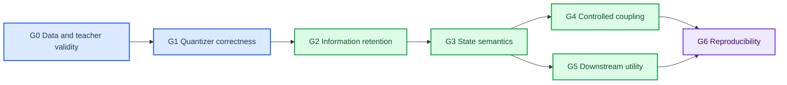

# Redesigned experiment program

_Preregistered experiment logic for the approved target architecture, 2026-07-01_

---

## 📋 Experimental principle

The program tests a chain of claims rather than searching for an attractive coupling plot. Later claims are evaluated only after their prerequisites pass:



Every suite declares one primary endpoint before the test set is opened. Secondary metrics explain failure modes but cannot replace a failed primary endpoint.

## 🎯 Hypotheses and falsifiers

| ID | Hypothesis | Primary falsifier |
| --- | --- | --- |
| H1 | Uncertainty-aware physical-state supervision organizes token prototypes by identifiable physiological state | State/prototype decoding does not beat reconstruction-only VQ on held-out subjects |
| H2 | A separate residual branch preserves task information that a small semantic vocabulary discards | Semantic-plus-residual is not better than semantic-only and remains materially below the continuous latent |
| H3 | Masked state/context prediction improves sequence semantics beyond pointwise reconstruction | It provides no held-out state, task, or stability gain under matched capacity |
| H4 | EEG history adds predictive information about future fNIRS token distributions beyond fNIRS history and marginals | Incremental held-out likelihood is zero/negative or disappears under subject/task controls |
| H5 | Coupling differences contain task-relevant structure beyond dataset/source style | Task-local effects are unstable, source-controlled performance is at chance, or source prediction dominates again |
| H6 | Physiological signatures are more stable than raw token IDs across seeds | Signature-matched prototypes and coupling maps are not reproducible above null matching |

## 🧰 Common baselines

| Baseline | Description | Purpose |
| --- | --- | --- |
| B0 | Archived X3 causal cross-adapter, current quantizer behavior | Historical strongest-exchange reference |
| B1 | Independent reconstruction-only tokenizer with corrected EMA | Isolate quantizer correctness from semantic supervision |
| B2 | Corrected tokenizer supervised by reconstructed source waveforms | Test the current cache-supervision idea fairly |
| B3 | Corrected tokenizer supervised by physical-state posterior | Test explicit semantic organization |
| B4 | Physical-state supervision plus reconstruction and continuous residual | Target hybrid model |
| B5 | Continuous encoder latent without quantization | Information and downstream upper-reference, not a deployable token baseline |

All architecture comparisons match encoder capacity, local windows, training samples, optimizer budget, early-stopping rule, and subject splits unless a suite explicitly studies one of those variables.

## 🧪 E0 — Cache and teacher validity

**Question:** Are the cached state estimates temporally aligned, sufficiently observable, uncertainty-calibrated, and safe to use as supervision?

**Method:** audit cache manifests and hashes; compare cached observations with source solver outputs; run posterior predictive reconstruction; perturb individual states in simulation; test coverage and calibration by state coordinate; quantify boundary support after causal masking; compare highWL-only and paired optical observability.

**Primary endpoint:** held-out posterior predictive likelihood or normalized error relative to a history/mean baseline, reported per observed modality.

**Required controls:** subject-held-out splits, synthetic parameter recovery, state-label permutation, time shift, boundary-mask ablation, and duplicate-cache detection.

**Artifacts:** `teacher_audit.json`, `state_observability.csv`, `posterior_calibration.csv`, `mask_coverage.csv`, predictive-check figures, and cache/solver hashes.

**Pass condition:** every supervised coordinate has useful held-out predictive content and acceptable uncertainty coverage. Coordinates that fail are excluded or grouped as latent nuisance variables.

## ⚙️ E1 — Quantizer implementation and geometry

**Question:** Does corrected EMA produce a healthy, reproducible codebook without changing the scientific objective?

**Method:** deterministic synthetic centroid tests followed by B1 training on matched folds. Compare legacy and corrected update rules with identical initialization streams where possible.

**Primary endpoint:** quantizer state passes deterministic reference tests and maintains a preregistered active-code fraction without uncontrolled prototype overwrite.

**Secondary metrics:** perplexity, assignment entropy, effective rank, nearest-neighbor cosine, dead-code lifetime, revival count, prototype drift, reconstruction, and checkpoint round-trip equality.

**Artifacts:** `quantizer_reference_tests.json`, `quantizer_health.jsonl`, codebook snapshots, geometry figures, and resolved dimensions.

**Pass condition:** all correctness tests pass; health ranges are set from pilot train folds before formal test evaluation.

## 🧠 E2 — What should supervise semantic tokens?

**Question:** Is reconstructed waveform supervision, physical-state supervision, or a hybrid objective best for physiological semantic tokens?

**Method:** compare B1–B4 under matched codebook size and latent dimension. Decode teacher state from continuous latents, hard IDs, posterior, and codebook embeddings using train-fitted probes. Measure prototype-state consistency on held-out subjects.

**Primary endpoint:** held-out uncertainty-normalized error for identifiable state coordinates decoded from the hard token or its saved codebook vector.

**Secondary metrics:** mutual-information lower bounds, neighborhood continuity, token occupancy by state region, reconstruction, task probes, and seed-matched prototype stability.

**Artifacts:** `state_decoding.json`, `prototype_signatures.parquet`, `prototype_stability.json`, `objective_ablation.csv`, and state-manifold figures.

**Pass condition:** B3 or B4 improves the primary endpoint over B1 and B2 with confidence intervals excluding zero, while B4 stays within the E6 information-loss tolerance.

## 🕰️ E3 — Masked temporal semantic learning

**Question:** Does predicting missing state regions from context create sequence-level semantics rather than patch-local clustering only?

**Method:** compare no masking, random patch masking, contiguous-span masking, and causal-history masking. Match total updates and encoder capacity. Evaluate short/long missing spans and transfer to unseen tasks.

**Primary endpoint:** held-out masked-state prediction error on subject-held-out sessions.

**Secondary metrics:** token transition predictability, future-state prediction, fine-task probe, robustness to sensor dropout, and prototype stability.

**Artifacts:** `masked_state_metrics.json`, `mask_schedule.yaml`, transition matrices, span-length curves, and probe results.

**Pass condition:** the chosen masking strategy improves held-out state prediction and at least one non-state transfer metric without reducing E2 semantic quality.

## 💾 E4 — Residual representation strategy

**Question:** How much private information must remain continuous, and is a second discrete hierarchy justified?

**Method:** compare no residual, continuous residual, bottlenecked continuous residual, RVQ, and FSQ only after the continuous-residual target passes. Attribute reconstruction and task information to semantic-only, residual-only, and combined branches.

**Primary endpoint:** combined representation fine-task balanced accuracy or held-out task information relative to B5 continuous latent.

**Secondary metrics:** reconstruction, state leakage into residual, task leakage into semantic branch, residual dimension, bitrate, and robustness.

**Artifacts:** `residual_ablation.csv`, `branch_attribution.json`, rate-distortion plots, and downstream probes.

**Pass condition:** continuous residual recovers a preregistered fraction of the B5 gap while semantic state decoding remains stable. RVQ/FSQ is adopted only if it preserves this result at a meaningful rate reduction.

## 🌈 E5 — fNIRS observation representation

**Question:** Does paired optical input improve state identification and semantic token quality over the current highWL-only path?

**Method:** compare highWL-only, lowWL-only, paired optical, and derived HbO/HbR representations under identical splits and teacher targets. Record preprocessing and units explicitly.

**Primary endpoint:** held-out hemodynamic-state decoding from fNIRS semantic tokens.

**Secondary metrics:** teacher posterior uncertainty, reconstruction, task probe, codebook geometry, and coupling gain.

**Artifacts:** `optical_input_ablation.csv`, state-decoding panels, uncertainty tables, and resolved preprocessing manifests.

**Pass condition:** target mainline is selected by train/validation results before test evaluation. If paired optical does not help, the architecture document is revised rather than retaining it as an unsupported assumption.

## 📉 E6 — Information-retention ladder

**Question:** At which representation boundary is task and cross-modal information lost?

**Method:** freeze one tokenizer checkpoint and evaluate raw summary, encoder latent, posterior, soft expected embedding, hard ID, codebook embedding, residual, and semantic-plus-residual representations on identical LOSO folds.

**Primary endpoint:** fine-task subject-held-out balanced accuracy, normalized to the continuous latent reference.

**Secondary metrics:** conditional-information estimates with dimensionality-matched estimators, state decoding, calibration, source/dataset prediction, and task-family probes.

**Artifacts:** `information_ladder.json`, fold predictions, estimator configuration, bootstrap intervals, and retention waterfall figures.

**Pass condition:** B4 semantic-plus-residual closes the preregistered fraction of the continuous-latent gap; semantic-only may remain lower but must retain the state endpoint from E2. Absolute conditional-information values are not compared across incompatible estimator dimensions.

## 🔗 E7 — Frozen EEG-sequence to fNIRS-distribution coupling

**Question:** Does EEG token history improve prediction of future fNIRS token distributions beyond fNIRS history, lag marginals, subject, dataset, and task prevalence?

**Method:** freeze the selected tokenizers. Fit nested models on identical folds:

1. lag and global fNIRS marginal;
2. subject/dataset/task nuisance baseline;
3. fNIRS token history baseline;
4. EEG history only;
5. fNIRS history plus EEG history.

Evaluate lags `0..16 s` initially. Compare hard targets and soft fNIRS posterior targets. Pre-VQ exchange is evaluated only as a labeled ablation after the independent-tokenizer result.

**Primary endpoint:** subject-held-out incremental log-likelihood of model 5 over model 3, with a confidence interval across subjects.

**Secondary metrics:** calibration, conditional excess probability, lag profile, task interaction, permutation-null percentile, transition-conditioned gain, and robustness across seeds/datasets.

**Required nulls:** shuffled EEG within subject/task, circular time shift beyond the physiological lag range, token-frequency-preserving permutation, fNIRS-history-only, random codebook-ID permutation, and source-stratified evaluation.

**Artifacts:** `nested_model_metrics.json`, `lag_profile.csv`, `subject_effects.csv`, `task_interactions.csv`, null distributions, calibrated predictions, and full/meta-state coupling tensors.

**Pass condition:** positive held-out incremental likelihood survives correction for the preregistered lag family and is not driven solely by one dataset or pooled task mixture. A null result is retained as a valid falsification of H4.

## 🧭 E8 — Whole-brain and downstream utility

**Question:** Which exported token representation supports downstream learning, and does coupling add information beyond token prevalence and source style?

**Method:** pretrain and probe four modes on identical folds: hard ID, transferred codebook embedding, soft expected embedding, and semantic-plus-residual. Compare scratch, frozen, and limited fine-tuning. Add coupling summaries only after E7 passes.

**Primary endpoint:** subject-held-out balanced accuracy for the preregistered fine-grained task label.

**Secondary metrics:** task family, n-back versus WG, source/dataset prediction, calibration, representation linearity, and sample efficiency.

**Artifacts:** `representation_mode_comparison.csv`, fold-level predictions, confusion matrices, calibration curves, embedding-source audit, and exact checkpoint/export hashes.

**Pass condition:** the selected mode improves over the archived hard-ID baseline and is not explained by source-name prediction. Coupling features must add value over matched token-prevalence and sequence baselines.

## 📊 E9 — Physiological visualization and reproducibility

**Question:** Are the learned state signatures and coupling structures stable enough to support paper figures?

**Method:** order prototypes by train-only physical signatures; match codebooks across seeds with Hungarian assignment; cluster signatures into meta-states; visualize state trajectories, lag-resolved incremental coupling, task differences, uncertainty, and nulls.

**Primary endpoint:** cross-seed signature-matched prototype and coupling-map similarity relative to random matching.

**Secondary metrics:** bootstrap confidence, subject consistency, meta-state stability, task-effect reproducibility, and sensitivity to ordering/clustering choices.

**Artifacts:** publication SVG/PDF/PNG, `figure_data/*.csv`, ordering and matching files, meta-state definitions, captions, and null panels.

**Pass condition:** the main qualitative pattern is visible with a locked ordering and fixed scale across formal seeds, and its stability exceeds the permutation null. Expected token index is never interpreted as a physiological continuum.

## 🧬 Splits, nuisance controls, and statistics

- The primary split unit is subject. Windows from one subject cannot cross train, validation, and test.
- Hyperparameters, token ordering, meta-state definitions, thresholds, and stopping rules are selected on train/validation only.
- Dataset/source, task family, subject, window count, and token prevalence are explicit nuisance variables where applicable.
- Formal architecture comparisons use at least three fixed training seeds; uncertainty is reported across held-out subjects and seeds without treating windows as independent replicates.
- Primary endpoint confidence intervals use subject-level bootstrap or a hierarchical model. Multiple lags/tasks use a preregistered family-wise or false-discovery correction.
- Negative results and failed gates remain in the run index. A later exploratory analysis is labeled exploratory and cannot retroactively replace the primary endpoint.

## 📦 Suite layout and required outputs

```text
experiments/runs/physiology_semantic_tokenizer/
├── e0_teacher_validity/
├── e1_quantizer_correctness/
├── e2_semantic_supervision/
├── e3_masked_state/
├── e4_residual_strategy/
├── e5_optical_representation/
├── e6_information_ladder/
├── e7_frozen_coupling/
├── e8_wholebrain_downstream/
└── e9_visualization_stability/
```

Each suite contains a `suite_manifest.json`, `README.md`, dry-run manifest, smoke summary, formal-run index, pooled statistical summary, and links to immutable run-level artifacts. Suite status distinguishes `planned`, `dry_run_passed`, `smoke_passed`, `formal_running`, `formal_complete`, `gate_passed`, and `gate_failed`.

## 🚦 Decision table

| Result | Decision |
| --- | --- |
| E0 fails | Do not use physical states as labels; repair/calibrate the teacher or return to self-supervised targets |
| E1 fails | Stop all expensive training; quantizer results are uninterpretable |
| E2 fails, E6 passes | Retain information-preserving tokenizer but drop physiological-semantic token claims |
| E2 passes, E6 fails | Increase or redesign residual capacity; do not use hard tokens alone downstream |
| E7 global passes but task/source-controlled fails | Report pooled predictability only; do not claim stable neurovascular token coupling |
| E7 passes and E8 coupling features fail | Coupling may be interpretable without being useful for classification |
| E8 passes but source prediction dominates | Treat the result as confounded and redesign splits/normalization |
| E9 fails | Report quantitative results without a stable token-map narrative |

## 🔗 Related documents

- [`Implementation and validation plan`](04_IMPLEMENTATION_VALIDATION_PLAN.md)
- [`Target architecture`](02_TARGET_ARCHITECTURE.md)
- [`Theoretical foundations`](03_THEORETICAL_FOUNDATIONS.md)
- [`Legacy design postmortem`](01_LEGACY_DESIGN_POSTMORTEM.md)
- [`Active experiment log`](06_EXPERIMENT_LOG.md)

_Last updated: 2026-07-01_
