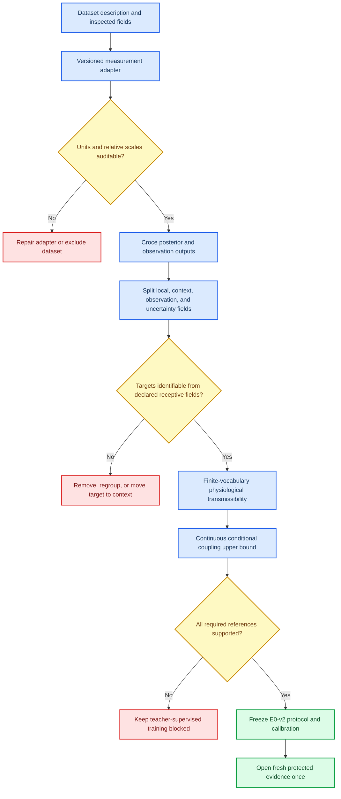

# Redesigned experiment program

_Revised experiment logic for entry-routed teacher supervision and preserve–discover–certify coupling, updated 2026-07-19_

---

## 📋 Experimental principle

The program tests a chain of claims rather than searching for an attractive coupling plot. Later claims are evaluated only after their prerequisites pass:


```mermaid
flowchart LR
    accTitle: Scientific claim gate hierarchy
    accDescr: Data validity and quantizer correctness precede co-equal retention and semantics gates, followed by bridge preservation, foundation discovery, independent controlled coupling, and reproducibility.

    g0["G0 Unified data validity"] --> g1["G1 Quantizer correctness"]
    g1 --> g2["G2 Information retention"]
    g1 --> g3["G3 Registered semantics"]
    g2 --> g4p
    g3 --> g4p["G4P Bridge preservation"]
    g4p --> g4d["G4D Foundation discovery"]
    g4d --> g4["G4 Controlled certificate"]
    g2 --> g5
    g3 --> g5["G5 Downstream utility"]
    g4 --> g6["G6 Reproducibility"]
    g5 --> g6

    classDef foundation fill:#dbeafe,stroke:#2563eb,stroke-width:2px,color:#1e3a5f
    classDef evidence fill:#dcfce7,stroke:#16a34a,stroke-width:2px,color:#14532d
    classDef terminal fill:#ede9fe,stroke:#7c3aed,stroke-width:2px,color:#3b0764

    class g0,g1 foundation
    class g2,g3,g4p,g4d,g4,g5 evidence
    class g6 terminal
```

G2 and G3 are co-equal promotion gates. They may be evaluated in either order or in one joint suite, but both must pass before E7 coupling-preservation promotion or E8 foundation pretraining. E7 preservation, E8 discovery, and E9 independent certification are distinct claims; success at an earlier stage cannot substitute for a later one.

Every suite declares one primary endpoint and a calibration procedure before the protected test set is opened. It does not freeze a universal numerical cutoff in advance. Secondary metrics explain failure modes and may motivate later experiment versions, but cannot retroactively replace a failed primary endpoint on the same protected test set.

### Adaptive evidence and threshold governance

Numerical thresholds are dataset-, phase-, modality-, and representation-dependent. The program therefore fixes the provenance and calibration procedure, not one permanent value. A gate decision must preserve the continuous metric, uncertainty, reference distribution, and decision rationale rather than reduce the result to an unexplained pass/fail number.

| Evidence class | How it is determined | Change rule |
| --- | --- | --- |
| Deterministic correctness | Mathematical or software invariant, such as serialization equality or forbidden cross-modal gradients | Fixed by the implementation contract; changing it requires an architecture change |
| Health reference | Estimated from synthetic tests, training-only pilots, matched baselines, and null distributions | May change by dataset or experiment phase; record the calibration data and method |
| Scientific effect | Judged comparatively on held-out subjects against the declared baseline/null, with uncertainty and sensitivity analyses | No universal minimum effect size; the evidence rubric is versioned before the corresponding protected test evaluation |
| Newly discovered metric | Added during pilot or exploratory analysis with its origin and intended interpretation | Remains diagnostic or secondary for the current test set; it may become primary only in a new evaluation version |

Each suite writes `decision_protocol.yaml`, `metric_registry.json`, and `evidence_calibration.json`. These files identify the primary endpoint, protected data boundary, calibration data, baseline/null construction, uncertainty method, current metric roles, and all changes. Revising a threshold or promoting a metric after viewing protected-test outcomes requires a new evaluation version and fresh protected evidence.

### Unified-loader requirement for the complete experiment matrix

The following is a blocking software invariant for every newly created run. It applies to baseline, ablation, smoke, formal, export and visualization jobs alike.

| Suite | Mandatory measured-data entrance | Optional joined sidecar |
| --- | --- | --- |
| E0 data/target validity | `UnifiedPhysiologyWindowDataset` | Any named teacher candidate, including Croce |
| E1 quantizer geometry | `UnifiedPhysiologyWindowDataset` | None required |
| E2 semantic objectives | `UnifiedPhysiologyWindowDataset` | Only the target family named by the ablation |
| E3 temporal learning | `UnifiedPhysiologyWindowDataset` | Optional context target |
| E4 residual strategy | `UnifiedPhysiologyWindowDataset` | None required |
| E5 fNIRS representation | `UnifiedPhysiologyWindowDataset` | None required |
| E6 information ladder | `UnifiedPhysiologyWindowDataset` | Optional probe labels from the same sample IDs |
| E7 coupling-preservation ablation | `UnifiedPhysiologyWindowDataset` | Entry-routed adaptive physical teacher for named T1–T4 rows only |
| E8 foundation discovery/downstream | Unified-loader-derived versioned frozen token export | Optional task covariates from canonical labels |
| E9 certificate/visualization | Immutable frozen-token and foundation artifacts | Named signature/probe tables only |

Every manifest records the loader class and contract, cache/index hashes, admitted alignment cases, window duration and preprocessing contract. The standard entrance is `UnifiedPhysiologyWindowDataset` / `unified_physiology_window_v1`; REFED downstream sequence regression must instead declare `REFEDContinuousSequenceDataset` / `refed_continuous_va_sequence_v1` together with its source unified-window schema, stride, target rate, mask policy, target coverage, and event-index hash. Any other or missing loader identity blocks the run. Historical Croce-cache and dataset-specific-loader runs remain comparison artifacts and are not relabeled as conformant.

## 🎯 Hypotheses and falsifiers

| ID | Hypothesis | Primary falsifier |
| --- | --- | --- |
| H1 | A validated auxiliary target family can organize token prototypes beyond reconstruction/self-supervision | Registered target/prototype decoding does not improve over the teacher-free baseline on held-out subjects |
| H2 | A separate residual branch preserves task information that a small semantic vocabulary discards | Semantic-plus-residual does not improve over semantic-only or remains inconsistent with the calibrated continuous-latent reference |
| H3 | Masked state/context prediction improves sequence semantics beyond pointwise reconstruction | It provides no reproducible held-out state, transfer, or stability gain under matched capacity |
| H4 | EEG history adds predictive information about future fNIRS token distributions beyond fNIRS history and marginals | Incremental held-out likelihood is non-positive or disappears under subject-, source-, history-, or marginal-controlled evaluation |
| H6 | Physiological signatures are more stable than raw token IDs across seeds | Signature-matched prototypes and coupling maps are not reproducible above calibrated null matching |

Task-specific coupling is retained as secondary research question S1, formerly H5: whether coupling patterns differ across task conditions beyond dataset/source style. The program treats this as an unvalidated, high-risk, long-range objective with no assumed positive result. Task interactions, task-stratified lag profiles, and task-local maps remain secondary metrics; their absence does not fail G4 or G5, and they cannot be used to rescue either gate.

## 🧰 Common baselines

The B0–B5 definitions below are internal architecture/representation controls. External named methods are governed separately by [`11_COMPARATIVE_METHOD_EXPERIMENT_WORKFLOW.md`](11_COMPARATIVE_METHOD_EXPERIMENT_WORKFLOW.md); they do not enter this table merely because source code is locally available.

| Baseline | Description | Purpose |
| --- | --- | --- |
| B0 | Archived X3 causal cross-adapter, current quantizer behavior | Historical strongest-exchange reference |
| B1 | Independent reconstruction-only tokenizer with corrected EMA | Isolate quantizer correctness from semantic supervision |
| B2 | Corrected tokenizer with a named self-supervised temporal target | Teacher-free semantic reference |
| B3 | Corrected tokenizer with one admitted auxiliary teacher family | Test target-specific semantic organization |
| B4 | Best admitted semantic objective plus reconstruction and continuous residual | Target hybrid selected by validation, not fixed to Croce |
| B5 | Continuous encoder latent without quantization | Information and downstream upper-reference, not a deployable token baseline |

All architecture comparisons match encoder capacity, local windows, training samples, optimizer budget, early-stopping rule, and subject splits unless a suite explicitly studies one of those variables.

### External comparison boundary

The downstream comparison program uses the same four measured datasets through `UnifiedPhysiologyWindowDataset`, with REFED sequence regression provided by the contract-preserving `REFEDContinuousSequenceDataset` subclass. The discrete-label task families and REFED's continuous valence/arousal family remain separate. REFED's primary target is a 1 Hz `[valence, arousal, time]` sequence with per-coordinate validity mask under `refed_continuous_va_sequence_v1`; native joystick values are preserved in the loader and any scaling is fit on training subjects only. As of 2026-07-18, `simultaneous_eeg_nirs:dsr` is restored as EEG-native Go/No-go stimulus classification: EEG codes 16/32 provide the labels, and each symbol is projected to the fNIRS clock only through its own admitted block anchor. The fNIRS stream is synchronized hemodynamic context, not an independent symbol-level label source. The released files contain 360 symbol markers per participant rather than the paper's stated 180; this discrepancy is retained in provenance and must not be silently downsampled. VP005 DSR remains excluded by the ordinary `continuous_drift` alignment gate, not by a task ban. DSR comparison runs should use a preregistered short EEG epoch (the event contract recommends 2 s); the loader's general 20 s observation window is not an ERP-duration claim.

STA-Net and EFRM remain candidate methods rather than scientifically admitted baselines. STA-Net now has an independent PyTorch FGSA/EGTA reimplementation with binary, multiclass, DSR-context, and masked sequence-regression variants; changing the head is accepted for horizontal comparison because every result retains an explicit adapter name and deviation manifest. Seven-task CUDA smoke establishes software connectivity only. STA-Net belongs primarily to a paired supervised track; EFRM belongs to pretrained transfer, linear-probe, and fine-tune tracks. Source-protocol, adapted subject-independent, in-domain-pretraining, and external-pretraining results must remain in separately labeled tables. The exact task contract, adapter gates, metrics, artifacts, and implementation order are defined in the comparative-method workflow.

## 🧪 E0 — Unified data and optional-target validity

### Status and scope boundary

E0-v1 and E0-v2 are preserved as historical pre-sign-calibration Croce-target diagnostics. They do not represent the current E0 status and do not block the sign-calibrated adaptive SSM physical teacher. The authoritative complete-E0 result is `PASS`.

The active E0 begins with the unified measured-data contract and then evaluates each optional target family independently. No family is the fixed physical prior for the architecture. The Croce-specific E0-v2 equations and results below are retained as historical rationale for this change; they are not the new input contract.

### Adaptive joint-teacher admission decision

The final 2026-07-24 review accepts the sign-calibrated adaptive local
fixed-interval SSM as the physical teacher. A joint target generator may use
paired held-out EEG/HbO/HbR as privileged information. E0 admission requires
that its train-fold transforms
are auditable, its declared local targets are learnable from the corresponding
student modality, and its finite target geometry is non-degenerate. It does not
require the complete joint posterior or fNIRS waveform to be recovered from EEG
alone.

For this target family, the blocking development-gate coordinates are EEG
`r_mean/r_slope` and observation-aligned fNIRS HbO/HbR mean/slope. EEG
`s_mean/s_slope` are admitted as optional local/prototype development
coordinates. Flow remains context/coupling-only and is excluded from
local/prototype losses. Raw-signal physical gain, EEG-only fNIRS reconstruction, and
individual physiological-parameter recovery are retained as diagnostics that
limit paper claims; they are not target-family admission endpoints. Posterior
uncertainty is optional and cannot weight training until separately calibrated.
The full decision and evidence ledger are recorded in
[`analysis/E0_V3_ADAPTIVE_TEACHER_ADMISSION_DECISION.md`](analysis/E0_V3_ADAPTIVE_TEACHER_ADMISSION_DECISION.md).
Gradient-entry routing and the preserve–discover–certify responsibility split
are fixed in
[`analysis/20260719_PHYSICAL_TEACHER_GRADIENT_ENTRY_DECISION.md`](analysis/20260719_PHYSICAL_TEACHER_GRADIENT_ENTRY_DECISION.md).

### Dataset measurement contract

For modality $m$, dataset $d$, and subject/session $s$, the recorded value is represented as:

\[
Y_{d,s,t}^{m}
=a_{d,s}^{m}+B_d^{m}O^m(Z_t)+\epsilon_{d,s,t}^{m},
\]

where $Z_t=(r_t,s_t,\delta f_t,\delta HbO_t,\delta Hb_t)$, $O^m$ is the modality observation mapping, $a_{d,s}^{m}$ is a baseline, and $B_d^{m}$ carries dataset-specific units and relative amplitude scaling. The adapter produces:

\[
X_{d,s,t}^{m}
=S_d^{-1}\left[\phi_d(Y_{d,s,t}^{m})-b_{d,s}^{m}\right].
\]

The transform $\phi_d$ is selected from the dataset description and inspected data fields. It may preserve declared relative HbO/HbR traces, convert intensity-like values to relative optical change, or preserve a paired optical basis without relabeling it as concentration. The subject/session baseline $b_{d,s}^{m}$ and train-only robust dataset scale $S_d$ align relative fluctuations while retaining reversible provenance.

E0 rejects crop-local normalization as the cross-dataset amplitude contract because identical local physiology can receive different scales when placed inside crops with different surrounding variance. Distribution matching must not force physiologically different datasets to have identical marginal distributions. The desired invariance is instead:

\[
I(K^m;D\mid Z^m)\approx 0,
\]

meaning that dataset identity should add little token information after the physiological state is fixed.

### Historical E0-v2 teacher information-transfer contract

For each independent modality student:

\[
U_t^m=f_m(X_t^m),\qquad K_t^m=Q_m(U_t^m).
\]

Because inference uses only $X_t^m$, the data-processing inequality imposes:

\[
I(K_t^m;T_t^m)\le I(X_t^m;T_t^m).
\]

The irreducible squared prediction risk for a teacher target $T_t^m$ is:

\[
\min_g E\|T_t^m-g(X_t^m)\|^2
=E\left[\operatorname{tr}\operatorname{Var}(T_t^m\mid X_t^m)\right].
\]

E0-v2 therefore validates targets separately by the receptive field that consumes them:

| Teacher field | Consumer | Essential requirement |
| --- | --- | --- |
| `local_state_projection` | Continuous latent and codebook prototype | Identifiable from the current modality patch |
| `context_transition_target` | Fixed-history causal context | Identifiable from the declared history and sensitive to state transition |
| `physical_observation_mean` | Semantic-only decoder | Expressed in the dataset adapter's canonical relative measurement space |
| `posterior_covariance` | Loss weighting and calibration | Calibrated as uncertainty; not treated as a physiological state coordinate by default |
| `valid_mask` | Every teacher-derived loss | Excludes missing support, invalid solver output, and unavailable causal history |
| `measurement_adapter_metadata` | Audit and export | Records original semantics, units, baseline, scale, channel mapping, and inverse transform |

The same state vector is not automatically valid for every entrance. Local targets are projections $T_t^{local}=P_{local}Z_t$; slow state and innovation targets are $T_t^{context}=P_{dynamic}(Z_{t-L:t},\Delta Z_t)$. In particular, fNIRS flow, slow derivatives, and response phase may be context targets even when they are not recoverable from a two-second patch alone.

### Transmission into discrete token identity

Continuous-state decoding is an optimization scaffold but does not establish discrete semantics. The direct criterion is prototype risk:

\[
\mathcal L_{proto}=E\|T^{local}-G(e_K)\|_{\Sigma^{-1}}^2.
\]

For squared loss, the optimal signature is $G(e_k)=E[T^{local}\mid K=k]$, and total variance decomposes as:

\[
\operatorname{Var}(T^{local})
=\operatorname{Var}(E[T^{local}\mid K])
+E[\operatorname{Var}(T^{local}\mid K)].
\]

E0-v2 records the pre-training transmissibility reference:

\[
R^2_{phys-token}
=1-
\frac{E[\operatorname{tr}\operatorname{Var}(T^{local}\mid K)]}
{\operatorname{tr}\operatorname{Var}(T^{local})}.
\]

This reference estimates whether a finite vocabulary can partition the admitted target geometry. E2 remains responsible for showing that the trained tokenizer actually realizes this potential.

Waveform information enters through two non-equivalent fidelity paths:

\[
\mathcal L_{phys-recon}
=\|D_{sem}(e_K)-X_{phys,T}\|^2,
\]

\[
\mathcal L_{full-recon}
=\|D_{full}(e_K,R)-X\|^2.
\]

The first tests whether the semantic branch carries the teacher-defined physical observation; the second requires semantic plus residual representations to preserve the complete measurement. Full reconstruction alone cannot establish token semantics because the residual branch may carry nearly all observation information.

### Continuous coupling upper bound

The frozen-token coupling objective ultimately measures:

\[
\Delta\ell^*
=I(K^E_{t-L:t-1};K_t^F\mid K^F_{t-L:t-1},D,S).
\]

Before tokenizer training, E0-v2 must establish that the admitted continuous teacher states contain such incremental information. For a locally linearized transition:

\[
Z_t^F=A Z_{t-1}^F+B Z_{t-L:t-1}^E+W_t,
\]

the continuous reference is:

\[
I(Z^E_{hist};Z_t^F\mid Z^F_{hist})
=\frac{1}{2}\log
\frac{\det\Sigma(Z_t^F\mid Z^F_{hist})}
{\det\Sigma(Z_t^F\mid Z^F_{hist},Z^E_{hist})}.
\]

If this conditional covariance reduction is absent, no quantizer can create valid coupling evidence. If it is present, the local/prototype targets must preserve the state directions responsible for it. Slow fNIRS level alone may be physiologically meaningful yet add little coupling information when it is already predictable from fNIRS history; transition and innovation sensitivity must therefore be reported separately.

### Historical E0-v2 execution order


```mermaid
flowchart TD
    accTitle: E0-v2 teacher admission sequence
    accDescr: E0-v2 first validates dataset measurement adapters, then target observability and uncertainty, followed by finite-vocabulary transmissibility and the continuous conditional coupling upper bound before any teacher-supervised tokenizer optimization.

    source_data["Dataset description and inspected fields"] --> adapter["Versioned measurement adapter"]
    adapter --> scale_check{"Units and relative scales auditable?"}
    scale_check -->|No| repair_adapter["Repair adapter or exclude dataset"]
    scale_check -->|Yes| teacher_posterior["Croce posterior and observation outputs"]
    teacher_posterior --> target_split["Split local, context, observation, and uncertainty fields"]
    target_split --> observability{"Targets identifiable from declared receptive fields?"}
    observability -->|No| remove_target["Remove, regroup, or move target to context"]
    observability -->|Yes| transmissibility["Finite-vocabulary physiological transmissibility"]
    transmissibility --> coupling_bound["Continuous conditional coupling upper bound"]
    coupling_bound --> admission{"All required references supported?"}
    admission -->|No| blocked["Keep teacher-supervised training blocked"]
    admission -->|Yes| freeze_protocol["Freeze E0-v2 protocol and calibration"]
    freeze_protocol --> protected_test["Open fresh protected evidence once"]

    classDef foundation fill:#dbeafe,stroke:#2563eb,stroke-width:2px,color:#1e3a5f
    classDef decision fill:#fef9c3,stroke:#ca8a04,stroke-width:2px,color:#713f12
    classDef blocked_class fill:#fee2e2,stroke:#dc2626,stroke-width:2px,color:#7f1d1d
    classDef admitted fill:#dcfce7,stroke:#16a34a,stroke-width:2px,color:#14532d

    class source_data,adapter,teacher_posterior,target_split,transmissibility,coupling_bound foundation
    class scale_check,observability,admission decision
    class repair_adapter,remove_target,blocked blocked_class
    class freeze_protocol,protected_test admitted
```

### Endpoints, controls, and artifacts

| Layer | Primary evidence | Required control |
| --- | --- | --- |
| Measurement adapter | Reversible semantics/unit manifest and stable relative-amplitude calibration | Dataset/source prediction, alternate robust scales, crop-position invariance |
| Target observability | Held-out reduction in target uncertainty/error from the declared modality receptive field | Target permutation, time shift, modality ablation, history-length ablation |
| Uncertainty | Coverage and standardized residual calibration | Variance scaling sensitivity and invalid-mask ablation |
| Vocabulary transmissibility | State variance explained by a fixed-capacity partition and within-code conditional variance | Random partition, shuffled target, capacity-matched null |
| Physical observation | Semantic-only reconstruction in canonical measurement space | Full reconstruction, residual-only attribution, history/mean diagnostic |
| Coupling upper bound | Conditional covariance or likelihood reduction from EEG state history beyond fNIRS state history | EEG shuffle, time shift, fNIRS-history-only, subject/source stratification |

Required artifacts are `measurement_adapters.yaml`, `unit_scale_audit.csv`, `target_contract.json`, `target_observability.csv`, `posterior_calibration.csv`, `vocabulary_transmissibility.json`, `continuous_coupling_upper_bound.json`, `mask_coverage.csv`, predictive diagnostics, and immutable cache/solver hashes. Every artifact records train/validation provenance and metric role.

### Admission and pass rule

The active rule evaluates the observation-aligned, sign-calibrated teacher
coordinate system. Measurement provenance, required target observability,
finite-capacity transmissibility, and sign/gauge invariance must be auditable.
The adaptive SSM satisfies this rule and complete E0 passes.

Clean-waveform error against raw history remains an observation-decomposition
diagnostic rather than a standalone veto. Values computed before sign
calibration cannot be propagated as current physical-teacher or E0 status
labels.

**Execution status (updated 2026-07-24):** The 2026-07-03 E0-v2 numbers remain an immutable pre-sign-calibration diagnostic archive. After observation-aligned sign calibration, the adaptive SSM physical teacher passes complete E0 and its physiological information, including fNIRS content, is fully accepted. The old `2.193` versus `0.834` comparison and posterior label carry no current E0 gate status. The archive remains at `experiments/runs/physiology_semantic_tokenizer/e0_teacher_validity/20260703_232754_e0_teacher_validity_v2/`.

### E0-D1 — Shared-state reconstruction-bound diagnostic

After the historical E0-v2 diagnostic, a Croce-independent analysis tested whether the paired observations themselves support one low-dimensional state that describes both modalities. The analysis fixed latent capacity, decoder family, input access, temporal crop, and subject split before interpreting a bound. It compared validation-oracle joint PCA, train-fitted joint PCA, cross-modal CCA, single-sided CCA inference, and separate modality PCA over dimensions 1–64. This remains diagnostic evidence; the current E0 pass is established by the sign-calibrated adaptive SSM decision.

At five dimensions, validation-oracle descriptor reconstruction reached EEG/fNIRS $R^2$ of `0.893/0.931`, but joint-component loading balance was only `0.041`; the components were modality-dominated. A CCA-constrained shared state reached only `0.098/-0.222`, and its mean validation canonical correlation was `0.004`. Separate five-dimensional modality models reached `0.880/0.965`. The resulting requirement is to admit only cross-subject-stable shared targets and retain modality-private observation state, measurement adaptation, and delayed hemodynamic dynamics. The full scope and caveats are archived in [`archive/diagnostics/09_SHARED_STATE_RECONSTRUCTION_BOUND.md`](archive/diagnostics/09_SHARED_STATE_RECONSTRUCTION_BOUND.md).

### E0-D2 — Cross-dataset delayed-innovation diagnostic

The next diagnostic tested a three-dimensional lagged CCA state after removing each modality's own three-second history, trial phase, and condition. Two subjects from each of Single-Trial, REFED, Simultaneous EEG&NIRS, and Visual Cognitive Motivation were evaluated with reciprocal one-subject train/one-subject validation folds. Five seconds was the fixed primary EEG-leading lag; 0–10 seconds was exploratory.

No dataset produced a positive cross-inferable shared fraction at five seconds. A joint state using both modalities gave balanced innovation ceilings of `3.97%`, `0.62%`, `1.63%`, and `2.56%`, respectively, but independent EEG-only and fNIRS-only states both clipped to `0%` in every dataset. This historical result prevents the joint ceiling itself from being treated as independent coupling evidence or a uniquely identifiable shared cause. It does not reduce the later sign-calibrated physical-teacher acceptance. Full methods and evidence boundaries are archived in [`archive/diagnostics/10_CROSS_DATASET_SHARED_NEURAL_STATE_DIAGNOSTIC.md`](archive/diagnostics/10_CROSS_DATASET_SHARED_NEURAL_STATE_DIAGNOSTIC.md).

## ⚙️ E1 — Quantizer implementation and geometry

**Question:** Does corrected EMA produce a healthy, reproducible codebook without changing the scientific objective?

**Method:** deterministic synthetic centroid tests followed by B1 training on matched folds. Compare legacy and corrected update rules with identical initialization streams where possible.

**Primary endpoint:** quantizer state passes deterministic reference tests and remains within health ranges calibrated from synthetic streams and training-only pilot folds, without uncontrolled prototype overwrite.

**Secondary metrics:** perplexity, assignment entropy, effective rank, nearest-neighbor cosine, dead-code lifetime, revival count, prototype drift, reconstruction, and checkpoint round-trip equality.

**Artifacts:** `quantizer_reference_tests.json`, `quantizer_health.jsonl`, codebook snapshots, geometry figures, and resolved dimensions.

**Pass condition:** all deterministic correctness tests pass; the observed health profile is supported by the versioned pilot/reference calibration before formal protected-test evaluation.

## 🧠 E2 — Which objectives produce useful semantic tokens?

**Execution status (2026-07-23):** v4 line-clean E0 revalidation restored
`230/230` development target trials, the training-gradient calibration froze
state/prototype weight `0.005`, and all 9 T0/T1/T2 runs completed. Quantizer
health and gradient-entry contracts passed, but neither T1 nor T2 produced a
seed-consistent improvement in the required hard-token endpoint; EEG remained
below the shuffled-target null. No semantic row was admitted and T0 is retained.
Protected subjects 24–29 remained closed. See
[`analysis/20260722_E2_IMPLEMENTATION_AND_EXPERIMENT_PLAN.md`](analysis/20260722_E2_IMPLEMENTATION_AND_EXPERIMENT_PLAN.md).

**Question:** Do reconstruction, self-supervised temporal targets, task probes, data-driven dynamical targets, or an admitted physical teacher produce the most reproducible and informative token geometry?

**Method:** compare B1–B4 under matched codebook size and latent dimension, then run the entry ladder below with all other optimization settings fixed:

| Row | Teacher entrances |
| --- | --- |
| T0 | Teacher-free reconstruction, VQ, and self-supervision |
| T1 | T0 + required local/prototype `r` and HbO/HbR targets |
| T2 | T1 + optional EEG `s_mean/s_slope` |

Decode every registered target separately from continuous latents, hard IDs, posterior, and codebook embeddings using train-fitted probes. Measure prototype-signature consistency on held-out subjects without treating any candidate signature as universal truth. Log per-loss gradient reachability, norm, and cosine conflict; flow and uncalibrated posterior variance are forbidden from these local/prototype rows.

**Primary endpoint:** held-out performance for the preregistered signature family decoded from the hard token or its saved codebook vector, reported together with the teacher-free information-retention endpoint.

**Secondary metrics:** mutual-information lower bounds, neighborhood continuity, token occupancy by state region, reconstruction, task probes, and seed-matched prototype stability.

**Artifacts:** `state_decoding.json`, `prototype_signatures.parquet`, `prototype_stability.json`, `objective_ablation.csv`, `gradient_entry_audit.json`, and state-manifold figures.

**Pass condition:** T1 or T2 improves its preregistered target endpoint over T0 on held-out subjects, with subject-level uncertainty, seed consistency, null sensitivity and no loss of the E6/G2 information-retention requirement. The conclusion is scoped to that target family; T2 is selected over T1 only when the optional `s` coordinates add stable value.

## 🕰️ E3 — Causal context and genuine masking

**Question:** Does predicting missing state regions from context create sequence-level semantics rather than patch-local clustering only?

**Method:** first compare no context with the T3 causal-history state objective, using only past expected embeddings and entry-specific context targets. Separately compare true random patch masking and contiguous-span masking when their input corruption is implemented. Match total updates and encoder capacity. Do not label the fixed-history next-state objective as masked modeling. Evaluate short/long histories, missing spans, and transfer to unseen tasks.

**Primary endpoint:** held-out causal-context state prediction error for T3 on subject-held-out sessions; true masking variants report their own separately named masked-state endpoint.

**Secondary metrics:** token transition predictability, future-state prediction, fine-task probe, robustness to sensor dropout, and prototype stability.

**Artifacts:** `causal_context_metrics.json`, optional `masked_state_metrics.json`, `mask_schedule.yaml`, transition matrices, history/span-length curves, and probe results.

**Pass condition:** the chosen masking strategy improves held-out state prediction and at least one non-state transfer metric without reducing E2 semantic quality.

## 💾 E4 — Residual representation strategy

**Question:** How much private information must remain continuous, and is a second discrete hierarchy justified?

**Method:** compare no residual, continuous residual, bottlenecked continuous residual, RVQ, and FSQ only after the continuous-residual target passes. Attribute reconstruction and task information to semantic-only, residual-only, and combined branches.

**Primary endpoint:** held-out task information retained by the combined representation relative to B5. The concrete estimator or task score is selected from pilot evidence, registered with its measurement assumptions, and frozen before the corresponding protected-test evaluation.

**Secondary metrics:** reconstruction, state leakage into residual, task leakage into semantic branch, residual dimension, bitrate, and robustness.

**Artifacts:** `residual_ablation.csv`, `branch_attribution.json`, rate-distortion plots, and downstream probes.

**Pass condition:** continuous residual materially improves the calibrated retention profile relative to semantic-only while semantic state decoding remains stable. RVQ/FSQ is adopted only when its rate-retention tradeoff is supported by the phase-specific baseline and uncertainty analysis; no universal recovery fraction or bitrate cutoff is assumed.

## 🌈 E5 — fNIRS observation representation

**Question:** Does paired optical input improve state identification and semantic token quality over the current highWL-only path?

**Method:** compare highWL-only, lowWL-only, paired optical, and derived HbO/HbR representations under identical splits and teacher targets. Record preprocessing and units explicitly.

**Primary endpoint:** held-out hemodynamic-state decoding from fNIRS semantic tokens.

**Secondary metrics:** teacher posterior uncertainty, reconstruction, task probe, codebook geometry, and coupling gain.

**Artifacts:** `optical_input_ablation.csv`, state-decoding panels, uncertainty tables, and resolved preprocessing manifests.

**Pass condition:** target mainline is selected by train/validation results before test evaluation. If paired optical does not help, the architecture document is revised rather than retaining it as an unsupported assumption.

## 📉 E6 — Information-retention ladder

**Question:** At which representation boundary is task and cross-modal information lost?

**Method:** freeze one tokenizer checkpoint and evaluate raw summary, encoder latent, posterior, soft expected embedding, hard ID, codebook embedding, residual, and semantic-plus-residual representations on identical LOSO folds.

**Primary endpoint:** fine-task subject-held-out balanced accuracy, normalized to the continuous latent reference.

**Secondary metrics:** conditional-information estimates with dimensionality-matched estimators, state decoding, calibration, source/dataset prediction, and task-family probes.

**Artifacts:** `information_ladder.json`, fold predictions, estimator configuration, bootstrap intervals, and retention waterfall figures.

**Pass condition:** B4 semantic-plus-residual reaches the calibrated continuous-latent retention reference for the current dataset and phase; semantic-only may remain lower but must retain the state endpoint from E2. The calibration record must show how reconstruction, task utility, bitrate, and uncertainty informed the decision. Absolute conditional-information values are not compared across incompatible estimator dimensions.

## 🔗 E7 — Tokenizer coupling preservation

**Question:** Does explicit, asymmetric physical-teacher guidance prevent the EEG tokenizer from discarding delayed information relevant to future fNIRS dynamics?

**Method:** extend T0–T2 with T3 causal context and T4, a low-capacity multi-horizon preservation shaper. T4 predicts future `delta_f` innovation and separately reported HbO/HbR innovations from EEG token history conditional on a frozen fNIRS-history baseline. Gradients reach only the EEG semantic tokenizer; fNIRS targets, tokenizer, baseline, and teacher are detached. Include T4-F0 without flow, N1 time-shift/shuffled teacher targets, and N2 EEG-only-teacher control. Discard the shaper after training.

Evaluate every frozen tokenizer row with a fresh, identically specified development evaluator; never report the training shaper's own gain as the endpoint.

**Primary endpoint:** improvement of held-out EEG-incremental proper likelihood for T4 over T3 under the fresh evaluator, with no loss of G2 information retention or G3 registered semantics.

**Secondary metrics:** horizon/lag profile, continuous-to-hard retention, flow ablation, codebook health, per-entry gradient norms/cosines, subject/dataset stability, and development null position.

**Required nulls:** shuffled EEG within subject/task, circular time shift outside the declared lag range, target-frequency-preserving permutation, T4-F0, N1, N2, and fNIRS-history-only.

**Artifacts:** `teacher_entry_ablation.csv`, `gradient_entry_audit.json`, `preservation_metrics.json`, `lag_profile.csv`, null distributions, frozen tokenizer hashes, and a shaper-discard audit.

**Pass condition:** T4 improves the preregistered frozen-development endpoint over T3 across held-out subjects and seeds, loses the gain under the required nulls, and preserves E2/E6 endpoints. Passing E7 means the tokenizer retained a delayed bridge; it is not yet the foundation-model or paper-level coupling claim.

## 🧭 E8 — Foundation coupling discovery and downstream utility

**Question:** Can the foundation model discover richer context-dependent EEG–fNIRS organization from frozen compressed sequences, and is the representation useful beyond token prevalence and source style?

**Method:** pretrain a causal temporal core with matched proper-likelihood heads:

1. `q_0`: fNIRS history plus declared nuisance controls;
2. `q_1`: the same inputs plus EEG token history.

Use identical targets, masks, horizons, and eligible samples. Compare the explicit `q_0/q_1` objective with per-modality MLM, pooled InfoNCE, and scratch baselines. Probe hard ID, transferred codebook embedding, soft expected embedding, and semantic-plus-residual modes on identical folds; compare frozen and limited fine-tuning. The baseline is fit independently or frozen so incremental gain cannot be created by degrading `q_0`.

E8 is executed as two registered sub-suites so each retains one primary endpoint. E8A selects the foundation objective by held-out proper likelihood. E8B then selects the representation mode by subject-held-out performance for the versioned fine-grained downstream task.

**Secondary metrics:** provisional EEG-incremental gain, calibration, sample efficiency, task family, source/dataset prediction, representation linearity, horizon dependence, and shuffled-EEG sensitivity.

**Artifacts:** `foundation_objective_ablation.csv`, `q0_q1_metrics.json`, `representation_mode_comparison.csv`, fold predictions, calibration curves, embedding-source audit, and exact tokenizer/foundation hashes.

**Pass condition:** E8A improves held-out proper likelihood without violating causal/matched-sample checks; E8B improves the preregistered downstream endpoint without being explained by source-name prediction. Its provisional coupling gain motivates E9 but is not its own independent certificate.

## 📊 E9 — Independent coupling certificate and physiological visualization

**Question:** After tokenizer and foundation selection, does independently evaluated EEG history add reproducible predictive information about future fNIRS tokens, and can that result support an interpretable paper figure?

**Method:** freeze all selected checkpoints. Fit a fresh or cross-fitted evaluator on nested models using identical samples: lag/marginal nuisance baseline, fNIRS-history `q_0`, EEG-history-only control, and fNIRS-plus-EEG-history `q_1`. Evaluate lags `0..16 s` initially, hard and soft fNIRS targets, subject/source/task-prevalence controls, and the complete shuffle/time-shift/marginal null family. The evaluator cannot reuse the T4 shaper or foundation prediction head as an independent result.

Order prototypes by train-only physical signatures, match codebooks across seeds with Hungarian assignment, aggregate physiological meta-states, and visualize raw prevalence, fNIRS-history prediction, EEG-incremental gain, lag profile, uncertainty, and nulls as distinct panels.

**Primary endpoint:** subject-held-out incremental log-likelihood `q_1-q_0` under the versioned lag-family correction. Cross-seed signature-matched coupling-map similarity relative to random matching is the required visualization-reproducibility acceptance metric, not a replacement endpoint.

**Secondary metrics:** calibration, conditional excess probability, task interaction, task-stratified maps, bootstrap confidence, subject/meta-state stability, and sensitivity to ordering/clustering choices. Task-specific coupling remains non-blocking.

**Artifacts:** `nested_model_metrics.json`, `certificate_manifest.json`, `lag_profile.csv`, `subject_effects.csv`, null distributions, calibrated predictions, full/meta-state coupling tensors, publication SVG/PDF/PNG, `figure_data/*.csv`, ordering/matching files, and captions.

**Pass condition:** held-out incremental likelihood is positive and separated from calibrated null evidence while surviving subject, source, history, marginal, and task-prevalence controls; the locked qualitative pattern is stable across formal seeds and exceeds the permutation null. Expected token index is never interpreted as a physiological continuum. A null result is a valid falsification of the paper-level coupling claim.

## 🧬 Splits, nuisance controls, and statistics

- The primary split unit is subject. Windows from one subject cannot cross train, validation, and test.
- Hyperparameters, token ordering, meta-state definitions, threshold-calibration procedures, and stopping rules are selected on train/validation only.
- Dataset/source, task family, subject, window count, and token prevalence are explicit nuisance variables where applicable.
- Formal architecture comparisons use at least three fixed training seeds; uncertainty is reported across held-out subjects and seeds without treating windows as independent replicates.
- Primary endpoint uncertainty uses subject-level bootstrap or a hierarchical model. Multiple lags use a versioned family-wise or false-discovery procedure; task interaction remains secondary regardless of its multiplicity-adjusted result.
- Numerical decision ranges may evolve with pilot evidence, but every value and rationale is versioned before the corresponding protected test is opened.
- New metrics discovered during an experiment are retained in the metric registry. They remain diagnostic or secondary for the current test set and cannot retroactively replace the primary endpoint.
- Negative results and failed gates remain in the run index. A later exploratory analysis is labeled exploratory and cannot retroactively replace the primary endpoint.

## 📦 Suite layout and required outputs

```text
experiments/runs/physiology_semantic_tokenizer/
├── e0_teacher_validity/
├── e1_quantizer_correctness/
├── e2_semantic_supervision/
├── e3_causal_context/
├── e4_residual_strategy/
├── e5_optical_representation/
├── e6_information_ladder/
├── e7_tokenizer_coupling_preservation/
├── e8_foundation_discovery_downstream/
└── e9_coupling_certificate_visualization/
```

Each suite contains a `suite_manifest.json`, `README.md`, `decision_protocol.yaml`, `metric_registry.json`, `evidence_calibration.json`, dry-run manifest, smoke summary, formal-run index, pooled statistical summary, and links to immutable run-level artifacts. Suite status distinguishes `planned`, `dry_run_passed`, `smoke_passed`, `formal_running`, `formal_complete`, `gate_passed`, and `gate_failed`.

## 🚦 Decision table

| Result | Decision |
| --- | --- |
| E0 measurement adapter fails | Repair the dataset adapter or exclude that dataset; do not pool its scale with admitted datasets |
| E0 local/context target fails | Remove, regroup, or move the coordinate to the receptive field that can identify it |
| One teacher's continuous coupling upper bound fails | Reject that teacher bridge; E7 may proceed only from a separately preregistered teacher-free or alternative-target premise |
| E0-v2 validation admitted | Freeze admitted targets and calibration, then open fresh protected evidence once; teacher-supervised optimization remains blocked until G0 passes |
| Sign-calibrated adaptive SSM complete E0 passed | Use the accepted physical teacher through explicit entry routing, then evaluate downstream semantics and coupling under their own gates |
| E1 fails | Stop all expensive training; quantizer results are uninterpretable |
| E2 fails, E6 passes | Retain information-preserving tokenizer but drop physiological-semantic token claims |
| E2 passes, E6 fails | Increase or redesign residual capacity; do not use hard tokens alone downstream |
| E7 preservation fails | Redesign tokenizer objectives/capacity; foundation training cannot restore discarded coupling information |
| E7 passes but E8 explicit `q_0/q_1` discovery fails | Retain the tokenizer result; do not claim foundation-level coupling discovery |
| E8 passes but source prediction dominates | Treat the result as confounded and redesign splits/normalization |
| E9 incremental certificate fails history/marginal/null controls | Report preservation/discovery development evidence only; do not claim controlled neurovascular token coupling |
| E9 coupling certificate passes but visualization stability fails | Report quantitative controlled coupling without a stable token-map narrative |

## 🔗 Related documents

- [`Implementation and validation plan`](04_IMPLEMENTATION_VALIDATION_PLAN.md)
- [`Target architecture`](02_TARGET_ARCHITECTURE.md)
- [`Theoretical foundations`](03_THEORETICAL_FOUNDATIONS.md)
- [`Legacy design postmortem`](01_LEGACY_DESIGN_POSTMORTEM.md)
- [`Active experiment log`](06_EXPERIMENT_LOG.md)
- [`Comparative-method experiment workflow`](11_COMPARATIVE_METHOD_EXPERIMENT_WORKFLOW.md)

_Last updated: 2026-07-19_
