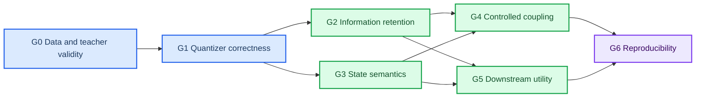

# Redesigned experiment program

_Final experiment logic for the approved target architecture, 2026-07-02_

---

## 📋 Experimental principle

The program tests a chain of claims rather than searching for an attractive coupling plot. Later claims are evaluated only after their prerequisites pass:


```mermaid
flowchart LR
    accTitle: Scientific claim gate hierarchy
    accDescr: Data validity and quantizer correctness precede two co-equal tokenizer gates for information retention and state semantics; both are required before controlled coupling or downstream utility is evaluated.

    g0["G0 Data and teacher validity"] --> g1["G1 Quantizer correctness"]
    g1 --> g2["G2 Information retention"]
    g1 --> g3["G3 State semantics"]
    g2 --> g4
    g3 --> g4["G4 Controlled coupling"]
    g2 --> g5
    g3 --> g5["G5 Downstream utility"]
    g4 --> g6["G6 Reproducibility"]
    g5 --> g6

    classDef foundation fill:#dbeafe,stroke:#2563eb,stroke-width:2px,color:#1e3a5f
    classDef evidence fill:#dcfce7,stroke:#16a34a,stroke-width:2px,color:#14532d
    classDef terminal fill:#ede9fe,stroke:#7c3aed,stroke-width:2px,color:#3b0764

    class g0,g1 foundation
    class g2,g3,g4,g5 evidence
    class g6 terminal
```

G2 and G3 are co-equal promotion gates. They may be evaluated in either order or in one joint suite, but both must pass before E7 coupling or E8 downstream promotion.

Every suite declares one primary endpoint and a calibration procedure before the protected test set is opened. It does not freeze a universal numerical cutoff in advance. Secondary metrics explain failure modes and may motivate later experiment versions, but cannot retroactively replace a failed primary endpoint on the same protected test set.

### Adaptive evidence and threshold governance

Numerical thresholds are dataset-, phase-, modality-, and representation-dependent. The program therefore fixes the provenance and calibration procedure, not one permanent value. A gate decision must preserve the continuous metric, uncertainty, reference distribution, and decision rationale rather than reduce the result to an unexplained pass/fail number.

| Evidence class | How it is determined | Change rule |
| --- | --- | --- |
| Deterministic correctness | Mathematical or software invariant, such as serialization equality or forbidden cross-modal gradients | Fixed by the implementation contract; changing it requires an architecture change |
| Health reference | Estimated from synthetic tests, training-only pilots, matched baselines, and null distributions | May change by dataset or experiment phase; record the calibration data and method |
| Scientific effect | Judged comparatively on held-out subjects against the declared baseline/null, with uncertainty and sensitivity analyses | No universal minimum effect size; the evidence rubric is versioned before the corresponding protected test evaluation |
| Newly discovered metric | Added during pilot or exploratory analysis with its origin and intended interpretation | Remains diagnostic or secondary for the current test set; it may become primary only in a new evaluation version |

Each suite writes `decision_protocol.yaml`, `metric_registry.json`, and `evidence_calibration.json`. These files identify the primary endpoint, protected data boundary, calibration data, baseline/null construction, uncertainty method, current metric roles, and all changes. Revising a threshold or promoting a metric after viewing protected-test outcomes requires a new evaluation version and fresh protected evidence.

## 🎯 Hypotheses and falsifiers

| ID | Hypothesis | Primary falsifier |
| --- | --- | --- |
| H1 | Uncertainty-aware physical-state supervision organizes token prototypes by identifiable physiological state | State/prototype decoding does not improve over reconstruction-only VQ on held-out subjects under the calibrated evidence protocol |
| H2 | A separate residual branch preserves task information that a small semantic vocabulary discards | Semantic-plus-residual does not improve over semantic-only or remains inconsistent with the calibrated continuous-latent reference |
| H3 | Masked state/context prediction improves sequence semantics beyond pointwise reconstruction | It provides no reproducible held-out state, transfer, or stability gain under matched capacity |
| H4 | EEG history adds predictive information about future fNIRS token distributions beyond fNIRS history and marginals | Incremental held-out likelihood is non-positive or disappears under subject-, source-, history-, or marginal-controlled evaluation |
| H6 | Physiological signatures are more stable than raw token IDs across seeds | Signature-matched prototypes and coupling maps are not reproducible above calibrated null matching |

Task-specific coupling is retained as secondary research question S1, formerly H5: whether coupling patterns differ across task conditions beyond dataset/source style. The program treats this as an unvalidated, high-risk, long-range objective with no assumed positive result. Task interactions, task-stratified lag profiles, and task-local maps remain secondary metrics; their absence does not fail G4 or G5, and they cannot be used to rescue either gate.

## 🧰 Common baselines

| Baseline | Description | Purpose |
| --- | --- | --- |
| B0 | Archived X3 causal cross-adapter, current quantizer behavior | Historical strongest-exchange reference |
| B1 | Independent reconstruction-only tokenizer with corrected EMA | Isolate quantizer correctness from semantic supervision |
| B2 | Corrected tokenizer supervised by reconstructed source waveforms | Test the current cache-supervision idea fairly |
| B3 | Corrected tokenizer supervised by physical-state posterior | Test explicit semantic organization |
| B4 | Physical-state supervision plus reconstruction and continuous residual | Target hybrid model |
| B5 | Continuous encoder latent without quantization | Information and downstream upper-reference, not a deployable token baseline |

All architecture comparisons match encoder capacity, local windows, training samples, optimizer budget, early-stopping rule, and subject splits unless a suite explicitly studies one of those variables.

## 🧪 E0 — Cache and teacher validity

**Question:** Are the cached state estimates temporally aligned, sufficiently observable, uncertainty-calibrated, and safe to use as supervision?

**Method:** audit cache manifests and hashes; compare cached observations with source solver outputs; run posterior predictive reconstruction; perturb individual states in simulation; test coverage and calibration by state coordinate; quantify boundary support after causal masking; compare highWL-only and paired optical observability.

**Primary endpoint:** held-out posterior predictive likelihood or normalized error relative to a history/mean baseline, reported per observed modality.

**Required controls:** subject-held-out splits, synthetic parameter recovery, state-label permutation, time shift, boundary-mask ablation, and duplicate-cache detection.

**Artifacts:** `teacher_audit.json`, `state_observability.csv`, `posterior_calibration.csv`, `mask_coverage.csv`, predictive-check figures, and cache/solver hashes.

**Pass condition:** every supervised coordinate shows useful held-out predictive content relative to the declared history/mean and permutation references, with uncertainty behavior supported by the suite-specific calibration record. No universal coverage cutoff is assumed. Coordinates without adequate evidence are excluded or grouped as latent nuisance variables.

## ⚙️ E1 — Quantizer implementation and geometry

**Question:** Does corrected EMA produce a healthy, reproducible codebook without changing the scientific objective?

**Method:** deterministic synthetic centroid tests followed by B1 training on matched folds. Compare legacy and corrected update rules with identical initialization streams where possible.

**Primary endpoint:** quantizer state passes deterministic reference tests and remains within health ranges calibrated from synthetic streams and training-only pilot folds, without uncontrolled prototype overwrite.

**Secondary metrics:** perplexity, assignment entropy, effective rank, nearest-neighbor cosine, dead-code lifetime, revival count, prototype drift, reconstruction, and checkpoint round-trip equality.

**Artifacts:** `quantizer_reference_tests.json`, `quantizer_health.jsonl`, codebook snapshots, geometry figures, and resolved dimensions.

**Pass condition:** all deterministic correctness tests pass; the observed health profile is supported by the versioned pilot/reference calibration before formal protected-test evaluation.

## 🧠 E2 — What should supervise semantic tokens?

**Question:** Is reconstructed waveform supervision, physical-state supervision, or a hybrid objective best for physiological semantic tokens?

**Method:** compare B1–B4 under matched codebook size and latent dimension. Decode teacher state from continuous latents, hard IDs, posterior, and codebook embeddings using train-fitted probes. Measure prototype-state consistency on held-out subjects.

**Primary endpoint:** held-out uncertainty-normalized error for identifiable state coordinates decoded from the hard token or its saved codebook vector.

**Secondary metrics:** mutual-information lower bounds, neighborhood continuity, token occupancy by state region, reconstruction, task probes, and seed-matched prototype stability.

**Artifacts:** `state_decoding.json`, `prototype_signatures.parquet`, `prototype_stability.json`, `objective_ablation.csv`, and state-manifold figures.

**Pass condition:** B3 or B4 improves the primary endpoint over B1 and B2 on held-out subjects, with subject-level uncertainty, seed consistency, and null sensitivity supporting the comparison under the versioned evidence protocol. This passes G3 independently; admission to coupling still requires the separate E6/G2 information-retention gate.

## 🕰️ E3 — Masked temporal semantic learning

**Question:** Does predicting missing state regions from context create sequence-level semantics rather than patch-local clustering only?

**Method:** compare no masking, random patch masking, contiguous-span masking, and causal-history masking. Match total updates and encoder capacity. Evaluate short/long missing spans and transfer to unseen tasks.

**Primary endpoint:** held-out masked-state prediction error on subject-held-out sessions.

**Secondary metrics:** token transition predictability, future-state prediction, fine-task probe, robustness to sensor dropout, and prototype stability.

**Artifacts:** `masked_state_metrics.json`, `mask_schedule.yaml`, transition matrices, span-length curves, and probe results.

**Pass condition:** the chosen masking strategy improves held-out state prediction and at least one non-state transfer metric without reducing E2 semantic quality.

## 💾 E4 — Residual representation strategy

**Question:** How much private information must remain continuous, and is a second discrete hierarchy justified?

**Method:** compare no residual, continuous residual, bottlenecked continuous residual, RVQ, and FSQ only after the continuous-residual target passes. Attribute reconstruction and task information to semantic-only, residual-only, and combined branches.

**Primary endpoint:** held-out task information retained by the combined representation relative to B5. The concrete estimator or task score is selected from pilot evidence, registered with its measurement assumptions, and frozen before the corresponding protected-test evaluation.

**Secondary metrics:** reconstruction, state leakage into residual, task leakage into semantic branch, residual dimension, bitrate, and robustness.

**Artifacts:** `residual_ablation.csv`, `branch_attribution.json`, rate-distortion plots, and downstream probes.

**Pass condition:** continuous residual materially improves the calibrated retention profile relative to semantic-only while semantic state decoding remains stable. RVQ/FSQ is adopted only when its rate-retention tradeoff is supported by the phase-specific baseline and uncertainty analysis; no universal recovery fraction or bitrate cutoff is assumed.

## 🌈 E5 — fNIRS observation representation

**Question:** Does paired optical input improve state identification and semantic token quality over the current highWL-only path?

**Method:** compare highWL-only, lowWL-only, paired optical, and derived HbO/HbR representations under identical splits and teacher targets. Record preprocessing and units explicitly.

**Primary endpoint:** held-out hemodynamic-state decoding from fNIRS semantic tokens.

**Secondary metrics:** teacher posterior uncertainty, reconstruction, task probe, codebook geometry, and coupling gain.

**Artifacts:** `optical_input_ablation.csv`, state-decoding panels, uncertainty tables, and resolved preprocessing manifests.

**Pass condition:** target mainline is selected by train/validation results before test evaluation. If paired optical does not help, the architecture document is revised rather than retaining it as an unsupported assumption.

## 📉 E6 — Information-retention ladder

**Question:** At which representation boundary is task and cross-modal information lost?

**Method:** freeze one tokenizer checkpoint and evaluate raw summary, encoder latent, posterior, soft expected embedding, hard ID, codebook embedding, residual, and semantic-plus-residual representations on identical LOSO folds.

**Primary endpoint:** fine-task subject-held-out balanced accuracy, normalized to the continuous latent reference.

**Secondary metrics:** conditional-information estimates with dimensionality-matched estimators, state decoding, calibration, source/dataset prediction, and task-family probes.

**Artifacts:** `information_ladder.json`, fold predictions, estimator configuration, bootstrap intervals, and retention waterfall figures.

**Pass condition:** B4 semantic-plus-residual reaches the calibrated continuous-latent retention reference for the current dataset and phase; semantic-only may remain lower but must retain the state endpoint from E2. The calibration record must show how reconstruction, task utility, bitrate, and uncertainty informed the decision. Absolute conditional-information values are not compared across incompatible estimator dimensions.

## 🔗 E7 — Frozen EEG-sequence to fNIRS-distribution coupling

**Question:** Does EEG token history improve prediction of future fNIRS token distributions beyond fNIRS history, lag marginals, subject, dataset, and task prevalence?

**Method:** freeze the selected tokenizers. Fit nested models on identical folds:

1. lag/global fNIRS marginal plus the shared dataset/source/task-prevalence nuisance terms;
2. fNIRS token history plus the same nuisance terms;
3. EEG history plus the same nuisance terms;
4. fNIRS history plus EEG history plus the same nuisance terms.

All comparisons use identical eligible samples and nuisance definitions. Subject effects are handled through training-subject hierarchy or subject-derived covariates that remain defined for an unseen subject; a held-out subject ID is never fitted as a free test-time parameter.

Evaluate lags `0..16 s` initially. Compare hard targets and soft fNIRS posterior targets. Pre-VQ exchange is evaluated only as a labeled ablation after the independent-tokenizer result.

**Primary endpoint:** subject-held-out incremental log-likelihood of model 4 over model 2, with subject-level uncertainty and calibrated null comparisons.

**Secondary metrics:** calibration, conditional excess probability, lag profile, task interaction, task-stratified coupling maps, permutation-null position, transition-conditioned gain, and robustness across seeds/datasets. Task interaction and task-specific coupling are explicitly non-blocking secondary analyses.

**Required nulls:** shuffled EEG within subject/task, circular time shift beyond the physiological lag range, token-frequency-preserving permutation, fNIRS-history-only, random codebook-ID permutation, and source-stratified evaluation.

**Artifacts:** `nested_model_metrics.json`, `lag_profile.csv`, `subject_effects.csv`, `task_interactions.csv`, null distributions, calibrated predictions, and full/meta-state coupling tensors.

**Pass condition:** held-out incremental likelihood is directionally positive and separated from the calibrated shuffle/time-shift/null evidence under the versioned lag-family correction, while surviving subject-, source-, history-, marginal-, and task-prevalence controls. No universal minimum gain is imposed. Distinct task-specific coupling patterns are not required; their presence or absence is reported as secondary evidence. A null result remains a valid falsification of H4.

## 🧭 E8 — Whole-brain and downstream utility

**Question:** Which exported token representation supports downstream learning, and does coupling add information beyond token prevalence and source style?

**Method:** pretrain and probe four modes on identical folds: hard ID, transferred codebook embedding, soft expected embedding, and semantic-plus-residual. Compare scratch, frozen, and limited fine-tuning. Add coupling summaries only after E7 passes.

**Primary endpoint:** subject-held-out performance for the versioned fine-grained task endpoint selected from train/validation evidence before protected-test evaluation.

**Secondary metrics:** task family, n-back versus WG, source/dataset prediction, calibration, representation linearity, and sample efficiency.

**Artifacts:** `representation_mode_comparison.csv`, fold-level predictions, confusion matrices, calibration curves, embedding-source audit, and exact checkpoint/export hashes.

**Pass condition:** the selected mode improves over the archived hard-ID baseline and is not explained by source-name prediction. Coupling features must add value over matched token-prevalence and sequence baselines.

## 📊 E9 — Physiological visualization and reproducibility

**Question:** Are the learned state signatures and coupling structures stable enough to support paper figures?

**Method:** order prototypes by train-only physical signatures; match codebooks across seeds with Hungarian assignment; cluster signatures into meta-states; visualize state trajectories, lag-resolved incremental coupling, task differences, uncertainty, and nulls.

**Primary endpoint:** cross-seed signature-matched prototype and coupling-map similarity relative to random matching.

**Secondary metrics:** bootstrap confidence, subject consistency, meta-state stability, task-effect reproducibility, and sensitivity to ordering/clustering choices.

**Artifacts:** publication SVG/PDF/PNG, `figure_data/*.csv`, ordering and matching files, meta-state definitions, captions, and null panels.

**Pass condition:** the main qualitative pattern is visible with a locked ordering and fixed scale across formal seeds, and its stability exceeds the permutation null. Expected token index is never interpreted as a physiological continuum.

## 🧬 Splits, nuisance controls, and statistics

- The primary split unit is subject. Windows from one subject cannot cross train, validation, and test.
- Hyperparameters, token ordering, meta-state definitions, threshold-calibration procedures, and stopping rules are selected on train/validation only.
- Dataset/source, task family, subject, window count, and token prevalence are explicit nuisance variables where applicable.
- Formal architecture comparisons use at least three fixed training seeds; uncertainty is reported across held-out subjects and seeds without treating windows as independent replicates.
- Primary endpoint uncertainty uses subject-level bootstrap or a hierarchical model. Multiple lags use a versioned family-wise or false-discovery procedure; task interaction remains secondary regardless of its multiplicity-adjusted result.
- Numerical decision ranges may evolve with pilot evidence, but every value and rationale is versioned before the corresponding protected test is opened.
- New metrics discovered during an experiment are retained in the metric registry. They remain diagnostic or secondary for the current test set and cannot retroactively replace the primary endpoint.
- Negative results and failed gates remain in the run index. A later exploratory analysis is labeled exploratory and cannot retroactively replace the primary endpoint.

## 📦 Suite layout and required outputs

```text
experiments/runs/physiology_semantic_tokenizer/
├── e0_teacher_validity/
├── e1_quantizer_correctness/
├── e2_semantic_supervision/
├── e3_masked_state/
├── e4_residual_strategy/
├── e5_optical_representation/
├── e6_information_ladder/
├── e7_frozen_coupling/
├── e8_wholebrain_downstream/
└── e9_visualization_stability/
```

Each suite contains a `suite_manifest.json`, `README.md`, `decision_protocol.yaml`, `metric_registry.json`, `evidence_calibration.json`, dry-run manifest, smoke summary, formal-run index, pooled statistical summary, and links to immutable run-level artifacts. Suite status distinguishes `planned`, `dry_run_passed`, `smoke_passed`, `formal_running`, `formal_complete`, `gate_passed`, and `gate_failed`.

## 🚦 Decision table

| Result | Decision |
| --- | --- |
| E0 fails | Do not use physical states as labels; repair/calibrate the teacher or return to self-supervised targets |
| E1 fails | Stop all expensive training; quantizer results are uninterpretable |
| E2 fails, E6 passes | Retain information-preserving tokenizer but drop physiological-semantic token claims |
| E2 passes, E6 fails | Increase or redesign residual capacity; do not use hard tokens alone downstream |
| E7 global passes but source/history/marginal-controlled fails | Report pooled predictability only; do not claim controlled neurovascular token coupling |
| E7 passes but task-specific patterns are absent or unstable | Keep G4 passed if its primary controls pass; report no verified task-specific coupling pattern |
| E7 passes and E8 coupling features fail | Coupling may be interpretable without being useful for classification |
| E8 passes but source prediction dominates | Treat the result as confounded and redesign splits/normalization |
| E9 fails | Report quantitative results without a stable token-map narrative |

## 🔗 Related documents

- [`Implementation and validation plan`](04_IMPLEMENTATION_VALIDATION_PLAN.md)
- [`Target architecture`](02_TARGET_ARCHITECTURE.md)
- [`Theoretical foundations`](03_THEORETICAL_FOUNDATIONS.md)
- [`Legacy design postmortem`](01_LEGACY_DESIGN_POSTMORTEM.md)
- [`Active experiment log`](06_EXPERIMENT_LOG.md)

_Last updated: 2026-07-02_
