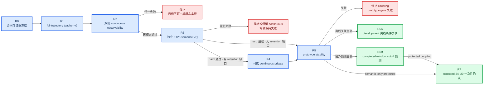

# Shared-Driver VQ Return Program：R0–R7 实验设计

_冻结日期：2026-07-25；E0–E9 保留为历史实验代际，新实验不得命名为 E2.1_

---

## 📋 实验原则

R 系列检验一条顺序可证伪的链：

> 单个模态的原始测量能够恢复联合共享驱动代理 → 固定 K=128 的 hard token 保留这种能力 → 两个独立 codebook 形成稳定、但不要求同 ID 的 driver signature → 冻结后按主张选择 R6A 离线时延条件关联和/或独立的 R6B completed-window 未来预测。

任一前门失败都停止后续确认性阶段。后面的漂亮共现图不能反向挽救前门。subject 是生物学独立单位；patch 不是独立样本；seed 是算法重复而不是额外样本量。


```mermaid
flowchart LR
    accTitle: R 系列依赖与停止规则
    accDescr: 新实验先冻结合同并建立 development-crossfit 与 population-frozen teacher，再依次检验连续可观测性、K128 离散保持、可选 private branch、prototype 语义、离线关联、严格时间截断预测和一次性 protected confirmation。

    r0["R0<br/>合同与证据冻结"]
    r1["R1<br/>full-trajectory teacher-v2"]
    r2["R2<br/>双侧 continuous observability"]
    stop2["停止<br/>目标不可由单模态实现"]
    r3["R3<br/>独立 K128 semantic VQ"]
    stop3["停止或保留 continuous<br/>离散保持失败"]
    r4["R4<br/>可选 continuous private"]
    r5["R5<br/>prototype stability"]
    stop5["停止 coupling<br/>prototype gate 失败"]
    r6a["R6A<br/>development 离线条件关联"]
    r6b["R6B<br/>completed-window cutoff 预测"]
    r7["R7<br/>protected 24–29 一次性确认"]

    r0 --> r1 --> r2
    r2 -->|"两模态通过"| r3
    r2 -->|"任一失败"| stop2
    r3 -->|"hard 通过 · 无 retention 缺口"| r5
    r3 -->|"hard 通过 · 有 retention 缺口"| r4 --> r5
    r5 -->|"离线关联主张"| r6a
    r5 -->|"窗外预测主张"| r6b -->|"protected coupling"| r7
    r5 -->|"semantic-only protected"| r7
    r5 -->|"失败"| stop5
    r3 -->|"量化失败"| stop3

    classDef process fill:#dbeafe,stroke:#2563eb,stroke-width:2px,color:#1e3a5f
    classDef evidence fill:#dcfce7,stroke:#16a34a,stroke-width:2px,color:#14532d
    classDef stop fill:#fee2e2,stroke:#dc2626,stroke-width:2px,color:#7f1d1d

    class r0,r1,r2,r3,r4,r5 process
    class r6a,r6b,r7 evidence
    class stop2,stop3,stop5 stop
```

## 🔒 公共冻结合同

所有行共享：

- 20 秒统一窗口、10 个 2 秒位置；
- EEG 仅看本模态 raw signal，fNIRS 仅看本模态 HbO/HbR；
- 独立 encoder、独立 `K=128, D=64` codebook；
- 预处理、raw view、channel/anchor rule 在 sidecar join 前确定；
- nuisance 只用于采样、评估、协变量和 null，不进入 tokenizer；
- train-only normalization；
- `token_temporal_scope`（token 属性）与 `evaluator_temporal_mode`（取样属性）分开登记；
- encoder 使用相同 patch-level boundary/finite mask；trajectory loss、验证和 common probe 使用同一 pointwise `measurement ∩ teacher ∩ target-point` mask；
- 三个固定 seed，匹配的 optimizer budget、样本、early stopping 和 checkpoint rule；
- development fit subjects `01–18`、development evaluation subjects `19–23`；protected subjects `24–29` 不读取；
- 每个 run 记录 `artifact_mask_policy`。旧 E2 的 artifact invalidity policy 不得复用为新基线。

## 🧊 R0：证据和命名冻结

R0 不训练模型。它完成：

1. 冻结 E0–E2 配置、结果与原始口径；
2. 发布 E2 corrigendum，明确 `3000 total validation patches → 500 teacher patches → 178 historical probe-valid EEG patches` 的三种不同分母；
3. 将旧 `physical_teacher_gradient_entry` 计划标为 superseded；
4. 冻结 R 系列的 sample registry、split、指标角色和停止规则；
5. 证明 protected subjects 没有被读取。

R0 失败条件包括：无法重现 sample IDs、sidecar hash 不唯一、当前 validity policy 未写入 manifest，或同一历史结果被新合同重新解释。

## 📦 R1：full-trajectory teacher-v2

旧 sidecar 只覆盖 `session_01/MA` 的 50 个 validation windows，并把状态压缩成 mean/slope。R1 必须生成 `[window, 10, 20]` 的完整 \(r^J\) 轨迹。

正式训练只允许二选一：

1. 为注册 cohort 的所有 session/condition/window 生成 target；
2. 将所有实验行严格限制到 100% target-covered cohort。

不得让部分样本做 raw reconstruction、另一部分样本做 semantic loss，从而形成隐含的两个人群。R1 产物至少包括按 subject/session/condition/patch 的覆盖表、teacher 参数来源、gauge、版本、输入 channel、target support 和所有 hash。

R1 分成两个明确产物：

- `R1-D development_crossfit`：可沿用当前 E0 的 subject-specific leave-one-trial provenance，即同一 development subject 的其他 trial 可拟合参数、anchor 与 EEG projection。它只允许进入探索性 `R2-D/R3-D`。
- `R1-P population_frozen`：normalization、SSM 参数、gauge、spatial anchor 与 EEG projection 全部只在 development-training subjects 拟合，对 held-out subject 纯 apply。`R1-P-dev` 固定由 subjects `01–18` 拟合、对 `19–23` apply；所有设计冻结后，`R1-P-final` 才按同一 pipeline 在 `01–23` 拟合、对 `24–29` pure apply。它是 `R2-P/R3-P` 与 R7 的必要条件。

\(r^E\) 必须与 \(r^J\) 成对生成：使用相同 R1-P 参数、EEG projection、anchor、gauge、sample 和时间坐标，只在推断时移除 fNIRS observation update，不允许独立重拟合。因而 \(\delta^F=r^J-r^E\) 的有效 mask 固定为两者 pointwise support 的交集。

R1 的严格门禁：

- 已注册 **development cohort** target coverage 为 100%；
- `[10,20]` pointwise support、patch support 与三种分母同时报告；
- 无 NaN、错位、重复 join 或未知 mask；
- raw student view 不被 sidecar channel 字段改变；
- validation 不参与 R1-P normalization 或 teacher 参数选择；
- R1-P 能在 held-out development subject 上纯 apply。

R1-P 改变了原 E0 的 subject-specific LOTO estimand，不能自动继承 E0 admission。进入 R2-P 前必须在 subjects `19–23` 重新通过预注册的 population-frozen teacher panel：held-out physical reconstruction、相对 EEG-only 的 jointness、跨 training-fold/gauge 稳定性、target observability，以及非退化且不被 phase/null 解释的 \(\delta^F\)。阈值由 `01–18`/synthetic calibration 冻结；任一门失败则 R1-P 失败。

protected coverage 在 R1 不读取、不预核验；只在 R7 一次性开启后核验。若 population-frozen teacher 不能在 protected subject 上纯 apply，则 R7 semantic gate 立即失败，任何 coupling 数值都只能标为描述性。

## 🔭 R2：量化前的双侧可观测性

这是整个计划最重要的可行性实验。分别训练等容量的 continuous EEG student 和 continuous fNIRS student，从本模态 20 秒 raw window 重建 \(r^J\)，不使用 VQ、不重建 raw signal。

主要 baseline 是由训练 subjects 构造的 `condition × relative-time` phase mean，防止模型只复制任务平均波形。对 modality \(m\)、subject \(s\)：

\[
\Delta R^2_{m,s}
=1-
\frac{\operatorname{SSE}(\hat r^J_m,r^J)}
{\operatorname{SSE}(\hat r_{\mathrm{phase}},r^J)}.
\]

R2 同时运行：

- `C-J`：真实配对的 registered candidate \(r^J\)；
- `C-E`：EEG-only \(r^E\)；
- `C-shuffle`：构造 teacher 前对 fNIRS 做 within-subject/condition/phase matched shuffle 或非生理时移；
- `C-smooth`：频谱和 phase 匹配但不含联合物理结构的平滑伪目标。

不同 row 的 native decoder 面对不同 target，native \(R^2\) 不能直接横比。共同 estimand 固定为：

1. 从每个 row 的 continuous latent 拟合**同一容量、同一 train-only protocol** 的 probe；
2. 所有 probe 在完全相同的 held-out samples 与 pointwise mask 上预测 registered paired candidate \(r^J\)，并单独预测 joint correction \(\delta^F=r^J-r^E\)；
3. 跨 row 的 primary contrast 使用 common-probe 的 \(r^J/\delta^F\) score；各 row native decoder 只作机制诊断。

`R2-D` 可用 R1-D 调试可实现性，但不得触发 promotion。预注册的 `R2-P` 通过规则使用 R1-P：

- EEG 和 fNIRS 的 subject-equal mean \(\Delta R^2>0\)；
- 每个模态至少 `4/5` validation subjects 为正；
- 三个 seed 的均值方向均为正；
- registered paired \(r^J\) 超过 target-shuffle null 的 95% 分位；
- `C-J` 的 common probe 在 **EEG 与 fNIRS 两个 student 分别**对 \(\delta^F\) 的 subject-equal score 都同时超过 `C-E`、`C-shuffle` 和 `C-smooth`；两模态先各自判定，再等权汇总，不得由 pooled 或单侧通过替代，也不得比较各自 native target 的 \(R^2\)。

任一模态失败则停止，不调 K、不增加 effect token、不用 cross-attention 绕过不可观测性。

## 🧠 R3：固定 K128 的离散语义

R3 的最小行：

| Row | 架构 | 作用 |
| --- | --- | --- |
| `N0` | K128，teacher-free raw reconstruction | 新数据/mask policy 下的对照，不复用旧 E2 T0 |
| `J0` | 双独立 K128，共享 decoder，完整 \(r^J\) 主目标 | 主假设 |
| `E-control` | 与 J0 同构，目标为 \(r^E\) | joint teacher 特异性 |
| `Null-J` | 与 J0 同构，目标为 shuffled/impossible-lag joint teacher | task/phase/marginal 控制 |

所有 row 都从 hard ID、posterior、codebook vector 与 continuous latent 拟合相同容量、相同 train-only protocol 的 frozen probe，并在相同 held-out \(r^J\) 与 \(\delta^F=r^J-r^E\) endpoint、相同 pointwise mask 上评分。跨 row 的 primary contrast 只使用这些 common-probe score；J0 的训练内 shared decoder 和其他 row 的 native decoder 只作机制诊断。由此避免“J0 用训练过的 \(r^J\) decoder、N0 用事后 probe”的不公平比较。

hard/codebook common-probe 输出相对 phase baseline 的 \(\Delta R^2\) 是主要 semantic estimand。另报告量化保持率：

\[
\eta_m=
\frac{\Delta R^2_{\mathrm{hard},m}}
{\Delta R^2_{\mathrm{continuous},m}}.
\]

\(\eta_m\) 的接纳阈值必须由 train-only pilot 或 synthetic delayed-bridge 重复性预先校准，不能看过 validation 后指定。

`R3-D` 可用 R1-D 做探索；架构 promotion 与任何 semantic claim 使用 R1-P 的 `R3-P`。R3-P 通过要求是以下条件的**合取**：

- 两模态 hard representation 都超过 phase baseline 与 permutation q95；
- J0 相对 N0 的 \(r^J\) common-probe 改善在 EEG 与 fNIRS 两侧都为正；primary aggregate 是“被试内先算两侧 contrast，再对模态等权”，不得由一侧或 pooled patch 数主导；
- J0 对共同 \(\delta^F\) endpoint 的 probe score 在 EEG 与 fNIRS 两侧都优于 `E-control` 和 `Null-J`，再作模态等权汇总；
- 三 seed 方向一致；
- K128 health 合同通过，但不要求全部 128 码均匀使用。

所有 quantizer calibration 必须在第一次查看 subjects `19–23` 的 R3-P 结果前，由 `01–18`/synthetic 数据完成并一次性冻结；不得在看到 hard-token failure 后校准再回到同一 validation 做第二次 promotion。若任一合取条件失败，R3-P 即失败，不得进入 R4/R5/R6；结论是“shared driver 可连续恢复，但 K128 离散化未实现”，不得缩小 K 或条件重试后把它写成原假设通过。

## 💾 R4：private branch 是否必要

仅在 R3-P 通过且有明确 raw/downstream retention 缺口时，比较：

- `J0`：semantic-only；
- `J1`：J0 + continuous private raw reconstruction。

private branch 不量化。raw-reconstruction 梯度不得进入任何 semantic encoder/codebook 参数；必须使用独立 private encoder/optimizer，或在分支点 detach，并通过参数级 gradient allowlist。保留 J1 必须同时满足：

1. 对 raw/downstream retention 有预注册的配对改善；
2. \(r^J\) semantic endpoint 在事前校准的非劣界内；
3. 没有新的跨模态信息泄漏；
4. 结果跨 seed/subject 稳定。

否则删除 private，保留更简单的 J0。R4 被跳过或拒绝时，J0 直接进入 R5；J1 被保留时，必须重新执行 export/checkpoint round-trip 与 signature matching 后再进入 R5。

## 🧬 R5：prototype 语义与稳定性

每个 prototype 的主 signature 是共享 decoder 输出的 20 点 driver trajectory，而不是 token ID。跨 seed 用该 signature 做 Hungarian matching。

必须报告：

- prototype support 与 rare-code 标记；
- held-out driver reconstruction；
- 跨 seed signature stability；
- 跨 subject prototype participation；
- hard、soft、codebook vector 与 continuous latent 的信息阶梯；
- task、subject、session、phase 的可解码性，用于暴露捷径而非定义语义。

R5 的 `n_min`（prototype support）、`s_min`（参与被试数）、`c_min`（eligible prototype 所覆盖的 token mass）、signature similarity 阈值和 subject-dominance 上限，必须由 train-only/synthetic calibration 在查看 validation 前冻结。通过是以下条件的合取：

- 两个模态中，达到 `n_min/s_min` 的 eligible prototypes 覆盖率都不低于 `c_min`；rare code 只作描述，不进入语义主张；
- 三个 seed 的全部成对 Hungarian matching 中，support-weighted signature stability 均超过 support-matched ID-permutation null 的 q95；
- leave-one-subject stability 的 subject bootstrap 下界超过注册阈值，且没有 prototype 仅由单一被试支配；
- R3 的 held-out common-probe semantic gate 在最终选择的 J0/J1 export 上仍成立；
- task/subject/session/phase shortcut probes 未超过预注册的 matched raw/phase control margin。

任一条件失败都停止 R6；这不会改写 R3 的离散保持结果，只表示尚不能把 prototype 当作可重复的跨被试语义单位。数值 occupancy 是量化器健康；driver signature 是指称语义；冻结外部评估是操作语义。三者不可互相替代。

## 🔗 R6A：双向 token 的 development 离线条件关联

tokenizer 和 checkpoint selection 全部冻结后，重新拟合容量匹配的 `q0/q1` evaluator。双向 20 秒 token 可与同一离线记录中的 raw HbO/HbR endpoint 做预注册 lag-band 关联，控制 fNIRS history、task/condition/phase、subject 层级和 matched null；对 held-out subject 使用预先冻结的 unseen-subject control rule，不拟合新的 subject intercept。因为 token receptive field 可能覆盖 endpoint，所有输出、文件名和图题必须使用 `offline_delayed_association`，不得使用 future、forecast、causal 或 certificate。

primary endpoint 是 subject-equal 聚合的 held-out proper-log-score gain：

\[
\Delta\ell_s^{A}
=E_s[\log q_1(Y^F\mid H^F,K^E,C)-\log q_0(Y^F\mid H^F,C)].
\]

必须同时运行：

- fNIRS history-only；
- within-subject/condition shuffled EEG；
- token-frequency-preserving permutation；
- circular shift 与 impossible lag；
- reverse/acausal direction；
- raw EEG feature baseline；
- \(r^E\) 与 `Null-J` tokenizer；
- 多 lag 的预注册 band-AUC 或 multiplicity correction。

R6A 是 development frozen evaluation，不是独立证书。primary 固定 split 为：R1-P-dev、tokenizer 与 q0/q1 的参数拟合使用 subjects `01–18`，q0/q1 对 `19–23` 只 apply；checkpoint/架构选择仍可能使用 `19–23`，所以这不是 fresh-data confirmation。可另做 whole-pipeline nested leave-one-subject sensitivity，但必须连 teacher、tokenizer、checkpoint 和 evaluator 都在每个 outer fold 重建，不能把仅重拟合 q0/q1 称为“全流程 cross-fitting”。

R6A 通过要求是 subject-level \(\Delta\ell^A>0\)，方向跨 seed/subject 稳定，且 registered pairing 增益超过 matched shuffle/time-shift null q95。仅 pooled、global 或单一 lag 为正即失败。

## ⏱️ R6B：严格 cutoff 的窗外增量预测

只有需要未来预测主张时才运行 R6B。首个 R 系列版本只允许使用**已经通过 R2-P/R3-P/R5 的同一个双向整窗 tokenizer**，但 evaluator 只能汇总在 cutoff 前已完整结束的窗口。若以后另建 `causal_past` tokenizer，它是新架构，必须重新通过自己的 R2-P/R3-P/R5，不能继承双向 checkpoint 的门禁。R6B 构造 cutoff \(c\)：

\[
q_0:\;Y^F_{(c+g):(c+g+h)}\sim H^F_{\le c}+C_c,
\qquad
q_1:\;Y^F_{(c+g):(c+g+h)}
\sim H^F_{\le c}+S(K^E_{\operatorname{RF-end}\le c})+C_c.
\]

每个 export 必须携带 `(record_id, absolute_input_start, absolute_input_end)` 及包含预处理支持在内的逐 token absolute receptive-field interval；endpoint 也携带绝对区间。按同一原始 record 断言
`max(token_RF_absolute_end) + embargo < endpoint_absolute_start`，不能用 row ID 不相交代替实际时间不重叠。endpoint interval 不得进入 token input、normalization、teacher construction 或 checkpoint selection。primary endpoint 是未来 raw HbO/HbR innovation 的 subject-equal proper-score gain；embargo、gap、horizon 和非重叠规则预注册。R6A 所列 controls/nulls 无论是否实际运行 R6A，都在 R6B 原样执行。

R6B 只有在两模态 semantic/R5 门、absolute-time cutoff assertions、三 seed/subject 方向和 matched-null q95 全部通过时才通过。若 R6A 通过而 R6B 失败，只允许离线时延条件关联主张；R6A 未运行不阻止 R6B。

## 🔐 R7：protected subjects 一次性确认

打开 subjects `24–29` 前必须冻结：

- 唯一主架构 `J0` 或 `J1`；
- 在 subjects `01–23` 最终拟合的三个 tokenizer checkpoint 及选择规则；
- 在 `01–23` 最终拟合的 R1-P-final teacher-v2 参数/hash；
- channel/anchor、preprocessing 与 mask policy；
- `token_temporal_scope` 与 `evaluator_temporal_mode`；
- common semantic probe 的已拟合参数、normalization、phase baseline 与 checkpoint hash；
- 若运行 R6A/R6B：q0/q1 的已拟合参数、normalization、checkpoint hash、unseen-subject control 应用规则和全部 null；semantic-only 时全部为 `N/A`；
- 若选择 prospective coupling：absolute-time receptive-field 规则与 R6B embargo/cutoff/gap/horizon；若选择 semantic-only：这些字段明确冻结为 `N/A`；
- primary estimand、聚合顺序和 stop rule；
- source、data index、sidecar、config 与 evaluator hashes。

最终拟合链的顺序也必须冻结并完整重跑：

```text
R1-P-final fit on 01–23
→ final tokenizer fit on 01–23
→ final token/signature export
→ common probe + phase baseline fit on that final export/teacher target
→ [only if R6A/R6B] q0/q1 fit on the same final export
→ freeze every applicable parameter/normalization/checkpoint/hash
→ open subjects 24–29
```

final tokenizer 的训练长度、checkpoint 规则和所有超参数沿用 development 冻结值；不得用 protected 做 early stopping、checkpoint selection 或任何校准。R6 的 development evaluator 不能直接复用到新 codebook/teacher 坐标。

固定检验顺序：

1. 开启后首先核验 R1-P-final 对 protected rows 的 pure-apply provenance、pointwise mask 与 100% 注册 coverage；
2. 以 development 已冻结的阈值和参数/gauge perturbation ensemble，在 protected 上执行同一 **apply-only teacher panel**：physical reconstruction、jointness、gauge/fold stability、target observability 与非退化 \(\delta^F\)；不得重拟合；
3. 前两门任一失败立即停止，不确认 semantic 或 coupling；
4. hard K128 shared-driver semantic gate；
5. 只有 R6B 已在 development 通过且其 cutoff 合同被冻结，窗外 future endpoint 才进入 protected coupling confirmation；
6. R6A 离线关联在 protected 中最多作为 secondary description，不能替代 R6B；
7. semantic gate 或 R6B temporal assertion 失败时，coupling 数值只能作为未检验的描述性结果；
8. protected 只打开一次，不在 subjects `24–29` 上修改架构、阈值或指标角色。

protected 只能对 teacher、tokenizer、probe、phase baseline 和 q0/q1 做 forward/apply；不得在 `24–29` 重拟合 normalization、probe、evaluator、subject intercept 或 calibration。若没有实施 R6B，可以预注册一次 semantic-only R7；此时 `evaluator_temporal_mode=semantic_only` 且 R6B 字段为 `N/A`，不得在同一 protected opening 中临时增加 coupling primary endpoint。

## 📊 统计与报告

- 每个 subject 内先聚合 patch/trial，再平均 seed，最后对 subject 做 cluster bootstrap。
- EEG/fNIRS 等权，不能因 target coordinate 数不同而隐式加权。
- 所有 row contrast 使用匹配的 subject、seed 和 sample。
- 同时报告 effect、置信区间、positive-subject count 和 null margin。
- primary、secondary、diagnostic 指标在运行前进入 `metric_registry.json`。
- 负结果与正结果使用相同 artifact schema。

## 🛑 全局停止规则

1. hash、split、mask、target join、跨模态梯度隔离或 protected boundary 失败：停止 suite。
2. R1-D/R1-P 在各自注册 development cohort 上不是 100% coverage：相应 suite 不训练；protected coverage 不在此阶段预读。
3. R1-P population-frozen teacher panel 任一门失败：不进入 R2-P。
4. R2-P 任一模态失败：不进入 VQ。
5. R3-P 的任一注册合取条件失败（任一模态、N0、E-control、Null-J、seed 或 health）：不进入 R4/R5/R6。
6. J1 不满足 retention 增益和 semantic 非劣：删除 private，保留 J0，并重新核验其 P5 export。
7. R5 的 support、seed/subject stability、shortcut 或 matched-null 任一门失败：不进入 R6。
8. R6A 不超过 fNIRS history 或不超过 matched null：拒绝离线 coupling claim。
9. R6B absolute cutoff assertion 或增量/null 门失败：拒绝未来预测 claim；不得用 R6A 替代。
10. protected 失败后不调参；需要新外部 cohort 才能重新确认。

## 📦 固定产物

每个适用 suite 至少写出：

```text
suite_manifest.json
resolved_config.yaml
decision_protocol.yaml
metric_registry.json
evidence_calibration.json
data_coverage_by_subject_session_condition_patch.csv
teacher_v2_manifest.json
teacher_gauge_and_jointness.json
mask_intersection_audit.json
continuous_feasibility.json
quantization_retention.json
quantizer_health.jsonl
common_probe_and_phase_baseline_manifest.json
prototype_signatures.parquet
prototype_stability.json
private_branch_attribution.json
coupling_incremental_logscore.csv
offline_association_logscore.csv
prospective_cutoff_audit.json
frozen_evaluator_checkpoint_manifest.json
lag_profile.csv
null_distributions.npz
```

所有产物必须包含 source commit、dirty-worktree flag、split/data/normalization/teacher/model hashes 和 protected-open state。

## 🔗 历史边界

E2 的原始负结果保留在 [综合复盘](analysis/20260724_E2_COMPREHENSIVE_REVIEW.md)。它是 R 系列的动机，不是可复用对照。E7–E9 的 shaper/foundation/certificate 原计划降为历史探索；R6 保留冻结外部评估原则，但把双向 token 的离线关联与严格 cutoff 的窗外预测拆开。真正独立的确认数据只来自 R7 protected。
