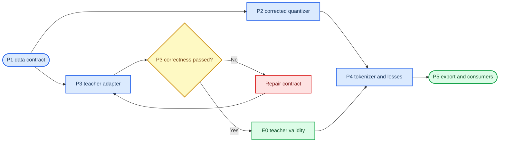

# Physiology-semantic tokenizer code migration plan

_Decision-complete migration boundary for P2 through P5; P6 coupling is excluded_

> Maintenance note: subsequent modification plans must annotate their affected components on a plan-specific copy of the maintained SVG architecture. See [`08_ARCHITECTURE_VISUALIZATION.md`](08_ARCHITECTURE_VISUALIZATION.md).

---

## 📋 Objective and execution boundary

This migration replaces the archived reconstruction-centered `source_observation` mainline with independently inferable EEG and fNIRS semantic tokenizers. The migration is complete at P5 export compatibility. It does not implement or evaluate P6 sequence coupling.

The following rules are fixed:

- formal E0 teacher validation starts only after the P3 adapter passes deterministic correctness tests and a real-data dry run;
- physical-state-supervised training does not start before E0 establishes valid teacher prediction and admissible coordinates;
- an explicit teacher-free reconstruction-plus-VQ baseline may optimize after a blocked E0 because it consumes no teacher target;
- legacy aliases, four-branch source/observation quantization, and pre-VQ cross-modal exchange remain archive-only;
- smoke success is software evidence, not a scientific gate decision.

## 📥 Runtime data contract

The strict `physiology_semantic_v2` loader remains the only active data entry for this architecture.

| Field | Shape | Consumer | Inference input |
| --- | ---: | --- | :---: |
| `eeg` | `[B, 6, 4000]` | EEG tokenizer | Yes |
| `fnirs` | `[B, 2, 200]` | fNIRS tokenizer | Yes |
| `teacher.state_mean` | `[B, 200, 5]` | Teacher adapter and losses | No |
| `teacher.state_var` | `[B, 200, 5]` | Teacher adapter and losses | No |
| `teacher.neural_driver_eeg_rate` | `[B, 4000, 1]` | Teacher adapter | No |
| `teacher.teacher_valid_mask` | `[B, 200]` | Teacher adapter and losses | No |
| `decomposition.*` | Modality-aligned | Attribution diagnostics | No |
| normalization/provenance | Sample metadata | Audit and export | No |

Both signals are divided into ten non-overlapping two-second patches:

- EEG: `[B, 10, 6, 400]`;
- fNIRS: `[B, 10, 2, 20]`.

The model-facing APIs are `encode_eeg(eeg)` and `encode_fnirs(fnirs)`. Passing the other modality, teacher tensors, or decomposition fields is a schema error.

## 🧠 Temporal representation boundary

Token identity is patch-local. The pre-quantization encoder may transform samples and channels inside one two-second patch, but it must not attend to another patch and must not use an absolute crop position. This makes a token invariant to where its source patch appears inside a crop.

Sequence learning is a separate post-quantization responsibility. For a target at patch `t`, the context module consumes only patches `[t-5, ..., t-1]`, representing ten seconds of prior history. Targets `t < 5` have incomplete history and contribute zero masked-context loss. The context output never replaces or mutates the exported token identity.

This boundary follows the separation between local latent quantization and contextual prediction in wav2vec 2.0,[^1] and the frozen-tokenizer-then-causal-model division used by NeuroLM.[^2] LaBraM remains the source for generic EEG patch and spectral-tokenizer components, but its full pre-quantization sequence Transformer is not copied because it would make token identity depend on neighboring and future patches.[^3]

## ⚙️ P2 corrected quantizer

Create a new active quantizer module rather than changing `NormEMAVectorQuantizer`, which is still imported by compatibility code.

### Public output

`QuantizerOutput` contains:

| Field | Shape | Definition |
| --- | ---: | --- |
| `logits` | `[B,N,K]` | Negative squared Euclidean distance divided by temperature |
| `posterior` | `[B,N,K]` | Softmax-normalized logits |
| `hard_ids` | `[B,N]` | Posterior argmax |
| `quantized` | `[B,N,D]` | Straight-through hard codebook lookup |
| `expected_embedding` | `[B,N,D]` | Posterior-weighted codebook expectation |
| `commitment_loss` | scalar | Encoder-to-selected-code commitment |
| `health` | dictionary | Entropy, active codes, rank, geometry, drift, and revival count |

Mainline assignment is non-normalized Euclidean distance. Cosine assignment is a named ablation. The resolved configuration asserts `K=128` and `D=64` for both modalities before the first forward pass.

### EMA update

The quantizer stores codebook weights, assignment-count EMA, vector-sum EMA, initialization state, update count, and revival count in its state dict. For each distributed step:

1. all-reduce current assignment counts and vector sums;
2. update both EMA buffers with the configured decay;
3. update only codewords with a positive current global assignment count;
4. leave zero-assignment codewords unchanged;
5. apply a configured, explicitly logged dead-code revival policy after the warm-up interval.

Checkpoint reload must reproduce logits, posterior, IDs, embeddings, EMA buffers, and health counters exactly in evaluation mode.

## 🧪 P3 physical teacher adapter

The adapter pools cached posterior values into deterministic patch targets and returns detached tensors.

For each state coordinate and patch, compute:

- mean over the patch;
- least-squares slope against time in seconds;
- `log(mean posterior variance + temporal variance of posterior means + eps)`.

The EEG target is six-dimensional: summary statistics for `r` from the EEG-rate neural driver and `s` from the state posterior. The fNIRS target is nine-dimensional: summary statistics for `delta_f`, `delta_hbo`, and `delta_hb`.

A target patch is valid only if every underlying cache-valid and causal-valid fNIRS sample is valid and all required means and variances are finite. The first five patches are therefore ineligible under the fixed ten-second history contract. Invalid targets and their uncertainty weights are finite placeholders with a false mask; they must contribute exactly zero loss.

P3 correctness requires constant and ramp trajectories, uncertainty propagation, mask contraction, stop-gradient behavior, shape assertions, and a one-sample real-cache dry run. E0 remains blocked until all checks pass.

## 🧩 P4 tokenizer, losses, and training

### Independent modality branches

Each branch performs:

1. reshape raw input into two-second patches;
2. compute frequency-aware patch embedding using the existing generic `MultiChannelPatchEmbedding`;
3. apply a patch-local projection/MLP with no cross-patch operation;
4. split into a 64-dimensional semantic latent and a continuous residual latent;
5. quantize the semantic latent;
6. decode state from the continuous semantic latent and from codebook embeddings;
7. reconstruct normalized raw patches from semantic-plus-residual, semantic-only, and residual-only inputs.

| Modality | Encoder output | Semantic latent | Residual latent | State target |
| --- | ---: | ---: | ---: | ---: |
| EEG | 256 | 64 | 64 | 6 |
| fNIRS | 160 | 64 | 32 | 9 |

The registry name is `physiology_semantic`. It is registered by the active tokenizer package without importing compatibility registration.

### Loss routing

The loss module exposes independently weighted state, prototype, masked-state, reconstruction, VQ, and private terms. State-related terms are uncertainty weighted and masked. The private term exists in configuration and metrics but defaults to zero until its scientific ablation is specified.

The fixed-history context module predicts state at `t` from the five preceding expected embeddings. It uses relative lag embeddings only. Perturbing patch `t` or any future patch must not change its context prediction.

### Training entry

The active training script supports `--dry-run`, `--smoke`, `--train`, and `--resume`. It implements epoch training and validation, AMP, gradient clipping, AdamW, warm-up/cosine scheduling, early stopping, best/last checkpoints, and complete optimizer/scheduler/scaler state restoration. A run saves resolved configuration, environment, split/cache manifest, JSONL metrics, quantizer health, teacher diagnostics, completion status, and hashes required by the run artifact contract.

The 2026-07-03 E0 pilot blocked physical-state supervision at validation, so that objective cannot take optimizer steps. The trainer verifies the concrete E0 decision artifact, split hash, data contract, cache roots, and admitted coordinates. The teacher-free reconstruction-plus-VQ path completed CUDA smoke and checkpoint resume; it may proceed to an E1 short-formal pilot without implying that E0 or semantic supervision passed.

## 📤 P5 export and consumer contract

The versioned export stores, per modality:

- hard IDs;
- full posterior or configured top-k posterior;
- expected codebook embedding;
- continuous residual;
- pooled teacher target, uncertainty, and validity mask;
- subject, source, task, anchor, crop, cache schema, checkpoint hash, and sample-order hash.

Consumers expose four explicit modes: `hard`, `codebook`, `soft`, and `semantic_residual`. `codebook` indexes the checkpoint codebook directly; creating a fresh embedding table is an error. Round-trip validation reloads the checkpoint and requires identical IDs and posteriors for the exported sample order.

## ✅ Acceptance tests

| Boundary | Blocking assertion |
| --- | --- |
| Patch locality | Identical patch content at different crop positions yields identical logits, IDs, and embeddings |
| Causality | Future or target-patch changes do not alter a fixed-history prediction |
| Modality independence | Changing EEG cannot alter fNIRS outputs and vice versa |
| Gradient isolation | No branch gradient reaches the other modality encoder or codebook |
| Teacher mask | Invalid targets contribute exactly zero supervised loss |
| Quantizer state | Zero-assignment stability, EMA arithmetic, revival logging, and reload equivalence pass |
| Pipeline | Loader → teacher → tokenizer → loss → checkpoint → export passes on CPU |
| Consumer | Export modes use checkpoint-native codebook geometry and preserve sample order |

The execution sequence is unit tests, integration tests, dry run, E0, then objective-specific smoke and short formal. A failed E0 blocks every teacher-supervised objective, while an explicitly teacher-free baseline remains available for quantizer and reconstruction characterization. P6 remains blocked until tokenizer freeze and the G2/G3 information-retention and state-semantics gates pass.

## 🔗 References

[^1]: Baevski, A., Zhou, H., Mohamed, A., & Auli, M. (2020). “wav2vec 2.0: A Framework for Self-Supervised Learning of Speech Representations.” https://arxiv.org/abs/2006.11477
[^2]: Jiang, W.-B., Wang, Y., Lu, B.-L., & Li, D. (2025). “NeuroLM: A Universal Multi-task Foundation Model for Bridging the Gap between Language and EEG Signals.” https://arxiv.org/abs/2409.00101
[^3]: Jiang, W.-B. et al. (2024). “Large Brain Model for Learning Generic Representations with Tremendous EEG Data in BCI.” https://proceedings.iclr.cc/paper_files/paper/2024/file/47393e8594c82ce8fd83adc672cf9872-Paper-Conference.pdf

_Last updated: 2026-07-03_
